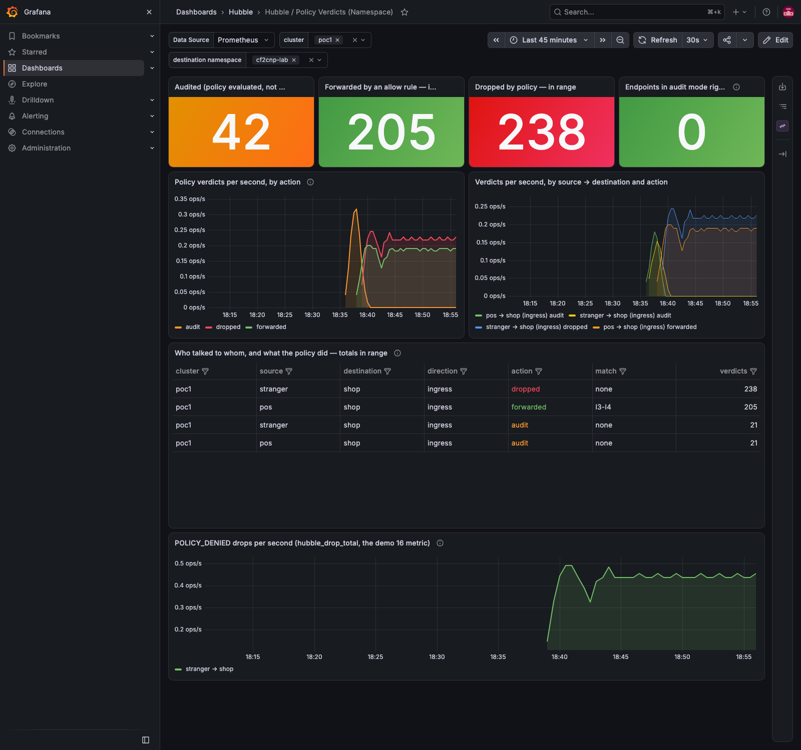

# cilium-implementation-poc

A reproducible proof of concept of what **Cilium 1.20.1** and **Hubble** give you over a stock CNI + kube-proxy
cluster — **measured, not quoted**. Two kind clusters in a ClusterMesh with no kube-proxy and no other CNI, 36 demos
from the first Hubble flow to policies generated from observed traffic, every command with its recorded output, and a
GitHub Action that builds and exercises the whole lab from the same scripts a laptop uses.



*Demo 26: a policy generated from Hubble flows, audited, then enforced — `pos → shop` forwarded, `stranger → shop` dropped.*

**Contents:** [Quick start](#quick-start) · [What it builds](#what-it-builds) · [What is tested, and where Cilium
documents it](#what-is-tested-and-where-cilium-documents-it) · [The demos](#the-demos) · [kind versus a real
cluster](#kind-versus-a-real-cluster) · [Blocked and parked](#blocked-and-parked) · [Documents](#documents) ·
[Tooling](#tooling)

## Quick start

The whole lab — both clusters, every stack, the eleven labs, the six cf2cnp chapters, the report — comes up from four
commands on a Mac (measured on an Apple M5 Pro, 2026-09-15: the bring-up in 9 min 34 s, everything after it in
9 min 5 s):

```bash
scripts/bootstrap/macos.sh            # Homebrew, Homebrew's bash and coreutils (requirements), the tools, the Docker Desktop VM, the preflight
scripts/lab-up.sh poc1 poc2           # both clusters, each complete on its own, then the mesh
scripts/lab-all.sh                    # everything after: 1 min of audit traffic, the policies, the report — no long waits
                                      # LAB_AUDIT_MINUTES=3 LAB_TRAFFIC_MINUTES=6 for the Action's windows; LAB_CAPTURE=1 for the page walk
scripts/lab-trust.sh install kind-poc1; scripts/lab-route.sh kind-poc1; scripts/hosts-entries.sh | sudo tee -a /etc/hosts   # three sudo steps: the root, the route, the names
```

A new Mac starts at **[docs/NEW-MAC.md](docs/NEW-MAC.md)** (the toolchain, Docker Desktop from its settings file, the
preflight). To build it **by hand, one command at a time** with the recorded output beside each — the kind clusters,
the API endpoint by DNS name, the Cilium install, LB IPAM, the second cluster and the mesh — follow
**[docs/SETUP.md](docs/SETUP.md)** Steps 1–9 with [NETWORKING_DESIGN.md](NETWORKING_DESIGN.md) open (the addressing
plan every later address comes from) and [docs/TUNING.md](docs/TUNING.md) at Step 5 (the day-1 datapath values that are
an outage to change later). Steps 10 onward install what each demo adds.

The same scripts run on a GitHub-hosted runner (4 vCPU, 16 GB) as three `workflow_dispatch` workflows; only the
bootstrap differs (`scripts/bootstrap/ubuntu.sh` there, `macos.sh` here, both ending in the same
`scripts/lab-preflight.sh` table). `lab-observability.yaml` is the gate: the stacks, the labs, traffic under audit, the
cf2cnp chapters, the report and a Playwright walk of every page with its expectations as tests. The plan and every
run's measurements: [enhancements/004-lab-in-ci.md](enhancements/004-lab-in-ci.md).

**The pages**, once the names are in `/etc/hosts` (`scripts/lab-route.sh kind-poc1` prints the live addresses and
checks each from this host; `scripts/hosts-entries.sh` prints the block and never edits the file):

| Page | URL | Notes |
|---|---|---|
| Grafana — Cilium, Hubble, the verdicts, the observer and DNS dashboards (demos 16, 25, 28, 31) | `https://grafana.poc.local` | `admin` / `poc-grafana`; through the Gateway `routes-gw` (`172.18.255.240`) on the lab's wildcard certificate; `http://` answers a 301 to `https://` (gotcha #114) |
| Hubble UI — the service map, both clusters' flows | `http://hubble-direct.poc.local` (= `http://172.18.255.201`) | its own LoadBalancer address from poc1's block |
| cf2cnp — the policy generator the chapters call (demo 25) | `https://cf2cnp.poc.local` | |
| The bank across the mesh — web and api (demos 15, 19) | `https://bank.poc.local`, `https://bankapi.poc.local` | poc1's web/api/payments, poc2's accounts/postgres |
| The petclinic — six Spring Boot services (demo 20) | `https://petclinic.poc.local` | |
| The Star Wars app behind `sw-gateway` (demos 02, 05) | `http://deathstar.poc.local/v1/request-landing` | `172.18.255.241`; POST; the exhaust port answers 403 from the proxy |

The certificate is the lab's wildcard `*.poc.local`, issued by cert-manager from the lab's own root; once
`scripts/lab-trust.sh install kind-poc1` has put that root in the System keychain, the browser shows no warning.
`scripts/cluster-pause.sh` keeps the clusters for tomorrow; `scripts/lab-down.sh` removes them.

## What it builds

| Cluster | Nodes | Pod CIDR | Service CIDR | Cilium cluster id |
|---|---|---|---|---|
| `poc1` | 3 control-plane + 2 worker | `10.10.0.0/16` | `10.11.0.0/16` | 1 |
| `poc2` | 1 control-plane + 1 worker | `10.20.0.0/16` | `10.21.0.0/16` | 2 |

`poc1` has three control planes so etcd keeps a real majority and a control-plane failure can be demonstrated; `poc2`
is the far side of the mesh, deliberately minimal; the CIDRs do not overlap because ClusterMesh requires it. Both run
with **no kube-proxy** (`kubeProxyMode: none`) and **no default CNI** (`disableDefaultCNI: true`), with **eBPF
masquerading and eBPF host routing from day 1** (`bpf.masquerade: true`; `Host: BPF` in `cilium status` — the chart
default leaves the netfilter bypass off, [docs/TUNING.md](docs/TUNING.md)). What a plain install enables versus what
poc1 runs: [SETUP Step 5.4](docs/SETUP.md#step-54--is-the-service-mesh-on--what-a-plain-install-enables-and-what-this-poc-adds).

| Component | Version |
|---|---|
| kind | 0.33.0 |
| Kubernetes (node image) | v1.36.4, pinned by digest — kind 0.33.0 defaults to v1.37.0, but Cilium 1.20.1 is e2e-tested on 1.33–1.36 only |
| Cilium | 1.20.1 — the newest chart and upstream tag as of 2026-09-11 (`docs/summary/MTLS_EVALUATION.md` §7) |
| cilium CLI / Hubble CLI | v0.20.0 / 1.19.4 |
| cert-manager | v1.21.1 (chart; GitHub had v1.21.2 the same day — gotcha #26) |
| Gateway API CRDs | v1.6.1 standard, plus experimental `TCPRoute` |
| OpenTelemetry Collector | contrib 0.160.0 |
| cf2cnp (the fork) | 0.8.0 — `ghcr.io/ephico2real2/cf2cnp`, the chart from `https://ephico2real2.github.io/cf2cnp` |

The pins the scripts install are in [`scripts/bootstrap/versions.env`](scripts/bootstrap/versions.env).

## What is tested, and where Cilium documents it

Every row is exercised in the lab and proven in the demo named; the last column is the Cilium documentation for the
feature, so a claim here can be read against its source. The full list of sources, with what each was used for, is
[docs/REFERENCES.md](docs/REFERENCES.md).

| Capability | Mechanism under test | Proven in | Cilium docs |
|---|---|---|---|
| eBPF datapath, identity-aware | every pod gets a security identity; policy and load balancing are eBPF programs, not iptables chains | demos 01, 03 | [Policy intro](https://docs.cilium.io/en/stable/security/policy/intro/), [Hubble](https://docs.cilium.io/en/stable/observability/hubble/setup/) |
| Service load balancing without kube-proxy | `kubeProxyReplacement: true`; the eBPF service map replaces the NAT chains | demo 03, 11 | [Kubernetes without kube-proxy](https://docs.cilium.io/en/stable/network/kubernetes/kubeproxy-free/) |
| L3/L4 policy, default-deny, audit mode | `CiliumNetworkPolicy` / `CiliumClusterwideNetworkPolicy`; policies observed in audit before enforcement | demos 19, 26 | [Layer 3 rules](https://docs.cilium.io/en/stable/security/policy/layer3/), [Policy audit mode](https://docs.cilium.io/en/stable/security/policy-creation/#enable-policy-audit-mode-specific-endpoint) |
| L7 HTTP policy | method + path rules enforced by the per-node Envoy; the proxy's 403 versus the datapath's drop | demos 02, 30 | [Layer 7 rules — HTTP](https://docs.cilium.io/en/stable/security/policy/layer7/#http) |
| DNS-based egress (`toFQDNs`) and the DNS proxy | the resolver rule that turns the proxy on, names in the next flows, a CIDR until then | demo 31 | [DNS-based policies](https://docs.cilium.io/en/stable/security/dns/), [DNS rules](https://docs.cilium.io/en/stable/security/policy/layer3/#dns-based) |
| Cluster-aware policy across the mesh | the caller's cluster in the selector (`io.cilium.k8s.policy.cluster`), measured against the selector that enforced the wrong pod | demo 29 | [Network policy in ClusterMesh](https://docs.cilium.io/en/stable/network/clustermesh/policy/) |
| LoadBalancer addresses with no cloud | LB IPAM pools carved from the docker subnet + L2 announcements (no MetalLB, no kube-vip) | SETUP 8, NETWORKING_DESIGN | [LB IPAM](https://docs.cilium.io/en/stable/network/lb-ipam/), [L2 announcements](https://docs.cilium.io/en/stable/network/l2-announcements/) |
| Ingress via Gateway API | Cilium as `GatewayClass` controller; `HTTPRoute`, `GRPCRoute`, `TCPRoute`; TLS by SNI, wildcard and exact certificates on one Gateway | demos 05, 09 | [Gateway API](https://docs.cilium.io/en/stable/network/servicemesh/gateway-api/gateway-api/), [HTTPS](https://docs.cilium.io/en/stable/network/servicemesh/gateway-api/https/), [gRPC](https://docs.cilium.io/en/stable/network/servicemesh/gateway-api/grpc/) |
| Multi-cluster | ClusterMesh on a shared root of trust; global Services with failover and affinity; an application split across both clusters, active-active; a database replicated through the mesh | demos 07, 08, 15, 24 | [ClusterMesh setup](https://docs.cilium.io/en/stable/network/clustermesh/setup/), [Global services](https://docs.cilium.io/en/stable/network/clustermesh/global-services/), [Service affinity](https://docs.cilium.io/en/stable/network/clustermesh/affinity/) |
| Enterprise PKI | a cert-manager root in poc1, a `ClusterIssuer` in both clusters issuing the mesh, relay and Gateway certificates; the root in the OS stores and every namespace | demos 08, 24, 36 | [Hubble TLS](https://docs.cilium.io/en/stable/observability/hubble/configuration/tls/) |
| Node-to-node encryption | WireGuard in the kernel, enabled and verified on the wire, then deliberately left off | demo 04 | [WireGuard transparent encryption](https://docs.cilium.io/en/stable/security/network/encryption-wireguard/) |
| Observability and export | Hubble flows with identities and verdicts; the dynamic exporter per node → OpenTelemetry Collector (events, not spans); metrics and the chart's dashboards; L7 visibility; the policy-verdict metric | demos 01, 10, 16, 21, 26 | [Hubble exporter](https://docs.cilium.io/en/stable/observability/hubble/configuration/export/#dynamic-exporter-configuration), [Metrics](https://docs.cilium.io/en/stable/observability/metrics/), [Grafana](https://docs.cilium.io/en/stable/observability/grafana/), [L7 visibility](https://docs.cilium.io/en/stable/observability/visibility/), [Hubble UI](https://docs.cilium.io/en/stable/observability/hubble/hubble-ui/) |
| Datapath tuning and its measurement | eBPF host routing and masquerading on from day 1; the tuning that gets Cilium from half of kube-proxy's throughput to parity; what Hubble costs at 10 k conn/s | demos 06, 11, 14 | [Tuning guide](https://docs.cilium.io/en/stable/operations/performance/tuning/#ebpf-host-routing), [Masquerading](https://docs.cilium.io/en/stable/network/concepts/masquerading/), [Benchmark](https://docs.cilium.io/en/stable/operations/performance/benchmark/) |
| Evaluated and **not** adopted | mutual authentication (SPIFFE/SPIRE): deprecated in 1.20, removal planned for 1.21 ([cilium#47132](https://github.com/cilium/cilium/issues/47132)), ClusterMesh-incompatible; ztunnel mTLS: incompatible with any `cluster.id`, breaks L4/L7 policy for enrolled traffic, −73 % throughput | demo 13, [MTLS_EVALUATION](docs/summary/MTLS_EVALUATION.md) | [Mutual authentication](https://docs.cilium.io/en/stable/network/servicemesh/mutual-authentication/mutual-authentication/) |

## The demos

One `README.md` per demo under [`demos/`](demos/), each with a *Summary context*, the commands, the recorded
`output/transcript.txt`, and an **Evidence** section — the dashboards and UIs as the browser saw them under traffic
(`scripts/evidence/capture.js`), the pods in both clusters and the Cilium command that proves the claim
(`scripts/evidence/collect.sh`). Demos whose workload the lab keeps scaled down or that the VM kernel blocks have a
row in [missing-captures.md](missing-captures.md) instead. Read them in order the first time; from 26 on, each builds
on the one before.

| # | Demo | What it proves | Evidence |
|---|---|---|---|
| **Foundations** — poc1 alone | | | |
| 01 | [Hubble flows + UI](demos/01-hubble/README.md) | per-flow, identity-aware visibility that iptables cannot produce | [1 capture](demos/01-hubble/README.md#evidence) |
| 02 | [L7 HTTP policy](demos/02-l7-policy/README.md) | allow `POST /v1/request-landing`, deny `PUT /v1/exhaust-port` between the *same* two pods | [2 captures](demos/02-l7-policy/README.md#evidence) |
| 03 | [kube-proxy free](demos/03-kube-proxy-free/README.md) | Services load-balanced in eBPF; no kube-proxy DaemonSet exists at all | [pods + output](demos/03-kube-proxy-free/README.md#evidence) |
| 04 | [WireGuard](demos/04-wireguard/README.md) | node-to-node encryption on with one Helm value, verified on the wire, then switched off on purpose | [pods + output](demos/04-wireguard/README.md#evidence) |
| 05 | [Gateway API](demos/05-gateway-api/README.md) | Cilium as the Gateway controller, its address from Cilium's own LB IPAM | [2 captures](demos/05-gateway-api/README.md#evidence) |
| 06 | [Performance](demos/06-perf/README.md) | iperf3 across nodes with 25–38 % run-to-run noise measured honestly; netkit, BBR and BIG TCP each proven absent on this VM kernel | [pending](missing-captures.md) |
| **Multi-cluster and PKI** | | | |
| 07 | [ClusterMesh](demos/07-clustermesh/README.md) | a global Service backed by pods in the second cluster, with failover | [1 capture](demos/07-clustermesh/README.md#evidence) |
| 08 | [Enterprise CA](demos/08-certmanager-ca/README.md) | a cert-manager root in poc1 issuing every cluster's mesh certificates; trust before the join | [pods + output](demos/08-certmanager-ca/README.md#evidence) |
| 09 | [Wildcard TLS + three route types](demos/09-routes/README.md) | wildcard and exact certificates on one Gateway; `HTTPRoute`, `GRPCRoute`, `TCPRoute` from one image, a Go client that tests all three (how the missing-ALPN gotcha #33 was found) | [3 captures](demos/09-routes/README.md#evidence) |
| 24 | [ClusterMesh the enterprise way](demos/24-clustermesh-enterprise/README.md) | Hubble joins the mesh on the one cert-manager root (`7/7` nodes, zero handshake failures); the mesh declared the guide's way; the 3.5-minute outage a wrong order costs | [1 capture](demos/24-clustermesh-enterprise/README.md#evidence) |
| 36 | [One root, everywhere](demos/36-trust-everywhere/README.md) | the Gateway's wildcard was cert-manager's all along (read from the chain); that root into the OS trust stores and every namespace of both clusters, so `--cacert` stops being a special case | in the demo |
| **Observability** — hub on poc1, poc2 a spoke | | | |
| 10 | [Flow export → OpenTelemetry](demos/10-tracing/README.md) | Hubble's dynamic exporter per node tailed by a Collector into OTLP; every flow persistent and queryable — events, not spans (gotcha #30) | [pods + output](demos/10-tracing/README.md#evidence) |
| 16 | [Prometheus + Grafana, then Hubble on dashboards](demos/16-monitoring/README.md) | kube-prometheus-stack, then one Cilium Helm change: 6 ServiceMonitors, 6 dashboards, 52/52 targets, exemplars proven with a `traceparent` | [11 captures](demos/16-monitoring/README.md#evidence) |
| 18 | [OBI: zero-code traces across the mesh](demos/18-obi/README.md) | eBPF instrumentation on both clusters: one payment as a 16-span tree poc1 → poc2 → Postgres/Redis, RED metrics per route | [2 captures](demos/18-obi/README.md#evidence) |
| 21 | [Tempo: exemplar → trace](demos/21-tempo/README.md) | the same trace id at every hop, Hubble exemplar → Prometheus → Tempo → Grafana's trace view | [8 captures](demos/21-tempo/README.md#evidence) |
| 22 | [One Grafana for the mesh](demos/22-multicluster-observability/README.md) | poc2 remote-writes across the mesh through a role-named global Service; the `cluster` dropdown lists both | [9 captures](demos/22-multicluster-observability/README.md#evidence) |
| 23 | [A collector per cluster](demos/23-collector-per-cluster/README.md) | the gateway is a per-cluster Service, never global (the wrong cluster stamp measured); HA with a persistent queue proven by killing the collectors with the hub down | [pods + output](demos/23-collector-per-cluster/README.md#evidence) |
| 25 | [Historical flows, the open-source way](demos/25-hubble-observer-loki/README.md) | hubble-observer streams flows from the mesh-wide relay → Collector → Loki → a Grafana dashboard: what Timescape does, from parts | [8 captures](demos/25-hubble-observer-loki/README.md#evidence) |
| **Applications** | | | |
| 15 | [A bank across two clusters](demos/15-bank/README.md) | five components + Postgres/Redis split across poc1 and poc2 over global Services: active-active, zero failed requests through a scale-to-0 outage, a hot standby streaming through the mesh with promotion and failback | [4 captures](demos/15-bank/README.md#evidence) |
| 19 | [A zero-trust cell across the mesh](demos/19-zero-trust-cell/README.md) | `intent.yaml` → `render.py` → 7 policies + 1 clusterwide baseline; the bank runs default-deny on both clusters — the standing posture | [2 captures](demos/19-zero-trust-cell/README.md#evidence) |
| 20 | [Spring Boot + Java observability](demos/20-springboot/README.md) | spring-petclinic-microservices (6 JVMs) on the Gateway, the app's and the Java agent's spans in the demo 10 collector; three measured fixes | [pending](missing-captures.md) |
| **Forensics** — a third cluster, throwaway clusters | | | |
| 11 | [kube-proxy vs Cilium](demos/11-kube-proxy-vs-cilium/README.md) | `poc3` (kindnet + iptables) against poc1: 48 vs 11,078 iptables rules at 1,000 Services, ~2× faster programming — and the default Cilium install losing on throughput until three causes were found | [pending](missing-captures.md) |
| 13 | [ztunnel mTLS](demos/13-ztunnel/README.md) | real mTLS on the wire on a throwaway cluster; incompatible with any `cluster.id`, breaks L4/L7 policy on enrolled traffic, −73 % throughput — not the standard | [pending](missing-captures.md) |
| 14 | [TCP_CRR tuning blog, tested](demos/14-tcp-crr-tuning/README.md) | bigger maps, shorter timeouts, socket LB, client sysctls — none moved the connection rate; this rig's ceiling is Hubble | [pending](missing-captures.md) |
| **Policy from observed flows** — cf2cnp, the fork, enhancement 001 | | | |
| 26 | [Policy from flows, three ways](demos/26-cf2cnp-policy-from-flows/README.md) | the foundational skill: a Hubble flow JSON from four sources (relay, Loki, observer log, export file — byte-identical policies) → cf2cnp by API, UI, Grafana action → audit → enforce | [5 + 7 captures](demos/26-cf2cnp-policy-from-flows/README.md#evidence) |
| 27 | [cf2cnp 0.5.0 from the fork](demos/27-cf2cnp-release/README.md) | the fork's release (Helm repo, image) deployed as the observer chart's dependency; two components, one request, two names that cannot collide | [4 + 7 captures](demos/27-cf2cnp-release/README.md#evidence) |
| 28 | [The verdicts dashboard as a product](demos/28-policy-verdicts-chart/README.md) | [hubble-policy-verdicts](https://github.com/ephico2real2/hubble-policy-verdicts): its own chart (sidecar ConfigMap or Grafana Operator CR), released, a dependency of the observer chart, offered upstream | [2 + 3 captures](demos/28-policy-verdicts-chart/README.md#evidence) |
| 29 | [Policy from a cross-cluster flow (E1, E9)](demos/29-cross-cluster-policy/README.md) | the caller's cluster in the generated selector, measured against the 0.5.1 output that enforced the wrong pod; a spoke's verdict on the hub's dashboard | [2 captures](demos/29-cross-cluster-policy/README.md#evidence) |
| 30 | [Layer-7 rules from the proxy's flows (E2)](demos/30-l7-rules/README.md) | `--l7`: method + path per port from 44 REQUEST records; a path nobody called answered 403 by the proxy, the stranger still dropped at L3 | [2 + 3 captures](demos/30-l7-rules/README.md#evidence) |
| 31 | [DNS visibility → `toFQDNs` (E3)](demos/31-dns-visibility/README.md) | a world destination without a name becomes a CIDR; the DNS-visibility rule puts the lookups through the proxy, and the regenerated policy is `toFQDNs` | [1 + 3 captures](demos/31-dns-visibility/README.md#evidence) |
| 32 | [The operator's loop (E4, E5, E10)](demos/32-operator-loop/README.md) | intent before generation (`exclude=`), a new client merged into the existing file without rewriting it, the file evolving through a pull request from a workflow | [1 + 3 captures](demos/32-operator-loop/README.md#evidence) |
| 33 | [Hardening the shared `/generate` (E6)](demos/33-hardening/README.md) | a policy for the cf2cnp pod (the parent chart's wider one narrowed, because policies add), an Origin allow-list, a token measured on for one revision then off, with the reason | [1 capture](demos/33-hardening/README.md#evidence) |
| 34 | [Verdict → policy on one page (E7, E8)](demos/34-verdict-to-policy/README.md) | the dashboard's Loki row runs the cf2cnp action on a dropped flow; a second observer streams every verdict with the policy that decided it, so "which rule allowed it" is one LogQL | [2 captures](demos/34-verdict-to-policy/README.md#evidence) |
| 35 | [The shop platform: one request, six policies](demos/35-shop-platform/README.md) | a shared catalog called from three namespaces, an API gateway in a fourth, a client that must only go through the gateway — six policies whose descriptions read like the architecture (cf2cnp 0.6.3) | [3 captures](demos/35-shop-platform/README.md#evidence) |

The one-page answer to "what was tested and what happened" for every generated policy (demos 26–35) and for cf2cnp's
own test layers: [docs/POLICY-TEST-RESULTS.md](docs/POLICY-TEST-RESULTS.md).

## kind versus a real cluster

**kind is the lab, not the design.** Only the initial setup is kind-specific — [docs/SETUP.md](docs/SETUP.md) Steps
1–5 and 9 (the pinned node image, the no-CNI / no-kube-proxy cluster config, the multi-control-plane API endpoint by DNS
name, the second cluster's disjoint CIDRs) — and the **network layer**, which is what a Docker-based homelab has
instead of a real network. Everything from demo 06 onward is meant to move to a real cluster unchanged.

| In this lab (Docker Desktop, kind) | In a real cluster |
|---|---|
| the `kind` docker bridge (`172.18.0.0/16`) is the LAN; node IPs are container IPs on it; the two clusters can only mesh because they share it | a subnet plan: routable node networks, non-overlapping pod/service CIDRs per cluster, a route or tunnel between them |
| LoadBalancer addresses from Cilium's LB IPAM out of a slice of that bridge, reached from macOS through one static route into the Docker VM | an LB pool on a VLAN, announced by L2 or BGP (demo 12 is parked for exactly this) |
| **DNS:** every `*.poc.local` name written into `/etc/hosts`, all pointing at the one Gateway address `172.18.255.240` | one wildcard A record `*.poc.local` → the Gateway's address |
| **TLS:** one wildcard certificate on the Gateway from cert-manager and the demo 08 root, the root trusted by hand | the same, with the root distributed by the platform (demo 36 shows the mechanism) |
| the mesh API server as a NodePort on a control-plane container IP | a LoadBalancer or a DNS name per cluster, the shared CA provisioned before the join (demos 08, 24) |
| the Docker VM kernel (6.6-linuxkit, no `CONFIG_SECURITY`, no `CONFIG_NETKIT`) and its memory ceiling: **Tetragon**, **OBI's generic tracer**, **netkit**, the **bandwidth manager with BBR** and **BIG TCP** cannot run (gotchas #60, #66, demo 06 Part 4) | the kernel and the RAM you chose; none of those gotchas apply |
| one VM for seven kind nodes, two Cilium installs and the whole observability stack: control-plane restarts under load, the hub Prometheus OOM-killed, petclinic and poc3 kept scaled down or paused (gotchas #66, #77) | real nodes with their own memory |
| open-source Hubble UI: no time range, no history, no cluster picker | the same — this lab builds the flow store with Loki instead (demo 25) |

**The networking design in one sentence:** one Gateway with one LoadBalancer address, one wildcard DNS record and one
wildcard certificate in front of every HTTP application; exact names and exact certificates only where a demo proves
the difference (demo 09); mTLS from the enterprise root for everything that is not a browser (the relay, the mesh API
server, the observer, the CLI). The lab fakes the DNS half with `/etc/hosts` and trusts the root by hand; a real
network replaces exactly those two things. The plan, the ASCII diagram, the route commands for a Mac and for a Linux
server, and the checklist for the network team: [NETWORKING_DESIGN.md](NETWORKING_DESIGN.md)
(`scripts/network-plan.sh` reprints it live).

## Blocked and parked

Everything in the demo table runs today except where its row says *pending*. What does not, and why — each measured,
each with its record:

- **Tetragon (demo 17)** — every agent crash-loops on a Docker Desktop kernel without `CONFIG_SECURITY` (fixed in
  Docker Desktop 4.30), and kind nodes need a creation-time `/procHost` mount (now in `clusters/poc*.yaml`) —
  [demos/17-tetragon](demos/17-tetragon/README.md), [Tetragon docs](https://tetragon.io/docs/).
- **netkit, bandwidth manager with BBR, BIG TCP** — absent from the linuxkit kernel; demo 06 Part 4 proves each
  ([netkit](https://docs.cilium.io/en/stable/operations/performance/tuning/#netkit-device-mode),
  [bandwidth manager](https://docs.cilium.io/en/stable/operations/performance/tuning/#bandwidth-manager),
  [BIG TCP](https://docs.cilium.io/en/stable/operations/performance/tuning/#ipv4-big-tcp)); the runner's kernel refused
  them too (gotchas #92 onward).
- **BGP with an FRR router (demo 12)** — planned in [docs/summary/BGP_FRR_PLAN.md](docs/summary/BGP_FRR_PLAN.md); every
  VIP is reachable by L2 today and nothing on the docker network speaks BGP, so the router *is* the demo
  ([BGP control plane](https://docs.cilium.io/en/stable/network/bgp-control-plane/bgp-control-plane/)).
- **Cilium mutual authentication and ztunnel mTLS** — evaluated, not adopted (the table above; demo 13,
  [MTLS_EVALUATION](docs/summary/MTLS_EVALUATION.md)). WireGuard + identity policy is the standard.
- **Application spans from Hubble** — not a Cilium 1.20 capability (hubble-otel archived, the CFP closed); demo 10
  exports flow *events*, demos 18 and 20 get spans from OBI and the Java agent.
- **Wildcard name resolution on the Mac (dnsmasq)** — documented in demo 09 Part 3c, not run; **the Linux-server
  route** of NETWORKING_DESIGN §5 — its routing-table shape measured on the Docker VM, not yet on a bare Linux host.
- **Swagger UI and ReDoc for cf2cnp** — parked 2026-09-15 with the plan in
  [ephico2real2/cf2cnp#4](https://github.com/ephico2real2/cf2cnp/issues/4): the page already documents each endpoint
  with a Try-it-out panel; revisit when a machine consumer of the spec exists, and then `/api/openapi.json` alone first.

## Documents

| Document | What it holds |
|---|---|
| [docs/SETUP.md](docs/SETUP.md) | the build by hand, one command at a time with its real output; where something went wrong, the failure and the diagnosis are kept — the debugging is the useful part |
| [docs/NEW-MAC.md](docs/NEW-MAC.md), [docs/HANDOVER.md](docs/HANDOVER.md) | a new Mac's path to the lab; a new session's: the standing rules, where the upstream PRs and the forks stand, what is owed |
| [NETWORKING_DESIGN.md](NETWORKING_DESIGN.md), [docs/TUNING.md](docs/TUNING.md) | the addressing plan and diagram; the day-1 datapath values and why they cannot wait |
| [OBSERVABILITY-ARCHITECTURE.md](OBSERVABILITY-ARCHITECTURE.md) | the one picture of the observability stack across the mesh: the hub, every spoke, and why (demos 10, 16, 18, 21–25) |
| [docs/GOTCHAS.md](docs/GOTCHAS.md) | **114 traps this build actually hit**, with the real error text and the real fix. Most share one shape — *they reported success while not working*: `brew` said "already installed", every container was `Up` while the cluster was dead, the API server answered `curl -k` with 200 while Cilium could not reach it, a policy fix "worked" and opened a hole. The three most expensive: the bridge is `bridge100`, not `bridge101` (SETUP 3.5); the two Cilium LB CRDs did not graduate together — `CiliumLoadBalancerIPPool` is `v2`, `CiliumL2AnnouncementPolicy` still `v2alpha1` (SETUP 8); every Docker Desktop setting **before** any cluster, or the cluster is lost to reassigned container IPs (SETUP 2.7) |
| [docs/FINDINGS.md](docs/FINDINGS.md), [docs/REFERENCES.md](docs/REFERENCES.md) | the measurements; every external source with what it was used for |
| [docs/POLICY-TEST-RESULTS.md](docs/POLICY-TEST-RESULTS.md) | every generated policy's test and outcome (demos 26–35), and cf2cnp's own test layers |
| [docs/VERIFICATION_RUN.md](docs/VERIFICATION_RUN.md) | 1,024 lines of real console output in 23 sections, from the toolchain to the flow store, regenerable with `scripts/verify.sh` |
| [enhancements/](enhancements/README.md) | proposals that grew out of the demos, each with its measurement, issue, reviewed plan and proving demo: 001 policy from flows (issue [#11](https://github.com/ephico2real2/cilium-implementation-poc/issues/11)), 002 the shop platform, 003 cf2cnp on Cilium's policy API, 004 the lab in CI |
| [docs/session-changelogs/](docs/session-changelogs/), `docs/REVIEW_*.md` | what each working session changed and measured; the adversarial review records (Codex and Cursor) behind the substantial changes |

The lab's original name, `cilium-kind-poc`, survives in the git history and as the marker of the `/etc/hosts` blocks
the `hosts-entries.sh` scripts write (`scripts/lab-route.sh` removes them by that marker); the directory took the
repository's name on 2026-09-15.

## Tooling

- **`scripts/verify.sh`** re-runs every quoted command in one pass so you compare against *your* cluster rather than a
  snapshot from someone else's laptop (`scripts/verify.sh > docs/VERIFICATION_RUN.md`). It is read-only apart from HTTP
  requests to the demo apps and **always exits 0**, deliberately: a `curl` that times out is what an L3 denial looks
  like, and it is recorded as `[exit code: 28]` rather than hidden. It is an evidence report, not a gate.
- **`scripts/evidence/capture.js`** and **`collect.sh`** take each demo's Evidence section (one Playwright runner, one
  `evidence.json` per demo; one table); **`scripts/check-routes.sh`** is demo 09's external-access proof;
  **`scripts/hubble-tls.sh --configure kind-poc1 kind-poc2`** configures the Hubble CLI once for the relays' mutual TLS,
  after which every `hubble …` command in the demos works as written (gotcha #75).
- **`scripts/mdfmt`** formats and lints every `*.md` with `markdownlint-cli2` (`.markdownlint-cli2.yaml`); it runs from
  a Claude Code hook on every write and from the git pre-commit hook (`git config core.hooksPath .githooks`), and names
  what it will not fix by itself: a `|` inside a table cell, a wrapped line beginning with `#`, `-` or `+`, a second
  top-level heading.
