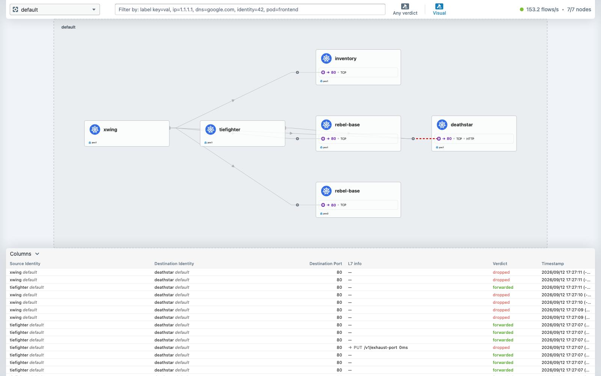

# Demo 01 — Hubble: seeing what the network is actually doing

## Summary context

**The problem Hubble solves.** On a cluster using iptables-based networking, "what is talking to
what" is genuinely hard to answer. `iptables -L` shows rules, not traffic. Packet counters show
volume, not identity. A dropped packet leaves no explanation of *which rule* dropped it or *why*.
Debugging usually means `tcpdump` on a node, correlating IP addresses to pods by hand, and hoping
the pod has not been rescheduled since.

**What Cilium can do instead.** The same eBPF programs that enforce policy and load-balance
Services sit directly in the datapath, so they can report every flow as it happens — annotated with
the **security identity** of both ends (not just IPs), the **verdict** (forwarded or dropped), and,
where an L7 policy applies, the **HTTP method, path, status and latency**. Hubble is the API and
CLI over that stream.

**Why identity matters more than it sounds.** A pod IP is ephemeral and gets reused. A Cilium
identity is derived from the pod's labels, so `default/tiefighter (ID:66741)` means the same thing
after a reschedule onto a different node with a different IP. Every line below names workloads, and
that is what makes the output readable without a lookup table.

**Architecture, briefly.** A Hubble instance runs inside each Cilium agent and sees only its own
node. **Hubble Relay** aggregates all of them into one API — that is why `hubble status` reports
`Connected Nodes: 5/5`, and why you get a cluster-wide view rather than a per-node one. The
`-P` flag on the CLI sets up the port-forward to Relay for you.

**Prerequisite:** `poc1` up with Cilium and Hubble (SETUP.md Steps 3–6), demo 02's app deployed to
generate interesting traffic.

All output below is in [`output/transcript.txt`](output/transcript.txt), captured with
`scripts/record.sh`.

---

## Part 1 — is Hubble healthy?

```bash
hubble status -P
```

> **Without `-P` (or a running port-forward) every `hubble` command on the laptop fails with**
> `dial tcp 127.0.0.1:4245: connect: connection refused` — the cluster is fine, the CLI simply
> has no server. Gotcha #37 shows both forms; `hubble status` always prints which server it used.

```
Healthcheck (via 127.0.0.1:4245): Ok
Current/Max Flows: 19,311/20,475 (94.32%)
Flows/s: 27.68
Connected Nodes: 5/5
```

- **`Connected Nodes: 5/5`** — Relay is talking to the Hubble instance on every node. If this said
  4/5 you would be observing a cluster with a blind spot.
- **`Current/Max Flows`** — the ring buffer is per-node and finite. At 94% full it is recycling, so
  `--last N` reaches back minutes, not hours. Hubble is a live lens, not a long-term store; for
  retention you export flows (see the "tracing" work item).

**Expected warning.** Every command prints:

```
level=WARN msg="Hubble CLI version is lower than Hubble Relay ..." hubble-cli-version=1.19.4 hubble-relay-version=1.20.1+g7d68cfb3
```

This is **not** a misconfiguration. Cilium 1.20.1 ships Relay 1.20.1, but the `cilium/hubble` CLI
repo's newest release is 1.19.4 — there is no matching CLI to install. Everything in this demo
works; the examples below filter the warning out for readability with `| grep -v level=WARN`.

## Part 2 — L7 flows: method, path, status and latency

```bash
hubble observe --last 6 -P --protocol http
```

```
20:05:55.461: default/tiefighter:46152 (ID:66741) -> default/deathstar-6cdb68dc9f-mxjhs:80 (ID:86276) http-request FORWARDED (HTTP/1.1 POST http://deathstar.default.svc.cluster.local/v1/request-landing)
20:05:55.464: default/tiefighter:46152 (ID:66741) <- default/deathstar-6cdb68dc9f-mxjhs:80 (ID:86276) http-response FORWARDED (HTTP/1.1 200 2ms (POST http://deathstar.default.svc.cluster.local/v1/request-landing))
20:05:55.675: default/tiefighter:50882 (ID:66741) -> default/deathstar-6cdb68dc9f-xqvqg:80 (ID:86276) http-request FORWARDED (HTTP/1.1 POST http://deathstar.default.svc.cluster.local/v1/request-landing)
20:05:55.678: default/tiefighter:50882 (ID:66741) <- default/deathstar-6cdb68dc9f-xqvqg:80 (ID:86276) http-response FORWARDED (HTTP/1.1 200 2ms (POST http://deathstar.default.svc.cluster.local/v1/request-landing))
```

Read one request/response pair and notice how much is there without any application
instrumentation: **workload names**, **security identities**, **direction** (`->` / `<-`), the
**verdict**, the **HTTP method and full URL**, the **status code**, and the **server-side latency**
(`2ms`).

Also visible by accident: the two requests went to **different backend pods** (`...-mxjhs` and
`...-xqvqg`). That is the eBPF Service load balancer from demo 03, caught in the act.

## Part 3 — verdicts, including the interesting failures

```bash
hubble observe --last 6 -P --verdict DROPPED
```

```
20:03:03.713: default/tiefighter:38990 (ID:66741) -> default/deathstar-...:80 (ID:86276) http-request DROPPED (HTTP/1.1 PUT http://deathstar.default.svc.cluster.local/v1/exhaust-port)
20:03:06.843: fe80::74c8:b5ff:fef7:853a (ID:86276) <> ff02::2 (unknown) Unsupported L3 protocol DROPPED (ICMPv6 RouterSolicitation)
```

The first line is demo 02's L7 denial: it names the exact request that was refused. Compare with an
L3 denial, which looks quite different:

```bash
hubble observe --last 25 -P --label class=deathstar
```

```
default/xwing:51338 (ID:99365) <> default/deathstar-...:80 (ID:86276) Policy denied DROPPED (TCP Flags: SYN)
```

`Policy denied ... (TCP Flags: SYN)` — the connection never completed a handshake. That is why the
client saw a timeout rather than a 403. **The verdict line tells you which layer refused, without
guessing.**

**On the ICMPv6 noise.** Those `Unsupported L3 protocol DROPPED (ICMPv6 RouterSolicitation)` lines
are pods sending IPv6 router solicitations on a cluster configured for IPv4 only. They are
harmless, expected, and worth pointing out precisely *because* a newcomer filtering for `DROPPED`
will see them first and think something is broken. Real policy drops say `Policy denied`.

## Part 4 — useful filters

```bash
hubble observe -P --follow                          # live tail
hubble observe -P --protocol http                   # L7 only
hubble observe -P --verdict DROPPED                 # what is being denied
hubble observe -P --label class=deathstar           # by Kubernetes label
hubble observe -P --namespace kube-system           # by namespace
hubble observe -P --protocol dns                    # DNS lookups, with the queried name
```

## Part 5 — the service map

```bash
cilium hubble ui
```

Opens the Hubble UI in a browser: a live service-dependency graph built from the same flow stream,
with a flow table underneath. Useful for showing someone the shape of an application's traffic in
one picture; the CLI is better for answering a specific question.

The graph is only as rich as the metrics enabled — `cilium/values-poc1.yaml` turns on `dns`, `drop`,
`tcp`, `flow`, `port-distribution`, `icmp` and `httpV2`. Without `httpV2` the map still draws, but
without the HTTP detail that makes it interesting.

## What to take away

| Capability | Evidence above |
|---|---|
| Cluster-wide, not per-node | `Connected Nodes: 5/5` via Relay |
| Identity-aware, not IP-aware | `default/tiefighter (ID:66741)` on every line |
| L7 visibility with no app changes | method, full URL, status, `2ms` latency |
| Verdicts explain themselves | `Policy denied` (L3) vs `http-request DROPPED` (L7) |
| Observability and enforcement share a dataplane | the same eBPF that dropped the request reported it |

**The honest limit:** the flow buffer is finite and in-memory (94% full here), so Hubble answers
"what is happening now" and "what happened a few minutes ago". Long-term retention means exporting
flows to something that stores them — which is exactly what the outstanding "tracing" work item is.

## Evidence

Captured 2026-09-12 with `scripts/evidence/capture.js` and `scripts/evidence/collect.sh` (both re-runnable; the pod and Cilium output is the recorded file [`output/evidence.txt`](output/evidence.txt)). Every image is what the browser saw, with traffic running.

**hubble ui default** — the live service map of the default namespace — deathstar, tiefighter, xwing, rebel-base, inventory — and the flow table beneath; the header shows the node count the relay reaches (7/7 since demo 24)



**Running pods** (from `output/evidence.txt`):

```console
$ kubectl --context kind-poc1 -n default get pods -o wide
NAME                          READY   STATUS    RESTARTS      AGE   IP            NODE           NOMINATED NODE   READINESS GATES
deathstar-d7f446dc5-6wgwz     1/1     Running   2 (24h ago)   41h   10.10.4.244   poc1-worker    <none>           <none>
deathstar-d7f446dc5-dkgqt     1/1     Running   2 (24h ago)   41h   10.10.3.155   poc1-worker2   <none>           <none>
inventory-69ccd48cd-bzswq     1/1     Running   2 (24h ago)   31h   10.10.3.167   poc1-worker2   <none>           <none>
inventory-69ccd48cd-mv2hh     1/1     Running   2 (24h ago)   31h   10.10.4.117   poc1-worker    <none>           <none>
rebel-base-5bbc557b76-26q6b   1/1     Running   2 (24h ago)   31h   10.10.3.53    poc1-worker2   <none>           <none>
rebel-base-5bbc557b76-gvk68   1/1     Running   2 (24h ago)   31h   10.10.4.238   poc1-worker    <none>           <none>
tiefighter                    1/1     Running   2 (24h ago)   41h   10.10.4.191   poc1-worker    <none>           <none>
xwing                         1/1     Running   2 (24h ago)   41h   10.10.4.57    poc1-worker    <none>           <none>
```

```console
$ kubectl --context kind-poc1 -n kube-system get pods -o wide
NAME                                          READY   STATUS    RESTARTS        AGE    IP            NODE                  NOMINATED NODE   READINESS 
cilium-envoy-4ht26                            1/1     Running   2 (24h ago)     2d2h   172.18.0.5    poc1-worker           <none>           <none>
cilium-envoy-9p6mq                            1/1     Running   2 (24h ago)     2d2h   172.18.0.4    poc1-worker2          <none>           <none>
cilium-envoy-r5c6d                            1/1     Running   2 (24h ago)     2d2h   172.18.0.7    poc1-control-plane2   <none>           <none>
cilium-envoy-v9lk2                            1/1     Running   2 (24h ago)     2d2h   172.18.0.3    poc1-control-plane3   <none>           <none>
cilium-envoy-w7759                            1/1     Running   2 (24h ago)     2d2h   172.18.0.6    poc1-control-plane    <none>           <none>
cilium-ntbb4                                  1/1     Running   0               11h    172.18.0.7    poc1-control-plane2   <none>           <none>
cilium-operator-79d6b9ffd7-57lpg              0/1     Running   8 (52s ago)     8h     172.18.0.7    poc1-control-plane2   <none>           <none>
cilium-pv958                                  1/1     Running   0               11h    172.18.0.3    poc1-control-plane3   <none>           <none>
cilium-qt6nm                                  1/1     Running   0               11h    172.18.0.5    poc1-worker           <none>           <none>
cilium-s2wxk                                  1/1     Running   0               11h    172.18.0.4    poc1-worker2          <none>           <none>
cilium-zdgfx                                  1/1     Running   0               11h    172.18.0.6    poc1-control-plane    <none>           <none>
clustermesh-apiserver-844c48bb9b-sngg7        3/3     Running   2 (8h ago)      8h     10.10.4.2     poc1-worker           <none>           <none>
coredns-789c5fbdb4-qhj2d                      1/1     Running   0               17h    10.10.1.35    poc1-control-plane2   <none>           <none>
```

The Cilium/kubectl commands that prove this demo's claim, with their output, follow the pod listings in [`output/evidence.txt`](output/evidence.txt).
