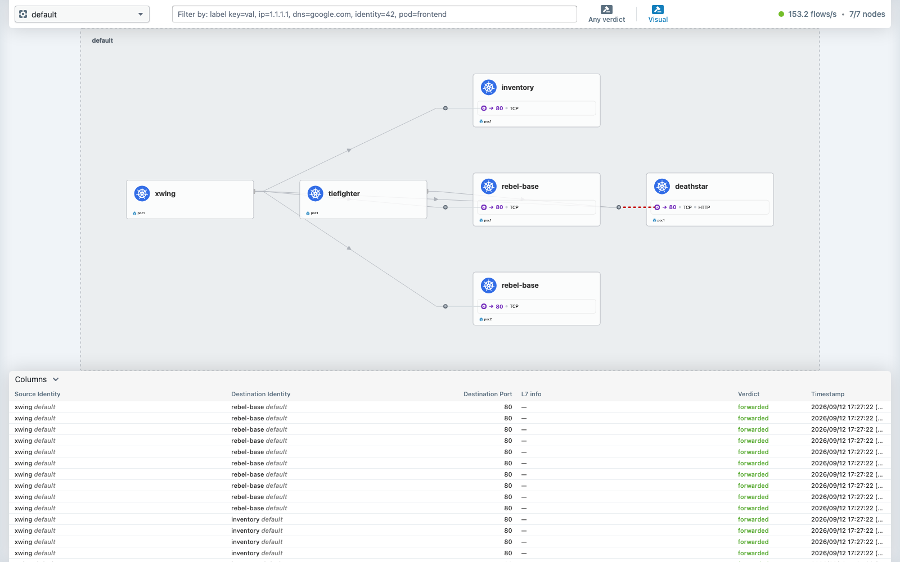
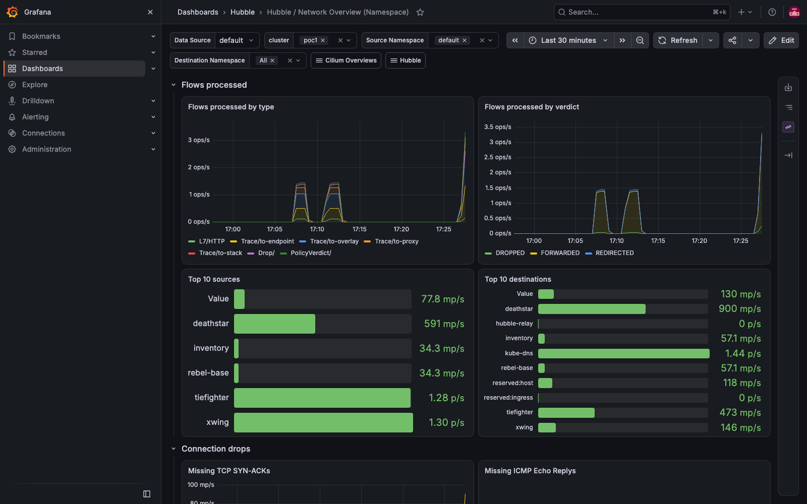

# Demo 02 — L7 HTTP-aware network policy

**What it proves.** Cilium can allow one HTTP method+path and deny another *between the same two
pods, on the same TCP port*. This is not a thing iptables can express. It is the clearest single
argument for an eBPF, identity-aware dataplane.

The demo is Cilium's official Star Wars app, pinned to v1.20.1:
`deathstar` (a Service with 2 replicas), `tiefighter` (`org=empire`) and `xwing` (`org=alliance`).

Run it in three stages, and **do each stage in order** — the value is in how the answer changes.

## Stage 0 — no policy

```bash
kubectl apply -f demos/02-l7-policy/http-sw-app.yaml
kubectl wait --for=condition=Ready pod --all --timeout=180s
```

```bash
kubectl exec tiefighter -- curl -s -XPOST deathstar.default.svc.cluster.local/v1/request-landing
kubectl exec xwing      -- curl -s -XPOST deathstar.default.svc.cluster.local/v1/request-landing
```

```
Ship landed
Ship landed
```

Both land. There is no policy, so everything is permitted.

Worth noticing in passing: that request resolved a Kubernetes Service and was load-balanced to one
of two backends **with no kube-proxy in the cluster**. Cilium did it in eBPF.

## Stage 1 — L3/L4 policy, and the gap it leaves

```bash
kubectl apply -f demos/02-l7-policy/01-l3-l4-policy.yaml
```

```bash
kubectl exec tiefighter -- curl -s -XPOST deathstar.default.svc.cluster.local/v1/request-landing
```

```
Ship landed
```

```bash
kubectl exec xwing -- curl -s -XPOST --max-time 8 deathstar.default.svc.cluster.local/v1/request-landing
```

```
command terminated with exit code 28      # curl timeout — the packet was dropped
```

The rule matched on the **label** `org=empire`, not on an IP, so it survives rescheduling.

**Now the gap.** tiefighter is allowed on TCP 80. What stops it calling the dangerous endpoint?

```bash
kubectl exec tiefighter -- curl -s -XPUT deathstar.default.svc.cluster.local/v1/exhaust-port
```

```
Panic: deathstar exploded

goroutine 1 [running]:
main.HandleGarbage(0x2080c3f50, 0x2, 0x4, 0x425c0, 0x5, 0xa)
        /code/src/github.com/empire/deathstar/temp/main.go:9 +0x64
```

Nothing stopped it. A port-level rule cannot see a URL — the connection it authorised was used for
a request it never had the vocabulary to describe.

## Stage 2 — L7 policy closes it

```bash
kubectl apply -f demos/02-l7-policy/02-l7-policy.yaml
```

The only change from stage 1 is a `rules.http` block permitting `POST /v1/request-landing`.

```bash
kubectl exec tiefighter -- curl -s -XPOST deathstar.default.svc.cluster.local/v1/request-landing
```

```
Ship landed
```

```bash
kubectl exec tiefighter -- curl -s -XPUT -w '\n[%{http_code} in %{time_total}s]\n' \
  deathstar.default.svc.cluster.local/v1/exhaust-port
```

```
Access denied

[403 in 0.016952s]
```

Same client, same destination, same port, same security identity — **a different verb and path get
a different answer.**

### A diagnostic worth internalising

Compare the two denials:

| Denied at | Symptom | Why |
|---|---|---|
| L3/L4 (xwing) | curl **times out**, exit 28 | the SYN is dropped in eBPF; nothing ever answers |
| L7 (tiefighter → exhaust-port) | instant **403** in ~17 ms | the Envoy L7 proxy accepted the connection, parsed the request, and refused it |

So the *shape* of a failure tells you which layer refused it. A timeout smells like L3/L4; a fast
403 smells like L7.

## Stage 3 — see it in Hubble

```bash
hubble observe --last 40 -P --protocol http
```

```
default/tiefighter:38986 (ID:66741) -> default/deathstar-...:80 (ID:86276) http-request FORWARDED (HTTP/1.1 POST http://deathstar.default.svc.cluster.local/v1/request-landing)
default/tiefighter:38986 (ID:66741) <- default/deathstar-...:80 (ID:86276) http-response FORWARDED (HTTP/1.1 200 3ms (POST .../v1/request-landing))
default/tiefighter:38990 (ID:66741) -> default/deathstar-...:80 (ID:86276) http-request DROPPED   (HTTP/1.1 PUT  http://deathstar.default.svc.cluster.local/v1/exhaust-port)
default/tiefighter:38990 (ID:66741) <- default/deathstar-...:80 (ID:86276) http-response FORWARDED (HTTP/1.1 403 0ms (PUT .../v1/exhaust-port))
```

And the L3 denial, for contrast:

```bash
hubble observe --last 25 -P --label class=deathstar
```

```
default/xwing:51338 (ID:99365) <> default/deathstar-...:80 (ID:86276) Policy denied DROPPED (TCP Flags: SYN)
```

Note what is in those lines: pod names and numeric **security identities**, the HTTP method and
path, the verdict, and the response time. Not IP pairs and packet counts. That is the observability
half of the argument, and it comes from the same dataplane doing the enforcement.

## Clean up

```bash
kubectl delete -f demos/02-l7-policy/02-l7-policy.yaml
kubectl delete -f demos/02-l7-policy/http-sw-app.yaml
```

## Evidence

Captured 2026-09-12 with `scripts/evidence/capture.js` and `scripts/evidence/collect.sh` (both re-runnable; the pod and Cilium output is the recorded file [`output/evidence.txt`](output/evidence.txt)). Every image is what the browser saw, with traffic running.

**hubble ui default after policy** — the same namespace after the Star Wars L7 policy: the **red dashed edge** from tiefighter to deathstar is the L7 denial (PUT /v1/exhaust-port) beside the allowed POST /v1/request-landing; the table streams the forwarded flows



**grafana network overview default** — Hubble's Network Overview for default: flows by verdict, the drop panels counting the policy denials



**Running pods** (from `output/evidence.txt`):

```console
$ kubectl --context kind-poc1 -n default get pods -o wide
NAME                          READY   STATUS    RESTARTS      AGE   IP            NODE           NOMINATED NODE   READINESS GATES
deathstar-d7f446dc5-6wgwz     1/1     Running   2 (24h ago)   41h   10.10.4.244   poc1-worker    <none>           <none>
deathstar-d7f446dc5-dkgqt     1/1     Running   2 (24h ago)   41h   10.10.3.155   poc1-worker2   <none>           <none>
inventory-69ccd48cd-bzswq     1/1     Running   2 (24h ago)   31h   10.10.3.167   poc1-worker2   <none>           <none>
inventory-69ccd48cd-mv2hh     1/1     Running   2 (24h ago)   31h   10.10.4.117   poc1-worker    <none>           <none>
rebel-base-5bbc557b76-26q6b   1/1     Running   2 (24h ago)   31h   10.10.3.53    poc1-worker2   <none>           <none>
rebel-base-5bbc557b76-gvk68   1/1     Running   2 (24h ago)   31h   10.10.4.238   poc1-worker    <none>           <none>
tiefighter                    1/1     Running   2 (24h ago)   41h   10.10.4.191   poc1-worker    <none>           <none>
xwing                         1/1     Running   2 (24h ago)   41h   10.10.4.57    poc1-worker    <none>           <none>
```

The Cilium/kubectl commands that prove this demo's claim, with their output, follow the pod listings in [`output/evidence.txt`](output/evidence.txt).

