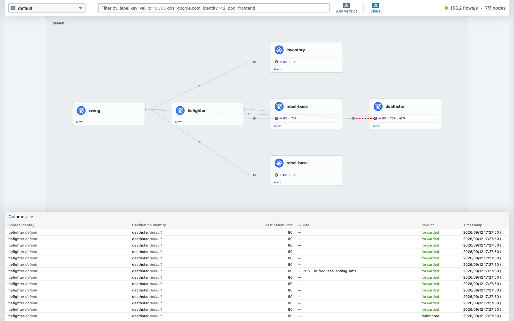

# Demo 07 — ClusterMesh: one Service, two clusters

## Summary context

**The problem.** Two Kubernetes clusters — different regions, different failure domains, or one
being drained for maintenance — and a Service in one needs backends in the other. The usual answers
are an ingress per cluster plus external DNS with health checks (slow failover, DNS caching, a new
public surface), or a service mesh gateway (another control plane, another proxy hop, mTLS config).

**Cilium's answer.** Merge the clusters' endpoint sets in the dataplane. A Service annotated
`service.cilium.io/global: "true"` is load-balanced across backends in **every** meshed cluster by
the same eBPF that handles ordinary ClusterIP traffic. No gateway, no DNS games, and the pods have
no idea the mesh exists.

**Prerequisites.** Two clusters with **non-overlapping** pod and service CIDRs, unique cluster
names and numeric ids in 1–255, and mutual node IP reachability. This PoC planned for that on day
one — `clusters/poc1.yaml` uses `10.10/16`+`10.11/16` and `poc2.yaml` uses `10.20/16`+`10.21/16`,
and both set `cluster.id`/`cluster.name` at *install* because changing an id later reissues every
security identity in the cluster.

All output is in [`output/transcript.txt`](output/transcript.txt).

---

## Part 1 — enable the mesh

```bash
cilium clustermesh enable --context kind-poc1 --service-type NodePort
cilium clustermesh enable --context kind-poc2 --service-type NodePort
```

**`--service-type NodePort` because kind has no cloud load balancer** for the mesh API server. The
CLI warns that NodePort "may fail when nodes are removed" — true and worth heeding in production,
irrelevant on a laptop.

## Part 2 — the failure worth keeping: mismatched CAs

```bash
cilium clustermesh connect --context kind-poc1 --destination-context kind-poc2
```

```
Error: Unable to connect cluster: Cilium CA certificates do not match between clusters poc1 and
poc2. Use --allow-mismatching-ca to allow this by adding remote CAs to the CA bundle
```

Each cluster generated **its own** Cilium CA at install:

```
poc1: notBefore=Sep 10 20:21:40 2026 GMT   notAfter=Sep  9 20:21:40 2029 GMT
poc2: notBefore=Sep 11 14:15:43 2026 GMT   notAfter=Sep 10 14:15:43 2029 GMT
```

**Do not reach for `--allow-mismatching-ca`.** It works by adding each cluster's CA to the other's
trust bundle, which means every cluster trusts every other cluster's *independent* root. A shared
CA is one trust anchor; mismatching CAs are N. For a two-cluster lab the difference is academic; for
a real mesh it is the difference between one thing to rotate and N things to keep in sync.

**The fix — share the CA.** poc2 was empty, so doing it properly cost nothing:

```bash
kubectl --context kind-poc1 -n kube-system get secret cilium-ca -o yaml \
  | grep -v '^\s*\(resourceVersion\|uid\|creationTimestamp\|selfLink\)' \
  | kubectl --context kind-poc2 -n kube-system apply -f -
```

> **Better still: do this at install time.** Pass the same `tls.ca.cert`/`tls.ca.key` to both
> clusters' `helm install` and the problem never arises. Copying afterwards works only because
> poc2 had issued nothing that mattered yet.

### And a second trap: deleting certs does not regenerate them

The certs already issued by poc2's old CA had to go:

```bash
kubectl --context kind-poc2 -n kube-system delete secret \
  clustermesh-apiserver-{admin,server,remote,local}-cert
```

The apiserver then would not start, and said exactly why:

```
Warning  FailedMount  MountVolume.SetUp failed for volume "etcd-server-secrets" :
         secret "clustermesh-apiserver-server-cert" not found
```

Restarting the pods did not help. Nor did `helm upgrade`. The reason is in the chart's own values:

```bash
helm get values cilium -n kube-system --kube-context kind-poc2 -a | grep -A3 'tls:'
```

```
clustermesh.apiserver.tls.auto: {'enabled': True, 'method': 'cronJob', 'schedule': '0 0 1 */4 *', ...}
```

**`method: cronJob`, `schedule: 0 0 1 */4 *`** — the certificates are generated by a CronJob that
runs on the 1st of the month every four months. Delete the secrets and nothing regenerates them
until then. Trigger it by hand:

```bash
kubectl --context kind-poc2 -n kube-system create job clustermesh-certgen-manual \
  --from=cronjob/clustermesh-apiserver-generate-certs
```

```
NAME                         STATUS     COMPLETIONS   DURATION   AGE
clustermesh-certgen-manual   Complete   1/1           4s         20s
```

Confirm the new cert carries the **shared** CA — the dates must match poc1's exactly:

```bash
kubectl --context kind-poc2 -n kube-system get secret clustermesh-apiserver-server-cert \
  -o jsonpath='{.data.ca\.crt}' | base64 -d | openssl x509 -noout -dates
```

```
notBefore=Sep 10 20:21:40 2026 GMT
notAfter=Sep  9 20:21:40 2029 GMT      <- identical to poc1's CA
```

## Part 3 — connect

```bash
cilium clustermesh connect --context kind-poc1 --destination-context kind-poc2
```

```
✅ Connected cluster kind-poc1 <=> kind-poc2!
```

**Connecting is not the same as connected.** Verify:

```bash
cilium clustermesh status --context kind-poc1 --wait
```

```
✅ All 5 nodes are connected to all clusters [min:1 / avg:1.0 / max:1]
✅ All 1 KVStoreMesh replicas are connected to all clusters [min:1 / avg:1.0 / max:1]

🔌 Cluster Connections:
  - poc2: 5/5 configured, 5/5 connected - KVStoreMesh: 1/1 configured, 1/1 connected
```

```
poc2 side:  ✅ All 2 nodes are connected to all clusters
            - poc1: 2/2 configured, 2/2 connected
```

**Every node on both sides** holds the connection — not a single gateway. That is why there is no
extra hop and no chokepoint.

## Part 4 — the global service

The same `Service` manifest goes to **both** clusters; each cluster gets its own backends.

```yaml
metadata:
  name: rebel-base
  annotations:
    service.cilium.io/global: "true"
```

**That annotation is the entire feature.** Being in a mesh does not make Services global — sharing
is opt-in, per Service, which is the right default.

```bash
kubectl --context kind-poc1 apply -f demos/07-clustermesh/global-service.yaml
kubectl --context kind-poc2 apply -f demos/07-clustermesh/global-service.yaml
kubectl --context kind-poc1 apply -f demos/07-clustermesh/backend-poc1.yaml
kubectl --context kind-poc2 apply -f demos/07-clustermesh/backend-poc2.yaml
```

### The proof, before any traffic

```bash
kubectl --context kind-poc1 -n kube-system exec ds/cilium -c cilium-agent -- \
  cilium-dbg service list | grep -A5 10.11.100.76
```

```
23   10.11.100.76:80/TCP   ClusterIP   1 => 10.10.3.240:80/TCP (active)
                                       2 => 10.10.4.104:80/TCP (active)
                                       3 => 10.20.1.69:80/TCP (active)
                                       4 => 10.20.1.184:80/TCP (active)
```

Read the CIDRs. Backends 1–2 are `10.10.x` — **poc1**. Backends 3–4 are `10.20.x` — **poc2**. One
Service, one eBPF entry, four backends spanning two clusters. Nothing had to be told about this
except the annotation.

### Traffic really is spread

```bash
kubectl --context kind-poc1 exec tiefighter -- \
  sh -c 'for i in $(seq 20); do curl -s http://rebel-base.default.svc.cluster.local/; done' \
  | grep -o '"cluster": "[a-z0-9]*"' | sort | uniq -c
```

```
  11 "cluster": "poc1"
   9 "cluster": "poc2"
```

Each cluster's backend serves a payload naming itself, so the response *is* the evidence — no
inference required.

## Part 5 — failover

Take poc1's local backends away entirely:

```bash
kubectl --context kind-poc1 scale deployment rebel-base --replicas=0
```

```
replicas ready: 0/0
```

The same client, unchanged, in the cluster that now has **no local backends at all**:

```
  20 "cluster": "poc2"
```

**20/20 served by the other cluster.** No errors, no client change, no DNS change, no restart. The
eBPF load balancer simply stopped having local backends to choose and used the remote ones it
already knew about.

Restore with `--replicas=2` and the split returns.

## Part 6 — a real cross-cluster dependency (both directions)

Parts 4–5 used a global service with backends in **both** clusters, so a successful request could
always have been served locally; only the failover case forced it remote. That is not the same as
a **dependency that lives solely in another cluster**, which is the actual use case people mean.
So: provider in one cluster only, consumer in the other, tested **both ways**.

### The Service object must exist in BOTH clusters

This is the part that catches people. A client resolves `payments.default.svc.cluster.local`
through **its own** cluster's DNS, which only answers for Services that exist there. The global
annotation merges **endpoints** across clusters — it does **not** replicate the Service object.

So the `Service` is applied to both clusters; the `Deployment` to only one. If you skip the local
Service you get "the mesh is connected, why does DNS not resolve?"

### Direction 1 — consumer in poc1, provider only in poc2

```bash
kubectl --context kind-poc1 apply -f demos/07-clustermesh/cross-cluster-dependency.yaml  # Service
kubectl --context kind-poc2 apply -f demos/07-clustermesh/cross-cluster-dependency.yaml  # Service
kubectl --context kind-poc2 apply -f demos/07-clustermesh/payments-backend-poc2-only.yaml # backend
```

poc1 has the Service and **nothing behind it**:

```bash
kubectl --context kind-poc1 get endpoints payments
kubectl --context kind-poc1 get pods -l name=payments
```

```
NAME       ENDPOINTS   AGE
payments   <none>      1m

No resources found in default namespace.
```

Yet poc1's eBPF table has two backends — both `10.20.x`, which is **poc2's** pod CIDR:

```
24   10.11.165.19:80/TCP   ClusterIP   1 => 10.20.1.90:80/TCP (active)
                                       2 => 10.20.1.112:80/TCP (active)
```

```bash
kubectl --context kind-poc1 exec tiefighter --   sh -c 'for i in $(seq 6); do curl -s http://payments.default.svc.cluster.local/; done'
```

```
{"service": "payments", "running_in": "poc2", "note": "this provider exists ONLY in poc2"}
{"service": "payments", "running_in": "poc2", "note": "this provider exists ONLY in poc2"}
... 6/6
```

And DNS confirms the consumer used an ordinary **local** lookup:

```
Name:    payments.default.svc.cluster.local
Address: 10.11.165.19          <- poc1's OWN ClusterIP
```

**Nothing in the client knows a second cluster exists.** No remote hostname, no port-forward, no
gateway. It called a normal Service name and got a pod in another cluster.

### Direction 2 — consumer in poc2, provider only in poc1

The exact mirror, because a mesh that only works one way is not a mesh:

```bash
kubectl --context kind-poc1 apply -f demos/07-clustermesh/inventory-backend-poc1-only.yaml
```

poc2's eBPF table for `inventory` — backends in `10.10.x`, **poc1's** CIDR:

```
12   10.21.50.140:80/TCP   ClusterIP   1 => 10.10.3.17:80/TCP (active)
                                       2 => 10.10.4.213:80/TCP (active)
```

```bash
kubectl --context kind-poc2 run xcheck --rm -i --restart=Never --image=curlimages/curl:latest \
  --command -- sh -c 'curl -s http://inventory.default.svc.cluster.local/'
```

```
{"service": "inventory", "running_in": "poc1", "note": "this provider exists ONLY in poc1"}
```

### Why this is the stronger proof

| | Global service (Parts 4–5) | Cross-cluster dependency (Part 6) |
|---|---|---|
| Backends | both clusters | **one cluster only** |
| A success could be local | yes, except during failover | **never** |
| Directions tested | poc1 → mesh | **poc1 → poc2 AND poc2 → poc1** |
| What it models | HA / spill-over capacity | a genuine service dependency across clusters |

## Verifying the mesh day to day

Handy variants, including a couple of tools you may already prefer over plain `kubectl`.

### Switching contexts

`kubectx` lists and switches contexts more briefly than `kubectl config use-context`:

```bash
kubectx
```

```
kind-kind-cluster
kind-poc1
kind-poc2
```

```bash
kubectx kind-poc1
```

```
Switched to context "kind-poc1".
```

> **Gotcha: a context can outlive its cluster.** `kind-kind-cluster` above is a **stale entry** —
> `kind get clusters` reports only `poc1` and `poc2`. Deleting a cluster with `kind delete cluster`
> removes the context, but a cluster deleted some other way (or a kubeconfig copied between
> machines) leaves the entry behind, and `kubectl --context kind-kind-cluster ...` then fails with
> a connection error that looks like a broken cluster rather than a missing one. Cross-check with
> `kind get clusters`, and prune with
> `kubectl config delete-context kind-kind-cluster`.

`oc` works anywhere `kubectl` does, if that is your habit:

```bash
oc get node
```

```
NAME                  STATUS   ROLES           AGE   VERSION
poc1-control-plane    Ready    control-plane   18h   v1.36.4
poc1-control-plane2   Ready    control-plane   18h   v1.36.4
poc1-control-plane3   Ready    control-plane   18h   v1.36.4
poc1-worker           Ready    <none>          18h   v1.36.4
poc1-worker2          Ready    <none>          18h   v1.36.4
```

### Full mesh status, both sides

Always check **both** — a mesh reporting healthy from one side is only half the answer.

```bash
cilium clustermesh status --context kind-poc1
```

```
⚠️  Service type NodePort detected! Service may fail when nodes are removed from the cluster!
✅ Service "clustermesh-apiserver" of type "NodePort" found
✅ Cluster access information is available:
  - 172.18.0.6:32379
✅ Deployment clustermesh-apiserver is ready
ℹ️  KVStoreMesh is enabled

✅ All 5 nodes are connected to all clusters [min:1 / avg:1.0 / max:1]
✅ All 1 KVStoreMesh replicas are connected to all clusters [min:1 / avg:1.0 / max:1]

🔌 Cluster Connections:
  - poc2: 5/5 configured, 5/5 connected - KVStoreMesh: 1/1 configured, 1/1 connected
```

```bash
cilium clustermesh status --context kind-poc2
```

```
✅ Cluster access information is available:
  - 172.18.0.10:32379
✅ All 2 nodes are connected to all clusters [min:1 / avg:1.0 / max:1]

🔌 Cluster Connections:
  - poc1: 2/2 configured, 2/2 connected - KVStoreMesh: 1/1 configured, 1/1 connected
```

**What to read in that output:**

- **`5/5 configured, 5/5 connected`** — *configured* means the node was told about the remote
  cluster; *connected* means it actually established the session. A gap between the two numbers is
  the interesting failure, and it is invisible if you only look for green ticks.
- **The access address** (`172.18.0.6:32379`) is the NodePort endpoint the other cluster dials.
  Each side advertises its own.
- **`min:1 / avg:1.0 / max:1`** — remote clusters connected per node. Every node connects
  independently, which is why there is no gateway to fail.
- The **NodePort warning** is expected here and worth heeding in production (see Part 1).

## Part 7 — cross-cluster throughput (WireGuard off)

Same rig as demo 06, same image, same 10s TCP test, same laptop, **encryption off on both sides** —
confirmed before measuring, because it is the single biggest variable:

```bash
for c in kind-poc1 kind-poc2; do
  kubectl --context $c -n kube-system exec ds/cilium -c cilium-agent -- cilium-dbg status | grep Encryption
done
```

```
kind-poc1  Encryption:  Disabled
kind-poc2  Encryption:  Disabled
```

The server runs in **poc2 only**, reached through a global Service, so poc1 has the Service with
no local endpoints:

```
poc1 local endpoints: <none>
26   10.11.157.25:5201/TCP   ClusterIP   1 => 10.20.1.220:5201/TCP (active)
```

Measurements are taken with `scripts/bench.sh`, which prints **every raw sample** and computes the
median and spread on screen — nothing is calculated off-camera:

```bash
scripts/bench.sh "INTRA" kind-poc1 perf iperf3-client 10.10.4.116 5
scripts/bench.sh "CROSS" kind-poc1 perf iperf3-client iperf3-global.perf.svc.cluster.local 5
```

### Two measurement sessions, and why that matters

**Session A:**

| | Median | Range | Spread |
|---|---|---|---|
| Intra-cluster | 8714 Mbit/s | 6757–8997 | 25% |
| Cross-cluster | 8098 Mbit/s | 8057–8215 | 2% |

On that data alone you would conclude cross-cluster costs about 7%, and that it is unusually
consistent. **Both conclusions were wrong.** Session B, same rig, same commands, an hour later:

```
=== INTRA-CLUSTER  poc1-worker2 -> poc1-worker ===
  run 1: 6626    run 2: 9011    run 3: 8432    run 4: 6513    run 5: 6550
  median  : 6626 Mbits/sec
  min/max : 6513 / 9011 Mbits/sec
  spread  : 37.7%  of median
```

```
=== CROSS-CLUSTER  poc1 -> poc2 via global service ===
  run 1: 8096    run 2: 6022    run 3: 7845    run 4: 7780    run 5: 7919
  median  : 7845 Mbits/sec
  min/max : 6022 / 8096 Mbits/sec
  spread  : 26.4%  of median
```

| | Session A | Session B |
|---|---|---|
| Intra-cluster median | 8714 | **6626** |
| Cross-cluster median | 8098 | **7845** |
| Which was faster? | intra, by 7% | **cross, by 18%** |

**The ordering reversed.** Cross-cluster's "remarkably tight" 2% spread in session A did not
reproduce either — it was 26.4% in session B. That 2% was luck.

### The actual conclusion

> **This rig cannot measure a difference between intra-cluster and cross-cluster throughput.** The
> two distributions overlap almost entirely (intra 6513–9011, cross 6022–8215 across both
> sessions), and run-to-run variation within a single configuration (26–38%) is far larger than any
> difference between them — large enough to reverse the ranking between sessions.

An earlier draft of this page claimed "cross-cluster costs ~7%". **That is retracted.** It was a
single session's median difference, smaller than that session's own noise, and it did not survive
a re-run.

**Why the numbers move so much:** both clusters are containers on one laptop, sharing a kernel, a
bridge and a CPU with Cilium agents, Envoy, Hubble, the demo workloads and everything else on the
machine. Whichever path happens to be least contended at that moment wins.

**Why the result would not transfer anyway:** with both clusters on one host there is no real
network between them. Even a clean measurement here would only capture *mechanism* overhead —
endpoint merging, extra map entries, the tunnel — and say nothing about a real mesh, where the
inter-region link dominates entirely.

**What it would take to answer properly:** two machines with a real link, ≥30 samples per
configuration, interleaved rather than run in blocks (so drift affects both equally), and reported
as distributions rather than medians.

## What to take away

| Claim | Evidence |
|---|---|
| Mesh is established on every node | `All 5 nodes connected` / `All 2 nodes connected`, both directions |
| Endpoints merge across clusters | one eBPF entry with backends in `10.10.x` **and** `10.20.x` |
| Traffic spreads across clusters | 11 poc1 / 9 poc2 over 20 requests |
| Failover is automatic and invisible | 20/20 to poc2 with zero local backends, no client change |
| Sharing is opt-in | one annotation; unannotated Services stay cluster-local |
| A shared CA is the right way | mismatched CAs are refused by default, and `--allow-mismatching-ca` trades one trust anchor for N |

**The honest caveats.** Both clusters are on one docker bridge, so node-to-node reachability — the
hard prerequisite in the real world — was free here. `--service-type NodePort` is a laptop
convenience. And this demonstrates *mechanism*, not latency: two clusters on one laptop share a
kernel, so cross-cluster requests are as fast as local ones, which will not be true across regions.

## Clean up

```bash
kubectl --context kind-poc1 delete -f demos/07-clustermesh/backend-poc1.yaml
kubectl --context kind-poc2 delete -f demos/07-clustermesh/backend-poc2.yaml
kubectl --context kind-poc1 delete -f demos/07-clustermesh/global-service.yaml
kubectl --context kind-poc2 delete -f demos/07-clustermesh/global-service.yaml
cilium clustermesh disconnect --context kind-poc1 --destination-context kind-poc2
```

## Evidence

Captured 2026-09-12 with `scripts/evidence/capture.js` and `scripts/evidence/collect.sh` (both re-runnable; the pod and Cilium output is the recorded file [`output/evidence.txt`](output/evidence.txt)). Every image is what the browser saw, with traffic running.

**hubble ui default mesh** — the default namespace seen through one relay that peers both clusters: the global services with backends in poc2



**Running pods** (from `output/evidence.txt`):

```console
$ kubectl --context kind-poc1 -n default get pods -o wide
NAME                          READY   STATUS    RESTARTS      AGE   IP            NODE           NOMINATED NODE   READINESS GATES
deathstar-d7f446dc5-6wgwz     1/1     Running   2 (24h ago)   41h   10.10.4.244   poc1-worker    <none>           <none>
deathstar-d7f446dc5-dkgqt     1/1     Running   2 (24h ago)   41h   10.10.3.155   poc1-worker2   <none>           <none>
inventory-69ccd48cd-bzswq     1/1     Running   2 (24h ago)   31h   10.10.3.167   poc1-worker2   <none>           <none>
inventory-69ccd48cd-mv2hh     1/1     Running   2 (24h ago)   31h   10.10.4.117   poc1-worker    <none>           <none>
rebel-base-5bbc557b76-26q6b   1/1     Running   2 (24h ago)   31h   10.10.3.53    poc1-worker2   <none>           <none>
rebel-base-5bbc557b76-gvk68   1/1     Running   2 (24h ago)   31h   10.10.4.238   poc1-worker    <none>           <none>
tiefighter                    1/1     Running   2 (24h ago)   41h   10.10.4.191   poc1-worker    <none>           <none>
xwing                         1/1     Running   2 (24h ago)   41h   10.10.4.57    poc1-worker    <none>           <none>
```

```console
$ kubectl --context kind-poc2 -n default get pods -o wide
NAME                          READY   STATUS      RESTARTS      AGE   IP            NODE          NOMINATED NODE   READINESS GATES
payments-857785457d-96plh     1/1     Running     2 (24h ago)   31h   10.20.1.113   poc2-worker   <none>           <none>
payments-857785457d-q6d2z     1/1     Running     2 (24h ago)   31h   10.20.1.121   poc2-worker   <none>           <none>
rebel-base-5bbc557b76-jrgj2   1/1     Running     2 (24h ago)   31h   10.20.1.46    poc2-worker   <none>           <none>
rebel-base-5bbc557b76-lgn9x   1/1     Running     2 (24h ago)   31h   10.20.1.190   poc2-worker   <none>           <none>
xcheck                        0/1     Completed   0             31h   <none>        poc2-worker   <none>           <none>
```

The Cilium/kubectl commands that prove this demo's claim, with their output, follow the pod listings in [`output/evidence.txt`](output/evidence.txt).

