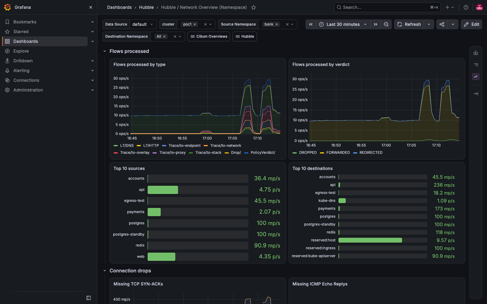
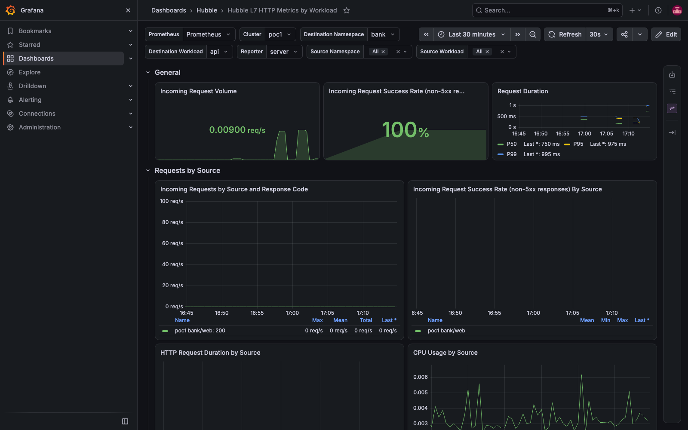
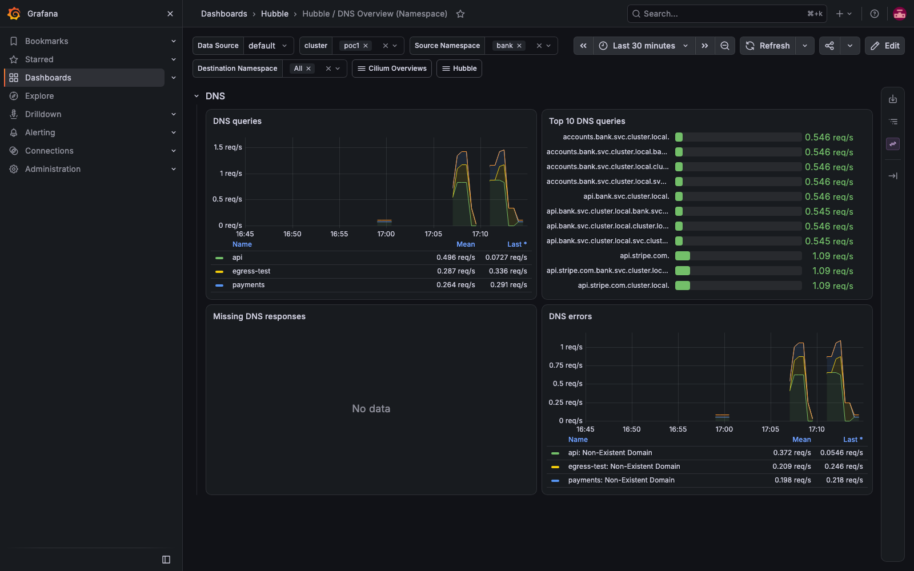
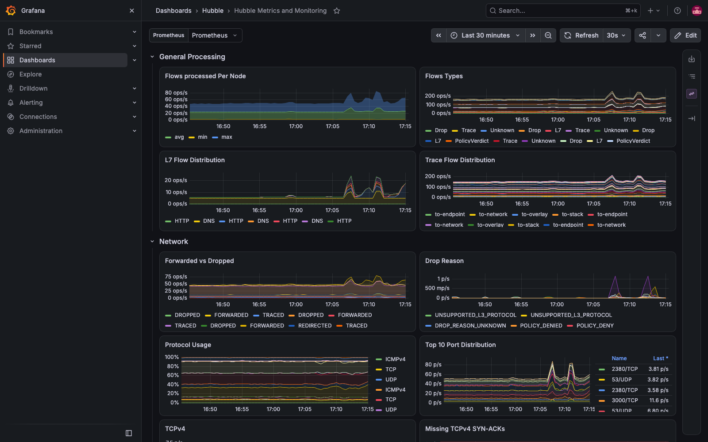
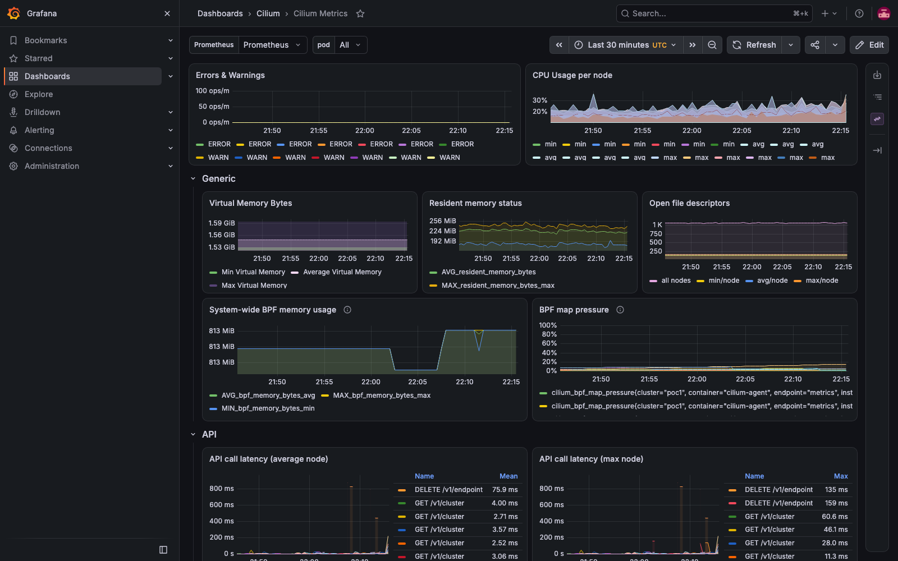
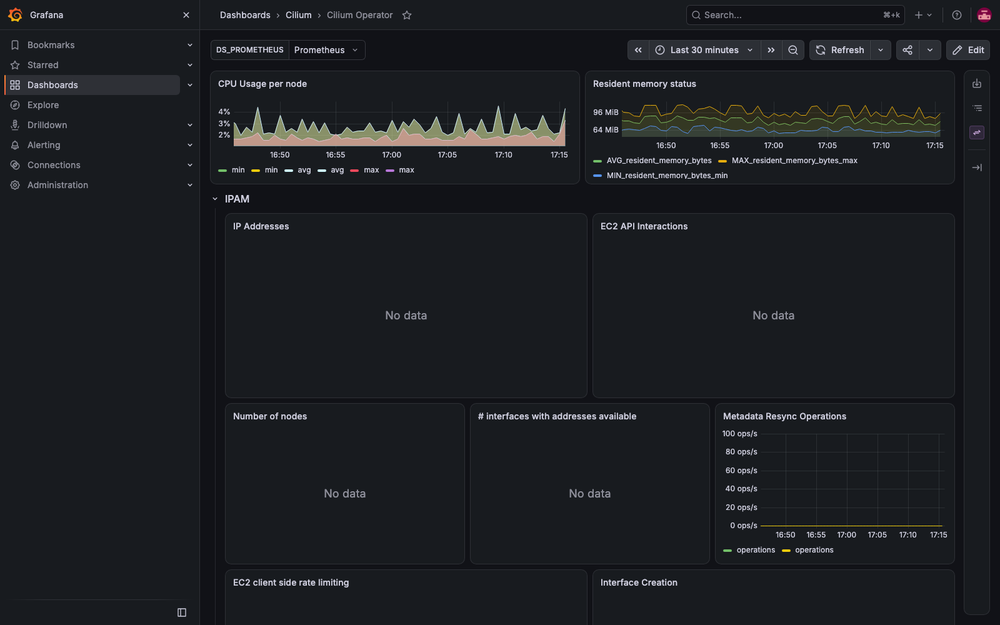
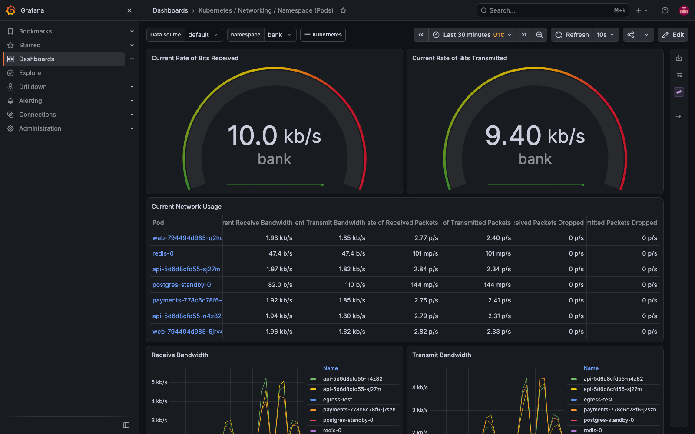

# Demo 16 — Prometheus + Grafana (kube-prometheus-stack), then Hubble's metrics on dashboards

> **Where this sits in the whole:** [OBSERVABILITY-ARCHITECTURE.md](../../OBSERVABILITY-ARCHITECTURE.md) — the one picture of metrics, traces and flows across poc1, poc2 … poc-N, reviewed against what is deployed.

## Summary context

Hubble UI is a *service map*: it draws flows from each agent's ring buffer (gotcha #47) and has
**no metrics view in any version**. The numbers Hubble produces — drops, DNS, TCP, HTTP/gRPC
latency, per-port distribution — have been on every agent's `hubble-metrics :9965` since demo 01
(`hubble.metrics.enabled` in `cilium/values-poc1.yaml`), but nothing collected them and nothing drew
them. This demo fixes that in two deliberately separate sections:

| Section | What | Why separate |
|---|---|---|
| **A** (this part) | Install **kube-prometheus-stack** on poc1: Prometheus Operator, Prometheus, Alertmanager, Grafana, node-exporter, kube-state-metrics — and put Grafana on the demo 09 Gateway as `https://grafana.poc.local` | A general-purpose monitoring stack is a platform decision that has nothing to do with Cilium. It must be up, scraping, and reachable **before** Cilium is told to publish into it, or a Cilium-side failure and a stack-side failure are indistinguishable |
| **B** (Part 5 onward) | Tell the Cilium chart to create ServiceMonitors + Grafana dashboards for the agent, the operator and Hubble; prove Prometheus scrapes `:9965`; drive the bank and read the panels | This is the actual answer to *"where are the Hubble dashboards?"* — and it is a Cilium helm change on a live mesh, which has its own blast radius (gotcha #42) |

Everything below was run and recorded in [`output/transcript.txt`](output/transcript.txt).

---

# Section A — the monitoring stack

## Part 1 — install kube-prometheus-stack, pinned, with every deviation explained

**Why this chart.** kube-prometheus-stack is the Prometheus community's packaging of the
Prometheus Operator plus the exporters and Grafana, wired together. Its operator watches
`ServiceMonitor`/`PodMonitor` objects, which is exactly the interface the Cilium chart speaks in
Section B (`hubble.metrics.serviceMonitor.enabled`), so nothing has to be hand-written into a
scrape config. Version pinned to what `helm search` returned on build day, like every other
component in this repo (gotcha #43 — pin, or the next run is a different demo):

```bash
helm repo add prometheus-community https://prometheus-community.github.io/helm-charts   # the chart's home
helm repo update prometheus-community
helm search repo prometheus-community/kube-prometheus-stack --version 90.1.1            # chart 90.1.1 = operator v0.93.1
```

**The values file** — [`values-kube-prometheus-stack.yaml`](values-kube-prometheus-stack.yaml).
Read it; every key is a deviation from the chart default with its reason in the comment. The ones
that matter:

| Key | Set to | Reason |
|---|---|---|
| `prometheus.prometheusSpec.serviceMonitorSelectorNilUsesHelmValues` | `false` | **The trap.** By default Prometheus selects *only* ServiceMonitors carrying the release's own label (`release: monitoring`). The Cilium chart creates its ServiceMonitors in `kube-system` without that label, so with the default they would exist and never be scraped. `false` = select every ServiceMonitor in the cluster |
| `…podMonitorSelectorNilUsesHelmValues` | `false` | same, for PodMonitors |
| `…retention` / `resources` | `2d`, 512 Mi–1 Gi | a laptop lab on a 15 GB VM already running 7 nodes |
| `…enableFeatures: [exemplar-storage]` | on | Hubble's `httpV2` metrics are configured with exemplars (demo 01 values); Prometheus discards them unless this is on |
| `grafana.adminPassword` | `poc-grafana` | so the password is in git for the lab, not in a generated Secret you have to fetch |
| `grafana.grafana.ini.server.root_url` | `https://grafana.poc.local` | links Grafana renders point at the Gateway name (Part 2), not `localhost` |
| `grafana.sidecar.dashboards.searchNamespace` | `ALL` | the sidecar loads any ConfigMap labelled `grafana_dashboard=1` from **any** namespace — that is how Section B's Cilium dashboards (ConfigMaps in `kube-system`) appear without copying JSON around |
| `kubeControllerManager/kubeScheduler/kubeEtcd.enabled` | `false` | kind binds these to `127.0.0.1` on the control-plane nodes; the scrapes can never succeed and would sit as three permanent red targets |
| `kubeProxy.enabled` | `false` | poc1 has **no kube-proxy** (demo 03). Nothing to scrape |

**Install** — `--wait` so the command returns only when every pod is Ready; the release is named
`monitoring` so every object it creates is `monitoring-…`:

```bash
helm install monitoring prometheus-community/kube-prometheus-stack --version 90.1.1 \
  -n monitoring --create-namespace --kube-context kind-poc1 \
  -f demos/16-monitoring/values-kube-prometheus-stack.yaml --wait --timeout 10m
```

Recorded (2 min 13 s to Ready, 10 pods):

```
NAME: monitoring   STATUS: deployed   chart kube-prometheus-stack-90.1.1   app v0.93.1

alertmanager-monitoring-kube-prometheus-alertmanager-0   2/2   Running   10.10.3.207   poc1-worker2
monitoring-grafana-b9bbf985-xlcn6                        3/3   Running   10.10.4.40    poc1-worker
monitoring-kube-prometheus-operator-57b74d8f5b-zw957     1/1   Running   10.10.3.227   poc1-worker2
monitoring-kube-state-metrics-7f584dc46d-dpxkb           1/1   Running   10.10.4.165   poc1-worker
monitoring-prometheus-node-exporter-…  ×5                1/1   Running   172.18.0.x    every node (hostNetwork)
prometheus-monitoring-kube-prometheus-prometheus-0       2/2   Running   10.10.4.70    poc1-worker
```

Ten CRDs from `monitoring.coreos.com` were installed with it (`kubectl get crd | grep -c monitoring.coreos.com`
→ 10) — `ServiceMonitor`, `PodMonitor`, `Prometheus`, `Alertmanager`, `PrometheusRule`, … These are
what Section B's Cilium values will create instances of.

**Is Prometheus actually scraping?** The Prometheus image has no `wget`/`curl`/shell, so
`kubectl exec` cannot ask it (the transcript shows that attempt failing — kept, because it is the
first thing everybody tries). Ask through the API server's service proxy instead, which needs
nothing in the pod and no port-forward:

```bash
kubectl --context kind-poc1 get --raw \
  "/api/v1/namespaces/monitoring/services/monitoring-kube-prometheus-prometheus:9090/proxy/api/v1/targets?state=active"
```

Recorded, grouped by scrape pool:

```
  serviceMonitor/monitoring/monitoring-grafana/0                       up  x1
  serviceMonitor/monitoring/monitoring-kube-prometheus-alertmanager/0  up  x1  (+/1 x1)
  serviceMonitor/monitoring/monitoring-kube-prometheus-apiserver/0     up  x3   ← the three control planes
  serviceMonitor/monitoring/monitoring-kube-prometheus-coredns/0       up  x2
  serviceMonitor/monitoring/monitoring-kube-prometheus-kubelet/0,1,2   up  x5 each  ← 5 nodes: kubelet, cAdvisor, probes
  serviceMonitor/monitoring/monitoring-kube-prometheus-operator/0      up  x1
  serviceMonitor/monitoring/monitoring-kube-prometheus-prometheus/0,1  up  x1 each
  serviceMonitor/monitoring/monitoring-kube-state-metrics/0            up  x1
  serviceMonitor/monitoring/monitoring-prometheus-node-exporter/0      up  x5
  total targets: 32  up: 32
```

No red targets — that is what the four `enabled: false` lines in the values bought.

**And the thing this demo is for is not there yet, by design.** Recorded immediately after:

```
  hubble_flows_processed_total series in Prometheus: 0
  No resources found in kube-system namespace.        ← kubectl get servicemonitor,podmonitor -n kube-system
  cilium ServiceMonitors in kube-system: 0
  dashboards: 25                                      ← the stack's own (node, kubelet, apiserver, …)
  hubble/cilium dashboards: []
```

Prometheus is up and scraping everything *it* knows about; it knows nothing about Cilium. Section B
is the single helm change that fixes that. Keep this "before" state in mind: it is the control.

### 1b. How any dashboard gets in — the sidecar contract, and the one demo 20 added

The sidecar is the third container of the Grafana pod (`grafana-sc-dashboard`). Section A's values
switched it on and told it to watch **every** namespace (`grafana.sidecar.dashboards.enabled: true`,
`searchNamespace: ALL`); it provisions the JSON of any ConfigMap labelled `grafana_dashboard=1` as a
file-based dashboard. Cilium's chart used that contract for its six dashboards (Section B, Part 5).
Demo 20 used it for a dashboard that is not from any chart — grafana.com's 19004, *Spring Boot 3.x
Statistics* — and the steps are now a script, [`dashboard-configmap.sh`](dashboard-configmap.sh):

1. download the latest revision's JSON from grafana.com's API
   (`https://grafana.com/api/dashboards/19004/revisions/latest/download`);
2. resolve the import-time placeholder `${DS_PROMETHEUS}` to the live Prometheus datasource uid
   (read from `https://grafana.poc.local/api/datasources`) — the sidecar does no input resolution, and an
   unresolved placeholder renders empty panels;
3. drop `__inputs`/`__requires`, clear the numeric `id`, pin a stable `uid` (it is the URL:
   `/d/springboot-19004/…`) and a title suffix so the copy is recognisable;
4. wrap it in a ConfigMap with the label, in the namespace of the thing it describes, and `kubectl apply`.
   The sidecar picked it up within a minute (the Grafana search call in demo 20's transcript).

```bash
demos/16-monitoring/dashboard-configmap.sh 19004 springboot grafana-dashboard-springboot springboot-19004 " (petclinic)" "Spring Boot" \
  | kubectl --context kind-poc1 apply -f -
kubectl --context kind-poc1 -n monitoring logs deploy/monitoring-grafana -c grafana-sc-dashboard --since=5m | grep -i springboot
kubectl --context kind-poc1 get cm -A -l grafana_dashboard=1
```

Two consequences of provisioning instead of clicking *Import*: it is declarative (survives Grafana
restarts and a reinstall of the stack; delete the ConfigMap and the dashboard goes), and it is
read-only in the UI — edit the JSON and re-apply, or *Save as* a copy. The committed file for demo 20
is `demos/20-springboot/40-monitoring.yaml`; the script reproduces it byte-for-byte in uid, title,
panel count and resolved datasource (checked).

## Part 2 — Grafana on the Gateway as `https://grafana.poc.local`

The demo 09 Gateway (`routes-gw`, `172.18.255.240`) terminates TLS with a wildcard `*.poc.local`
certificate from the cert-manager CA of demo 08, so a new hostname costs one `HTTPRoute`. The route
lives in `routes` with the Gateway; the backend `Service` is in `monitoring`, and Gateway API
refuses a cross-namespace backend unless the *target* namespace consents with a `ReferenceGrant`
(gotcha #32, same as the bank's `allow-routes-to-bank`). Both in
[`10-gateway.yaml`](10-gateway.yaml):

```bash
kubectl --context kind-poc1 apply -f demos/16-monitoring/10-gateway.yaml
kubectl --context kind-poc1 -n routes get httproute grafana \
  -o custom-columns='ROUTE:.metadata.name,HOSTS:.spec.hostnames,ACCEPTED:.status.parents[0].conditions[?(@.type=="Accepted")].status,RESOLVED:.status.parents[0].conditions[?(@.type=="ResolvedRefs")].status'
```

```
ROUTE     HOSTS                 ACCEPTED   RESOLVED
grafana   [grafana.poc.local]   True       True        ← ResolvedRefs=True is the ReferenceGrant working
```

Proof from outside the cluster, before touching `/etc/hosts` (`--resolve` pins the name to the
Gateway address for this one call; the CA is the repo's `docs/root-ca.crt`):

```bash
GW=$(kubectl --context kind-poc1 -n routes get gateway routes-gw -o jsonpath='{.status.addresses[0].value}')
curl -s --cacert docs/root-ca.crt --resolve grafana.poc.local:443:$GW https://grafana.poc.local/api/health
curl -s --cacert docs/root-ca.crt --resolve grafana.poc.local:443:$GW -u admin:poc-grafana https://grafana.poc.local/api/org
```

```
{"database": "ok", "version": "13.2.1", …}     -> http 200
{"id":1,"name":"Main Org.",…}                  ← the admin password from the values file works
```

## Part 3 — the hosts-file block for this demo (you run the `sudo` lines)

Same pattern as demos 09 and 15: a script that prints **its own delimited block** from live state
(the Gateway address and the route's hostnames, never hard-coded), so it can be added and removed
without touching the other demos' blocks. Scripts in this repo never write `/etc/hosts` themselves.

```bash
cd /Users/olasumbo/gitRepos/cilium-kind-poc
demos/16-monitoring/hosts-entries.sh                                  # review first
sudo sh -c 'demos/16-monitoring/hosts-entries.sh >> /etc/hosts'      # you run this
grep -c 'grafana.poc.local' /etc/hosts                                # expect 1
dscacheutil -flushcache; sudo killall -HUP mDNSResponder              # drop the macOS resolver cache
open https://grafana.poc.local                                        # admin / poc-grafana
curl -s --cacert docs/root-ca.crt https://grafana.poc.local/api/health
```

What the script prints (recorded):

```
# ---- cilium-kind-poc monitoring (generated 2026-09-12T02:53Z by demos/16-monitoring/hosts-entries.sh) ----
172.18.255.240  grafana.poc.local
# ---- end cilium-kind-poc monitoring ----
```

Remove the block later, on its own, leaving the demo 09 and bank blocks untouched:

```bash
sudo sed -i '' '/---- cilium-kind-poc monitoring/,/---- end cilium-kind-poc monitoring/d' /etc/hosts
```

(`scripts/hosts-entries.sh` lists this name too now, since it reads every route on the Gateway;
use whichever block you prefer, not both.) The Mac still needs the demo 09 route to the kind
network — `sudo route -n add -net 172.18.0.0/16 192.168.64.2` — or `.240` is unreachable.

## Part 4 — what Section A leaves you with

- Prometheus at `http://monitoring-kube-prometheus-prometheus.monitoring:9090` in-cluster, reachable
  from the Mac through the API proxy URL above (or `kubectl port-forward`), scraping 32/32 targets.
- Grafana 13.2.1 at `https://grafana.poc.local`, 25 stock dashboards, Prometheus + Alertmanager
  datasources pre-wired.
- **Zero** Cilium or Hubble series, **zero** Cilium ServiceMonitors, **zero** Cilium dashboards. Every
  one of those numbers should change in Section B and nothing else should.

Uninstall, if ever needed (CRDs are deliberately left by helm; the second line removes them):

```bash
helm uninstall monitoring -n monitoring --kube-context kind-poc1
kubectl --context kind-poc1 get crd -o name | grep monitoring.coreos.com | xargs kubectl --context kind-poc1 delete
kubectl --context kind-poc1 delete -f demos/16-monitoring/10-gateway.yaml
```

---

# Section B — Cilium and Hubble publish into the stack

## Part 5 — one helm change: ServiceMonitors and dashboards from the Cilium chart

**What the Cilium chart can do for a Prometheus Operator.** Instead of the annotation-based scrape
the Cilium docs show for a hand-written `prometheus.yml` (a `kubernetes-pods` job keeping targets
with `prometheus.io/scrape: "true"`), the chart can create `ServiceMonitor` objects — the Operator's
native discovery — plus the Grafana dashboards as labelled ConfigMaps. All of it is in
[`values-cilium-metrics.yaml`](values-cilium-metrics.yaml), applied **on top of** the live release
(the demo 05 pattern: snapshot first, `--reuse-values -f`):

| Value | What it creates | Restarts? |
|---|---|---|
| `prometheus.enabled` + `prometheus.serviceMonitor.enabled` | agent `/metrics` on `:9962`, headless Service `cilium-agent`, ServiceMonitor | **yes** — a new containerPort on the DaemonSet → every agent rolls (gotcha #42) |
| `dashboards.enabled` | ConfigMap `cilium-dashboard` (label `grafana_dashboard=1`) | no |
| `operator.prometheus.serviceMonitor.enabled` + `operator.dashboards.enabled` | Service `cilium-operator` `:9963`, ServiceMonitor, ConfigMap | operator pods roll (their pod annotations change, see below) |
| `envoy.prometheus.serviceMonitor.enabled` | ServiceMonitor on the existing `cilium-envoy` Service `:9964` | no |
| `hubble.metrics.serviceMonitor.enabled` + `hubble.metrics.dashboards.enabled` | ServiceMonitor `hubble` → `hubble-metrics :9965`; 4 Hubble dashboard ConfigMaps | no |
| `hubble.relay.prometheus.enabled` + `…serviceMonitor.enabled` | relay `:9966`, Service, ServiceMonitor | relay restarts |
| `clustermesh.useAPIServer` + `clustermesh.apiserver.metrics.{enabled, kvstoremesh.enabled, etcd.enabled}` — the docs' ClusterMesh snippet, **now stated explicitly** (Part 5b) | the `clustermesh-apiserver-metrics` Service, ports 9962 / 9964 / 9963 | no — all four were already live (defaults + demo 07) |
| `clustermesh.apiserver.metrics.serviceMonitor.enabled` | ServiceMonitor with three endpoints: apiserver, kvstoremesh, etcd | no |

**Two things the render diff proved before anything was applied** (`helm template` of the live
values with and without the file, object by object — in the transcript):

1. **With ServiceMonitors on, the chart removes the `prometheus.io/scrape` / `prometheus.io/port`
   annotations** from the operator Deployment, the `cilium-envoy` Service and the `hubble-metrics`
   Service. The docs say so ("If ServiceMonitor is enabled, these annotations are omitted"), and the
   diff shows it. So the two discovery modes are exclusive per install: the docs' `kubernetes-pods`
   scrape job would find nothing on this cluster now. Pick one; with kube-prometheus-stack, pick
   ServiceMonitors.
2. **With any `serviceMonitor.enabled=true` and no `monitoring.coreos.com` CRDs, the chart refuses
   the whole release** — `templates/validate.yaml`: *"Service Monitor requires monitoring.coreos.com/v1
   CRDs … or set .Values.prometheus.serviceMonitor.trustCRDsExist=true"*. That is the ordering
   constraint Section A exists for, and why these values are not in `cilium/values-poc1.yaml` (a
   day-1 install has no CRDs yet).

**The docs' ClusterMesh snippet, checked against this cluster.** The metrics page shows

```bash
helm install cilium cilium/cilium --version 1.20.1 --namespace kube-system \
   --set clustermesh.useAPIServer=true \
   --set clustermesh.apiserver.metrics.enabled=true \
   --set clustermesh.apiserver.metrics.kvstoremesh.enabled=true \
   --set clustermesh.apiserver.metrics.etcd.enabled=true
```

Three of those four are already the chart's **defaults** in 1.20.1 (`helm show values`:
`metrics.enabled: true`, `kvstoremesh.enabled: true`, `etcd.enabled: true`), and `useAPIServer: true`
has been in poc1's values since demo 07 — which is why the `clustermesh-apiserver-metrics` Service
(`apiserv-metrics=9962 kvmesh-metrics=9964 etcd-metrics=9963`) existed before this demo touched
anything. What the snippet does **not** switch on is the ServiceMonitor, so nothing scraped those
ports until `clustermesh.apiserver.metrics.serviceMonitor.enabled: true` in Part 5 — and the
`cluster` relabeling has to be set three times, once per endpoint (`relabelings`,
`kvstoremesh.relabelings`, `etcd.relabelings`; Part 9 found the 566 unlabelled series that proves
it). What Prometheus holds from that one job now:

```
count by (job, container) ({job="clustermesh-apiserver-metrics"})
  container=apiserver     431
  container=etcd         1837      (--metrics=basic on the embedded etcd)
  container=kvstoremesh   626
```

**Part 5b — the snippet's values are now in the file, explicitly.** On request, the four values
went into `values-cilium-metrics.yaml` under `clustermesh:` (plus `etcd.mode: basic`, the default
the pod already runs with `--metrics=basic`), so the intent survives a future chart version that
changes a default. Proven a no-op before applying, then applied:

```
render diff, live release vs live + values-cilium-metrics.yaml:   changed: nothing   added: nothing   removed: nothing
Release "cilium" has been upgraded.   revision 37
live: useAPIServer=True metrics.enabled=True kvstoremesh=True etcd=True/basic serviceMonitor=True
clustermesh-apiserver-689b47f875-g59zd   true,true,true   started 00:10:10Z   ← not restarted
agent start: 03:25:06Z / 03:25:19Z / 03:25:33Z                              ← the Part 9b pods, untouched
  scraped: apiserver 431 · etcd 1837 · kvstoremesh 626 series
```

**Apply**, with a 1 s probe of the Gateway running alongside to measure what the agent rollout costs:

```bash
helm get values cilium -n kube-system --kube-context kind-poc1 -o yaml > .tmp/poc1-values-before-demo16.yaml   # the rollback file
helm upgrade cilium cilium/cilium --version 1.20.1 -n kube-system --kube-context kind-poc1 \
  --reuse-values -f demos/16-monitoring/values-cilium-metrics.yaml
kubectl --context kind-poc1 -n kube-system rollout status ds/cilium --timeout=8m
```

Recorded:

```
Release "cilium" has been upgraded.   revision 35
Gateway probe https://bank.poc.local/healthz every 1 s during the upgrade: 123 probes, 65 non-200
  outage window 03:02:27 -> 03:03:35          ← 68 s, the price of prometheus.enabled after day 1

SERVICEMONITOR          SELECTS                                              PORT              INTERVAL
cilium-agent            app.kubernetes.io/name:cilium-agent                  metrics           10s
cilium-envoy            k8s-app:cilium-envoy                                 envoy-metrics     10s
cilium-operator         io.cilium/app:operator name:cilium-operator          metrics           10s
clustermesh-apiserver   app.kubernetes.io/name:clustermesh-apiserver …       apiserv-metrics   10s
hubble                  k8s-app:hubble                                       hubble-metrics    10s
hubble-relay            k8s-app:hubble-relay                                 metrics           10s

DASHBOARD-CONFIGMAP                  LABEL
cilium-dashboard                     1
cilium-operator-dashboard            1
hubble-dashboard                     1
hubble-dns-namespace                 1
hubble-l7-http-metrics-by-workload   1
hubble-network-overview-namespace    1
```

**Did Prometheus pick them up?** The same targets query as Part 1, now with `kube-system` pools:

```
  serviceMonitor/kube-system/cilium-agent/0            up  x5     ← 5 agents
  serviceMonitor/kube-system/cilium-envoy/0            up  x5
  serviceMonitor/kube-system/cilium-operator/0         up  x1
  serviceMonitor/kube-system/clustermesh-apiserver/0,1,2  up  x1 each   ← apiserver, kvstoremesh, etcd
  serviceMonitor/kube-system/hubble-relay/0            up  x1
  serviceMonitor/kube-system/hubble/0                  up  x5     ← hubble-metrics :9965 on every node
  total targets: 52  up: 52                            (was 32 in Part 1)

  cilium   340 families   9801 series
  envoy    541 families  22061 series
  hubble    20 families    421 series                  (was 0)
```

And Grafana's sidecar loaded the six ConfigMaps without being told (Section A's `searchNamespace: ALL`):

```
  Cilium Metrics                          https://grafana.poc.local/d/vtuWtdumz/cilium-metrics
  Cilium Operator                         https://grafana.poc.local/d/1GC0TT4Wz/cilium-operator
  Hubble / DNS Overview (Namespace)       https://grafana.poc.local/d/_f0DUpY4k/hubble-dns-overview-namespace
  Hubble / Network Overview (Namespace)   https://grafana.poc.local/d/nlsO8tYVz/hubble-network-overview-namespace
  Hubble L7 HTTP Metrics by Workload      https://grafana.poc.local/d/3g264CZVz/hubble-l7-http-metrics-by-workload
  Hubble Metrics and Monitoring           https://grafana.poc.local/d/5HftnJAWz/hubble-metrics-and-monitoring
  total dashboards: 31  cilium/hubble: 6
```

That answers the question this demo started from. The rest of the section is about what those
dashboards actually *show* — which turned out to be less than their titles promise until three
more things were fixed.

## Part 6 — what the dashboards need that the demo 01 metric list did not give them

The metric list this PoC has run since demo 01 is the one from the Cilium docs:
`dns, drop, tcp, flow, port-distribution, icmp, httpV2:exemplars=true;labelsContext=…`. The four
Hubble dashboards were read from their ConfigMap JSON (every `expr`, in the transcript) and
compared with the labels the series actually had:

| Dashboard | Filters / groups on | The series had | Result |
|---|---|---|---|
| Hubble Metrics and Monitoring | `by (pod, …)` — the *agent* pod | ✓ | works as shipped |
| Hubble / Network Overview (Namespace) | `source_namespace`, `destination_namespace`, `by (source)`, `by (destination)`, `cluster` | `flow`/`drop`/`tcp`/`icmp` had only `type, subtype, verdict, protocol, reason, flag` | **empty** |
| Hubble / DNS Overview (Namespace) | same, plus `by (query)` | **no `hubble_dns_*` series at all** | **empty** |
| Hubble L7 HTTP Metrics by Workload | `source_workload`, `destination_workload`, `reporter`, `cluster` | labels present but `destination_workload=""` for every Gateway request | one nameless row |

Three separate causes, three fixes:

**(a) Contexts.** Each metric needs `sourceContext`/`destinationContext` (→ the `source`/`destination`
labels) and `labelsContext=source_namespace,destination_namespace`. **(b) The `cluster` label** the
dashboards' top-left dropdown filters on is not something Prometheus adds to its own series
(external labels only travel with remote-write/alerts), so it is stamped at scrape time by a
`relabelings` entry on every ServiceMonitor: `{targetLabel: cluster, replacement: poc1}`. The
chart's default `node` relabeling is kept beside it. **(c) The metric list moved to the dynamic
config** (`hubble.metrics.dynamic`, a ConfigMap the agents re-read — docs: [Static or dynamic exporter](https://docs.cilium.io/en/stable/observability/metrics/#static-or-dynamic-exporter)) with `hubble.metrics.enabled: []`,
so that *adding a metric later* does not repeat Part 5's 68 s. And `enableOpenMetrics: true`, because
exemplars only exist in the OpenMetrics exposition format (Part 8).

The render diff for this change: one new ConfigMap `cilium-dynamic-metrics-config`, three keys in
`cilium-config` (`hubble-metrics` removed, `enable-hubble-open-metrics=true`,
`hubble-dynamic-metrics-config-path`), a volume mount on the DaemonSet (→ one more rollout), the
`cluster` relabeling on six ServiceMonitors. Applied the same way, same probe:

```
Gateway probe … during the upgrade: 56 probes, 17 non-200
  outage window 03:14:33 -> 03:14:50       ← the healthz probe on ONE route
check-routes (all demo 09 routes) right after `cilium status` said OK:  FAILED CHECKS: 9
demos/15-bank/exercise.sh 10, 75 s later:                              all 10 → http 000
demos/15-bank/exercise.sh 40, 90 s later:                              40/40 OK
```

That is a correction to Part 5's number, and it is recorded rather than smoothed over: a single
`/healthz` probe understates a Gateway rollout. Part 9b measures it properly.

## Part 7 — L7 visibility: why the DNS dashboard was empty and the HTTP one nameless

Hubble only sees DNS names, HTTP methods, status codes and latency on traffic that passes through
Cilium's L7 proxy, and **a policy with an L7 rule is what puts a port on the proxy** — the docs'
"Layer 7 Protocol Visibility". Without one, DNS is UDP/53 in `port-distribution` (1,385 flows in
Part 5) and nothing else. So [`20-visibility-policies.yaml`](20-visibility-policies.yaml) adds two
`CiliumNetworkPolicy` objects to `bank` on poc1 that **deny nothing** — each ends with an allow-all
rule — and only change *where* the L7 metrics come from:

- `dns-visibility`: egress to kube-dns `:53` with `rules: {dns: [{matchPattern: "*"}]}`, then
  `toEntities: [all]`. The BPF policy map's `(identity, port)` key beats `(identity, any-port)`, so
  `:53` is proxied and everything else — the mesh peer, the world — is untouched.
- `http-visibility`: ingress to `web`/`api`/`payments` `:8080` with `rules: {http: [{}]}`, then
  `fromEntities: [all]`. This one also fixes the nameless row, for a reason measured in Part 8.

```bash
kubectl --context kind-poc1 apply -f demos/16-monitoring/20-visibility-policies.yaml
demos/15-bank/exercise.sh 40      # the bank must not notice
```

```
POLICY            VALID
dns-visibility    True
http-visibility   True
  calls: 40  ok: 40  declined (409, insufficient funds): 0  FAILED (infrastructure): 0  in 31 s
  payments served by : poc2=24 poc1=16     ← still active-active across the mesh
  ->  LEDGER CONSISTENT

policy enforcement on the bank endpoints of poc1-worker (cilium-dbg endpoint list -o json):
  app=postgres-standby   policy-enabled=egress  proxy ports=['53/egress']
  app=redis              policy-enabled=egress  proxy ports=['53/egress']
  app=api                policy-enabled=both    proxy ports=['53/egress', '8080/ingress']
  app=web                policy-enabled=both    proxy ports=['53/egress', '8080/ingress']
```

## Part 8 — the dashboards, read back as PromQL

Every panel below is the dashboard's own query shape, run against Prometheus through the API-server
proxy (`scripts` in the transcript; `promq.py` is a 12-line helper). Numbers are from the 40-call
exercise plus one demo 02 request.

**Hubble L7 HTTP Metrics by Workload** — now with names and a latency per hop:

```
sum by (reporter, destination_workload, status) (rate(hubble_http_requests_total{destination_namespace="bank"}[2m]))
     0.534  reporter=server destination_workload=api       status=200
    0.4945  reporter=server destination_workload=web       status=200
    0.3365  reporter=server destination_workload=api       status=201
    0.2458  reporter=server destination_workload=payments  status=200
    0.1891  reporter=client destination_workload=api       status=201   ← seen by the client's node
    0.1592  reporter=client destination_workload=-         status=201   ← the Gateway's Envoy (see gotcha #58)

histogram_quantile(0.95, … hubble_http_request_duration_seconds_bucket{reporter="server"} …) * 1000
     94.87  destination_workload=api          ← api includes its cross-cluster call to accounts
     46.27  destination_workload=payments
     6.886  destination_workload=web
```

**Why the Gateway row is nameless — measured, and it is gotcha #58.** The same request produced
two kinds of series: `reporter=server` rows carry the workload; `reporter=client` rows from the
Gateway do not. The live flows show why: the Gateway's Envoy runs on the node holding the LB
address (`poc1-control-plane`, per the L2 lease) and the bank pods are on the workers, and
`workloads` is filled only for endpoints **local to the reporting agent** — the ipcache carries a
peer's namespace and pod name, not its owner. Two controls with existing data: demo 02's
`tiefighter → deathstar` (reported by the destination's own node) shows
`destination_workload=deathstar`; a live `api → accounts` flow to poc2 shows
`pod=accounts-…, workloads=None`. `http-visibility` (Part 7) fixes it for service-to-service
traffic by making the *destination's* node the reporter. For the Gateway hop it stays `-`, and the
dashboard's `reporter` dropdown is how you exclude it.

**Hubble / DNS Overview (Namespace)** — exists only because of `dns-visibility`:

```
topk(8, sum by (query, rcode) (increase(hubble_dns_queries_total{source_namespace="bank"}[10m])))
     82.46  query=payments.bank.svc.cluster.local.                           ← the name asked for
     82.46  query=payments.bank.svc.cluster.local.bank.svc.cluster.local.    ← and the resolver's
     82.46  query=payments.bank.svc.cluster.local.cluster.local.                search-path attempts
     82.46  query=payments.bank.svc.cluster.local.svc.cluster.local.           (ndots:5), each NXDOMAIN

sum by (destination, rcode) (increase(hubble_dns_responses_total{destination_namespace="bank"}[10m]))
     268.9  destination=api       rcode=Non-Existent Domain
     91.32  destination=api       rcode=No Error
```

A finding for free: the Go client resolves a fully-qualified name **without a trailing dot**, so
the resolver tries every search-domain suffix first — three NXDOMAINs per lookup. (Note the reply's
`source_namespace` is `kube-system`; filter responses by `destination_namespace`.)

**Hubble / Network Overview (Namespace)** — flows by peer, drops by reason:

```
sum by (verdict) (rate(hubble_flows_processed_total{destination_namespace="bank"}[2m]))
     36.58  verdict=FORWARDED
     1.515  verdict=REDIRECTED          ← to the L7 proxy (Part 7)
sum by (source, destination, reason) (increase(hubble_drop_total[30m]) > 0)
     17.26  source=-  destination=-                 reason=UNSUPPORTED_L3_PROTOCOL   (IPv6 neighbour discovery on a v4-only cluster)
```

**Exemplars** — `exemplars=true` has been in the values since demo 01 and Prometheus had zero. An
exemplar is a trace id attached to a histogram bucket, so it needs a request that *carries* one.
Five requests through the Gateway with a `traceparent` header:

```
curl … -H "traceparent: 00-<32 hex trace id>-<16 hex span>-01" https://bankapi.poc.local/api/balance/chk-1001
  Prometheus exemplars now: 8
  sample: {"labels": {"traceID": "4955f0a53e9bec4bea36b4b904e9e7c2"}, "value": "0.028230846", …}
```

So the chain works end to end — OpenMetrics on the agent, exemplar storage in Prometheus — and
stays empty until an application propagates trace context. The bank does not; that is a
demo 10 follow-up, not a monitoring gap.

**Cilium Metrics / Cilium Operator / ClusterMesh** — the agent-side panels, one line each:

```
sum by (endpoint_state) (cilium_endpoint_state)                    60 ready, 0 in every other state
max by (map_name) (cilium_bpf_map_pressure) > 0.05                 (no series)  ← no BPF map above 5 %
sum by (direction) (rate(cilium_forward_bytes_total[2m]))          1.3 MB/s ingress, 0.56 MB/s egress
cilium_identity{type="cluster_local"}                              20 / 19 / 2 / 1 / 1 per node
sum by (target_cluster) (cilium_clustermesh_remote_cluster_readiness_status)   5  target_cluster=poc2
sum by (target_cluster) (cilium_clustermesh_remote_cluster_nodes)             10  target_cluster=poc2  (2 nodes × 5 agents)
```

(`cilium_operator_ipam_ips` has no series here: it is for cloud IPAM modes, and this cluster runs
`ipam.mode: kubernetes`.)

## Part 9 — changing the contexts, and what "no restart" actually covers (gotcha #59)

`workload-name|reserved-identity` (the docs' example) left `destination=-` for every peer on
another node (Part 8). `app` is different: it is read from the **identity labels**
(`app`, `app.kubernetes.io/name`, `k8s-app`), which every agent knows for every peer, local or
remote, other cluster included — the live `api → accounts` flow above carries `k8s:app=accounts`.
So every context became `app|workload-name|reserved-identity`, and the two ClusterMesh endpoints
(`kvstoremesh`, `etcd`) that have their own `relabelings` keys got the `cluster` label too (Part 8's
`count by (cluster)` had 566 series without it — all from that job).

The render diff: `ConfigMap cilium-dynamic-metrics-config` and `ServiceMonitor clustermesh-apiserver`
changed, **no pod template changed**. So the dynamic config should have taken it without a restart:

```
same 5 agent pods, same start times: NO restart
-- agent log --
level=error msg="failed reading dynamic exporter config" … error="invalid yaml config file:
  metric config validation failed - label set cannot be changed without restarting Prometheus. metric: dns
  … metric: drop / tcp / icmp / flow / httpV2"           ← every 10 s, on every agent
```

The source (`pkg/hubble/metrics/metric_config_watcher.go`, v1.20.1):

```go
if oldMetric, ok := c.cfgStore[newMetric.Name]; ok {
    if !reflect.DeepEqual(newMetric.ContextOptionConfigs, oldMetric.ContextOptionConfigs) {
        errs = errors.Join(errs, fmt.Errorf("metric config validation failed - label set cannot be changed without restarting Prometheus. metric: %v", newMetric.Name))
```

So "dynamic" means: **add or remove a metric, change its include/exclude filters — but never the
context options of a metric that is already registered.** The agents keep the previous config and
log the refusal; `helm upgrade` had said *Happy Helming*. The Part 9 queries still showed
`destination=-` — the proof that nothing had changed. One rollout restart applies it, and this
time the recovery was measured with both a 1 s probe and a loop of the full route check:

```
03:25:05  kubectl rollout restart ds/cilium
03:25:45  daemon set "cilium" successfully rolled out                (40 s)
Gateway probe: 84 probes, 51 non-200; outage 03:25:32 -> 03:26:24   (52 s on /healthz)
check-routes every 10 s:  03:25:49 FAILED 9 · 03:26:04 FAILED 9 · 03:26:17 FAILED 9 · 03:26:33 FAILED 0
                                                                    (88 s from the command to every route clean)
errors since restart: 0        "Starting Hubble Metrics dynamic flow processor"
```

And now the Namespace dashboards name their peers across nodes **and across the mesh**:

```
topk(8, sum by (source, destination) (rate(hubble_flows_processed_total{source_namespace="bank",destination_namespace!=""}[2m])))
     7.935  source=api        destination=kube-dns
     1.247  source=api        destination=payments
    0.5468  source=payments   destination=redis
    0.4544  source=payments   destination=accounts       ← accounts lives in poc2
    0.3263  source=accounts   destination=payments       ← and calls back across the mesh
  … source=api destination=accounts destination_namespace=bank verdict=FORWARDED   0.2112

count by (cluster) ({__name__=~"(hubble|cilium)_.+"})      1.16e+04  cluster=poc1     (no unlabelled series left)
```

## Part 10 — see the panels move (the walkthrough, in order)

After Part 3's hosts block is in place. Every line is something you run on the Mac:

```bash
cd /Users/olasumbo/gitRepos/cilium-kind-poc
demos/16-monitoring/hosts-entries.sh                                  # 1. review the block first
sudo sh -c 'demos/16-monitoring/hosts-entries.sh >> /etc/hosts'      #    add it (you run this)
grep -c 'grafana.poc.local' /etc/hosts                                #    expect 1
dscacheutil -flushcache; sudo killall -HUP mDNSResponder              #    drop the macOS resolver cache

curl -s --cacert docs/root-ca.crt https://grafana.poc.local/api/health   # 2. the name, through the Gateway
open https://grafana.poc.local                                        #    admin / poc-grafana

demos/15-bank/exercise.sh 40                                          # 3. traffic: 40 payments across both clusters
open https://grafana.poc.local/d/3g264CZVz/hubble-l7-http-metrics-by-workload
open https://grafana.poc.local/d/_f0DUpY4k/hubble-dns-overview-namespace
open https://grafana.poc.local/d/nlsO8tYVz/hubble-network-overview-namespace
```

Expected from the health line:

```
{"database": "ok", "version": "13.2.1", …}
```

On **Hubble L7 HTTP Metrics by Workload** set `reporter` to `server` and `destination_namespace` to
`bank`: `web`, `api` and `payments` appear with their request rate by status and their p95 latency.
The Gateway hop shows as `-` under `reporter=client` — that is gotcha #58, not a missing label. On
the two **(Namespace)** dashboards pick `bank` as the source namespace; the DNS one lists the names
asked for (`payments.bank.svc.cluster.local.` and its search-path variants), the Network one names
peers across nodes and across the mesh (`payments → accounts` in poc2).

If `.240` is unreachable after a reboot, the demo 09 route to the kind network is gone:

```bash
sudo route -n add -net 172.18.0.0/16 192.168.64.2
```

**Does the flow diagram move to Grafana now? No.** Hubble UI still owns the service map — drawn
live from each agent's ring buffer through the relay (gotcha #47), no history, no metrics view in
any version. Grafana now owns the time series — rates, latency, drops, DNS, per namespace and per
workload, with retention — and draws no topology from them. The one plugin that put a Hubble node
graph into Grafana, Isovalent's *Hubble Data Source*, needed Hubble Timescape (the Enterprise flow
store) as its backend and is now listed as **deprecated** on grafana.com. On the open-source stack
you keep both open: Hubble UI for *who talks to whom right now*, Grafana for *how much, how fast,
how often, over time*. The closest Grafana gets to a map is the Network Overview's
`by (source, destination)` tables, which after Part 9 name the peers.

---

# Section C — the reference Hubble values (Isovalent's), reconciled with what was measured

The values Isovalent's Hubble-and-Grafana post ships are these:

```yaml
hubble:
  metrics:
    enabled:
      - dns:query;ignoreAAAA
      - drop:sourceContext=identity;destinationContext=identity
      - tcp
      - flow
      - icmp
      - 'httpV2:exemplars=true;labelsContext=source_ip,source_namespace,source_workload,destination_ip,destination_namespace,destination_workload,traffic_direction;sourceContext=workload-name|reserved-identity;destinationContext=workload-name|reserved-identity'
    enableOpenMetrics: true
    dashboards:
      enabled: true
      namespace: monitoring
      annotations:
        grafana_folder: "Hubble"
```

Line by line against this cluster after Parts 6–9, and what changed (recorded in the transcript,
Section C):

| Reference value | Here | Decision |
|---|---|---|
| `dns:query;ignoreAAAA` | `dns` had `query`, not `ignoreAAAA` | **adopted** — a v4-only cluster; the AAAA lookups Go and Java resolvers fire are noise (Part 8 counted three NXDOMAINs per lookup) |
| `drop … Context=identity` | `app\|workload-name\|reserved-identity` + namespace labels (Part 9) | **kept ours** — `identity` gives a number; `app` gives a name that resolves for cross-node and cross-cluster peers (gotcha #58), and the namespace labels are what the "(Namespace)" dashboards filter on |
| `tcp`, `flow`, `icmp` without contexts | with contexts | **kept ours** — same reason; without them the namespace dashboards are empty (Part 6) |
| no `port-distribution` | present | **kept** — the Part 5 port table |
| `httpV2 … sourceContext=workload-name\|reserved-identity` | `app\|workload-name\|reserved-identity` | **kept ours** (gotcha #58) |
| `enableOpenMetrics: true` | already `true` since Part 6 | — |
| static `enabled:` list | the dynamic config (`enabled: []`) | **kept** — adding a metric later is restart-free; the reference list is static |
| `dashboards.namespace: monitoring`, folder `Hubble` | ConfigMaps in `kube-system`, no folder | **adopted**, and extended to the agent and operator dashboards (folder `Cilium`) |

**Why the dashboards move to `monitoring`.** Three reasons, in order of weight. The Grafana sidecar's
default is to watch *its own* namespace; Section A widened that to `ALL` as a convenience, which
means the sidecar reads ConfigMaps cluster-wide. With the dashboards in `monitoring` the default
would do, and `kube-system` stays Cilium's. Ownership follows: a dashboard is Grafana's concern, so
it lives with Grafana, and whoever administers `monitoring` sees every dashboard in one place. And
folders: the `grafana_folder` annotation only means something once the sidecar is told to honour it
(`folderAnnotation: grafana_folder`, `provider.foldersFromFilesStructure: true` — a stack upgrade),
after which Hubble, Cilium and Spring Boot are three folders instead of thirty-two dashboards in *General*.

**Applied** — one Cilium upgrade and one stack upgrade:

```bash
helm upgrade cilium cilium/cilium --version 1.20.1 -n kube-system --kube-context kind-poc1 --reuse-values -f demos/16-monitoring/values-cilium-metrics.yaml
kubectl --context kind-poc1 -n kube-system rollout restart ds/cilium        # the dns context changed: gotcha #59, below
helm upgrade monitoring prometheus-community/kube-prometheus-stack --version 90.1.1 -n monitoring --kube-context kind-poc1 -f demos/16-monitoring/values-kube-prometheus-stack.yaml
```

```
Release "cilium" has been upgraded.   revision 38
-- the dynamic reload, as predicted by gotcha #59 --
"… metric config validation failed - label set cannot be changed without restarting Prometheus. metric: dns"
-- rollout restart --
Gateway probe (petclinic /actuator/health) every 1 s: 84 probes, 51 non-200; outage 11:21:20 -> 11:22:13 (53 s)
errors since restart: 0

NS           NAME                                 FOLDER              ← helm moved the six ConfigMaps
monitoring   cilium-dashboard                     Cilium
monitoring   cilium-operator-dashboard            Cilium
monitoring   hubble-dashboard                     Hubble
monitoring   hubble-dns-namespace                 Hubble
monitoring   hubble-l7-http-metrics-by-workload   Hubble
monitoring   hubble-network-overview-namespace    Hubble
springboot   grafana-dashboard-springboot         Spring Boot         ← demo 20's, already annotated

-- Grafana after the stack upgrade --
  Cilium 2 · Hubble 4 · Spring Boot 1 · General 25
```

**What the folders are, plainly.** Nothing about the data, the URLs or the uids changed; this is
how Grafana's *Dashboards* page is organised. Before Section C it was one flat list of 32 under the
default folder, *General*. After, the same 32, grouped:

| Grafana folder | Dashboards | Where the ConfigMap is, and what put it in the folder |
|---|---|---|
| **Hubble** | Hubble Metrics and Monitoring · Hubble / Network Overview (Namespace) · Hubble / DNS Overview (Namespace) · Hubble L7 HTTP Metrics by Workload | `monitoring`, rendered by the Cilium chart (`hubble.metrics.dashboards`), annotation `grafana_folder: Hubble` |
| **Cilium** | Cilium Metrics · Cilium Operator | `monitoring`, rendered by the Cilium chart (`dashboards`, `operator.dashboards`), annotation `grafana_folder: Cilium` |
| **Spring Boot** | Spring Boot 3.x Statistics (petclinic) | `springboot`, demo 20's ConfigMap, annotation `grafana_folder: Spring Boot` |
| **General** | the 25 kube-prometheus-stack dashboards (node, kubelet, API server, CoreDNS, …) | `monitoring`, the stack's own ConfigMaps, no annotation |

The annotation alone does nothing: the sidecar has to be told to read it
(`grafana.sidecar.dashboards.folderAnnotation: grafana_folder` + `provider.foldersFromFilesStructure: true`
in the stack values). With both halves in place the sidecar files each dashboard under the folder its
ConfigMap names. Open `https://grafana.poc.local/dashboards` to see exactly this view.

The same stack upgrade also added the Tempo datasource and the exemplar link — that is demo 21.

> **Step by step, as exercises: [`GUIDE.md`](GUIDE.md).**

## What to take away

- **Order matters, and the chart enforces it.** Prometheus Operator CRDs first (Section A), Cilium
  ServiceMonitors second — or the release is refused. And kube-prometheus-stack must be told to
  select ServiceMonitors that are not its own (gotcha #57) or Cilium's are silently ignored.
- **Set the metrics up on day 1.** `prometheus.enabled` adds a container port and the dynamic
  config adds a volume — each is an agent rollout, each cost this Gateway 52–88 s. Both are now in
  `docs/TUNING.md` §6.
- **Contexts are the dashboards.** The chart's own dashboards query labels its own default metric
  list does not produce. Use `app|workload-name|reserved-identity` and the namespace labels; stamp a
  `cluster` label at scrape time. And change contexts *before* traffic matters: the dynamic config
  cannot change them (gotcha #59).
- **L7 needs a policy.** DNS and per-workload HTTP metrics are empty without one; a visibility
  policy denies nothing and costs a proxy hop on the ports it names — 40/40 measured.
- **Hubble UI is not a metrics UI**, and no Hubble version has one. This is the stack that is.

Rollback of Section B, in one line, from the snapshot taken before Part 5:

```bash
helm upgrade cilium cilium/cilium --version 1.20.1 -n kube-system --kube-context kind-poc1 -f .tmp/poc1-values-before-demo16.yaml
kubectl --context kind-poc1 delete -f demos/16-monitoring/20-visibility-policies.yaml
```

> **Superseded in demo 19.** The two visibility policies of Part 7 were allow-all and were removed
> when the bank became a default-deny cell; the rendered cell policies carry the same `http: [{}]`
> and `dns` rules, so the dashboards of Parts 8–9 keep their data.

## Part 11 — "I cannot see histograms in the Hubble UI": checked with a browser

Checked with Playwright (Chromium, headless, from the Mac through the Gateway), not by reading docs.
The scripts are in [`browser/`](browser/) and the captures in [`output/screenshots/`](output/screenshots/).

**Hubble UI v0.13.5** (`quay.io/cilium/hubble-ui:v0.13.5`), namespace `springboot` selected,
95 flows/s live: the page is a **service map and a flow table** — the only controls are the namespace
picker, the flow filter, a verdict filter and the *Visual* toggle; the flow table's columns are
*Source Identity, Destination Identity, Destination Port, L7 info, Verdict, Timestamp*. A search of the
whole DOM for `metric`, `histogram`, `latenc`, `chart`, `graph`, `p95`, `percentile`, `duration`
returned **nothing**. The UI talks to two backend streams only (`/api/control-stream`,
`/api/service-map-stream`); there is no metrics endpoint behind it. That is the measurement behind
this demo's first sentence: Hubble UI has no metrics view. ([screenshot](output/screenshots/hubble-ui-springboot.png))

**Part 11b (2026-09-12) — the flows-per-minute chart in the blog screenshots is not our Hubble UI.**
The clip in question shows, under the service map, a *flows / minute* time chart ("578 flows, May 29
2025 3:26 PM") over a **Time range: 1 hour ago → Now**, a **Clusters** dropdown, a **Policies** tab,
a *Cluster map* breadcrumb and a signed-in Isovalent user. Every one of those is a capability the
open-source UI we run (`quay.io/cilium/hubble-ui:v0.13.5`, Part 11 above) does not have and cannot
have: the OSS relay serves each agent's in-memory ring buffer — 4,095 flows per node here, minutes of
history at 40 flows/s — so there is nothing to draw an hour from, no store to filter by cluster, and
no policy view. That screen is **Isovalent Enterprise for Cilium's Hubble UI backed by Hubble
Timescape**, the enterprise flow store that keeps flows over time
([Timescape](https://isovalent.com/features/hubble-timescape/),
[the Isovalent lab](https://isovalent.com/labs/hubble-connectivity-visibility/); the pages are
JS-rendered and did not fetch for quotation, so the identification rests on the screenshot's own
controls and on the Part 11 DOM measurement of our UI). Nothing "happened" to our version: it is the
complete open-source UI. **Demo 25 builds the store part of that picture from open-source parts** (hubble-observer → Loki → the 23862 dashboard). On this stack the chart's information lives in Grafana's Hubble / Network
Overview panels (flows by verdict over time, with retention), fed by the Part 6 dynamic metrics.

**Where the histograms are — Grafana, three dashboards, captured the same way:**

| Dashboard | What the capture shows |
|---|---|
| [Hubble L7 HTTP Metrics by Workload](output/screenshots/grafana-hubble-l7-bank-api.png) — `bank` / `api` / `reporter=server`, last 12 h | *Request Duration* P50 75 ms · P95 97.5 ms · P99 99.5 ms (the bank's last traffic before it was scaled down), request volume, success rate, requests by source and code. That **is** the histogram (`hubble_http_request_duration_seconds_bucket`, Part 8) |
| [Hubble / Network Overview (Namespace)](output/screenshots/grafana-hubble-network-bank.png) — `bank`, last 12 h | flows by type and verdict over time, top sources/destinations by name (Part 9's contexts), drop panels |
| [Spring Boot 3.x Statistics (petclinic)](output/screenshots/grafana-springboot-customers.png) — `customers-service` | uptime, heap and non-heap gauges, CPU, load average, open files; JVM/GC/HikariCP/HTTP sections below (demo 20 Part 4) |

**What the browser walk cost, and a retraction.** The first L7 capture showed a red error triangle
on every panel; that was *not* a broken dashboard. Replaying the panel's exact query through
Grafana's API returned 200 with data, and a capture ten minutes later rendered every panel
(7 datasource queries, 0 failed, 1 legitimately empty *CPU Usage by Source*). The errors were query
timeouts during a VM load spike the walk coincided with — gotcha #66. Twelve-hour ranges over Hubble's
per-workload series are not free on a 16 GB VM running three clusters.

## Evidence

Captured 2026-09-12 with `scripts/evidence/capture.js` and `scripts/evidence/collect.sh` (both re-runnable; the pod and Cilium output is the recorded file [`output/evidence.txt`](output/evidence.txt)). Every image is what the browser saw, with traffic running.

**grafana hubble network overview** — Section C dashboards in the Hubble folder: Network Overview for bank/poc1



**grafana hubble l7 http** — L7 HTTP by workload, api, reporter=server (gotcha #58)



**grafana hubble dns overview** — DNS queries and responses of the bank namespace (the dynamic DNS metric with query context)



**grafana hubble metrics monitoring** — Hubble’s own health: flows processed, drops, the metrics pipeline



**grafana cilium metrics poc1** — Cilium agent metrics for poc1: endpoints, policy, BPF map pressure, API latency



**grafana cilium operator** — the operator: CPU and memory, identity GC, leader election — the IPAM row is AWS/EC2-only, so its "No data" is expected on kind



**grafana k8s networking bank** — the stack’s own Kubernetes networking view of the bank pods, from kubelet/cAdvisor — not Hubble



**Running pods** (from `output/evidence.txt`):

```console
$ kubectl --context kind-poc1 -n monitoring get pods -o wide
NAME                                                     READY   STATUS    RESTARTS        AGE     IP            NODE                  NOMINATED NODE 
alertmanager-monitoring-kube-prometheus-alertmanager-0   2/2     Running   0               19h     10.10.3.207   poc1-worker2          <none>         
loki-0                                                   2/2     Running   0               7h49m   10.10.3.140   poc1-worker2          <none>         
monitoring-grafana-85f995b8c8-gqnc8                      3/3     Running   0               11h     10.10.4.99    poc1-worker           <none>         
monitoring-kube-prometheus-operator-57b74d8f5b-zw957     1/1     Running   9 (95s ago)     19h     10.10.3.227   poc1-worker2          <none>         
monitoring-kube-state-metrics-7f584dc46d-dpxkb           1/1     Running   11 (106s ago)   19h     10.10.4.165   poc1-worker           <none>         
monitoring-prometheus-node-exporter-d9h5h                1/1     Running   3 (114s ago)    19h     172.18.0.7    poc1-control-plane2   <none>         
monitoring-prometheus-node-exporter-fzxrc                1/1     Running   2 (93s ago)     19h     172.18.0.3    poc1-control-plane3   <none>         
monitoring-prometheus-node-exporter-jwqp7                1/1     Running   4 (7h31m ago)   19h     172.18.0.5    poc1-worker           <none>         
monitoring-prometheus-node-exporter-n6jl7                1/1     Running   3 (7h31m ago)   19h     172.18.0.6    poc1-control-plane    <none>         
monitoring-prometheus-node-exporter-nqvbt                1/1     Running   1 (8h ago)      19h     172.18.0.4    poc1-worker2          <none>         
prometheus-monitoring-kube-prometheus-prometheus-0       2/2     Running   1 (61s ago)     177m    10.10.3.98    poc1-worker2          <none>         
tempo-0                                                  1/1     Running   6 (71s ago)     8h      10.10.3.228   poc1-worker2          <none>         
```

The Cilium/kubectl commands that prove this demo's claim, with their output, follow the pod listings in [`output/evidence.txt`](output/evidence.txt).
