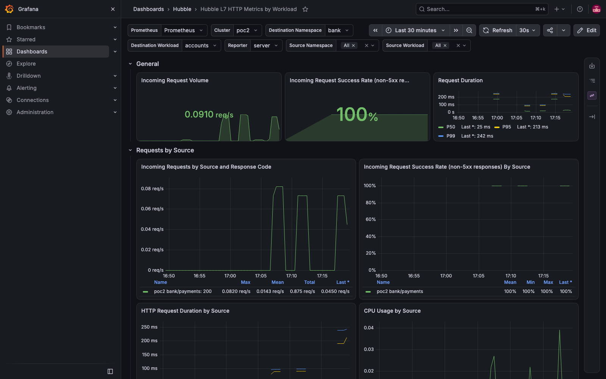
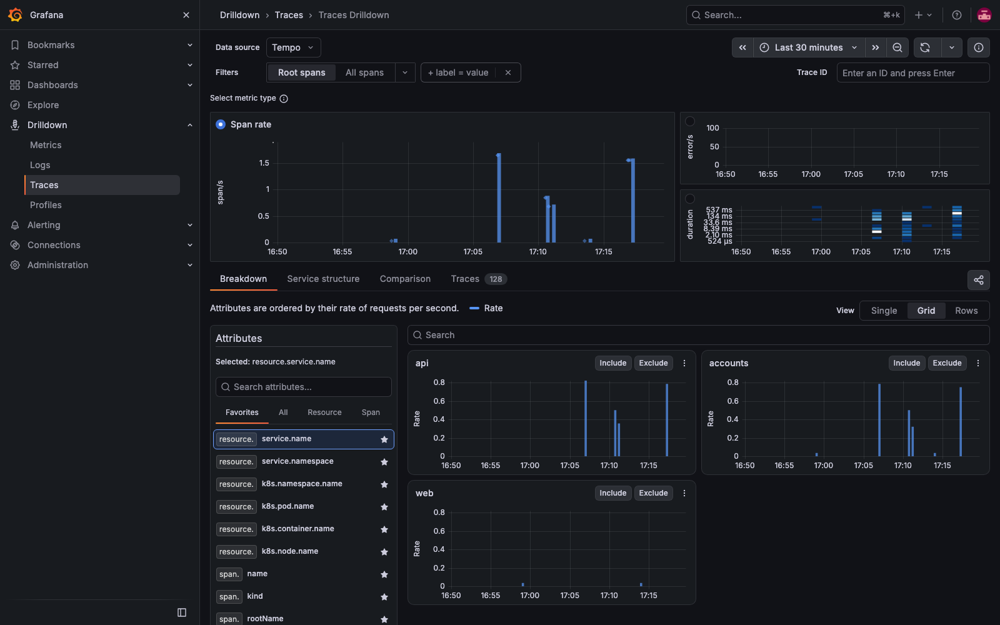

# Demo 18 — OBI: distributed traces and RED metrics for the bank, across both clusters, zero code

**Where this sits in the whole:** [OBSERVABILITY-ARCHITECTURE.md](../../OBSERVABILITY-ARCHITECTURE.md) — the one picture of metrics, traces and flows across poc1, poc2 … poc-N, reviewed against what is deployed.

> **Amended by demo 22 Part 5 (2026-09-12):** since demo 22 poc2 has the Prometheus Operator CRDs (release
> `edge`), so the PodMonitor below applies there too — `sed s/__CLUSTER__/poc2/ … | kubectl --context kind-poc2 apply -f -`
> — and poc2's OBI RED metrics reach the hub through remote write like everything else. The "poc2 ONLY"
> note in `30-podmonitor.yaml` describes the state at the time.

## Summary context

Demo 10 established that Cilium 1.20 emits no application spans, and demo 16 Part 8 showed Hubble's
exemplars stay empty until *something* puts a `traceparent` on requests. The bank's Go code
propagates nothing. **OBI** (OpenTelemetry eBPF Instrumentation) attaches uprobes to the Go runtime
and eBPF programs to the node's traffic control, and produces spans and metrics for processes it is
told to watch — no code change, no sidecar, no restart of the bank. This demo adapts the
[OBI ↔ Cilium compatibility page](https://opentelemetry.io/docs/zero-code/obi/cilium-compatibility/)
to the bank in **both** clusters and proves, from recorded output:

- one trace id following a payment from `api` (poc1) through `payments` (poc2) to its Redis calls
  back in poc1 and to `accounts` → Postgres in poc2 — **16 spans, two clusters, one tree** (Part 2);
- spans from both clusters landing in the demo 10 collector through a **global Service** (Part 2);
- RED metrics per deployment / route / status in the demo 16 Prometheus (Part 2);
- Hubble's exemplars filling on their own, with OBI's trace ids (Part 2);
- and that the page's Cilium `bpf.tc.priority` change is **not needed here**, with the reason (Part 1).

Everything below was run and recorded in [`output/transcript.txt`](output/transcript.txt).

| File | What |
|---|---|
| [`10-obi.yaml`](10-obi.yaml) | Namespace, RBAC, ConfigMap, DaemonSet — one file for both clusters, `__CLUSTER__` stamped by `deploy.sh` |
| [`20-collector-service.yaml`](20-collector-service.yaml) | the demo 10 collector as a global Service; apply to **both** clusters |
| [`30-podmonitor.yaml`](30-podmonitor.yaml) | OBI's `:9464` into the demo 16 Prometheus (poc1 only — where the Operator CRDs are) |
| [`deploy.sh`](deploy.sh) `poc1\|poc2` | apply + restart (a ConfigMap change does not restart pods) + PodMonitor where possible |
| [`check.sh`](check.sh) `[since]` | the page's verification, both clusters, probes filtered |
| [`tracetree.py`](tracetree.py) | one trace as a tree from the collector's debug output |

## Part 1 — deploy to both clusters, and the Cilium priority question

**What the page's manifest became** — the differences, each with its reason in the YAML comments:

| Page | Here | Why |
|---|---|---|
| `image: otel/ebpf-instrument:main` | `v0.13.0` (2026-09-04) | pinned, like everything else in this repo (gotcha #43) |
| `discovery.instrument: k8s_deployment_name: nodejs-service, …` | `{k8s_namespace: bank, k8s_deployment_name: web \| api \| payments \| accounts}` + (Part 3) the three StatefulSets | our services; AND within an entry, OR across entries. The same file instruments whatever runs locally: web/api/payments in poc1, payments/accounts in poc2. Postgres and Redis were added in Part 3 as the "vendor software" case |
| — | `OTEL_RESOURCE_ATTRIBUTES=k8s.cluster.name=<cluster>` and (Part 2) `attributes.kubernetes.cluster_name` | kind has no node label OBI can read a cluster name from; the Part 1 log said so |
| tolerations: none (unchanged) | none, on purpose | kind taints control planes `NoSchedule`; the bank runs on workers; OBI lands only there (poc1 ×2, poc2 ×1) |
| `traffic_control_backend: tcx` (unchanged) | `tcx` | see below |

**The Cilium priority.** The page says to set `bpf.tc.priority: 2` on Cilium so that OBI's traffic
control programs run before Cilium's, and that *"If OBI detects Cilium runs programs with priority 1,
OBI exits and displays an error"*. It also says this applies to the **netlink** backend — the
fallback when tcx is unavailable. Measured before deploying:

```
poc1: enable-tcx=true tc-filter-priority=[]
poc2: enable-tcx=true tc-filter-priority=[]
chart 1.20.1 values mentioning a tc priority: 0        ← the value the page names does not exist in this chart
6.6.12-linuxkit                                         ← tcx needs 6.6+
```

Cilium 1.20.1 attaches with tcx by default (`bpf.enableTCX: true`), the kernel has tcx, and OBI is
configured for tcx. Two tcx programs on one interface are ordered by the tcx link API, not by tc
filter priorities — the conflict the page describes does not arise. So Cilium was **not** touched
(which would have been an agent rollout on both clusters, demo 16 Part 9b: ~90 s of Gateway outage
each). The proof is OBI's own startup log: it attached and printed spans, no priority error.

```bash
demos/18-obi/deploy.sh poc1        # sed __CLUSTER__ → apply → rollout status
demos/18-obi/deploy.sh poc2
```

```
-- poc1 --                                   -- poc2 --
obi-l95nt   poc1-worker2   true   0          obi-2wnqt   poc2-worker   true   0
obi-xwmkp   poc1-worker    true   0

level=INFO msg="OpenTelemetry eBPF Instrumentation" Version=v0.13.0 …
level=INFO msg="instrumenting process" cmd=/bankdemo pid=23718 type=go        ← ×3 on this node (web, api, payments)
level=WARN msg="can't fetch Kubernetes Cluster Name … set the OTEL_EBPF_KUBE_CLUSTER_NAME environment variable"
level=WARN msg="creating or accessing OTEL namespace in bpffs failed" … "OBI will use process-internal maps"   ← readOnlyRootFilesystem; harmless (pinned maps are for profile correlation)
level=INFO msg="Attaching sock msgs" / "Attaching sock ops"                   ← +25 s after Ready
```

**The page's check, on both clusters** (`check.sh`, readiness probes filtered — 350 `/healthz` spans
per 2 min before Part 2 filtered them at the source). The first spans appeared **about 40 s after the
pods were Ready**; the first check at +20 s was empty (gotcha #61):

```
== poc1 ==
… (27.5ms) HTTPClient 200 GET /accounts/chk-1001(/accounts/*)   [api.bank:52114]->[accounts.bank:80]  svc=[bank/api go]  traceparent=[00-b051d94225…
… (29.3ms) HTTP       200 GET /api/balance/chk-1001(/api/balance/{id})  [10.10.3.168]->[api.bank:8080]  svc=[bank/api go]  traceparent=[00-b051d94225…
… (51.2ms) HTTP       201 POST /payments(/payments)            [10.10.3.168]->[payments.bank:8080]     svc=[bank/payments go]
… (84.9ms) HTTPClient 201 POST /payments(/payments)            [api.bank:35792]->[payments.bank:80]    svc=[bank/api go]
… (87.5ms) HTTP       201 POST /api/pay(/api/pay)              [10.10.3.168]->[api.bank:8080]          svc=[bank/api go]
```

Read one line: OBI's route heuristic turned `/api/balance/chk-1001` into `/api/balance/{id}`; the
server span at `api` and the client span it made to `accounts` carry the **same trace id**
(`b051d94225…`) — context propagated inside a process that propagates nothing itself.

**And across the mesh.** The three most recent `api → accounts.bank` client spans in poc1, looked
up by trace id in poc2's OBI log:

```
  trace 7ac987173ed7a70c51089a0e5a5f051a seen in poc2 (accounts): 2 span(s)  … SQLClient 0 SELECT accounts [accounts.bank:43274]->[postgres-primary.bank:5432]
  trace 71f8866da24572a5dfc98f4e25acb97d seen in poc2 (accounts): 2 span(s)  … SQLClient …
  trace c25462ba63e35a5c3aff331f716145ef seen in poc2 (accounts): 2 span(s)  … SQLClient …
```

The trace context crossed the VXLAN tunnel between clusters and the Postgres query on the other
side belongs to the same trace. `context_propagation: all` did that at the network layer.

## Part 2 — spans to one collector, probes out, RED metrics in, exemplars for free

**The collector** (demo 10's DaemonSet on poc1) gained an OTLP receiver and a `traces` pipeline —
additive, the logs pipeline is untouched; the `resource` processor is deliberately *not* on the traces
pipeline (it would overwrite OBI's `service.name` with `hubble-flow-export`). Then **one Service
object applied to both clusters** — the ClusterMesh rule from demo 07 — with backends in poc1 only:

```
  poc1  70   10.11.115.140:4318/TCP   ClusterIP   1 => 10.10.0.32:4318 … 4 => 10.10.3.191:4318   ← the 5 collectors
  poc2  25   10.21.35.73:4318/TCP     ClusterIP   1 => 10.10.0.32:4318 … 4 => 10.10.3.191:4318   ← poc2 has none of its own; the mesh points at poc1's
```

OBI (a `hostNetwork` pod, `dnsPolicy: ClusterFirstWithHostNet`) resolves
`otel-collector.otel.svc.cluster.local` in its own cluster and Cilium's socket LB in the host
namespace sends it across. The OBI config grew four blocks (`10-obi.yaml`, commented):
`otel_traces_export.endpoint` (port 4318 → OTLP/http inferred), `routes.ignored_patterns: [/healthz]`
with `ignore_mode: all`, `attributes.kubernetes.cluster_name`, and `prometheus_export.port: 9464`
with a named container port for the PodMonitor.

```bash
kubectl --context kind-poc1 apply -f demos/10-tracing/otel-collector.yaml && kubectl --context kind-poc1 -n otel rollout restart ds/otel-collector
kubectl --context kind-poc1 apply -f demos/18-obi/20-collector-service.yaml
kubectl --context kind-poc2 apply -f demos/18-obi/20-collector-service.yaml
demos/18-obi/deploy.sh poc1 ; demos/18-obi/deploy.sh poc2      # (poc2: "no monitoring.coreos.com CRDs: PodMonitor skipped")
```

**Spans from both clusters, in one collector** (3-minute window after a 10-call exercise):

```
  ResourceSpans blocks: 25   spans: 257
  by k8s.cluster.name:   14 poc1   14 poc2
  by service.name:        accounts 9 · api 10 · payments 9      (hubble-flow-export 1165 = the demo 10 logs pipeline, still running)
  span names: processing 53 · in queue 53 · POST /payments 24 · set 23 · UPDATE accounts 12 · POST /api/pay 12 ·
              POST /accounts/{id}/debit 11 · lpush 11 · ltrim 11 · SELECT accounts 8 · GET /api/balance/{id} 8
```

**One payment, as a tree** (`tracetree.py`, reading the collector's debug output):

```
trace a963574176f9e85f7331942f5fd12d6f: 16 spans, clusters ['poc1', 'poc2']
POST /api/pay  [Server]  poc1/api  94.4 ms
  in queue  [Internal]  poc1/api  0.2 ms
  processing  [Internal]  poc1/api  94.2 ms
    POST /payments  [Client]  poc1/api  92.6 ms  payments.bank.svc.cluster.local
      POST /payments  [Server]  poc1/payments  47.1 ms                    ← the global Service picked poc1's payments this time
        processing  [Internal]  poc1/payments  47.1 ms
          set  [Client]  poc1/payments  1.6 ms  redis
          POST /accounts/*/debit  [Client]  poc1/payments  39.1 ms  accounts.bank.svc.cluster.local
            POST /accounts/{id}/debit  [Server]  poc2/accounts  6.7 ms    ← the other cluster
              processing  [Internal]  poc2/accounts  6.7 ms
          set / lpush / ltrim  [Client]  poc1/payments  redis
UPDATE accounts  [Client]  poc2/accounts  2.8 ms  postgres-primary        ← its SQL, same trace (parent linkage lost by the SQL probe: a root)
```

That is the bank's whole call graph with timings, across two Kubernetes clusters, and nobody
touched `main.go`. Two honest notes from the same output: OBI's Go SQL probe emitted the
`UPDATE accounts` span without a parent id, so it shows as a second root of the same trace; and the
export is batched — spans reach the collector **10–20 s** after the request (8 payments at 04:57:55,
169 spans arriving at 04:58:1x), so a check inside that window is empty.

**Probes filtered at the source** (clean 90-s window, all pods restarted with `ignored_patterns`):

```
  spans named GET /healthz in the collector: 0    (the trace_printer on the pods still shows them: 305 probe lines — it prints what it sees)
```

**RED metrics in the demo 16 Prometheus.** The PodMonitor's two targets (`172.18.0.4/5:9464`) are up.
OBI labels each series with the pod's Kubernetes identity; the service name is in `target_info`,
so panels group by `k8s_deployment_name`:

```
sum by (cluster, k8s_deployment_name, http_route, http_response_status_code) (increase(http_server_request_duration_seconds_count[5m]) > 0)
     10.34  poc1  api        /api/balance/{id}   200
      9.31  poc1  api        /api/pay            201
      6.21  poc1  payments   /payments           201
      1.03  poc1  api        /api/credit/{id}    200
histogram_quantile(0.95, … http_server_request_duration_seconds_bucket …) * 1000       api 176 ms · payments 71 ms
sum by (k8s_deployment_name, db_system_name, db_operation_name) (increase(db_client_operation_duration_seconds_count[5m]) > 0)
     12.41  payments  redis  set        6.21  payments  redis  lpush        6.21  payments  redis  ltrim
sum by (k8s_deployment_name, server_address, http_response_status_code) (increase(http_client_request_duration_seconds_count[5m]) > 0)
     11.38  api → accounts.bank.svc.cluster.local 200      9.31  api → payments.bank.svc.cluster.local 201      6.21  payments → accounts… 200
```

(poc1 only: Prometheus lives there. poc2's OBI serves the same metrics on `poc2-worker:9464`,
unscraped — a second Prometheus, or remote-write, is the multi-cluster answer, not a PodMonitor.)

**Hubble's exemplars, without a hand-made header.** Demo 16 Part 8 had to send `traceparent`
by hand to get one. Now every request through the bank carries OBI's:

```
  exemplars on bank latency buckets, last 10 min: 7
  exemplar traceID 3d4dee671b9c5e51547d9982a4b59c3d: 8 OBI span line(s) carry it     ← the same trace, seen by Cilium's proxy AND by OBI
```

## Part 3 — the vendor processes: Postgres and Redis (blocked by this kernel, measured)

OBI's strongest argument is that it instruments software you did not write. The docs list
PostgreSQL and Redis as supported **client and server side**, so the three StatefulSets went into
discovery — `postgres` (poc2), `postgres-standby` and `redis` (poc1) — with no change to their images:

```yaml
        - {k8s_namespace: bank, k8s_statefulset_name: postgres}
        - {k8s_namespace: bank, k8s_statefulset_name: postgres-standby}
        - {k8s_namespace: bank, k8s_statefulset_name: redis}
```

OBI found and classified them — and stopped their tracer on every node:

```
-- poc1/obi-g9b9l --      3  /usr/local/bin/postgres (cpp)     1  /usr/local/bin/redis-server (generic)
-- poc2/obi-4crm7 --      2  /usr/local/bin/postgres (cpp)     1  /bankdemo (go)

  attach  /usr/local/bin/postgres pid=50980 (cpp)
  STOP    (the non-Go tracer for the process attached just above)
  attach  /usr/local/bin/redis-server pid=38095 (generic)
  STOP
  attach  /bankdemo pid=49368 (go)                                    ← the Go tracer: no STOP

level=ERROR msg="couldn't trace process. Stopping process tracer" error="instrumenting function
  \"security_socket_accept\": setting kprobe: creating perf_kprobe PMU (arch-specific fallback for
  \"security_socket_accept\"): token __x64_security_socket_accept: not found: no such file or directory"
```

**The same wall as demo 17.** Go is traced with uprobes on the runtime; everything else goes through
OBI's *generic tracer* (`bpf/generictracer/k_tracer.c`), which attaches kprobes to the kernel's LSM
socket hooks — and this Docker Desktop kernel was built without `CONFIG_SECURITY`, so those
functions do not exist (gotcha #60):

```
  security_socket_accept       0        ← what the generic tracer needs
  security_socket_connect      0
  security_socket_sendmsg      0
  security_socket_recvmsg      0
  tcp_connect                  1        ← the plain networking symbols are there; the LSM layer is not
  inet_csk_accept              1
# CONFIG_SECURITY is not set
```

Fresh TCP connections were tried too (psql over TCP from the standby to the primary across the mesh,
`redis-cli` over TCP): still no vendor spans, no StatefulSet-labelled series — as the error predicts.
The Go services were unaffected throughout (spans kept arriving for api, payments, accounts).

The three entries stay in `10-obi.yaml`: they are correct, and on Docker Desktop ≥ 4.30 (the same
upgrade demo 17 waits for) the Postgres and Redis **server** spans and metrics should appear with
no other change. That is the follow-up to run first after the upgrade, before Tetragon.

## What to take away

- **Zero-code tracing across a ClusterMesh works**, and the mesh is what made the collector a
  one-line target from the other cluster.
- **Do not change Cilium for the page's sake.** With tcx on both sides there is no priority to set,
  and the value the page names is not in the 1.20.1 chart. Read the backend line in OBI's log instead.
- **Timing is the trap** (gotcha #61): spans start ~40 s after Ready and export 10–20 s later. The
  page's check, run right after `rollout status`, shows nothing — that is not a failure.
- **OBI's metric labels are Kubernetes labels.** `service.name` is a resource attribute (in
  `target_info`); group by `k8s_deployment_name` and `http_route`.
- **Vendor software is instrumentable too — on a kernel with the LSM hooks.** Postgres and Redis were
  found and classified; their tracer needs `security_socket_accept`, which this Docker Desktop kernel
  lacks (Part 3, gotcha #60). Go was unaffected because Go is traced with uprobes.
- **The three observability layers now line up:** Hubble (L4/L7 flows and drops per identity),
  OBI (application spans and RED metrics per route), and Grafana/Prometheus (both, with retention),
  joined by trace ids in Hubble's exemplars.

Remove it all:

```bash
for c in poc1 poc2; do kubectl --context kind-$c delete -f demos/18-obi/10-obi.yaml --ignore-not-found; kubectl --context kind-$c delete -f demos/18-obi/20-collector-service.yaml --ignore-not-found; done
kubectl --context kind-poc1 delete -f demos/18-obi/30-podmonitor.yaml --ignore-not-found
```

> **Demo 20 added `{k8s_namespace: springboot}` to discovery.** The Java services were found and
> classified; OBI's own Java agent injection timed out and the generic tracer stopped on the same
> missing `security_socket_accept` as Part 3. Java on this rig traces through the OpenTelemetry Java
> agent instead (demo 20, Part 3).

## Part 6 — "tracing stopped and the pods are running" (2026-09-12, 21:40Z): it had not stopped

**The report.** Traces, the OBI RED metrics and the service graph were empty; every pod was Running.

**What the pipeline said.** Hub Prometheus: 87 targets up, none down; Hubble and Envoy metrics
seconds old; Grafana's three data sources healthy. Tempo: 0 traces from either cluster in 15 min,
metrics-generator `active_series 0`, no `traces_*` series in the hub for over 3 h. OBI: every pod's
`:9464` exporting **0** `http_server_*` series. Everything pointed at OBI.

**What OBI said.** Its `trace_printer` was printing live HTTP at that very minute — all of it
`GET /healthz` from the kubelet, which the config **ignores for traces and metrics**
(`ignored_patterns: [/healthz]`, `ignore_mode: all`, Part 2). The bank had no other traffic: the
last payments were hours old. No application requests → no spans → no RED series; the generator's
service-graph series expire when spans stop; Grafana shows "No data". **Nothing was broken; nothing
was happening.**

**What was done, and what was not needed.** OBI was restarted in both clusters before that
re-read — recorded, unnecessary, harmless. Then 20 payments through the Gateway: poc1's OBI exported
series within 40 s; poc2's after its usual attach delay (gotcha #61, 60 s more): Tempo `poc1 38,
poc2 9` traces in 10 min, `http_server_request_duration_seconds_count` `poc1 7, poc2 2` series in the
hub, 115 `traces_service_graph_*` series, and the graph's edges over 10 min: `user→api 42`,
`api→payments 14`, `payments→accounts 6`, `api→accounts 2`, `user→accounts 2` — the cross-cluster
payment path, seen again ([capture](../21-tempo/output/screenshots/service-graph-after-incident.png)).

**The lesson (gotcha #79).** Before restarting anything, separate *no data* from *broken*: OBI's own
log (`trace_printer: text`) shows whether it sees requests, `hubble_http_requests_total` shows whether
any exist, and the generator's `active_series` falls to 0 within minutes of silence by design. A lab
with no load generator is quiet most of the day; `demos/15-bank/exercise.sh 20` is the switch.

## Evidence

Captured 2026-09-12 with `scripts/evidence/capture.js` and `scripts/evidence/collect.sh` (both re-runnable; the pod and Cilium output is the recorded file [`output/evidence.txt`](output/evidence.txt)). Every image is what the browser saw, with traffic running.

**grafana l7 accounts poc2** — the poc2 side of a payment (accounts), as Hubble sees it — OBI’s spans of the same requests are in Tempo (demo 21 drilldown)



**grafana traces drilldown** — Traces Drilldown grouped by service.name: the OBI-instrumented bank services of both clusters, zero code changed



**Running pods** (from `output/evidence.txt`):

```console
$ kubectl --context kind-poc1 -n obi get pods -o wide
NAME        READY   STATUS    RESTARTS   AGE   IP           NODE           NOMINATED NODE   READINESS GATES
obi-8xxhx   1/1     Running   0          48m   172.18.0.5   poc1-worker    <none>           <none>
obi-smtrp   1/1     Running   0          48m   172.18.0.4   poc1-worker2   <none>           <none>
```

```console
$ kubectl --context kind-poc2 -n obi get pods -o wide
NAME        READY   STATUS    RESTARTS   AGE   IP           NODE          NOMINATED NODE   READINESS GATES
obi-j5874   1/1     Running   0          47m   172.18.0.9   poc2-worker   <none>           <none>
```

The Cilium/kubectl commands that prove this demo's claim, with their output, follow the pod listings in [`output/evidence.txt`](output/evidence.txt).
