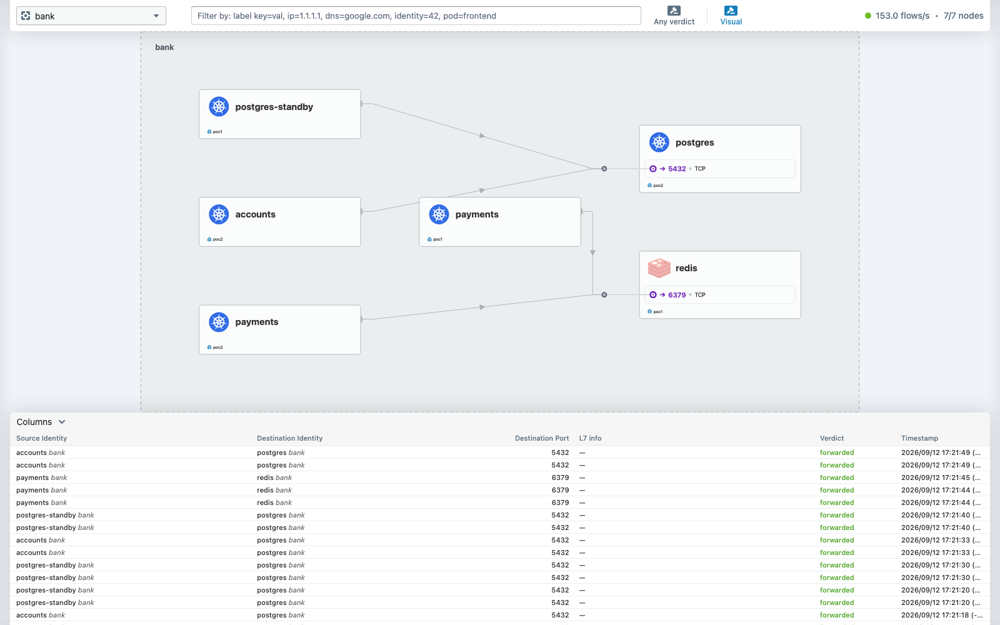

# Demo 24 — ClusterMesh the enterprise way, complete: one root CA for the mesh *and* for Hubble

## From demo 08 to demo 24 — why this demo exists

Demo 08 put the ClusterMesh API server on an enterprise CA: cert-manager in both clusters, a root
created once (`clustermesh-root-ca`), the same `ClusterIssuer/ca-issuer` in each cluster, and
`clustermesh.apiserver.tls.auto.method: certmanager`. That part was right and is still live: its four
Certificates per cluster were `Ready`, issued by `ca-issuer`, when this demo started (Part 0). Demo 08
stays as recorded. Two things it left undone, and what each cost:

| Left undone in demo 08 | What it cost | Where it is recorded |
|---|---|---|
| **Hubble's certificates stayed on the Helm method**, signed by each cluster's own self-signed `cilium-ca` | poc2's relay crash-looped for nine hours after the CA copy (gotcha #48); then, once the mesh made poc1's relay aware of poc2's nodes, it reached them on TCP 4244 and failed the TLS handshake: `Connected Nodes: 5/7`, `x509: certificate signed by unknown authority` (gotcha #71). Nothing renewed them either: "while certificates are automatically generated, they are not automatically renewed" ([the guide](https://docs.cilium.io/en/stable/network/clustermesh/setup/)) | demo 08 addendum; demo 24 Part 0 |
| **The mesh was joined with the CLI** (`cilium clustermesh connect`), which wrote `clustermesh.config.clusters` into the Helm values as a side effect | nothing in the repo *declared* the mesh; the guide's declarative form (`clusters.yaml` + one file per cluster) is what a GitOps pipeline would carry | demo 24 Part 1 |

**How soon should this have been done?** In demo 08 Part 4 — the *same* `helm upgrade` that pointed
the mesh API server at `ca-issuer` should have carried `hubble.tls.auto.method: certmanager` too. The
issuer existed; the values are three lines. It cannot be done at the very first `helm install`: cert-manager's
pods need a CNI, so the order is Cilium (Helm method, no mesh yet) → cert-manager → root + issuer →
**one** upgrade moving every certificate consumer to the issuer → *then* connect. Trust before join,
for Hubble as much as for the mesh.

> **Amended by demo 25 Part 5 (2026-09-12):** `poc1.yaml` / `poc2.yaml` now also set
> `hubble.relay.tls.server.enabled: true` and `mtls: true` — the relay presents the root-issued server
> certificate and requires a client certificate. Applied to both clusters with zero bank disruption
> (225×200) and the mesh API server untouched; the reason and the proof are in demo 25.

## The tutorial, in order — two independent clusters, poc1 and poc2

Steps 1–4 are demo 08's and are already live; their evidence is quoted from the record. Steps 5–6 are
this demo's, recorded in [`output/transcript.txt`](output/transcript.txt).

### 1. cert-manager in both clusters

```bash
helm repo add jetstack https://charts.jetstack.io && helm repo update jetstack
for ctx in kind-poc1 kind-poc2; do
  helm install cert-manager jetstack/cert-manager --version v1.21.1 --namespace cert-manager --create-namespace --kube-context "$ctx" --set crds.enabled=true
done
```

*Why:* each cluster issues its **own** leaf certificates locally; only the trust anchor is shared.
*Evidence (Part 0):* `cert-manager-v1.21.1 deployed` in both.

### 2. the root, once, in poc1 — [`../08-certmanager-ca/01-root-ca-poc1.yaml`](../08-certmanager-ca/01-root-ca-poc1.yaml)

A bootstrap `Issuer/selfsigned-bootstrap` signs `Certificate/clustermesh-root-ca` (`isCA: true`,
10 years); `ClusterIssuer/ca-issuer` points at its Secret. *Why a ClusterIssuer:* Cilium's Certificates
live in `kube-system`.

### 3. distribute the root to poc2, then the SAME issuer name — [`../08-certmanager-ca/02-issuer-poc2.yaml`](../08-certmanager-ca/02-issuer-poc2.yaml)

Only the CA Secret crosses; verify the fingerprints match before going on.
*Evidence (Part 0):* root sha256 `72:16:61:3E:82:57:59:05…` in both clusters, `ca-issuer ready=True` in both.

### 4. declare the mesh and point EVERY certificate consumer at the issuer

The guide's form: one shared [`clusters.yaml`](clusters.yaml) listing every member ("Cilium ignores
the local cluster from the list of remote clusters"), and one file per cluster,
[`poc1.yaml`](poc1.yaml) / [`poc2.yaml`](poc2.yaml): `cluster.name/id`, `clustermesh.useAPIServer`,
the API server Service, **and both TLS blocks** — `clustermesh.apiserver.tls.auto` *and*
`hubble.tls.auto`, `method: certmanager`, `certManagerIssuerRef: ClusterIssuer/ca-issuer`.

```bash
for c in poc1 poc2; do
  helm upgrade cilium cilium/cilium --version 1.20.1 -n kube-system --kube-context kind-$c --reuse-values \
    -f demos/24-clustermesh-enterprise/clusters.yaml -f demos/24-clustermesh-enterprise/$c.yaml
done
```

*Rendered before applying* (`helm template` against the live values): removed `Secret/cilium-ca`,
`Secret/hubble-server-certs`, `Secret/hubble-relay-client-certs` (Helm's copies); added
`Certificate/hubble-server-certs` (`*.<cluster>.hubble-grpc.cilium.io`) and
`Certificate/hubble-relay-client-certs`; `cilium-config` unchanged; and — because `clusters.yaml`
now lists the local cluster too — a hostAlias on the `clustermesh-apiserver` Deployment and a
`remote-<local>` etcd user. That last change is what Part 3 measures.

### 5. verify the chain before trusting anything

*Evidence (Part 1):* both Hubble Certificates `Ready` in both clusters within 35 s, renewal dated
2028-09-11 (cert-manager renews; Helm never did); `hubble-server-certs` and
`hubble-relay-client-certs` now `issuer=CN=clustermesh-root-ca` in both clusters, and the `ca.crt`
they carry is the root (`72:16:61:3E…`). `cilium-ca` is gone from both clusters (Helm removed what it
owned; backed up first).

### 6. connect — here, already connected — and prove Hubble across the mesh

With the CLI, `cilium clustermesh connect`; here the mesh was already connected, and stayed so
(`poc2: 5/5 configured, 5/5 connected`, `poc1: 2/2 configured, 2/2 connected`). The proof (Part 2):

```
Connected Nodes: 7/7
poc2/poc2-control-plane    Connected   …   2.77 flows/s
poc2/poc2-worker           Connected   …  44.90 flows/s
relay: no handshake failures since the upgrade: 0
```

and flows from poc2 read from poc1's relay with `hubble observe --cluster poc2`:
`bank/api … -> bank/payments-7dbb8cdfdb-5bsf5:8080 to-overlay FORWARDED` — the poc1→poc2 payment hop,
seen from the poc2 side, through one relay. [`check.sh`](check.sh) re-runs the whole verification.

## Part 3 — the cost of doing it late, measured

A bank call every second during the two upgrades ([`output/probe.log`](output/probe.log)):

```
  13:36  calls=21  failed=0
  13:37  calls=28  failed=1      ← poc2's upgrade starts 13:36:58
  13:38  calls=11  failed=10
  13:39  calls=12  failed=12
  13:40  calls=25  failed=2      ← last failure 13:40:33
  13:41  calls=43  failed=0
```

Three and a half minutes in which poc1's `api` could not reach `accounts` (which exists only in
poc2). Not TLS — the mesh certificates did not change. The `clustermesh-apiserver` Deployment
changed (the hostAlias), so its pod was replaced; its etcd is an emptyDir, so poc1's agents saw
`etcd cluster ID has changed … reconnecting` and dropped their poc2 cache; then the new pod's
`kvstoremesh` lost its leader election (`level=fatal msg="Leader election lost"`, exit 255, once in
each cluster) and reconnected to poc2 only at 13:40:34. Prometheus, poc1's view of poc2:

```
cilium_clustermesh_remote_cluster_readiness_status  13:38:00=5  13:38:30=1  [no 13:39 samples]  13:40:00=5
cilium_clustermesh_remote_cluster_nodes             13:38:00=10 13:38:30=2  [no 13:39 samples]  13:40:00=10
```

**The lesson (gotcha #72):** in KVStoreMesh mode any values change that touches the
`clustermesh-apiserver` Deployment is a mesh outage of minutes, not seconds. Listing the local
cluster in `clusters.yaml` is correct and harmless *at install time*; on a live mesh, do it in a
window — or omit the local entry from that cluster's file, which is what the CLI had done.

## Exercises

See [`GUIDE.md`](GUIDE.md).

## What to take away

- **One root, every leaf.** The mesh API server *and* Hubble on the same issuer, in the same
  upgrade, before joining. A CA that half the components trust is a mesh that half works.
- **cert-manager renews; Helm does not.** `RENEWS` on every Certificate is the difference the guide
  warns about.
- **Declare the mesh.** `clusters.yaml` + per-cluster files are what the guide, and a pipeline, carry.
- **Read what the upgrade renders before running it,** and measure it while it runs: a three-line
  TLS change came with a Deployment change nobody asked for.

## Evidence

Captured 2026-09-12 with `scripts/evidence/capture.js` and `scripts/evidence/collect.sh` (both re-runnable; the pod and Cilium output is the recorded file [`output/evidence.txt`](output/evidence.txt)). Every image is what the browser saw, with traffic running.

**hubble ui 7 of 7** — the header’s node count: 7/7 — poc1’s relay reaches every node of both clusters once Hubble’s certificates come from the one root



**Running pods** (from `output/evidence.txt`):

```console
$ kubectl --context kind-poc1 -n kube-system get pods -o wide
NAME                                          READY   STATUS    RESTARTS        AGE    IP            NODE                  NOMINATED NODE   READINESS 
cilium-envoy-4ht26                            1/1     Running   2 (24h ago)     2d2h   172.18.0.5    poc1-worker           <none>           <none>
cilium-envoy-9p6mq                            1/1     Running   2 (24h ago)     2d2h   172.18.0.4    poc1-worker2          <none>           <none>
cilium-envoy-r5c6d                            1/1     Running   2 (24h ago)     2d2h   172.18.0.7    poc1-control-plane2   <none>           <none>
cilium-envoy-v9lk2                            1/1     Running   2 (24h ago)     2d2h   172.18.0.3    poc1-control-plane3   <none>           <none>
cilium-envoy-w7759                            1/1     Running   2 (24h ago)     2d2h   172.18.0.6    poc1-control-plane    <none>           <none>
cilium-ntbb4                                  1/1     Running   0               11h    172.18.0.7    poc1-control-plane2   <none>           <none>
cilium-operator-79d6b9ffd7-57lpg              1/1     Running   8 (119s ago)    8h     172.18.0.7    poc1-control-plane2   <none>           <none>
cilium-pv958                                  1/1     Running   0               11h    172.18.0.3    poc1-control-plane3   <none>           <none>
cilium-qt6nm                                  1/1     Running   0               11h    172.18.0.5    poc1-worker           <none>           <none>
cilium-s2wxk                                  1/1     Running   0               11h    172.18.0.4    poc1-worker2          <none>           <none>
cilium-zdgfx                                  1/1     Running   0               11h    172.18.0.6    poc1-control-plane    <none>           <none>
clustermesh-apiserver-844c48bb9b-sngg7        3/3     Running   2 (8h ago)      8h     10.10.4.2     poc1-worker           <none>           <none>
coredns-789c5fbdb4-qhj2d                      1/1     Running   0               17h    10.10.1.35    poc1-control-plane2   <none>           <none>
```

```console
$ kubectl --context kind-poc2 -n kube-system get pods -o wide
NAME                                         READY   STATUS    RESTARTS         AGE    IP            NODE                 NOMINATED NODE   READINESS G
cilium-envoy-2gtwr                           1/1     Running   2 (24h ago)      32h    172.18.0.10   poc2-control-plane   <none>           <none>
cilium-envoy-dbxr2                           1/1     Running   2 (24h ago)      32h    172.18.0.9    poc2-worker          <none>           <none>
cilium-operator-65c84b698c-9rgnj             1/1     Running   7 (110s ago)     8h     172.18.0.10   poc2-control-plane   <none>           <none>
cilium-rr5z8                                 1/1     Running   0                9h     172.18.0.9    poc2-worker          <none>           <none>
cilium-sqf2x                                 1/1     Running   0                9h     172.18.0.10   poc2-control-plane   <none>           <none>
clustermesh-apiserver-cd9779c97-p24zd        3/3     Running   2 (8h ago)       8h     10.20.1.239   poc2-worker          <none>           <none>
coredns-879947797-f4bdb                      1/1     Running   0                17h    10.20.1.136   poc2-worker          <none>           <none>
coredns-879947797-k8xkh                      1/1     Running   0                17h    10.20.1.168   poc2-worker          <none>           <none>
etcd-poc2-control-plane                      1/1     Running   2 (24h ago)      32h    172.18.0.10   poc2-control-plane   <none>           <none>
hubble-relay-556c4dbb98-2zslj                1/1     Running   0                6h4m   10.20.1.195   poc2-worker          <none>           <none>
kube-apiserver-poc2-control-plane            1/1     Running   2 (24h ago)      32h    172.18.0.10   poc2-control-plane   <none>           <none>
kube-controller-manager-poc2-control-plane   1/1     Running   15 (2m24s ago)   32h    172.18.0.10   poc2-control-plane   <none>           <none>
kube-scheduler-poc2-control-plane            1/1     Running   15 (2m25s ago)   32h    172.18.0.10   poc2-control-plane   <none>           <none>
```

The Cilium/kubectl commands that prove this demo's claim, with their output, follow the pod listings in [`output/evidence.txt`](output/evidence.txt).
