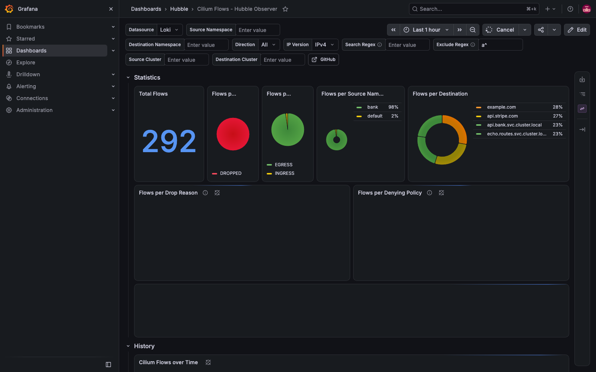
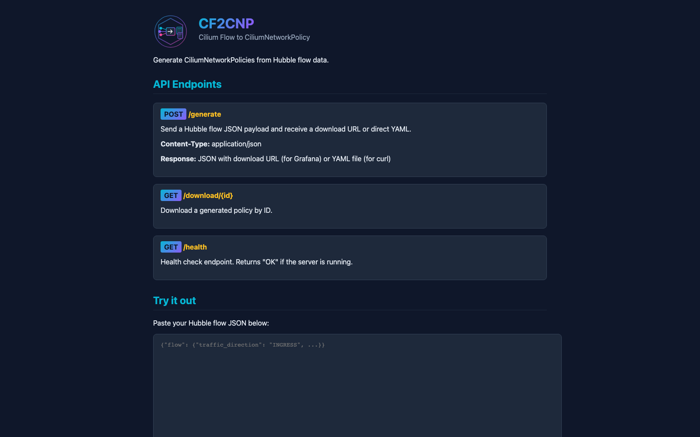

# Demo 25 — historical flows, the open-source way: hubble-observer → Loki → the 23862 dashboard

**Where this sits in the whole:** [OBSERVABILITY-ARCHITECTURE.md](../../OBSERVABILITY-ARCHITECTURE.md) — the one picture of metrics, traces and flows across poc1, poc2 … poc-N, reviewed against what is deployed.

## Summary context

Demo 16 Part 11b established what the flows-per-minute chart in the enterprise screenshots is: Isovalent's
Hubble UI reading **Hubble Timescape**, their flow store. The open-source UI we run has a ring buffer per
node and no store. This demo builds the store from open-source parts and lands on the same picture:
a time range, a flows-per-minute chart, a filterable table of every dropped flow — for **both clusters
through one relay** — in Grafana ([capture](output/screenshots/ho-dashboard.png)).

| Piece | What | Where |
|---|---|---|
| the source | [onzack/hubble-observer](https://github.com/onzack/hubble-observer) (Apache-2.0): one pod running `hubble observe flows --verdict DROPPED --follow -o json` against the relay, one JSON flow per line on stdout | poc1, namespace `hubble-observer` |
| the shipper | the demo 10 OTel collector DaemonSet, a second `filelog` receiver on that pod's log file only, resource attributes named as the dashboard expects, `otlphttp` to Loki's OTLP endpoint with the demo 23 persistent queue | poc1, `otel` |
| the store | Grafana Loki 3.6.12, single binary, filesystem, 24 h retention, the three attributes as index labels | poc1, `monitoring` |
| the view | grafana.com dashboard **23862 rev 5** (the chart's own), provisioned as a sidecar ConfigMap in the Hubble folder; cf2cnp behind the demo 09 Gateway for the dashboard's link | Grafana |

Everything is recorded in [`output/transcript.txt`](output/transcript.txt). **Answers to the three questions
that shaped it:**

- **poc1 only, or every cluster?** poc1 only. Since demo 24 poc1's relay streams all 7 nodes of the mesh
  (`Connected Nodes: 7/7` as the observer sees it, Part 5), and every flow carries
  `source.cluster_name` / `destination.cluster_name` — the dashboard's *Source Cluster* / *Destination
  Cluster* boxes filter on exactly those. Part 3b proves it: a drop caused in poc2 is stored labelled
  `poc2`, reported by `poc2/poc2-worker`. The per-cluster alternative (an observer and a shipper in every
  cluster, all writing to the central Loki, the demo 22/23 shape) is the right one when relays are not
  meshed or the relay stream would cross a WAN; here it would double the pods to say the same thing.
- **The embedded dashboard the chart creates?** It is a `GrafanaDashboard` custom resource for the
  Grafana **Operator**, which this stack does not run — our Grafana is fed by the kube-prometheus-stack
  sidecar from ConfigMaps (demo 16). So `grafanaDashboard.enabled: false`, and
  [`dashboard-from-file.sh`](dashboard-from-file.sh) makes the same substitutions the chart's template
  makes (`DS_LOKI` → the dashboard's own `${datasource}` variable, the observer namespace, the cf2cnp URL)
  and wraps the downloaded export in a ConfigMap with the `grafana_folder: Hubble` annotation.
- **TLS / mTLS to the relay?** Done in Part 5, after measuring why: the relay ran in plaintext
  (`disable-server-tls: true`) and any pod could stream every flow of both clusters from it. Now the
  relays require mutual TLS from the enterprise root; the observer, the UI and the CLI each hold their
  own certificate from cert-manager.

## Part 0 — chart-prep.sh: the critical first step, every chart, every time

[`chart-prep.sh`](chart-prep.sh) does, and records, the four steps in order: **(1)** add the source
(`helm repo add grafana …`; the onzack charts live in an OCI registry, which has no `repo add`),
**(2)** list the versions available and pick one on purpose (`helm search repo grafana/loki --versions`;
for ghcr.io the tags list through an anonymous pull token), **(3)** pull *that* version's default values
into [`default-values/`](default-values/) — committed, the baseline — and **(4)** diff our values
against them, key by key. Recorded:

```
  grafana/loki (newest 5): chart 7.3.0 app 3.6.12 · 7.2.0 · 7.1.0 · 7.0.0 · 6.55.0
  oci://ghcr.io/onzack/helm-charts/hubble-observer tags: 0.6.1 … 2.4.2 2.5.0 2.6.0-alpha
  oci://ghcr.io/onzack/helm-charts/cf2cnp tags: 0.1.0 0.3.1 0.4.0
  default-values/loki-7.3.0.yaml (4441 lines) · hubble-observer-2.5.0.yaml (133) · hubble-observer-2.6.0-alpha.yaml (160) · cf2cnp-0.4.0.yaml (116)
  values-loki.yaml: 27 keys set, e.g. ≠ deploymentMode: 'SingleBinary' (default: 'SimpleScalable') … ≠ read.replicas: 0 (default: 3)
  values-hubble-observer.yaml: 17 keys set, e.g. ≠ grafanaDashboard.enabled: False (default: True) · ≠ cf2cnp.enabled: True (default: False)
```

[`values-loki.yaml`](values-loki.yaml) and [`values-hubble-observer.yaml`](values-hubble-observer.yaml)
carry, on every key, what the default was and why it changed.

## Part 1 — Loki

`helm install loki grafana/loki --version 7.3.0 -n monitoring -f values-loki.yaml`: `loki-0 2/2 Running`,
Service `loki :3100`, `ready`. Single binary, filesystem, replication 1, one tenant, 24 h retention with
the compactor, 512 Mi limit; the SimpleScalable pools, gateway, caches, canary and test off. The one
setting that makes the dashboard work unchanged is Loki's `otlp_config`: the resource attributes
`namespace`, `container` and `k8s.cluster.name` become **index labels**, because the dashboard's every
query starts with `{namespace="…", container="hubble-observer"}` (Promtail's label names, not OTel's).

## Part 2 — the observer, and the published chart's bug

`helm install … oci://…/hubble-observer --version 2.5.0`: `--wait` failed with `context deadline
exceeded`; the pod sat at `0/1 Running`, restarts climbing, no output. Its events:

```
Startup probe failed: failed to connect to 'hubble-relay:80': … lookup hubble-relay on 10.11.0.10:53: no such host
Killing  Container hubble-observer failed startup probe, will be restarted
```

By hand, from inside the same pod: `hubble status --server hubble-relay.kube-system.svc.cluster.local:80`
→ `Connected Nodes: 7/7`. The container worked; the probe killed it. **The 2.5.0 chart's three probes
dial `$(HUBBLE_RELAY_HOST):$(HUBBLE_RELAY_PORT)`, the short name, while the observe command uses the
FQDN** — a short name resolves only from the relay's own namespace (gotcha #73). The main branch builds
one FQDN for both (`_helpers.tpl`, `relayAddress`), so the chart is **vendored from main** at
[`chart/hubble-observer`](chart/hubble-observer) (commit in [`chart/UPSTREAM-COMMIT.txt`](chart/UPSTREAM-COMMIT.txt),
also published as tag `2.6.0-alpha`; `helm dependency build` pulled the cf2cnp 0.4.0 subchart).

**Part 2b**, reinstalled from it: both pods `1/1 Running`, `probe target now:
hubble-relay.kube-system.svc.cluster.local:80`. cf2cnp on, exposed as every app here is
([`20-cf2cnp-route.yaml`](20-cf2cnp-route.yaml): the HTTPRoute in the Gateway's namespace, since its
listeners admit routes from `Same` only, and a ReferenceGrant in `hubble-observer`) — `cf2cnp
[cf2cnp.poc.local] Accepted True ResolvedRefs True`; [`hosts-entries.sh`](hosts-entries.sh) prints the
`/etc/hosts` line for the Mac.

## Part 3 — the shipper, and the drops

[`../10-tracing/otel-collector.yaml`](../10-tracing/otel-collector.yaml), additive: a `filelog/hubble-observer`
receiver on `/var/log/pods/hubble-observer_hubble-observer-*/hubble-observer/*.log` with the `container`
operator (the path becomes `k8s.namespace.name` / `k8s.container.name` / `k8s.pod.name`), a
`resource/loki-labels` processor inserting `namespace`, `container` and `k8s.cluster.name=poc1`, an
`otlphttp/loki` exporter with the persistent queue, and the `/var/log/pods` hostPath. Only that pod's
files: the DaemonSet does not become a general log shipper.

Drops on purpose: demo 19's cell probe (`egress-test.sh`) — `api.stripe.com:80` (FQDN allowed on 443 only),
`example.com:443`, `1.1.1.1:443`, the API server, `echo.routes`, `api.bank:8080` — all `DENIED`. 45 s later:

```
  observer stdout:  {"flow":{"time":"…","verdict":"DROPPED","drop_reason":133, … 
  Loki index labels: container k8s_cluster_name k8s_container_name k8s_namespace_name k8s_pod_name namespace service_name
  Loki streams for {namespace="hubble-observer",container="hubble-observer"}: 1
  Loki, last 10 min, by verdict and source cluster:  {flow_source_cluster_name: poc1, flow_verdict: DROPPED} 68
```

The **api.stripe.com and example.com rows on the dashboard are that test traffic**, nothing else.

**Part 3b — one observer, both clusters.** The first attempt to cause a drop from a poc2 bank pod
failed: `exec: "sh": executable file not found` — the bank images are distroless (gotcha #74). The
demo 19 way, a debug pod in poc2's `bank` namespace, three `wget http://1.1.1.1` → `rc=1` each; 45 s later:

```
  {flow_node_name: poc2/poc2-worker, flow_source_cluster_name: poc2, flow_source_pod_name: egress-probe} 12
```

A drop observed by a poc2 agent, streamed by poc1's relay across the mesh, stored in poc1's Loki labelled
`poc2`.

## Part 4 — Grafana

The Loki data source added to the demo 16 stack values (`additionalDataSources`, `uid: loki`), the
dashboard ConfigMap applied. Through the Grafana API: `ds: Loki loki http://loki.monitoring…:3100`;
`dashboard: Cilium Flows - Hubble Observer | folder: Hubble | uid: hubble-observer-23862`; the
dashboard's own Total Flows query through the data source proxy: **68**, then 80 with poc2's.

The [capture](output/screenshots/ho-dashboard.png) ([`browser-check.js`](browser-check.js)): *Total
Flows 80*, *Flows per Verdict* DROPPED, *Flows per Source Namespace* bank 100 %, *Flows per Destination*
api.bank 29 % · echo.routes 29 % · api.stripe.com 21 % · example.com 21 %, the flows-per-minute bars at
09:45–09:51, and the table's newest rows: `10.20.1.157 egress-probe (Pod) bank EGRESS TCP-80` — poc2's
probe, first. Zero "No data" panels. Two facts about the capture: the panels took **minutes** to render
on this VM (load 160–190 through the afternoon, the gotcha #66 environment; Loki's own log reports every
query `latency=fast` and Grafana's only errors are `context canceled` from the page closing), so the
script waits for the Total Flows number rather than a fixed time; and Chromium resolves `cf2cnp.poc.local`
itself (`--host-resolver-rules`) so the capture needs no `sudo`. The [cf2cnp UI](output/screenshots/ho-cf2cnp.png):
`POST /generate`, `GET /download/{id}`, `GET /health` → `OK` through the Gateway.

## Part 5 — TLS and mTLS to the relay: why, and done

**Why (Part 5a, measured).** The relay is the one API that streams *every* flow of the mesh — both
clusters, every namespace, DNS names and HTTP paths included. With `disable-server-tls: true` it
listened in plaintext on port 80, and any pod that could open a TCP connection to it got all of it:

```
a pod named anyone, namespace default, no ServiceAccount permissions, no certificate:
  Healthcheck (via hubble-relay.kube-system.svc.cluster.local:80): Ok
  Connected Nodes: 7/7
  … 10.20.1.24:56432 (host) -> bank/accounts-6544fcc9b8-jkxgc:8080 … FORWARDED      ← poc2's bank, from poc1's default namespace
```

That is a read of the whole platform's traffic metadata from the least-privileged place in it — the
enterprise reason the chart's README has a TLS section at all. Network policy could fence the relay,
but the relay's own answer is mutual TLS: it presents a certificate from the enterprise root (demo 24)
and requires one from every client. Cilium's own clients — the UI's backend, and the CLI — already
carry that; the observer and the operators needed theirs.

**5b — the observer's own certificate.** [`30-relay-mtls-client-cert.yaml`](30-relay-mtls-client-cert.yaml):
a cert-manager `Certificate` in the observer's namespace from `ClusterIssuer/ca-issuer` — `Ready` in
seconds, `CN=hubble-observer.hubble-relay-client.cilium.io`, `issuer=CN=clustermesh-root-ca`, `TLS Web
Client Authentication`, and `ca.crt` = the root (`72:16:61:3E…`). No Cilium secret copied across a
namespace boundary, which is what the chart's README would otherwise have you do.

**5c — the relays, both clusters, from the declared values.** Three lines added to demo 24's
[`poc1.yaml`](../24-clustermesh-enterprise/poc1.yaml) / `poc2.yaml`: `hubble.relay.tls.server.enabled: true`,
`mtls: true`. Rendered first (the lesson of gotcha #72): `hubble-relay-config` gains the server cert and the
client CA and loses `disable-server-tls`, the relay Service moves **80 → 443**, `Certificate/hubble-relay-server-certs`
(and on poc1 `hubble-ui-client-certs`) are created, `hubble-ui`'s backend gets `TLS_TO_RELAY_ENABLED`
and the client cert — and **`clustermesh-apiserver` is untouched**. Applied with a bank call every
second: `225×200`, no disruption (the pods' start times confirm the mesh API server never moved).
The anonymous pod afterwards: plaintext → exit 1; TLS without a certificate →
`remote error: tls: certificate required`.

**5d — the observer over mTLS.** [`values-hubble-observer.yaml`](values-hubble-observer.yaml): `port: "443"`,
`tls.enabled`, the one secret for `ca` and `client`. The chart mounts it and sets `HUBBLE_TLS=true`,
`HUBBLE_TLS_SERVER_NAME=hubble.hubble-relay.cilium.io`, the CA and client cert paths — which is how its
probes work too. `Connected Nodes: 7/7` from inside the pod.

**5e — operators.** [`40-hubble-cli-client-cert.yaml`](40-hubble-cli-client-cert.yaml): a 90-day client
certificate for the CLI (`CN=operator.hubble-relay-client.cilium.io`, cert-manager renews it) in both
clusters; [`scripts/hubble-tls.sh <context>`](../../scripts/hubble-tls.sh) fetches it into `.tmp/` and
prints the flags. Recorded: `hubble status --server localhost:4245 $(scripts/hubble-tls.sh kind-poc1)` →
`Connected Nodes: 7/7`; without the flags → `error reading server preface: EOF`; `hubble status -P` with
them → 7/7. Every relay client script in the repo now uses it — `scripts/verify.sh`, demo 19's
`drops.sh`, demo 24's and this demo's `check.sh` (`check-routes.sh` reads the agent's local socket and
needed nothing).

**5f — after.** The first check found 0 drops for a reason that had nothing to do with TLS: demo 19's
probe pod had finished its `sleep 3600` (phase `Succeeded`). Recreated: `68 DENIED` lines → observer
stdout 68 lines → `drops.sh` over mTLS 68 (`egress-test@poc1 -> reserved:world :80 POLICY_DENIED 24`, …)
→ Loki `{poc1, DROPPED} 68`. Hubble UI over mTLS ([capture](output/screenshots/ho-ui-tls.png)): 7/7
nodes, 144.9 flows/s, both clusters' bank services on one map, its backend logging `initialized with
TLS to hubble-relay enabled`.

**5g — should this have been day one? Yes, and now it is.** Two facts made the rearrangement
cheap. First, the chart's *Helm* certificate method issues the relay's server certificate, the UI's
client certificate and `hubble-relay-client-certs` at the very first install when
`hubble.relay.tls.server.enabled/mtls` are set — rendered with the day-one file alone:
`Secret hubble-relay-server-certs [ca.crt tls.crt tls.key]`, relay config with the server cert and
without `disable-server-tls`, `Service hubble-relay port 443`. Step 9.3a / demo 24 then re-issues all
of them from the enterprise root with nothing else to change. So the two keys now live in
[`cilium/values-poc1.yaml`](../../cilium/values-poc1.yaml) and `values-poc2.yaml` (the live releases
already carried them from Part 5c — `helm get values` shows `{enabled: True, mtls: True}` on both).
Second, the Hubble CLI has a configuration file with precedence *flag > environment > config file >
default*, so `scripts/hubble-tls.sh --configure kind-poc1 kind-poc2` writes `tls`, `tls-server-name`,
`tls-ca-cert-files` (every listed cluster's CA — one root after demo 24, two before demo 08) and the
client certificate once, and **demos 01–24's commands work as written**. Recorded, verbatim and with no
flags: demo 01's `hubble status -P --kube-context kind-poc1` → `Connected Nodes: 7/7`; demo 07's
`hubble observe -P --kube-context kind-poc2 --last 3` → poc2's flows; a plain `hubble status` through a
`4245:443` port-forward → 7/7. Before cert-manager exists (a fresh build at Step 5) the helper falls
back to the chart's `hubble-relay-client-certs`, which the relay accepts because it verifies clients
against its CA only. The earlier demos stay as recorded; the root README says this once (8b), SETUP
Steps 5, 6 and 9 carry it.

**What did not change:** the observer's `ciliumNetworkPolicy` stays off (its policy has no DNS rule;
GUIDE exercise 6).

## Part 6 — the second pass upstream: two issues, one comment, one pull request

A second pass over the chart with `git log`, the published 2.5.0 templates and a live run of every
switch, recorded in the transcript (Parts 6–6c):

| Finding | Evidence | Upstream |
|---|---|---|
| 2.5.0's three probes dial the relay's **short** name; fixed on `main` by 0246a9a (the TLS commit) but only published as `2.6.0-alpha` | Part 2 (events, `no such host`; `7/7` from inside the same pod) | [issue #7](https://github.com/onzack/hubble-observer/issues/7) |
| the maintainer wrote the TLS/mTLS support and, in their words, has no environment to test it | Part 5d: the observer over mTLS, 68 flows end to end | [comment on #6](https://github.com/onzack/hubble-observer/issues/6#issuecomment-5647503591) |
| `ciliumNetworkPolicy.enabled=true` never worked: **no DNS rule** — Hubble: `<> coredns:53 Policy denied DROPPED`, probes time out, restarts 3 | Part 6, live, then reverted | [issue #8](https://github.com/onzack/hubble-observer/issues/8) |
| …and with DNS fixed, still not Ready: **58 drops to the relay pod `:4245`** — the rule names the *Service* port (80/443); Cilium enforces egress on the **backend pod's** port (gotcha #76) | Part 6b (fork branch, first fix) | [comment on #8](https://github.com/onzack/hubble-observer/issues/8#issuecomment-5647561846) |
| the fix, parameterized: `ciliumNetworkPolicy.dns` (namespace, matchLabels, port, L7 DNS rule, on by default) and `ciliumNetworkPolicy.relayPort` (default 4245); `dns.enabled=false` keeps the old single rule | `helm lint` clean; `helm template` both shapes; `kubectl apply --dry-run=server` created; live: policy on → `READY true, RESTARTS 0`, 0 drops, DNS and relay:4245 `FORWARDED`, `7/7` (Part 6c) | [PR #9](https://github.com/onzack/hubble-observer/pull/9), `Closes #8` |

The fork is `ephico2real2/hubble-observer`, branch `fix/cnp-dns-egress`, one commit authored by the
operator. Our vendored chart stays at upstream `main` (21319b7) with the policy off in our values
until the PR lands; the live cluster was returned to that state after each test (revision 8).

## Part 7 — the image, as-is: what `quay.io/cilium/hubble` brings, and why it stays at v1.16.4

That image is nothing more than the Hubble CLI, `hubble v1.16.4`, in a 36 MB busybox base (measured:
`cmd=[/usr/bin/hubble]`, `/bin/sh → /bin/busybox`). Everything the observer does is one CLI
invocation, and five capabilities of that binary carry the whole design:

1. **`observe` is a client of the relay's Observer gRPC API.** The chart runs
   `hubble observe … --server hubble-relay…:443`; the CLI captures nothing itself. It asks the relay,
   and the relay aggregates every node's Hubble server — since demo 24, both clusters'. That is why one
   pod in poc1 captures poc2's drops.
2. **`--follow` turns a query into a stream.** Without it `observe` prints the ring buffers and exits;
   with it the CLI holds the gRPC stream open and prints each flow as it happens — and doubles as the
   liveness signal: if the stream dies the process exits and the kubelet restarts it.
3. **`--verdict` and `--not --drop-reason-desc` are server-side filters.** The CLI sends them to the
   relay as whitelist/blacklist filters (`--not`: "Reverses the next filter to be blacklist"), so only
   DROPPED flows minus the unsupported-L3 noise cross the wire — tens of lines per minute, not the
   5,000 that `verdictFilter: none` produces.
4. **`-o json` with `--ip-translation` (default on) produces the record the dashboard depends on.**
   One JSON object per line: `verdict`, `drop_reason_desc`, `traffic_direction`, `node_name`, and
   `source`/`destination` with `namespace`, `pod_name`, `labels`, `identity` and, in a mesh,
   `cluster_name`. Loki's `| json` flattens them into `flow_verdict`, `flow_source_cluster_name`, … —
   exactly the labels every panel of dashboard 23862 filters on.
5. **TLS from environment variables.** `HUBBLE_TLS`, `HUBBLE_TLS_SERVER_NAME`, `HUBBLE_TLS_CA_CERT_FILES`
   and the client cert/key paths — how Part 5 enabled mTLS without changing the command, and how the
   exec probes (plain `hubble status`) inherit the same settings.

Two more facts, and they answer "should we bump the image in the PR?" — **no**:

- **The CLI is 1.16.4 against a 1.20.1 relay**, and it works because the Observer API is stable across
  those releases (7/7 nodes, every JSON field the dashboard needs, 68 of 68 flows end to end); the
  CLI prints one version warning at connect time and nothing more. There is **no newer image to bump
  to**: `quay.io/cilium/hubble` has no release tag after `v1.16.4` (checked `v1.17.0` … `v1.20.1`: all
  absent; `latest` = `hubble v0.9.0-dev@HEAD-3ca3c10 compiled with go1.17.1 on linux/amd64`), the Hubble CLI project publishes only tarballs since, and the only
  newer CLI is the one inside the Cilium agent image (`hubble v1.20.1` there, measured) — a
  several-hundred-MB image nobody should run an observer from. The chart's default is the newest
  published CLI image, so a "bump" PR would have nothing correct to change. Building our own
  `busybox + hubble 1.20.1` image is possible and is the day a field the dashboard needs changes.
- **The busybox shell is load-bearing.** The chart's command is `sh -c "hubble observe … > /proc/1/fd/1"`:
  the shell redirects the CLI's stdout to the container's PID 1 stdout, which the kubelet writes to
  `/var/log/pods/…/hubble-observer/*.log` — the file the demo 10 collector tails. A distroless CLI
  image would need the chart's command changed, not only the tag.

**7b — the 1.20.1 CLI, checked, not assumed.** The agent image `quay.io/cilium/cilium:v1.20.1` carries
`hubble v1.20.1` (`/bin/sh → /usr/bin/dash`), and every one of the 14 flags the chart's command and probes
use is present. What it adds for `observe`: `--from-cluster`/`--to-cluster` (server-side cluster filters),
`--field-mask`/`--use-default-field-masks` (ask the relay for fewer fields per flow — smaller Loki lines),
`--encrypted`/`--unencrypted`, `--reply`/`--not-reply`, `--ip-trace-id`, `--print-policy-names` (compact
output only), and CLI-side port-forwarding. **The JSON is identical:** the same DROPPED flows serialized by
the observer's 1.16.4 CLI (through the relay, mTLS) and by the 1.20.1 CLI inside a cilium-agent carry the
same **49 fields** — including `egress_denied_by[]` with `name`, `kind`, `revision` and the policy labels.
The older CLI loses nothing; the observer was *not* switched to the agent image (a several-hundred-MB image
for one binary, and the flags it adds change the wire, not the data).

**7c — the dashboard extended with data it already receives.** Two fields present in every dropped
flow are not on dashboard 23862: the drop reason and the denying policy.
[`dashboard-23862-rev5-extended.json`](dashboard-23862-rev5-extended.json) adds two pie panels below
the Statistics row, built from the same variables and `$logparser` as the others:

| Panel | Query shape | Measured, last 24 h |
|---|---|---|
| Flows per Drop Reason | `sum by (flow_drop_reason_desc) (count_over_time(… \| $logparser … [$__range]))` | `POLICY_DENIED 274`, `POLICY_DENY 40` |
| Flows per Denying Policy | `… \| json denied_by="flow.egress_denied_by[0].name" \| denied_by!="" …` | `bank-cell-baseline 20` (kind `CiliumClusterwideNetworkPolicy`) |

The second needed a fact about Loki: its `json` parser **skips arrays**, so `flow_egress_denied_by_0_name`
never exists after `| json` (measured: the grouping returned `{}`); the element is extracted with the
JSON-path form `| json denied_by="flow.egress_denied_by[0].name"`. `POLICY_DENIED` (no rule allowed the
flow) carries no policy name; `POLICY_DENY` (an explicit deny rule, demo 19's `egressDeny`) does — which
is why the two panels tell different things. Provisioned with `dashboard-from-file.sh` under the same uid
([capture](output/screenshots/ho-dashboard-extended.png)). The fork carries the write-up of the image and
its flags: [`docs/HUBBLE-CLI-IMAGE.md` on `docs/hubble-cli-image`](https://github.com/ephico2real2/hubble-observer/blob/docs/hubble-cli-image/docs/HUBBLE-CLI-IMAGE.md),
a branch built on the PR #9 fix.

**7d — long-term support: the default image is unmaintained, so the observer runs the CLI from the
Cilium agent image.** Part 7 said "there is nothing to bump to" and stopped one step short of the
enterprise conclusion. The facts (2026-09-12): `quay.io/cilium/hubble:v1.16.4` was pushed on
2024-11-21 and nothing after it; it is built with Go 1.23.3 (end of life) on alpine 3.20.3; `trivy
image --severity CRITICAL,HIGH` finds **5 CRITICAL + 51 HIGH** (OS layer 2/19, the `hubble` binary 3/32).
That it still works against a 1.20.1 relay is an API-compatibility fact, not a support statement:
unmaintained means those findings are never fixed. The maintained Hubble CLI ships inside the Cilium
agent image, on the same release train as the relay it talks to: `quay.io/cilium/cilium:v1.20.1` —
`hubble v1.20.1` (Go 1.26.5), a dash shell (the stdout redirect still works), all 14 flags present,
trivy **0 CRITICAL** (128 HIGH across its 14 Go binaries, the `hubble` binary 0/11), and it is already
on every node at the exact digest the agents run, so the switch costs no pull.

[`values-hubble-observer.yaml`](values-hubble-observer.yaml) now sets `image.repository:
quay.io/cilium/cilium` and `image.tag: "v1.20.1@sha256:ae9ea21f…"` — the agents' digest, pinned the way
demo 01 pins the agents. Recorded (Part 7d): revision 10, one pod `Ready`, `hubble v1.20.1` in-pod,
`Connected Nodes: 7/7`, **no version warning**, 68 DROPPED flows from a fresh cell probe on stdout and
`{poc1: 68}` in Loki within 45 s. One thing the history shows and the text must too: revision 9
(`tag: v1.20.1`, no digest) had already been applied by an earlier, interrupted test run before this
Part pinned it — the digest-pinned revision 10 replaced it and only that pod remains. Rule for every
image in this repo, gotcha #78: an image with no maintainer is a finding, whatever its version compatibility.

## Part 8 — validated from the operator's fork, then vendored from it

Our upstream work (PR #9's policy fix, PR #10's documentation) lives on
`ephico2real2/hubble-observer`, branch `docs/hubble-cli-image` = upstream `main` 21319b7 + the fix +
the docs. [`chart-from-fork.sh`](chart-from-fork.sh) clones that branch at a pinned commit into
`.tmp/`, builds the cf2cnp dependency and installs **with the chart's own CiliumNetworkPolicy on** —
the policy is what the fix is about, so a Ready observer behind it is the validation. Recorded
(Part 8): commit `c459f3c`, revision 11, the rendered policy `relay-pods:4245 dns:53 l7dns:*`, a fresh
cell probe → `dropped FROM the observer pod: 0`, `Connected Nodes: 7/7`, Loki `{poc1: 68}`.

Then the vendored copy at [`chart/hubble-observer`](chart/hubble-observer) was replaced with that
commit ([`chart/UPSTREAM-COMMIT.txt`](chart/UPSTREAM-COMMIT.txt) says so; the document is at
[`chart/docs/HUBBLE-CLI-IMAGE.md`](chart/docs/HUBBLE-CLI-IMAGE.md)), and
[`values-hubble-observer.yaml`](values-hubble-observer.yaml) sets `ciliumNetworkPolicy.enabled: true`
— off since Part 2 because the upstream policy never worked, on now because ours does. The release
was upgraded from the vendored path: one observer pod `Ready`, three policies (the relay rule, and the
two cf2cnp rules the chart adds), 7/7, 272 DROPPED flows stored over the hour.

Upstream: [PR #9](https://github.com/onzack/hubble-observer/pull/9) (the fix, `Closes #8`) and
[PR #10](https://github.com/onzack/hubble-observer/pull/10) (the documentation, rebased on `main`,
independent of #9). Both are authored by the operator from the fork.

## Part 9 — performance: the newer CLI's flags reviewed, the field mask measured, the parser timed

**The flags, one by one** (`hubble observe --help`, CLI 1.20.1, and what each means for this design):

| Flag | What it does (CLI help / docs) | Performance value here |
|---|---|---|
| `--field-mask a,b,c` | "Fields not in the mask will be removed from server response" — the **relay** strips them | **Yes, measured below:** −28 % bytes per flow on the stream, the pod log and Loki |
| `--use-default-field-masks` | "Request only visible fields when the output format is compact, tab, or dict" | None for `-o json` (measured: 1334 = 1334 bytes) |
| `--from-cluster` / `--to-cluster` | server-side cluster filters | A per-cluster observer in a mesh without a mesh-wide relay; not needed with one relay |
| `--encrypted` / `--unencrypted`, `--reply` / `--not-reply`, `--ip-trace-id` | more server-side filters | Volume, if you only want one class of flow (e.g. `--not-reply` halves TCP chatter for `verdictFilter: none`) |
| `--print-policy-names` | compact output only | None: the JSON already carries `*_denied_by` |
| `--kube-context`, `--port-forward-port` | CLI-side port-forward | Not for a pod |

**The field mask, built from the dashboard itself.** The 23862 JSON references **40** distinct
`flow_*` labels (queries, table columns, transformations), derives *Flows per Destination* from the
`flow.destination_names[0]` JSON path, and names non-pod sources/destinations by parsing
`source.labels` / `destination.labels` (`pattern` stages). The smallest mask that keeps all of that —
`time, uuid, verdict, drop_reason, drop_reason_desc, traffic_direction, node_name, Type, Summary, IP,
l4, l7, source/destination.{namespace,pod_name,labels,identity,cluster_name}, destination_names,
egress_denied_by, ingress_denied_by` — drops `ethernet`, `event_type`, `emitter`, `file`, `node_labels`,
`policy_log`, `policy_match_type`, `source/destination.ID` and `workloads`, none of which any panel
reads (`ethernet_*`, `event_type_*`, `*_ID` are hidden columns). Measured on the same 40 DROPPED flows
through the relay: **1330 → 964 bytes per flow**; live on the observer, the same 68-flow probe:
**1308 → 946 bytes per line (−28 %)**, all 68 in Loki, the FQDN path (`api.bank… 14, api.stripe.com 10,
echo.routes… 14, example.com 10`) and the denying policy (`bank-cell-baseline 5`) still derived, the
dashboard with zero "No data" panels ([capture](output/screenshots/ho-dashboard-masked.png)). One
lesson from the measuring: a node's ring buffer holds under a minute at 145 flows/s, so `--last` a few
minutes after a probe returns nothing — the mask tests had to follow the probe immediately.

The chart had no way to pass the flag, so it got one: [PR #11](https://github.com/onzack/hubble-observer/pull/11)
adds `fieldMask` (a list) and `extraArgs`, both empty by default (the rendered command is unchanged),
validated by lint, render of both shapes, a server-side dry run against the live release, and the live
run above. [`values-hubble-observer.yaml`](values-hubble-observer.yaml) carries the mask; the vendored
chart is now the fork's `demo25-integration` branch (= upstream + PRs #9, #10, #11), and the release
was upgraded from it (revision 14, mask in the running command).

**The Loki parser, timed.** The dashboard's `$logparser` is `regexp (?P<message>.+) | line_format
{{.message}} | json` — a wrapper for CRI-prefixed lines that is a no-op for our OTLP-shipped pure-JSON
lines. Timed against `| json` alone (1 h instant query, five runs): **0.217 s vs 0.224 s**, i.e. equal;
Loki's own stats for such a query: `485 kB, 340 lines, 74 ms`. At this volume the parser is not where
time goes, so the variable's default stays as shipped; on a store holding millions of lines the
`| json` form is the one to set in the `logparser` textbox.

**How the dashboard ConfigMap is created, and what the labels do** (measured on the live objects):

1. [`dashboard-from-file.sh`](dashboard-from-file.sh) resolves the export's inputs (`${DS_LOKI}` →
   the dashboard's own `${datasource}` variable, the observer namespace, the cf2cnp URL), drops
   `__inputs`/`__requires`, pins the `uid`, and writes a ConfigMap in `monitoring` with **one data key,
   `hubble-observer-23862.json`** (36,080 bytes), the **label `grafana_dashboard: "1"`** and the
   **annotation `grafana_folder: Hubble`**.
2. The kube-prometheus-stack Grafana pod runs a **sidecar** (`kiwigrid/k8s-sidecar`) configured by
   the demo 16 values: `sidecar.dashboards.enabled`, `searchNamespace: ALL` (so ConfigMaps from any
   namespace count — that is how Cilium's own dashboards appeared), `label: grafana_dashboard`,
   `folderAnnotation: grafana_folder`. It watches ConfigMaps carrying that label and writes each data
   key as a file under `/tmp/dashboards/<annotation value>/`: measured,
   `/tmp/dashboards/Hubble/hubble-observer-23862.json` (36,080 bytes), beside the `Cilium` and
   `Spring Boot` folders and the stack's own dashboards at the top level.
3. Grafana's file provisioning provider (`sidecarProvider`, `path: /tmp/dashboards`,
   `foldersFromFilesStructure: true`, `updateIntervalSeconds: 30`, `allowUiUpdates: false`) turns each
   directory into a Grafana folder and each file into a dashboard, re-reading every 30 s — which is why
   a re-applied ConfigMap replaces the dashboard within a minute and why UI edits are not kept (edit
   the JSON, re-apply).

So "the label" is the sidecar's selector and "the annotation" is the folder; the uid in the JSON is
the URL. This is exactly the demo 16 mechanism; the hubble-observer chart's own dashboard object is a
`GrafanaDashboard` CR for the Grafana *Operator*, a different provisioning path this stack does not run.

**What else the dashboard JSON can carry** (from reading it, not yet built): the source/destination
cluster and namespace variables are free-text boxes — Loki can only offer `label_values()` for *index*
labels, and those live inside the JSON, so a `custom` variable with the cluster names (`poc1, poc2`) is
the honest upgrade; the `Cilium Flows over Time` table already builds a data link per row into cf2cnp
(`POST /generate`), so a "generate policy" workflow exists; a *Flows per Node* pie (`flow_node_name`)
and, once `verdictFilter: none` is used, the `l7` field (DNS queries, HTTP method/path) are the next
panels the data supports.

## Part 10 — everything on the fork's `develop`, deployed from it

The fork now has a **`develop`** branch = upstream `main` 21319b7 + all of this demo's upstream work:
PR #9 (the policy fix), PR #10 (the image document), PR #11 (`fieldMask` / `extraArgs`), and the two
dashboard panels added **to the chart's own dashboard file** (`dashboard/cilium-hubble-flows.json`,
which is byte-for-byte the grafana.com 23862 export — verified — so
[`extend-dashboard.py`](extend-dashboard.py) applies to both, idempotently). Commit `f1f5ead`, six
commits over upstream.

Deployed from it (Part 10 of the transcript): `chart-from-fork.sh develop f1f5ead` → revision 15, the
policy on (`4245/53`), the mask in the running command, the agent image at the agents' digest; the
dashboard ConfigMap regenerated from the **chart's** file with `dashboard-from-file.sh` (same uid,
folder Hubble) → Grafana `Cilium Flows - Hubble Observer` with `Flows per Drop Reason` and `Flows per
Denying Policy` among its panels; a fresh probe → 7/7 nodes, 476 DROPPED flows stored over the hour,
cf2cnp healthy, the [capture](output/screenshots/ho-dashboard-develop.png) with zero empty panels.
The vendored copy at [`chart/`](chart/) is that commit ([`chart/UPSTREAM-COMMIT.txt`](chart/UPSTREAM-COMMIT.txt)).

The one thing the chart's own dashboard mechanism still cannot do here: it ships as a `GrafanaDashboard`
CR for the Grafana Operator, so on this stack the same file is provisioned through the sidecar
ConfigMap (Part 9 explains the label and the annotation). The dashboard panels are not yet a pull
request upstream; they are ready to be one from `develop` (`git diff upstream/main --
helm/hubble-observer/dashboard/`).

## Part 10b — `develop` is the fork's default branch; the clusters deploy from it

Every branch of the fork was merged into `develop` and the result proven by diff: for each of
`fix/cnp-dns-egress`, `docs/hubble-cli-image`, `docs/hubble-cli-image-pr`, `feat/field-mask` and
`demo25-integration`, `git rev-list develop..<branch>` is **0** — nothing on any branch is missing from
`develop` (commit `041108d`, 6 files over upstream, `helm lint` clean with our values). It is now the
**default branch** of `ephico2real2/hubble-observer`.

Deployed from it, plainly — `chart-from-fork.sh develop` with [`values-hubble-observer.yaml`](values-hubble-observer.yaml)
and nothing else — and tested (transcript Part 10b): the observer `Ready`, the field mask in the
running command, the agent image at the agents' digest, the policy on with the relay pods on 4245 and
DNS on 53, `Connected Nodes: 7/7` from inside the pod; the dashboard ConfigMap generated from the
chart's own dashboard file on `develop` (unchanged from the previous apply — same content); a fresh
cell probe → 68 lines on stdout at 947 bytes each, `{poc1, DROPPED} 68` in Loki within 45 s, Grafana
listing the six "Flows per" panels including *Drop Reason* and *Denying Policy*, cf2cnp `OK`.

## Exercises

See [`GUIDE.md`](GUIDE.md).

## What to take away

- **Timescape is a store plus a UI; the store is the part you can build.** Exporter or observer → a
  shipper → Loki gives the time range, the histogram and the searchable history. The service map over a
  time range stays enterprise.
- **One relay, both clusters** — because demo 24 put Hubble on the shared CA. Without it, this demo
  would have needed an observer per cluster.
- **Pull the defaults first.** `chart-prep.sh` is the habit: the versions, the default values of the
  one you chose, and your values as a diff against them — that is what turned a "the pod is broken"
  into "the published chart's probe is wrong" in one read of the template.
- **The relay is the crown jewels of observability.** Everything Hubble sees, one gRPC stream; a
  plaintext relay is an anonymous read of the platform. mTLS from the one root, each client with its
  own certificate, is the standard — and it cost the bank nothing (225×200).
- **Labels are the contract.** The dashboard's `{namespace, container}` came from Promtail; the
  collector and Loki were configured to honour it, rather than editing nine queries.

## Evidence

Captured 2026-09-12 with `scripts/evidence/capture.js` and `scripts/evidence/collect.sh` (both re-runnable; the pod and Cilium output is the recorded file [`output/evidence.txt`](output/evidence.txt)). Every image is what the browser saw, with traffic running.

**grafana hubble observer** — the Loki-backed flow history: total, by verdict, direction, namespace, destination, drop reason, denying policy, the flows-per-minute chart and the table



**cf2cnp ui** — cf2cnp behind the Gateway: paste a flow, get a CiliumNetworkPolicy



**Running pods** (from `output/evidence.txt`):

```console
$ kubectl --context kind-poc1 -n hubble-observer get pods -o wide
NAME                                      READY   STATUS    RESTARTS   AGE     IP            NODE           NOMINATED NODE   READINESS GATES
hubble-observer-6f865f8f94-4vvzb          1/1     Running   0          84m     10.10.4.185   poc1-worker    <none>           <none>
hubble-observer-cf2cnp-7d6576479c-jh4n7   1/1     Running   0          7h40m   10.10.3.149   poc1-worker2   <none>           <none>
```

```console
$ kubectl --context kind-poc1 -n monitoring get pods -o wide
NAME                                                     READY   STATUS    RESTARTS         AGE     IP            NODE                  NOMINATED NODE
alertmanager-monitoring-kube-prometheus-alertmanager-0   2/2     Running   0                19h     10.10.3.207   poc1-worker2          <none>        
loki-0                                                   2/2     Running   0                7h50m   10.10.3.140   poc1-worker2          <none>        
monitoring-grafana-85f995b8c8-gqnc8                      3/3     Running   0                11h     10.10.4.99    poc1-worker           <none>        
monitoring-kube-prometheus-operator-57b74d8f5b-zw957     1/1     Running   9 (2m25s ago)    19h     10.10.3.227   poc1-worker2          <none>        
monitoring-kube-state-metrics-7f584dc46d-dpxkb           1/1     Running   11 (2m36s ago)   19h     10.10.4.165   poc1-worker           <none>        
monitoring-prometheus-node-exporter-d9h5h                1/1     Running   3 (2m44s ago)    19h     172.18.0.7    poc1-control-plane2   <none>        
monitoring-prometheus-node-exporter-fzxrc                1/1     Running   2 (2m23s ago)    19h     172.18.0.3    poc1-control-plane3   <none>        
monitoring-prometheus-node-exporter-jwqp7                1/1     Running   4 (7h31m ago)    19h     172.18.0.5    poc1-worker           <none>        
monitoring-prometheus-node-exporter-n6jl7                1/1     Running   3 (7h31m ago)    19h     172.18.0.6    poc1-control-plane    <none>        
monitoring-prometheus-node-exporter-nqvbt                1/1     Running   1 (8h ago)       19h     172.18.0.4    poc1-worker2          <none>        
prometheus-monitoring-kube-prometheus-prometheus-0       2/2     Running   1 (111s ago)     177m    10.10.3.98    poc1-worker2          <none>        
tempo-0                                                  1/1     Running   6 (2m1s ago)     9h      10.10.3.228   poc1-worker2          <none>        
```

The Cilium/kubectl commands that prove this demo's claim, with their output, follow the pod listings in [`output/evidence.txt`](output/evidence.txt).
