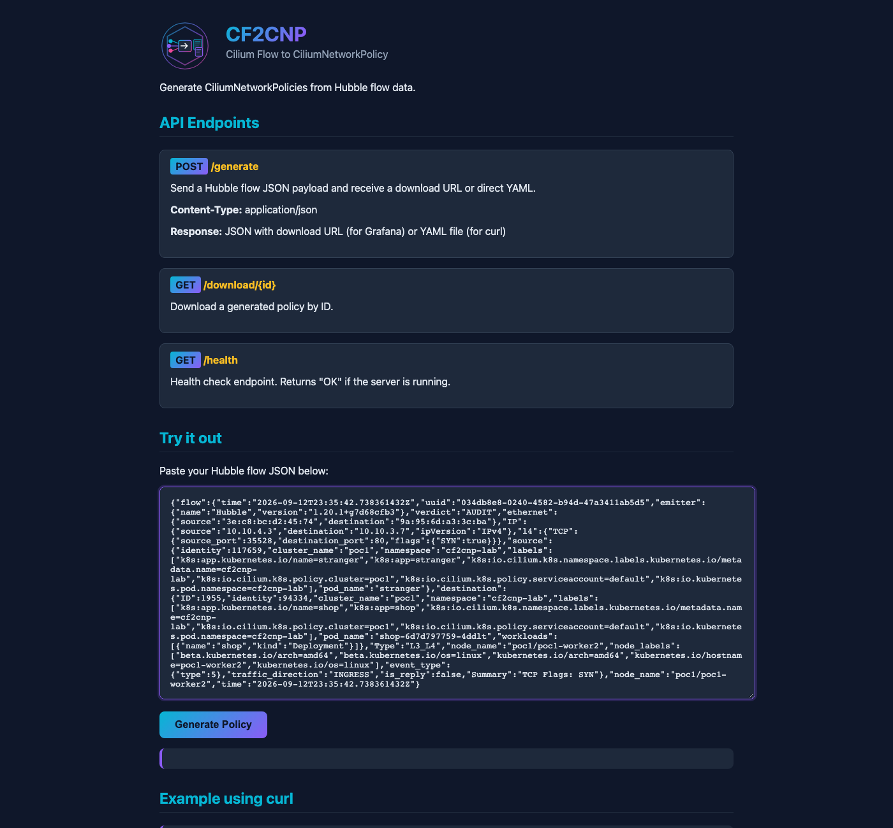
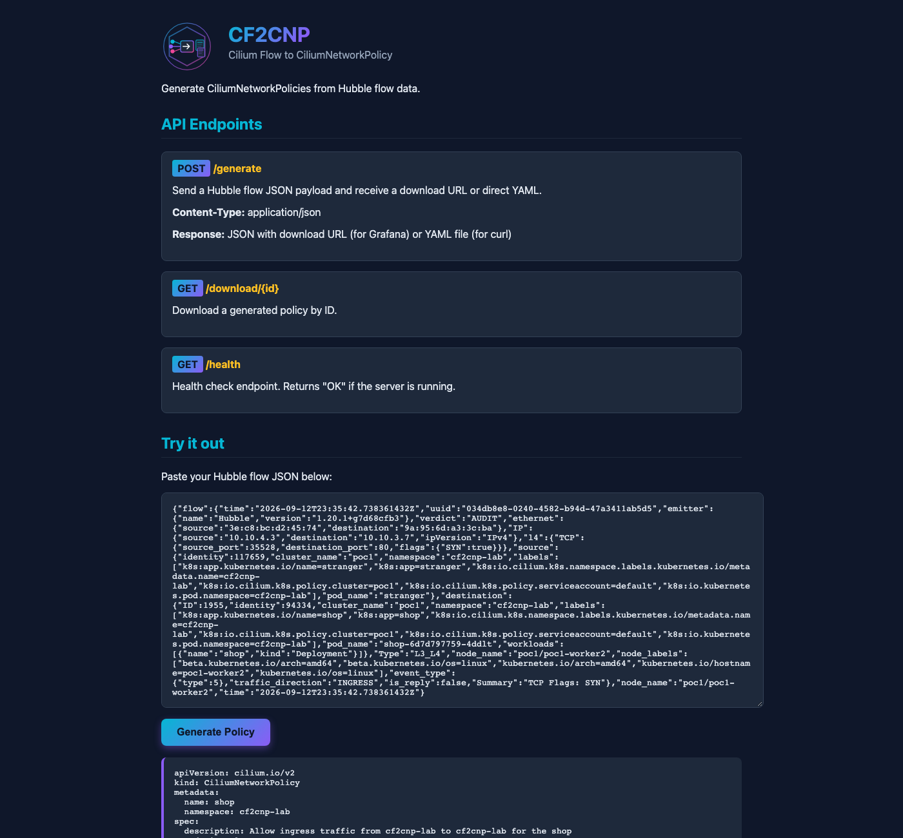
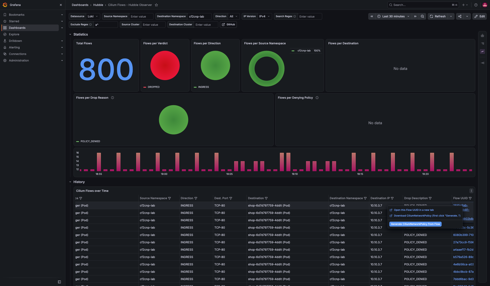
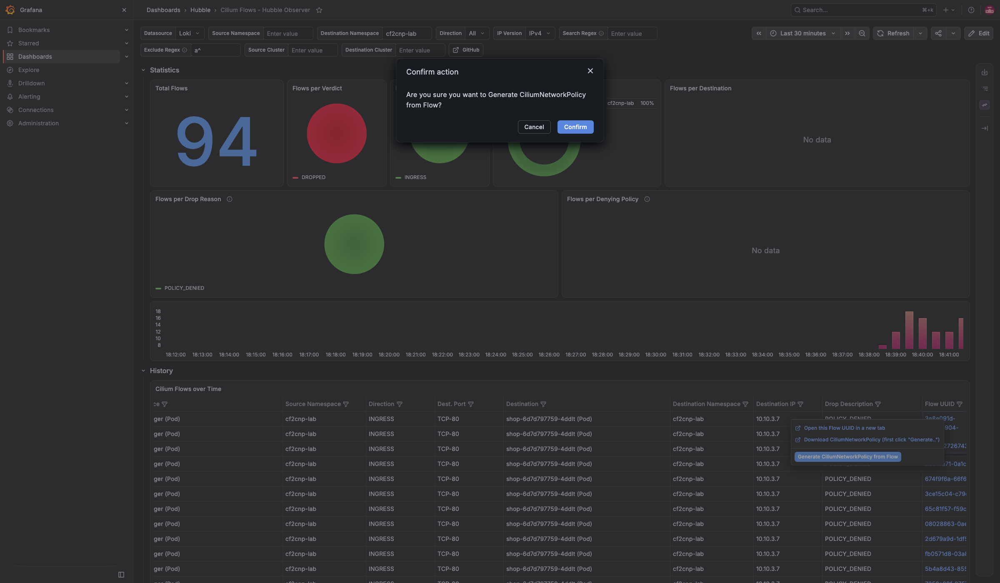
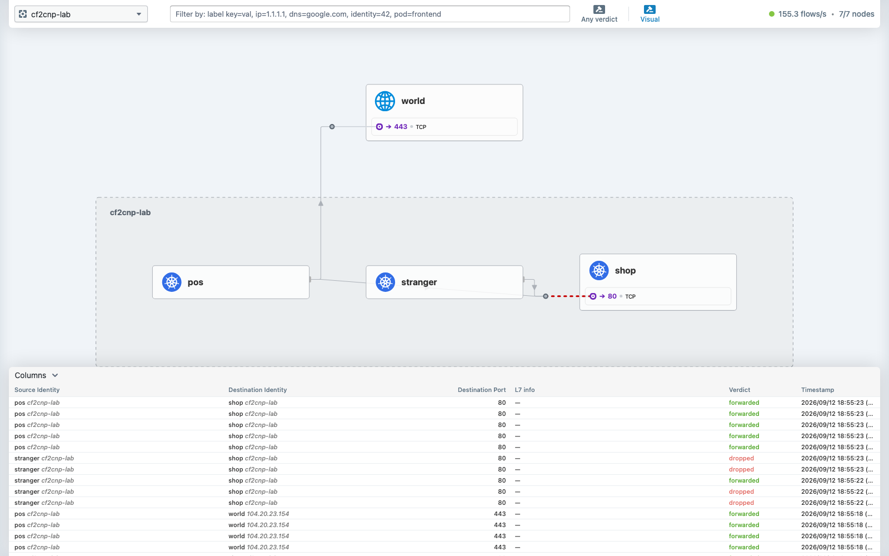
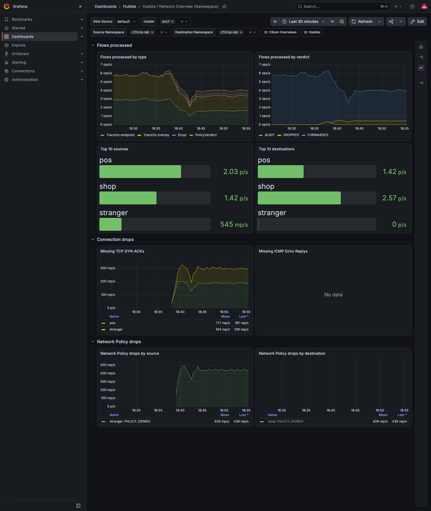
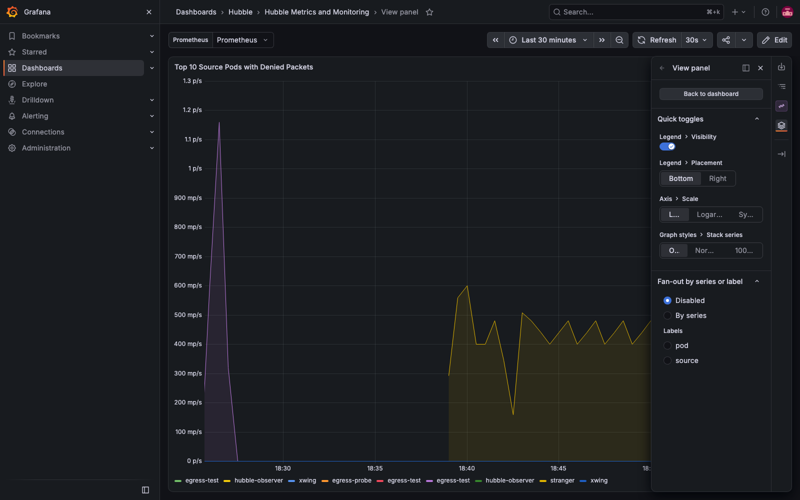
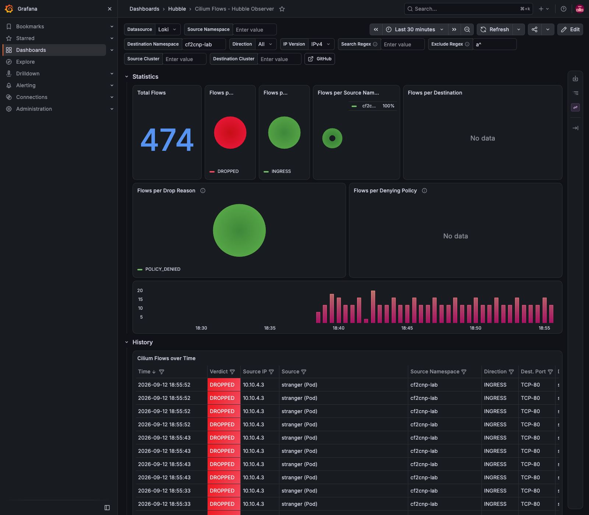
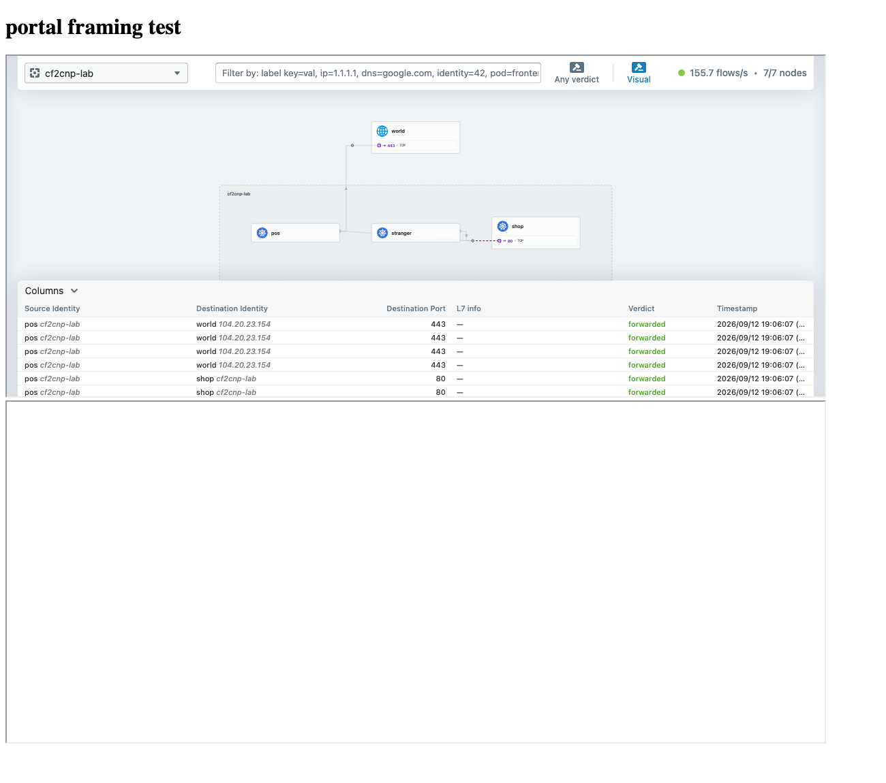
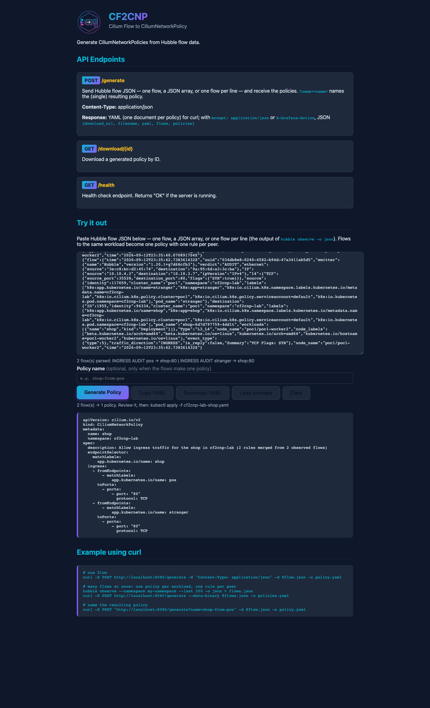

# Demo 26 — from a Hubble flow to a CiliumNetworkPolicy: the flow JSON, cf2cnp three ways, audit → enforce, and the verdicts on every dashboard

**Where this sits in the whole:** [OBSERVABILITY-ARCHITECTURE.md](../../OBSERVABILITY-ARCHITECTURE.md) — the
flow store this demo reads from (demo 25) and the metrics it charts (demo 16) are drawn there.

## Summary context

Demo 25 Part 11 learned cf2cnp from its project: paste a Hubble flow, get a policy. This demo makes that
the *foundational* skill it is: **where a Hubble flow comes from, what is in it, and how it becomes a
policy you can defend** — then the same flow through all three doors of cf2cnp (the API, the Web UI, the
Grafana action), and the policy's effect read back in Hubble UI, on the chart's dashboards, on the
observer's Loki dashboard and on a small dashboard of our own for policy verdicts. The pattern is the one
the enterprise products sell as "policy from observed traffic": **observe first in audit mode, generate,
apply, enforce** — done here with open-source parts and every step recorded in
[`output/transcript.txt`](output/transcript.txt).

| Piece | What | Where |
|---|---|---|
| the lab | `shop` (nginx :80), `pos` (the intended client; also talks to `example.com`), `stranger` (the client nobody intended) | [`10-lab.yaml`](10-lab.yaml), namespace `cf2cnp-lab` on poc1 |
| the flows | one flow as JSON from any of the four places this stack keeps flows | [`get-flow.sh`](get-flow.sh) `cli` / `loki` / `observer` / `export` |
| audit mode | Cilium's per-endpoint `PolicyAuditMode`: policy evaluated and *reported*, nothing dropped | [`audit-mode.sh`](audit-mode.sh), [`20-shop-default-deny-ingress.yaml`](20-shop-default-deny-ingress.yaml) |
| cf2cnp | method 1 the API ([`generate.sh`](generate.sh)); method 2 the Web UI ([`ui-generate.js`](ui-generate.js)); method 3 the Grafana action ([`grafana-generate.js`](grafana-generate.js)) | `https://cf2cnp.poc.local` (demo 25), the 23862 dashboard |
| the verdicts | Hubble as text ([`verify.sh`](verify.sh)) and as a metric ([`policy-metric.sh`](policy-metric.sh)); our dashboard ([`30-policy-verdicts-dashboard.json`](30-policy-verdicts-dashboard.json), [`dashboard.sh`](dashboard.sh)) | Grafana, folder Hubble |

Prerequisites: demo 16 (Grafana, the Hubble metrics), demo 24 (the relay on the enterprise root),
demo 25 (the observer → Loki, cf2cnp on the Gateway) and the CLI configured once for mTLS
(`scripts/hubble-tls.sh --configure kind-poc1 kind-poc2`). Every command below is run from the repo root.

## Part 1 — the lab, and what Hubble sees before any policy

```bash
kubectl --context kind-poc1 apply -f demos/26-cf2cnp-policy-from-flows/10-lab.yaml
demos/26-cf2cnp-policy-from-flows/verify.sh 2m
```

`verify.sh` reads the namespace's flows from the relay as JSON and counts them per
`(source → destination:port, verdict, drop reason, policy)`, skipping replies. With no policy, every flow is
FORWARDED and no policy is attributed (transcript Part 1):

```text
policies in cf2cnp-lab:
    56  pos        → shop-6d7d797759-4ddlt            :80    FORWARDED
    40  pos        → coredns-789c5fbdb4-vb8r9         :53    FORWARDED
    40  stranger   → shop-6d7d797759-4ddlt            :80    FORWARDED
    24  pos        → ,reserved:world                  :443   FORWARDED
```

`pos` and `stranger` landed on `poc1-worker`, `shop` on `poc1-worker2` — so every request crosses a node,
which matters in Part 3.

## Part 2 — the Hubble flow JSON: what it is, what cf2cnp reads, where to get it

A Hubble flow is one observed packet or L7 event with **identity** attached: who sent it (labels,
namespace, pod), who received it, the L4 tuple, the verdict, the policy that decided it, and *which
endpoint reported it*. The CLI's `-o json` prints the envelope `{"flow": {...}, "node_name": ..., "time": ...}`
— exactly the input cf2cnp expects (its README's [input format](https://github.com/onzack/cf2cnp#input-format)).
Of a flow of about 1.6 KB (the two saved ones are 1592 and 1607 bytes), cf2cnp reads five things:

| Field | Used for |
|---|---|
| `flow.traffic_direction` | `INGRESS` → an **ingress** policy selecting the *destination*; `EGRESS` → an **egress** policy selecting the *source* |
| `flow.source.namespace`, `.labels` | `fromEndpoints` (ingress) or the `endpointSelector` (egress); cross-namespace adds `io.kubernetes.pod.namespace` |
| `flow.destination.namespace`, `.labels` | the `endpointSelector` (ingress) or `toEndpoints` (egress); `reserved:world` → `toCIDR` or `toFQDNs` |
| `flow.destination_names` | the DNS name behind a world destination → `toFQDNs` + the DNS rule; **absent unless a DNS-visibility policy is in place** (Part 3) |
| `flow.l4.TCP/UDP.destination_port` | `toPorts` |

Labels are filtered to `app.kubernetes.io/name|component|instance`, falling back to `app`, `k8s-app`,
`name`, `component`, `instance` (the lab pods carry both `app` and `app.kubernetes.io/name`, so the
generated selectors use the priority key). A **reply** packet (`is_reply: true`) is rejected on purpose —
the policy must allow the original request. `get-flow.sh` takes the first non-reply flow.

**Where a flow can be read from — the four sources, each with its own reach (transcript Parts 3, 3b):**

| Source | Command | History | Scope |
|---|---|---|---|
| the relay, live | `get-flow.sh cli <hubble observe filters>` | the **per-agent** ring (`hubble-event-buffer-capacity`, chart default **4095** — `cilium-dbg status` shows `4095/4095`): about **100 s** on a poc1 worker at the measured **40 flows/s** (transcript Part 13). The Hubble UI's ~155 flows/s is 7 nodes summed — do not divide the ring by it. Fetch right after the traffic | every node of both clusters (demo 24) |
| Loki, the store | `get-flow.sh loki '{namespace="hubble-observer",container="hubble-observer"} \| json \| flow_verdict="DROPPED" …' 30` | **hours** (24 h retention, demo 25) | what the observer exported: DROPPED flows by default |
| the observer pod's stdout | `get-flow.sh observer '<grep>'` | the pod's log (30 min window in the script) | the same DROPPED stream, before Loki |
| the node's export file | `get-flow.sh export poc1-worker2 '<grep>'` | the file's rotation (demo 10) | that node's flows, every verdict |

All four produced the **same** `stranger → shop` INGRESS DROPPED flow and, through the API, the
**byte-identical policy** — `md5 31c4209a…` from the CLI, Loki, the observer log and the export file (Part 3b,
corrected). Which one to use is a question of *time* (live vs. stored) and *verdict* (Loki only holds what
the observer was told to export), not of correctness.

The CLI filters that bit, so you do not have to (Part 1b–1d): `--from-pod`/`--to-pod`/`--pod` already
carry the namespace and **cannot be combined with `--namespace`** (the CLI errors; our first three files
were empty and cf2cnp answered `400 Request body is empty`); `--traffic-direction ingress|egress` selects
*which side reported* the flow, and that decides the kind of policy cf2cnp writes.

## Part 3 — the ingress problem: in this capture, nothing reported INGRESS

This is the measured fact the workflow turns on — for this capture. With no policy on `shop`, every flow
*to* shop was reported as **EGRESS** — at `TO_OVERLAY` by the sender's node and at `TO_ENDPOINT` by shop's
own node — and `--traffic-direction ingress` returned **0** flows (Part 1d). Feed cf2cnp one of those and it
writes an *egress* policy for `pos`, not the ingress policy for `shop` you wanted.

It is an observation, not a Cilium invariant (review finding): the parser's `decodeTrafficDirection`
(cilium v1.20.1 `pkg/hubble/parser/threefour/parser.go`) returns INGRESS for a trace event whenever the local
endpoint is the destination and the packet is not a reply, policy or no policy — provided the observation
point carried a connection-tracking reason. What is reliable is the destination's **policy-verdict** event:
it exists only once a policy selects the endpoint, and it is always reported from the destination's side
as INGRESS. That is what Part 4 produces.

The egress example is still useful and is kept: from the `pos → reserved:world:443` flow cf2cnp wrote
[`cnp-pos-to-world.yaml`](policies/cnp-pos-to-world.yaml) — `toCIDR: 104.20.23.154/32` with the tool's own
comment offering `toEntities: [world]` instead. Not `toFQDNs: example.com`, because the flow carried **no
`destination_names`**: Hubble only learns names when a DNS-visibility rule (an L7 `rules.dns` policy, the
one demo 19's cell applies) makes the agent's proxy see the lookups. A CIDR for a CDN name is the wrong
policy for the intent; the tool wrote what it saw, which is the caution demo 25 Part 11 ended on.

The way to *get* ingress flows for a workload is the enterprise "observe first" step itself, Part 4.

## Part 4 — observe first: default-deny on `shop`, in policy audit mode

Cilium's per-endpoint **policy audit mode** evaluates policy and *reports* the verdict — `AUDIT` in Hubble,
`action="audit"` in the metric — **without dropping anything**
([docs: Enable policy audit mode for a specific endpoint](https://docs.cilium.io/en/stable/security/policy-creation/#enable-policy-audit-mode-specific-endpoint)).
It is endpoint-local, set on the agent of the node the pod runs on, and does not survive the pod. On
1.20 the endpoint JSON carries no pod name (`external-identifiers` holds only the CNI attachment id —
measured), so [`audit-mode.sh`](audit-mode.sh) resolves it by its CiliumEndpoint name,
`cep-name:cf2cnp-lab/<pod>` (a prefix `cilium-dbg endpoint get` accepts on 1.20.1; a hostNetwork pod has
no CiliumEndpoint and is refused by the 404) and configures that numeric id.

Then a default-deny ingress policy on `shop`. **`ingress: []` is not one** — Cilium 1.20.1 rejects it,
`Valid=False: rule must have at least one of Ingress, IngressDeny, Egress, EgressDeny`, and the endpoint stays
unenforced while `kubectl get cnp` lists the object (gotcha #80; it happened here first, Part 2 of the
transcript). The default-deny is **one empty rule**, `ingress: [{}]`:

```bash
demos/26-cf2cnp-policy-from-flows/audit-mode.sh shop Enabled
kubectl --context kind-poc1 apply -f demos/26-cf2cnp-policy-from-flows/20-shop-default-deny-ingress.yaml
sleep 45; demos/26-cf2cnp-policy-from-flows/verify.sh 45s
```

```text
endpoint 1955 (shop-6d7d797759-4ddlt on poc1-worker2): PolicyAuditMode=Enabled
Valid=True
    88  pos        → shop-6d7d797759-4ddlt            :80    FORWARDED
    54  stranger   → shop-6d7d797759-4ddlt            :80    FORWARDED
     9  pos        → shop-6d7d797759-4ddlt            :80    AUDIT
     6  stranger   → shop-6d7d797759-4ddlt            :80    AUDIT
  pos → shop:  HTTP/1.1 200 OK
  stranger → shop:  HTTP/1.1 200 OK
```

Two things changed at once. `shop`'s endpoint now **reports** — the AUDIT lines are policy-verdict events
emitted by the destination, `traffic_direction: INGRESS`, reported by `poc1/poc1-worker2` — and nothing
broke: both clients still get 200. Those AUDIT flows are precisely the input for an ingress policy:

```bash
demos/26-cf2cnp-policy-from-flows/get-flow.sh cli --verdict AUDIT --from-pod cf2cnp-lab/pos      --to-pod cf2cnp-lab/shop > demos/26-cf2cnp-policy-from-flows/policies/flow-pos-to-shop.json
demos/26-cf2cnp-policy-from-flows/get-flow.sh cli --verdict AUDIT --from-pod cf2cnp-lab/stranger --to-pod cf2cnp-lab/shop > demos/26-cf2cnp-policy-from-flows/policies/flow-stranger-to-shop.json
```

Both files are kept in [`policies/`](policies/) (1592 and 1607 bytes; `INGRESS`, `AUDIT`, the SYN of a new
connection, no policy named yet). **This is the foundational sequence:** put the workload in audit mode,
give it the default-deny, and every client that talks to it *writes its own allow rule into the flow log*
without a single dropped packet.

### Part 4a — the policy-verdict metric, switched on

Hubble's `policy` metric (`hubble_policy_verdicts_total{action=audit|forwarded|dropped|redirected, match=none|l3-l4|…}` — `redirected` is the L7-proxy verdict the bank's demo 19 rules produce)
was not in demo 16's list. It is added to
[`demos/16-monitoring/values-cilium-metrics.yaml`](../16-monitoring/values-cilium-metrics.yaml) with the
same contexts as the others, and applied with `--reuse-values`; the render diff was **one key of one
ConfigMap** (`cilium-dynamic-metrics-config`), no rollout — the dynamic exporter re-reads it (transcript
Part 4a). [`policy-metric.sh`](policy-metric.sh) prints it through the API server's service proxy.

## Part 5 — method 1 of 3: the API (`POST /generate`)

```bash
demos/26-cf2cnp-policy-from-flows/generate.sh demos/26-cf2cnp-policy-from-flows/policies/flow-pos-to-shop.json      demos/26-cf2cnp-policy-from-flows/policies/cnp-pos-to-shop.yaml
demos/26-cf2cnp-policy-from-flows/generate.sh demos/26-cf2cnp-policy-from-flows/policies/flow-stranger-to-shop.json demos/26-cf2cnp-policy-from-flows/policies/cnp-stranger-to-shop.yaml
```

[`generate.sh`](generate.sh) is `curl --cacert docs/root-ca.crt --resolve cf2cnp.poc.local:443:$GW -X POST
https://cf2cnp.poc.local/generate -H 'Content-Type: application/json' --data-binary @flow.json` — the
`--resolve` because the browser resolves `*.poc.local` through the hosts block and curl needs to be told;
`JSON=1` adds `Accept: application/json` and returns what Grafana receives instead (Part 7). The answer for
`pos`, [`cnp-pos-to-shop.yaml`](policies/cnp-pos-to-shop.yaml):

```yaml
apiVersion: cilium.io/v2
kind: CiliumNetworkPolicy
metadata:
  name: shop
  namespace: cf2cnp-lab
spec:
  description: Allow ingress traffic from cf2cnp-lab to cf2cnp-lab for the shop
  endpointSelector:
    matchLabels:
      app.kubernetes.io/name: shop
  ingress:
    - fromEndpoints:
        - matchLabels:
            app.kubernetes.io/name: pos
      toPorts:
        - ports:
            - port: "80"
              protocol: TCP
```

Read it against the intent before applying it — and notice the name. The `stranger` file is **also
`metadata.name: shop`** (gotcha #81): in HTTP mode cf2cnp writes one policy per flow named after the workload
it selects; apply both and the second replaces the first. The intent is "pos, not stranger", so only the
`pos` rule is applied.

## Part 6 — apply while still auditing, then enforce

```bash
kubectl --context kind-poc1 apply -f demos/26-cf2cnp-policy-from-flows/policies/cnp-pos-to-shop.yaml
sleep 40; demos/26-cf2cnp-policy-from-flows/verify.sh 40s          # phase A: still in audit mode
demos/26-cf2cnp-policy-from-flows/audit-mode.sh shop Disabled       # phase B: enforce
sleep 45; demos/26-cf2cnp-policy-from-flows/verify.sh 45s
```

```text
--- phase A: allow rule in place, endpoint still in AUDIT mode ---
     8  pos        → shop-6d7d797759-4ddlt            :80    FORWARDED                by shop
     5  stranger   → shop-6d7d797759-4ddlt            :80    AUDIT
--- phase B: audit mode off = enforce ---
    22  stranger   → shop-6d7d797759-4ddlt            :80    DROPPED   POLICY_DENIED
     9  pos        → shop-6d7d797759-4ddlt            :80    FORWARDED                by shop
  pos → shop:  HTTP/1.1 200 OK
  stranger → shop: wget: download timed out
```

Phase A is the check that costs nothing: the generated rule already matches `pos` (`FORWARDED … by shop`,
`ingress_allowed_by` naming the policy) while `stranger` is still only *audited*. Phase B turns the audit
flag off and the same verdicts become real: `POLICY_DENIED` for `stranger`, a timeout for its `wget`, and
`pos` untouched. The metric tells the same story with counts (transcript Part 6):

```text
  cluster  dir      source     destination  action     match  count
  poc1     ingress  pos        shop         audit      none   22
  poc1     ingress  pos        shop         forwarded  l3-l4  24
  poc1     ingress  stranger   shop         audit      none   23
  poc1     ingress  stranger   shop         dropped    none   21
```

`match=none` is the default-deny deciding (audit while observing, dropped when enforcing); `l3-l4` is the
generated rule matching.

## Part 7 — method 2 of 3: the Web UI

[`ui-generate.js`](ui-generate.js) drives the page the way a person would, so the screenshots are
reproducible: open `https://cf2cnp.poc.local/`, paste the flow into the textarea, click **Generate Policy**.

```bash
GW=$(kubectl --context kind-poc1 -n routes get gateway routes-gw -o jsonpath='{.status.addresses[0].value}')
GW=$GW NODE_PATH=<dir with playwright> node demos/26-cf2cnp-policy-from-flows/ui-generate.js demos/26-cf2cnp-policy-from-flows/policies/flow-stranger-to-shop.json
```





The page prints the same YAML as the API (transcript Part 7) — it *is* the API: the button POSTs the
textarea to `/generate`. As shipped (0.3.1) the page has the textarea and the button, starts a download
on generate and offers nothing else; the page's header documents the three endpoints (`POST /generate`,
`GET /download/{id}`, `GET /health`). Part 14 replaces it with the fork's page.

## Part 8 — method 3 of 3: the Grafana action

The 23862 dashboard's flow table (demo 25) has a **Flow UUID** column whose cell carries three items: an
*action*, **Generate CiliumNetworkPolicy from Flow**, and two *links*, **Download CiliumNetworkPolicy** and
**Open this Flow UUID**. [`grafana-generate.js`](grafana-generate.js) opens the dashboard filtered to
`cf2cnp-lab`, clicks the first UUID, runs the action, confirms, and follows the download; it prints every
request the browser made to cf2cnp:

```bash
GW=$GW NODE_PATH=<dir with playwright> node demos/26-cf2cnp-policy-from-flows/grafana-generate.js cf2cnp-lab
```





What the browser did (transcript Part 8), which is the whole mechanism:

```text
POST https://cf2cnp.poc.local/generate  headers={"accept":"application/json, text/plain, */*","x-grafana-action":"1", …}
     body={"flow":{"time":"2026-09-12T23:41:28.231340706Z","uuid":"3e8e091d-46f7-4904-beb7…   ← the whole log line (${__data.fields.Line})
  ← 200 {"download_url":"http://cf2cnp.poc.local/download/3e8e091d-…","filename":"cf2cnp-lab-shop.yaml","message":"Policy generated successfully…"}
```

The action posts the row's raw line; cf2cnp sees `X-Grafana-Action` (or `Accept: application/json`) and
answers JSON instead of YAML, caching the policy **under the flow's UUID** — for at least 10 minutes: cf2cnp's
`cleanupCache` removes entries older than ten minutes on a five-minute ticker (`internal/server/server.go`), so an
entry lives between 10 and 15 minutes. The *Download*
link is `${hubbleobservercf2cnpurl}/download/<uuid>` — it works only after Generate, else `404 expired`. The
browser receives it as an attachment (`content-disposition: attachment; filename="cf2cnp-lab-shop.yaml"`), so
the tutorial also fetches it with curl and diffs it against the API's file: **identical**
([`cnp-from-grafana.yaml`](policies/cnp-from-grafana.yaml)). One observation, taken upstream in Part 14: the JSON's
`download_url` said `http://` behind an https-only Gateway that forwards `X-Forwarded-Proto: https`
(cf2cnp built it from `r.TLS`, which a TLS-terminating proxy never sets); the dashboard's own link ignores
`download_url`, so nothing broke, but a client that trusted the field would have been sent to a closed port
(gotcha #83).

## Part 9 — the policy, seen everywhere it shows

**Hubble UI** (`https://hubble.poc.local/?namespace=cf2cnp-lab`): the service map draws the three
workloads and `world`; the table alternates `stranger → shop dropped` with `pos → shop forwarded`.



**Hubble / Network Overview (Namespace)** (demo 16's chart dashboard, cluster `poc1`, both namespace
variables `cf2cnp-lab`): *Flows processed by verdict* now has three series — AUDIT during Part 4, then
DROPPED — and the *Network Policy drops* row names `stranger: POLICY_DENIED` by source and
`shop: POLICY_DENIED` by destination. That row is `hubble_drop_total`, the metric demo 16 enabled.



**Hubble Metrics and Monitoring**, row *Network Policy*: four panels on `hubble_drop_total{reason="POLICY_DENIED"}`
(denies by reason, by protocol, top-10 source and destination pods). `stranger` tops the source list.



**Cilium Flows - Hubble Observer** (demo 25, Loki), destination namespace `cf2cnp-lab`: the *Total Flows* stat read
94 at the moment of the capture below (a Loki count over the last 30 minutes; the recorded numbers are `verify.sh`'s
24 drops in 60 s and the metric's 81 at evidence time), all `POLICY_DENIED`, the histogram starting at enforcement —
and *Flows per Denying Policy* at **No data**. That is correct, and gotcha #82: a default-deny drop is decided by the *absence* of an allow
rule, so `ingress_denied_by` is empty (`[]` in every one of these flows); the panel fills only when an
explicit `ingressDeny`/`egressDeny` rule drops. The allowed side does name its rule (`ingress_allowed_by`,
the `by shop` in `verify.sh`).



## Part 10 — our own policy dashboard, from the verdict metric

The chart's dashboards show *drops*. The enterprise "policy" views also show what was **allowed by which
rule** and what is **being audited** — and the metric from Part 4a carries exactly that. So
[`30-policy-verdicts-dashboard.json`](30-policy-verdicts-dashboard.json) — **Hubble / Policy Verdicts
(Namespace)** — is provisioned the demo 16 way ([`dashboard.sh`](dashboard.sh): a ConfigMap labelled
`grafana_dashboard=1`, annotated `grafana_folder: Hubble`, loaded by the sidecar; the check goes through
Grafana's API because the grafana image has no shell to `exec` into — measured):

| Panel | Query | Reads as |
|---|---|---|
| Audited / Forwarded / Dropped in range | `sum(increase(hubble_policy_verdicts_total{action="…"}[$__range]))` | the three phases as three numbers |
| Workloads still audited (last 5 min) | `count(sum(rate(…{action="audit"}[5m])) by (destination) > 0)` | orange while anything is still observing; a *workload*, not an endpoint — the destination context collapses replicas |
| Policy verdicts per second, by action | `sum(rate(…[$__rate_interval])) by (action)` | audit rising then vanishing, dropped appearing = enforcement |
| by source → destination and action | `… by (source, destination, direction, action)` | who is affected |
| Who talked to whom, and what the policy did | `sum(increase(…[$__range])) by (cluster, source, destination, direction, action, match)` as a table | `match=none` = the default-deny decided; `l3-l4` = the generated rule |
| POLICY_DENIED drops per second | `hubble_drop_total{reason="POLICY_DENIED"}` | the demo 16 metric beside the audit line |


> **Since demo 28** the dashboard is its own chart, [hubble-policy-verdicts](https://github.com/ephico2real2/hubble-policy-verdicts),
> deployed as a dependency of the hubble-observer fork (uid `hubble-policy-verdicts`); `dashboard.sh` is kept as the
> record of the first, hand-made provisioning and exits without applying. The JSON here is that first version.

## Part 11 — can Hubble UI be extended, or can Grafana be embedded in it? Measured

The question was whether Cilium lets you extend the open-source Hubble UI — embed Grafana, or a UI of our
own, as a "Hubble extension" the way the enterprise consoles look. Measured (transcript Part 9), not
assumed:

- **No extension mechanism.** The [hubble-ui](https://github.com/cilium/hubble-ui) README (30 lines)
  contains **0** occurrences of plugin / extension / extend / embed / iframe; the repository tree
  (10,495 paths) has no plugin or extension directory — the only matches are vendored Go modules. The UI
  is a fixed React front end plus a Go backend that speaks to the relay; there is no documented hook for
  a third-party panel. Isovalent's enterprise UI (the timeline, Timescape, RBAC) is a different product,
  not a plugin layer on this one — demo 16 Part 11b.
- **Hubble UI can be framed by another page — tested.** `https://hubble.poc.local/` answers with **no
  `X-Frame-Options` and no `Content-Security-Policy`** (only `server: envoy` from the Gateway), and a local
  page with two iframes (transcript Part 9b) rendered the service map inside its frame, live flow rate and
  all. The relationship the question assumed is reversed: nothing goes *into* Hubble UI, but Hubble UI can
  go into something.
- **Grafana refuses to be framed by default — tested.** The running instance reports
  `security.allow_embedding = false` and answers `x-frame-options: deny`; in the same test page the browser
  logged `Refused to display 'https://grafana.poc.local/' in a frame because it set 'X-Frame-Options' to
  'deny'` and the frame stayed blank. Embedding Grafana panels in a portal is a supported, documented
  switch (`grafana.ini` `[security] allow_embedding = true`, with the cookie SameSite implications Grafana
  documents) — a decision to record, not a default to flip here.



- **What the cloud providers do** was not measured here and is not claimed. The pattern that *is*
  measurable is the one this repo already runs: **Grafana is the portal** (demo 16's dashboards, demo 25's
  observer dashboard with its cf2cnp actions, this demo's verdict dashboard), and Hubble UI sits beside it
  behind the same Gateway. If one page is wanted, the measured facts say it is a page that frames Hubble
  UI and Grafana-with-`allow_embedding` — not an extension of Hubble UI.

## Part 14 — the tool improved: the fork, tested, deployed here, and sent upstream

Three things this demo measured about cf2cnp became one change set on the fork
[ephico2real2/cf2cnp](https://github.com/ephico2real2/cf2cnp), branch `feat/external-url-multi-flow`,
built as an image, `kind load`-ed into poc1, deployed through the observer chart
(`values-hubble-observer.yaml`, `cf2cnp.image`), and sent upstream as an issue and a pull request
(transcript Parts 14, 14b, 14c):

| Measured here | Change | Proof |
|---|---|---|
| `download_url` said `http://` behind the https-only Gateway (Part 8; the code used `r.TLS`, nil behind a TLS-terminating proxy) | `baseURL()`: `--external-url` (env `CF2CNP_EXTERNAL_URL`) > RFC 7239 `Forwarded` > `X-Forwarded-Proto`/`-Host` > `r.TLS`/`r.Host`; chart 0.5.0 `externalURL`, `extraArgs`, `extraEnv`, and the container `args` rendered so a flag can be given | seven scheme cases in `server_test.go`; live: the Grafana action's answer now `https://cf2cnp.poc.local/download/1895c9ab-…` (Part 14c) |
| one policy per flow, all named after the workload — two peers, two objects, the second apply replaces the first (gotcha #81, measured in Part 14e; in file mode the second file overwrote the first) | `/generate` accepts one flow, a JSON array or one flow per line (`hubble observe -o json`); policies selecting the same workload are **merged** into one object with one rule per peer; `?name=` names a single resulting policy; the JSON answer carries `flows`, `policies`, `yaml` | `TestGeneratePolicies_OneFilePerWorkload` fails on upstream main; live: three flows → two documents, `shop` with both peers, accepted by `kubectl apply --dry-run=server` (Part 14) |
| the page: textarea and button, auto-download, nothing to read before generating | a summary of the pasted flows (direction, verdict, peer → workload:port, replies flagged), a policy-name field, *Copy YAML* / *Download YAML* / *Load example* / *Clear*, the `kubectl apply -f <file>` hint | [`ui-generate.js`](ui-generate.js) on two flows: `2 flow(s) parsed: INGRESS AUDIT pos → shop:80 \| INGRESS AUDIT stranger → shop:80` → `2 flow(s) → 1 policy` (Part 14b) |



Tests were written first against real flows from this lab (`internal/testdata/`): the parser (single,
NDJSON, array, a bad line named by position, a directory with many flows per file), the generator (merge,
dedupe of identical rules, distinct workloads kept apart, name override and its refusal, one file per
workload, the multi-document stream), the server (every scheme case, the Grafana path keeping the flow's
UUID as cache id, many flows, `?name=`, bad inputs, YOLO). `go test ./...` green, `helm lint` clean, the
chart rendered with and without the new values. The upstream chart for hubble-observer pins the cf2cnp
subchart at 0.4.0, so `cf2cnp.externalURL` becomes settable from there only after a dependency bump — the
proxy-header path needs no value at all, which is why this lab runs the new image under the old chart.

### Part 14e — one name per kind per namespace: the collision measured, and the naming rule that removes it

Kubernetes identifies an object by API group, kind, namespace and **name**
([Object Names and IDs](https://kubernetes.io/docs/concepts/overview/working-with-objects/names/)); the
[recommended labels](https://kubernetes.io/docs/concepts/overview/working-with-objects/common-labels/)
distinguish workloads by `app.kubernetes.io/name` (the application), `/instance` (one installation of it)
and `/component` (one part of it). cf2cnp named a policy after `name` alone, so two workloads that differ
by component — or, as in Part 5, two *peers* of one workload — produced two objects called `shop`. Measured
on the cluster (transcript Part 14e): apply the `pos` file, apply the `stranger` file, read the object
back — it holds **only stranger's rule**, and within 20 seconds Hubble shows `pos → shop DROPPED
POLICY_DENIED`. The second apply replaced the first, silently: `kubectl apply` reports `configured`, not
a conflict.

Two changes on the fork close this at the source, both in release 0.5.0:

- **Merging** (Part 14): flows into the same workload become one object with one rule per peer — the
  peer case.
- **The name is a function of the whole selector**: `name`, then `instance`, then `component` folded in
  (`shop`, `shop-frontend`, `shop-blue-frontend`), so equal names imply equal selectors — the workload
  case. A workload with only a name keeps the name it always had. Every generated policy carries
  `app.kubernetes.io/managed-by: cf2cnp` and the selector's `name`/`instance`/`component` as **labels**, so
  `kubectl get cnp -l app.kubernetes.io/name=shop` lists a workload's policies whatever they are called.
  Measured live (Part 14f): the recorded `pos → shop` flow and the same flow with `component=frontend`
  and `component=backend` on shop yield `shop`, `shop-frontend`, `shop-backend`, each labelled.

### Part 14f — release 0.5.0 of the fork, and the cluster on it

While [onzack/cf2cnp#3](https://github.com/onzack/cf2cnp/pull/3) is pending, the fork releases on its own:

| Artefact | Where | How |
|---|---|---|
| chart `cf2cnp` 0.5.0 (appVersion 0.5.0) | `https://ephico2real2.github.io/cf2cnp` (`index.yaml` on the `gh-pages` branch) and the GitHub release [`cf2cnp-0.5.0`](https://github.com/ephico2real2/cf2cnp/releases/tag/cf2cnp-0.5.0) with the `.tgz` | `helm/chart-releaser-action` on push to `develop` (the fork's default branch) |
| the same chart as OCI | `oci://ghcr.io/ephico2real2/helm-charts/cf2cnp:0.5.0` | the upstream `helm-publish` workflow on tag `v0.5.0` |
| image `ghcr.io/ephico2real2/cf2cnp:0.5.0` | ghcr, public (pulls unauthenticated — measured) | the upstream `docker-publish` workflow on tag `v0.5.0` |

The hubble-observer fork's chart (`develop`) now declares the dependency `cf2cnp 0.5.0` from that
repository instead of `oci://ghcr.io/onzack/helm-charts` `"*"`; `chart-from-fork.sh develop` resolved it
(`dependencies: cf2cnp-0.5.0.tgz`), release revision 20, the pod on `ghcr.io/ephico2real2/cf2cnp:0.5.0`,
and demo 25's vendored copy is refreshed from that commit. The lab ends as the tutorial left it: pos
forwarded by the generated rule, stranger dropped.

**Continued as demo 27** — [`../27-cf2cnp-release/README.md`](../27-cf2cnp-release/README.md): the 0.5.0 release deployed and
tested on a two-component lab; `audit-mode.sh`, `verify.sh` and the two Playwright scripts take `NS=` / `SHOTS_DIR=` for it.

## Exercises

See [`GUIDE.md`](GUIDE.md) — from "get one flow" to "enforce, then reverse it", each with the expected
output.

## Cleanup

```bash
demos/26-cf2cnp-policy-from-flows/cleanup.sh
```

Deletes the namespace (the audit flag dies with the pod; the policies are namespaced). The policy metric
and the dashboard stay: they are part of the observability stack now.

## What to take away

- **Audit mode first, always.** A default-deny in `PolicyAuditMode` costs nothing, makes the workload's own
  endpoint report every ingress flow, and turns the flow log into a list of the allow rules you need. It
  is the mechanism under every "generate policy from traffic" feature.
- **`ingress: [{}]`, never `ingress: []`** — and read `.status.conditions` after every apply (gotcha #80).
- **A flow is a transcript, not an intent.** cf2cnp wrote a CIDR for a CDN, one file per flow all named
  `shop`, and nothing at all for the client you wanted to exclude. The tool is exact; the judgement is yours
  (demo 19's `intent.yaml` is where it is written down).
- **Four sources, one flow.** Live relay for now, Loki for hours, the export file for a node — all produced
  the identical policy. Pick by time and verdict coverage.
- **Three doors, one API.** The UI and the Grafana action both POST to `/generate`; the Grafana action adds
  a header and gets a URL keyed by the flow's UUID, cached ten minutes.
- **Denied-by is for deny rules.** A default-deny names no policy; read the allowed side and the
  `match=none` verdicts instead (gotcha #82).

## Evidence

Captured 2026-09-12 with `scripts/evidence/capture.js` and `scripts/evidence/collect.sh` (both re-runnable;
the pod, policy and verdict output is the recorded file [`output/evidence.txt`](output/evidence.txt)). The
Part 7 and Part 8 images are taken by the two Playwright scripts of this demo.

**hubble ui cf2cnp lab** — Hubble UI on the lab namespace after enforcement: pos → shop forwarded, stranger → shop dropped, pos → world


**grafana network overview cf2cnp lab** — Hubble / Network Overview for the lab: flows by verdict, and the Network Policy drops panels naming stranger and shop


**grafana hubble metrics denied sources** — Hubble Metrics and Monitoring, Network Policy row: Top 10 Source Pods with Denied Packets


**grafana hubble observer cf2cnp lab** — the Loki-backed drop history filtered to the lab


**grafana policy verdicts** — our own dashboard on `hubble_policy_verdicts_total`


**cf2cnp ui, three steps** — as shipped (0.3.1): [`ui-1-empty-upstream-0.3.1.png`](output/screenshots/ui-1-empty-upstream-0.3.1.png), [`ui-2-pasted-upstream-0.3.1.png`](output/screenshots/ui-2-pasted-upstream-0.3.1.png), [`ui-3-generated-upstream-0.3.1.png`](output/screenshots/ui-3-generated-upstream-0.3.1.png); the fork (Part 14): [`ui-1-empty.png`](output/screenshots/ui-1-empty.png), [`ui-2-pasted.png`](output/screenshots/ui-2-pasted.png), [`ui-3-generated.png`](output/screenshots/ui-3-generated.png)

**grafana action, four steps** — [`grafana-1-dashboard-filtered.png`](output/screenshots/grafana-1-dashboard-filtered.png), [`grafana-2-uuid-menu.png`](output/screenshots/grafana-2-uuid-menu.png), [`grafana-3-confirm.png`](output/screenshots/grafana-3-confirm.png), [`grafana-4-generated.png`](output/screenshots/grafana-4-generated.png)

**Running pods and policies** (from `output/evidence.txt`):

```console
$ kubectl --context kind-poc1 -n cf2cnp-lab get pods -o wide
NAME                    READY   STATUS    RESTARTS   AGE   IP           NODE           NOMINATED NODE   READINESS GATES
pos                     1/1     Running   0          22m   10.10.4.93   poc1-worker    <none>           <none>
shop-6d7d797759-4ddlt   1/1     Running   0          22m   10.10.3.7    poc1-worker2   <none>           <none>
stranger                1/1     Running   0          22m   10.10.4.3    poc1-worker    <none>           <none>

$ kubectl --context kind-poc1 -n cf2cnp-lab get cnp -o custom-columns=NAME:.metadata.name,VALID:...,SELECTOR:...,DESCRIPTION:...
NAME                        VALID   SELECTOR                           DESCRIPTION
shop                        True    map[app.kubernetes.io/name:shop]   Allow ingress traffic from cf2cnp-lab to cf2cnp-lab for the shop
shop-default-deny-ingress   True    map[app:shop]                      Step 2 — default-deny ingress on shop; evaluated in audit mode first, enforced once the generated allow rule is in place
```
