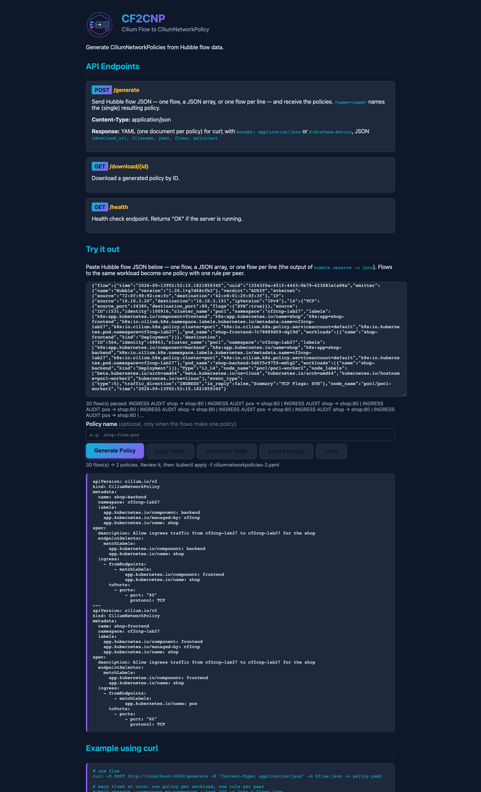
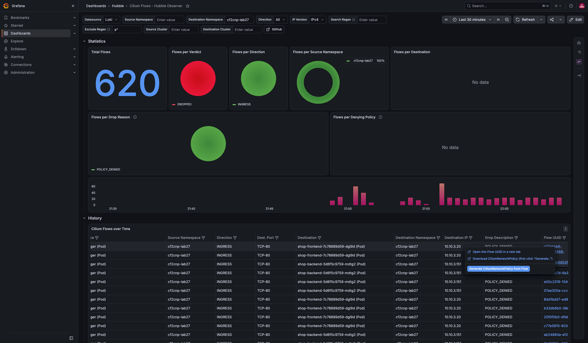
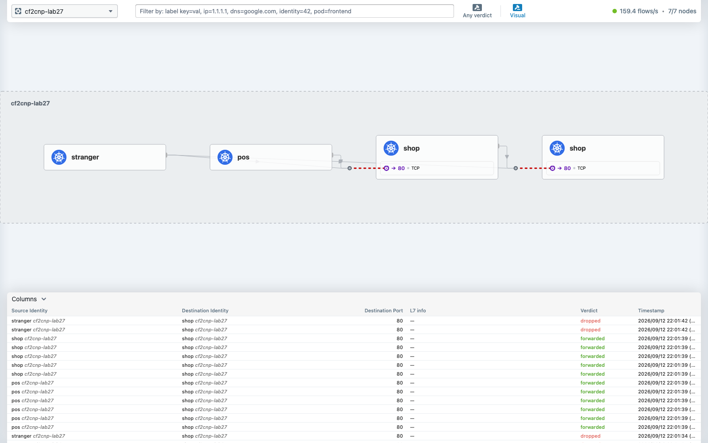
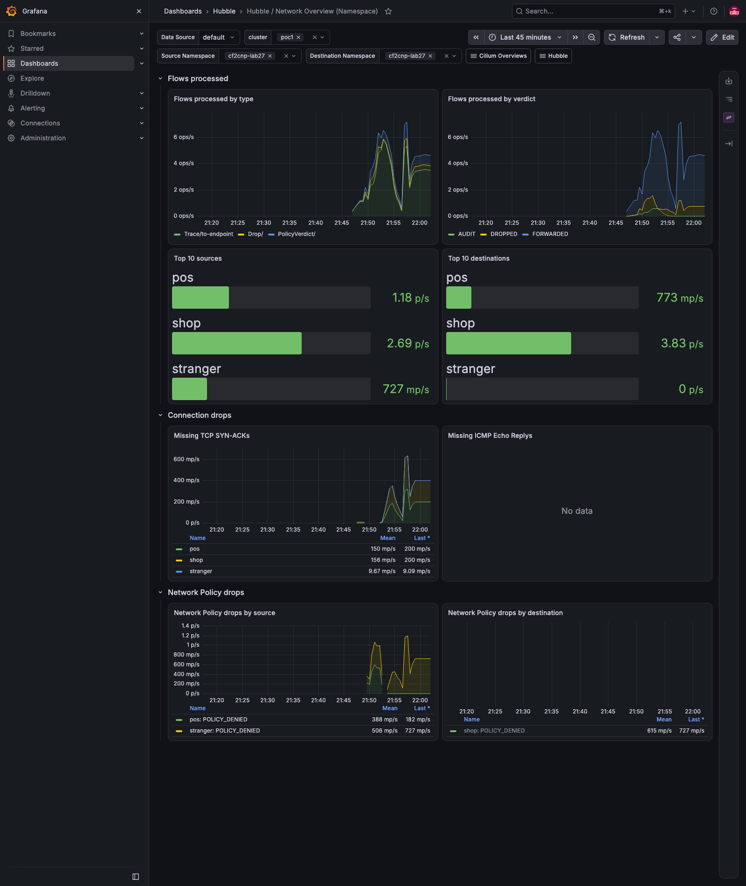
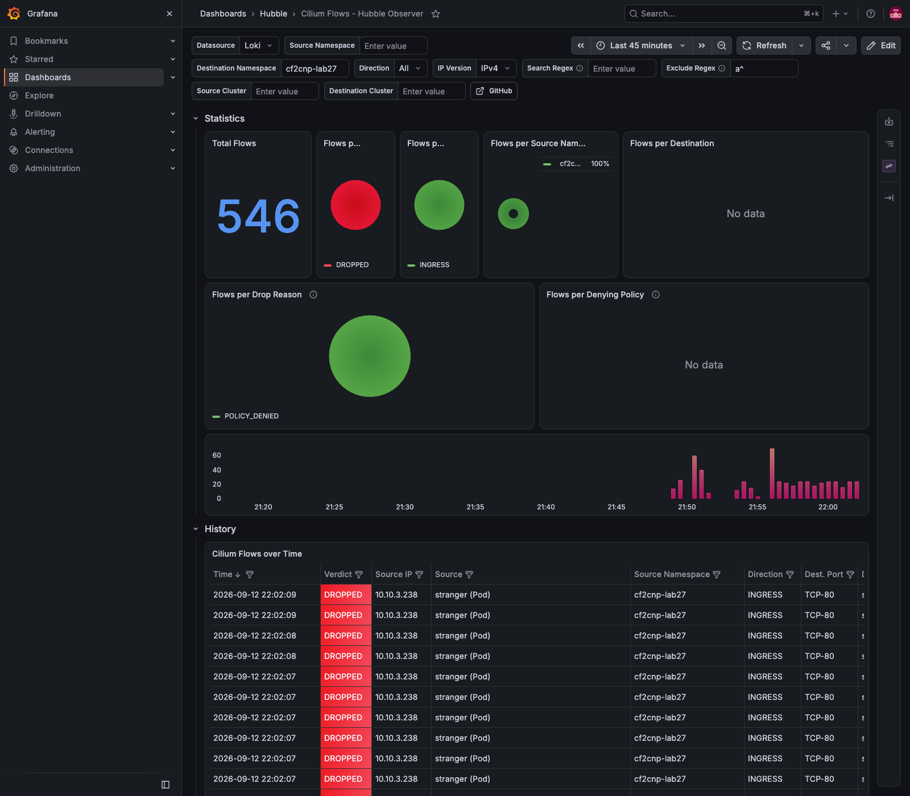

# Demo 27 — cf2cnp 0.5.0 from the fork: one request, many flows, one policy per workload, names that cannot collide

**Where this sits in the whole:** [OBSERVABILITY-ARCHITECTURE.md](../../OBSERVABILITY-ARCHITECTURE.md); the tool and the
workflow are demo 26's, the release is [demo 26 Part 14f](../26-cf2cnp-policy-from-flows/README.md#part-14f--release-050-of-the-fork-and-the-cluster-on-it).

## Summary context

Demo 26 found three things about cf2cnp and fixed them on the fork
([ephico2real2/cf2cnp](https://github.com/ephico2real2/cf2cnp), upstream [PR #3](https://github.com/onzack/cf2cnp/pull/3)):
`download_url` behind a TLS-terminating Gateway, one policy per flow all named alike, and a page that
could take one flow at a time. This demo **deploys the fork's release 0.5.0 and tests it** on a lab built
for the hardest of the three — the naming rule. Kubernetes identifies an object by group, kind, namespace
and name, so two workloads that share `app.kubernetes.io/name` and differ by `app.kubernetes.io/component`
must never produce two policies with one name. The lab has exactly that: a `shop` **frontend** and a `shop`
**backend**. Every step is recorded in [`output/transcript.txt`](output/transcript.txt), including the
two mistakes made on the way.

| Piece | What | Where |
|---|---|---|
| the release | chart `cf2cnp` 0.5.0 from `https://ephico2real2.github.io/cf2cnp` (gh-pages), image `ghcr.io/ephico2real2/cf2cnp:0.5.0` (public) | Part 0; the hubble-observer fork's chart dependency, `demos/25-hubble-observer-loki/values-hubble-observer.yaml` |
| the lab | `shop-frontend` (nginx + a sidecar that calls the backend), `shop-backend` (nginx), `pos` (calls the frontend), `stranger` (calls both) — the two shop pods carry `app.kubernetes.io/name: shop` and their component | [`10-lab.yaml`](10-lab.yaml), namespace `cf2cnp-lab27` |
| the default-deny | one policy selecting `app.kubernetes.io/name: shop`, so both components, audited first | [`20-shop-default-deny-ingress.yaml`](20-shop-default-deny-ingress.yaml) |
| the scripts | demo 26's, now namespace-aware (`NS=cf2cnp-lab27`) | [`../26-cf2cnp-policy-from-flows/`](../26-cf2cnp-policy-from-flows/) `audit-mode.sh`, `verify.sh`, `policy-metric.sh`, `ui-generate.js`, `grafana-generate.js` |
| the result | two policies from one request, `shop-frontend` and `shop-backend`, labelled, enforced | [`policies/`](policies/) |

## Part 0 — the release the cluster runs

```bash
helm repo add cf2cnp-fork https://ephico2real2.github.io/cf2cnp && helm search repo cf2cnp-fork --versions
docker pull ghcr.io/ephico2real2/cf2cnp:0.5.0
helm --kube-context kind-poc1 -n hubble-observer get metadata hubble-observer
```

```text
cf2cnp-fork/cf2cnp   0.5.0   0.5.0   A Helm chart for CF2CNP - Cilium Flow to Cilium...
Status: Image is up to date for ghcr.io/ephico2real2/cf2cnp:0.5.0        (no credentials: the package is public)
release hubble-observer hubble-observer 2.6.0-alpha revision 20
image=ghcr.io/ephico2real2/cf2cnp:0.5.0
```

The chart reaches the cluster as the hubble-observer fork's dependency (`Chart.yaml`: `cf2cnp 0.5.0` from the
gh-pages repository); the image is the one the `v0.5.0` tag built. Nothing in this demo is `kind load`-ed
or hand-built.

## Part 1 — the lab, and two mistakes worth keeping

```bash
kubectl --context kind-poc1 apply -f demos/27-cf2cnp-release/10-lab.yaml
NS=cf2cnp-lab27 demos/26-cf2cnp-policy-from-flows/verify.sh 30s
```

The first version of the frontend was an alpine pod running busybox `httpd` — and crash-looped: **alpine's
busybox has no `httpd` applet** (`sh: httpd: not found`, Part 1b). The frontend is nginx now, with an alpine
sidecar in the same pod that calls the backend every 5 s: same pod, same Cilium endpoint identity, so the
flows are `shop-frontend → shop-backend` as intended.

The second mistake is the useful one (Part 1c). After the rollout, `audit-mode.sh shop-frontend Enabled`
reported success — on the **old, terminating pod**, which the rollout still lists first. The new endpoint
had no audit flag, and `pos → shop-frontend` came out `DROPPED POLICY_DENIED` instead of `AUDIT`.
`audit-mode.sh` now selects Running pods without a `deletionTimestamp` (gotcha #84). Audit mode is
endpoint-local: every replaced pod needs it again.

## Part 2 — observe first, for both components at once

```bash
NS=cf2cnp-lab27 demos/26-cf2cnp-policy-from-flows/audit-mode.sh shop-frontend Enabled
NS=cf2cnp-lab27 demos/26-cf2cnp-policy-from-flows/audit-mode.sh shop-backend Enabled
kubectl --context kind-poc1 apply -f demos/27-cf2cnp-release/20-shop-default-deny-ingress.yaml
sleep 40; NS=cf2cnp-lab27 demos/26-cf2cnp-policy-from-flows/verify.sh 40s
```

One default-deny selects the application name, which both components carry; both endpoints report
`AUDIT` for everything that reaches them, and nothing is blocked (Part 1c, after the fix):

```text
     9  pos           → shop-frontend   :80    AUDIT
     8  shop-frontend → shop-backend    :80    AUDIT
     6  stranger      → shop-frontend   :80    AUDIT
     6  stranger      → shop-backend    :80    AUDIT
  pos → shop-frontend:  HTTP/1.1 200 OK
  stranger → shop-frontend:  HTTP/1.1 200 OK
```

## Part 3 — the flows, many at once, filtered by intent

The intent is: pos may call the frontend, the frontend may call the backend, stranger may call nothing.
So the flows are collected with stranger excluded — the filter is the intent, applied *before* generation:

```bash
hubble observe -P --kube-context kind-poc1 --verdict AUDIT --to-namespace cf2cnp-lab27 \
  --not --from-pod cf2cnp-lab27/stranger --last 100 -o json > demos/27-cf2cnp-release/policies/flows-audit.ndjson
```

```text
flows-audit.ndjson: 30 lines, 52605 bytes
   15  ('shop', 'shop-backend', 'INGRESS', 'AUDIT')
   15  ('pos', 'shop-frontend', 'INGRESS', 'AUDIT')
```

Thirty flows, one per line, exactly as `hubble observe` prints them — the input 0.5.0 accepts whole.

## Part 4 — one request, two policies, names that cannot collide

```bash
curl -s --cacert docs/root-ca.crt --resolve cf2cnp.poc.local:443:$GW -X POST https://cf2cnp.poc.local/generate \
  --data-binary @demos/27-cf2cnp-release/policies/flows-audit.ndjson -o demos/27-cf2cnp-release/policies/cnp-shop.yaml
```

The answer ([`cnp-shop.yaml`](policies/cnp-shop.yaml), `Content-Disposition: ciliumnetworkpolicies-2.yaml`) is
two documents:

```yaml
metadata:
  name: shop-backend                      # name = app name + component
  namespace: cf2cnp-lab27
  labels:
    app.kubernetes.io/component: backend  # the selector's labels, carried as metadata
    app.kubernetes.io/managed-by: cf2cnp
    app.kubernetes.io/name: shop
spec:
  endpointSelector: {matchLabels: {app.kubernetes.io/component: backend, app.kubernetes.io/name: shop}}
  ingress:
    - fromEndpoints: [{matchLabels: {app.kubernetes.io/component: frontend, app.kubernetes.io/name: shop}}]
      toPorts: [{ports: [{port: "80", protocol: TCP}]}]
---
metadata:
  name: shop-frontend
  ...
  ingress:
    - fromEndpoints: [{matchLabels: {app.kubernetes.io/name: pos}}]
```

With 0.3.1 both would have been `metadata.name: shop`, and the second apply would have replaced the first
(measured in demo 26 Part 14e). `kubectl apply --dry-run=server` accepts both.

## Part 5 — apply under audit, enforce, and list by label

```bash
kubectl --context kind-poc1 apply -f demos/27-cf2cnp-release/policies/cnp-shop.yaml
NS=cf2cnp-lab27 demos/26-cf2cnp-policy-from-flows/audit-mode.sh shop-frontend Disabled
NS=cf2cnp-lab27 demos/26-cf2cnp-policy-from-flows/audit-mode.sh shop-backend Disabled
NS=cf2cnp-lab27 demos/26-cf2cnp-policy-from-flows/verify.sh 45s
kubectl --context kind-poc1 -n cf2cnp-lab27 get cnp -l app.kubernetes.io/name=shop
```

```text
    43  pos           → shop-frontend   :80    FORWARDED
    40  shop-frontend → shop-backend    :80    FORWARDED
    18  stranger      → shop-frontend   :80    DROPPED   POLICY_DENIED
    18  stranger      → shop-backend    :80    DROPPED   POLICY_DENIED
     9  shop-frontend → shop-backend    :80    FORWARDED                by shop-backend
     9  pos           → shop-frontend   :80    FORWARDED                by shop-frontend
  pos → shop-frontend:  HTTP/1.1 200 OK
  stranger → shop-frontend: wget: download timed out

NAME            COMPONENT   MANAGED-BY   SELECTOR
shop-backend    backend     cf2cnp       map[app.kubernetes.io/component:backend app.kubernetes.io/name:shop]
shop-frontend   frontend    cf2cnp       map[app.kubernetes.io/component:frontend app.kubernetes.io/name:shop]
```

Each rule names the policy that allowed it (`by shop-frontend`, `by shop-backend`); the label listing is the
new metadata at work — every policy the tool ever generates for this application answers to
`app.kubernetes.io/name=shop`, whatever it is called.

## Part 6 — the page, with all thirty flows

[`ui-generate.js`](../26-cf2cnp-policy-from-flows/ui-generate.js) pasted the 30-line file. The page's own
summary read `30 flow(s) parsed: INGRESS AUDIT shop → shop:80 | INGRESS AUDIT pos → shop:80 | …`, the
result `30 flow(s) → 2 policies. Review it, then: kubectl apply -f ciliumnetworkpolicies-2.yaml`, and
*Copy YAML* / *Download YAML* lit up. (The summary line showed components as `shop → shop` in 0.5.0: it printed the
application name; 0.5.1 prints `shop/frontend → shop/backend` — demo 28 Part 3.)



## Part 7 — the Grafana action on a dropped flow

Same dashboard, same click as demo 26 Part 8, on the first dropped `stranger` flow of this namespace: the
answer was `https://cf2cnp.poc.local/download/…` with `"filename":"cf2cnp-lab27-shop-frontend.yaml"`, and the
download is `metadata.name: shop-frontend` with the component label
([`cnp-from-grafana.yaml`](policies/cnp-from-grafana.yaml)).



## Part 8 — what the dashboards show, and one thing they do not

**Hubble / Policy Verdicts (Namespace)** for `cf2cnp-lab27`: audit first, then `forwarded l3-l4` for pos and
the frontend, `dropped none` for stranger. Notice the table: the metric's destination context is the
**application name**, so both components read as `shop` — the metric collapses what the policy names keep
apart. Hubble UI does the same: two boxes both called `shop`. The names on the policies are the only place
the components are told apart, which is exactly why they must be.




## Cleanup

```bash
demos/27-cf2cnp-release/cleanup.sh
```

## What to take away

- **A name must be a function of the selector.** One name per kind per namespace is a Kubernetes rule, not a
  tool's choice; the tool now derives the name from every identifying label it selects on.
- **Labels are how you find them again.** `app.kubernetes.io/managed-by` and the selector's labels on each
  policy turn "which policies belong to shop?" into one `kubectl get -l`.
- **Filter by intent before generating.** `--not --from-pod …/stranger` on the collection is the whole
  difference between a policy that documents the traffic and one that expresses the intent.
- **Audit mode is per endpoint and per pod lifetime.** A rollout silently loses it; check which pod you
  flagged.
- **The dashboards group by application; the policies do not.** Read both.

## Evidence

Captured 2026-09-13 with `scripts/evidence/capture.js` and `scripts/evidence/collect.sh`
([`output/evidence.txt`](output/evidence.txt): pods, the policies by label, the verdicts, the metric, the
release). The Part 6 and Part 7 images are taken by demo 26's two Playwright scripts with `SHOTS_DIR` set here.

**hubble ui cf2cnp lab27** — the namespace under enforcement


**grafana policy verdicts cf2cnp lab27** — audit, then forwarded and dropped


**grafana network overview cf2cnp lab27** — the drops row naming stranger



**grafana hubble observer cf2cnp lab27** — the Loki-backed drop history



**the page, three steps** — [`ui-1-empty.png`](output/screenshots/ui-1-empty.png), [`ui-2-pasted.png`](output/screenshots/ui-2-pasted.png), [`ui-3-generated.png`](output/screenshots/ui-3-generated.png)

**the Grafana action, four steps** — [`grafana-1-dashboard-filtered.png`](output/screenshots/grafana-1-dashboard-filtered.png), [`grafana-2-uuid-menu.png`](output/screenshots/grafana-2-uuid-menu.png), [`grafana-3-confirm.png`](output/screenshots/grafana-3-confirm.png), [`grafana-4-generated.png`](output/screenshots/grafana-4-generated.png)

**Running pods and policies** (from `output/evidence.txt`):

```console
$ kubectl --context kind-poc1 -n cf2cnp-lab27 get pods -o wide
NAME                             READY   STATUS    RESTARTS   AGE   IP            NODE           NOMINATED NODE   READINESS GATES
pos                              1/1     Running   0          16m   10.10.3.60    poc1-worker2   <none>           <none>
shop-backend-5d6f5c9759-mdtg2    1/1     Running   0          16m   10.10.3.151   poc1-worker2   <none>           <none>
shop-frontend-7c78889d59-dgl9d   2/2     Running   0          13m   10.10.3.20    poc1-worker2   <none>           <none>
stranger                         1/1     Running   0          16m   10.10.3.238   poc1-worker2   <none>           <none>

$ kubectl --context kind-poc1 -n cf2cnp-lab27 get cnp -l app.kubernetes.io/name=shop -o custom-columns=...
NAME            COMPONENT   MANAGED-BY   VALID
shop-backend    backend     cf2cnp       True
shop-frontend   frontend    cf2cnp       True
```
