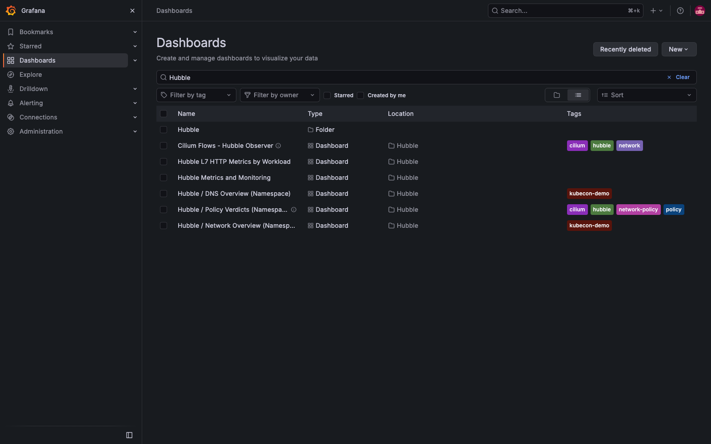
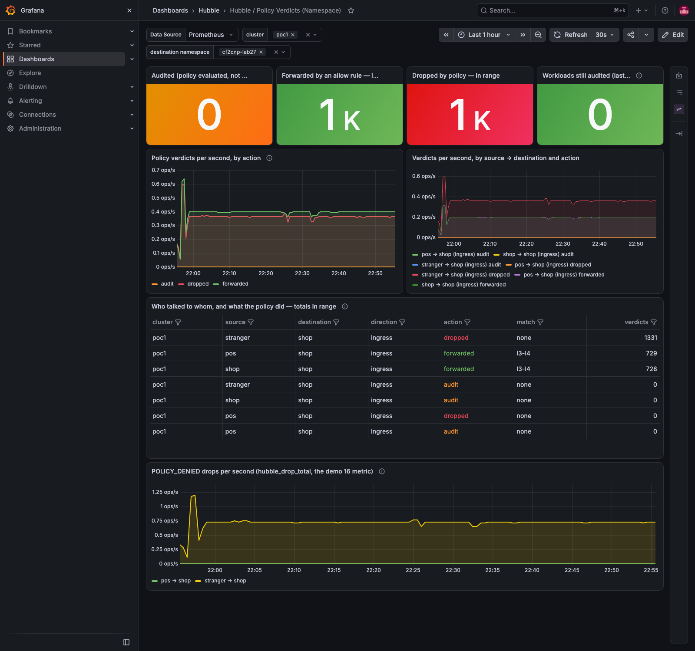
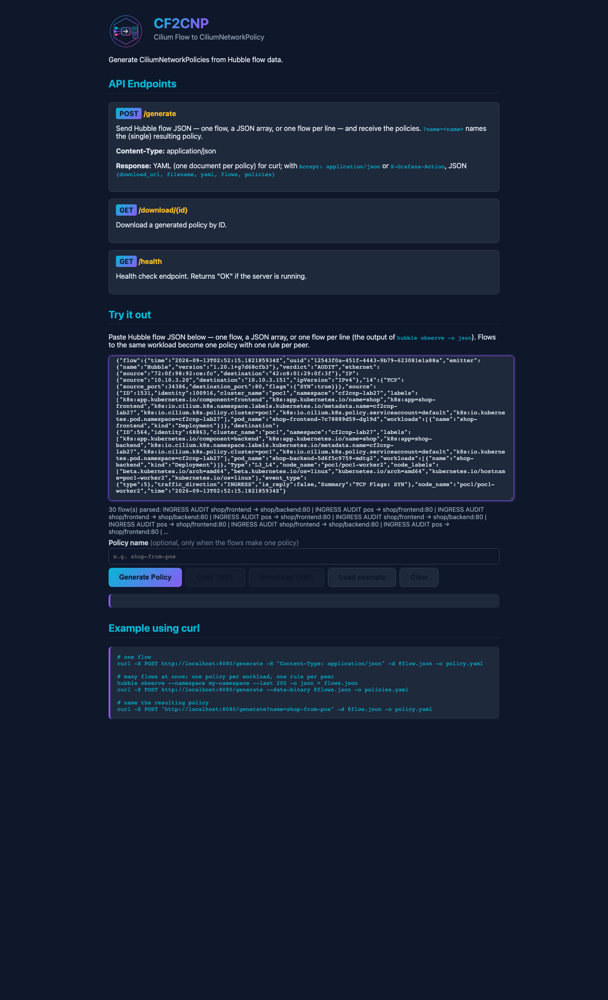

# Demo 28 — the Policy Verdicts dashboard, made enterprise-ready: its own repository and chart, a dependency of the observer chart, offered upstream; and cf2cnp 0.5.1

**Where this sits in the whole:** [OBSERVABILITY-ARCHITECTURE.md](../../OBSERVABILITY-ARCHITECTURE.md). The dashboard was
born in [demo 26 Part 10](../26-cf2cnp-policy-from-flows/README.md#part-10--our-own-policy-dashboard-from-the-verdict-metric)
and put to work in [demo 27](../27-cf2cnp-release/README.md).

## Summary context

Until this demo the *Hubble / Policy Verdicts (Namespace)* dashboard lived in exactly one place: a JSON file
and a shell script in this PoC, the script wrapping the JSON in a sidecar ConfigMap by hand. It was in
neither fork, nothing depended on it, and nobody else could install it (Part 0 measures that). An
enterprise-ready deliverable is the opposite of that: **its own repository, a versioned Helm chart with
both delivery paths (the Grafana sidecar and the Grafana Operator), released and served from GitHub
Pages, consumable as a dependency by the chart that ships the neighbouring dashboard, and offered to
that chart's author.** This demo does each of those, records the one bug the first release had, and
closes the small cf2cnp follow-up from demo 27 as release 0.5.1.

| Piece | What | Where |
|---|---|---|
| the repository | [ephico2real2/hubble-policy-verdicts](https://github.com/ephico2real2/hubble-policy-verdicts) (Apache-2.0): `charts/hubble-policy-verdicts` with the dashboard JSON, a sidecar ConfigMap template, a `GrafanaDashboard` template, a README with the Cilium values the panels need | GitHub |
| the release | chart 0.1.1 on `https://ephico2real2.github.io/hubble-policy-verdicts` (`index.yaml`, `gh-pages`) and GitHub release `hubble-policy-verdicts-0.1.1` with the archive; `helm/chart-releaser-action` on push to `main`; a CI job that lints and renders the chart both ways **and under a camelCase alias** | Parts 1, 2b |
| the consumer | the hubble-observer fork's chart (`develop`): dependency `hubble-policy-verdicts` with `alias: policyVerdictsDashboard`, `condition: policyVerdictsDashboard.enabled`, off by default; the PoC's values turn it on into the `monitoring` namespace, folder Hubble | Part 2 |
| upstream | [onzack/hubble-observer#12](https://github.com/onzack/hubble-observer/issues/12) (the value of it, with the screenshot) and [PR #13](https://github.com/onzack/hubble-observer/pull/13) (the dependency, off by default, from a branch on upstream `main`) | Part 4 |
| cf2cnp 0.5.1 | the page's flow summary names workloads the way policies are named — `name/instance/component` (`shop/frontend → shop/backend`) — released from the fork like 0.5.0 and running here | Part 3 |

## Part 0 — where it lived

```text
demos/26-cf2cnp-policy-from-flows/30-policy-verdicts-dashboard.json    (the JSON)
demos/26-cf2cnp-policy-from-flows/dashboard.sh                         (kubectl create configmap … | apply)
NAME                               LABEL   FOLDER   MANAGED-BY
hubble-policy-verdicts-dashboard   1       Hubble   <none>            ← a ConfigMap made by hand, owned by nothing
  ephico2real2/cf2cnp          0     ← code search: no file in either fork mentions it
  ephico2real2/hubble-observer 0
```

## Part 1 — the repository, the chart, the release

The chart mirrors how hubble-observer ships its own dashboard, and adds the sidecar path the PoC's Grafana
uses (kube-prometheus-stack's sidecar: label `grafana_dashboard=1`, annotation `grafana_folder`, every
namespace watched — measured on the running Grafana before the chart was designed):

| Value | Default | Meaning |
|---|---|---|
| `nameOverride` | `hubble-policy-verdicts` | the object's name (0.1.1: never derived from the chart alias) |
| `dashboard.folder`, `dashboard.labels` | `Hubble`, `{}` | folder and extra labels |
| `sidecar.enabled`, `.label`, `.labelValue`, `.folderAnnotation`, `.namespace` | `true`, `grafana_dashboard`, `"1"`, `grafana_folder`, release ns | the ConfigMap for the Grafana sidecar |
| `grafanaOperator.enabled`, `.instanceSelector`, `.allowCrossNamespaceImport` | `false`, `{grafanaInstance: main}`, `true` | the `GrafanaDashboard` for the Grafana Operator |

The dashboard JSON is demo 26's with uid `hubble-policy-verdicts` and no PoC-specific text. The README
states the prerequisite the panels have — Hubble's `policy` dynamic metric with source/destination
contexts, the exact values block — because a dashboard that needs a metric nobody enabled is "No data" with
a nice title.

Released by `helm/chart-releaser-action` on push to `main`: a GitHub release per chart version carrying the
`.tgz`, and `index.yaml` on the `gh-pages` branch that GitHub Pages serves. Two things the first run
taught (transcript Part 1 and the repository's history): chart-releaser diffs against the previous tag or,
with none, the repository's **first commit** — a chart present in that first commit is "no change", so the
first release needs a second commit that touches the chart; and GitHub Pages builds on the push to
`gh-pages`, which happens *after* the run reports success — poll `index.yaml`, not the run.

```text
hubble-policy-verdicts/hubble-policy-verdicts   0.1.1   1.0   A Grafana dashboard for Cilium network-policy v…
hubble-policy-verdicts-0.1.1   Latest   2026-09-13   hubble-policy-verdicts-0.1.1.tgz
```

## Part 2 — a dependency of the observer chart, and the bug the first release had

In the hubble-observer fork (`develop`, and the upstream-facing branch):

```yaml
dependencies:
  - name: hubble-policy-verdicts
    alias: policyVerdictsDashboard
    version: "0.1.1"
    repository: https://ephico2real2.github.io/hubble-policy-verdicts
    condition: policyVerdictsDashboard.enabled
```

with `policyVerdictsDashboard.enabled: false` in the chart's values and `true` in the PoC's
(`demos/25-hubble-observer-loki/values-hubble-observer.yaml`, ConfigMap into `monitoring`, folder Hubble).
`chart-from-fork.sh develop` resolved both dependencies (`cf2cnp-0.5.1.tgz`, `hubble-policy-verdicts-0.1.1.tgz`).

The first deploy **failed** (transcript Part 2, kept): `ConfigMap "policyVerdictsDashboard" is invalid:
metadata.name: … a lowercase RFC 1123 subdomain`. The chart's name helper was the Helm boilerplate
`default .Chart.Name .Values.nameOverride` — and inside a dependency that carries an **alias**, `.Chart.Name`
*is the alias*. A camelCase alias became an object name. 0.1.1 names the object with a fixed lowercase
default (`nameOverride` to change it), and the repository's CI now renders the chart under a camelCase
alias and rejects any name with an upper-case letter, so the class of bug cannot ship again (gotcha #85).
The Helm release on poc1 went `failed` for that revision and `deployed` on the next.

After the fix (Part 2b), one ConfigMap made by the chart, and Grafana holding exactly one Policy Verdicts
dashboard — the chart's:

```text
NAME                     FOLDER   MANAGED-BY   CHART                           INSTANCE
hubble-policy-verdicts   Hubble   Helm         policyVerdictsDashboard-0.1.1   hubble-observer
  uid=hubble-policy-verdicts folder=Hubble title=Hubble / Policy Verdicts (Namespace)
```

(The `helm.sh/chart` label still shows the alias — it is informational and Helm's own convention; the
*name* is what the API server validates.) The hand-made ConfigMap from demo 26 was deleted, and its
`dashboard.sh` now says it is superseded and exits. Demos 26 and 27 link to the chart's uid.





## Part 3 — cf2cnp 0.5.1: the page names components

Demo 27 noted that the page's flow summary printed `shop → shop` for frontend-to-backend, because it
showed the application name only. 0.5.1 builds the summary's identity the way the policy name is built —
`name`, then `/instance` and `/component` when present — released from the fork like 0.5.0 (tag `v0.5.1`:
image, OCI chart, gh-pages chart), the hubble-observer fork's dependency bumped, the PoC on it:

```text
page summary: 30 flow(s) parsed: INGRESS AUDIT shop/frontend → shop/backend:80 | INGRESS AUDIT pos → shop/frontend:80 | …
apply hint: 30 flow(s) → 2 policies. Review it, then: kubectl apply -f ciliumnetworkpolicies-2.yaml
image=ghcr.io/ephico2real2/cf2cnp:0.5.1
```



## Part 4 — offered upstream

- **[onzack/hubble-observer#12](https://github.com/onzack/hubble-observer/issues/12)** says what the
  dashboard is and why it belongs next to this chart: the workflow the chart enables (default-deny in audit
  mode → collect → cf2cnp → apply → enforce) is that dashboard's timeline, the "did the generated policy
  do what I meant" view, with the screenshot and the two demos that built it; and offers to transfer the
  repository or contribute the JSON into the chart's own `dashboard/` directory if the author prefers.
- **[PR #13](https://github.com/onzack/hubble-observer/pull/13)**, from a branch on upstream `main` that
  carries only the dependency (off by default) and a README section: nothing changes when it is off,
  `helm lint` clean.

## What to take away

- **A deliverable has an address.** A JSON file in a tutorial is a demo; a chart in a repository with a
  release, an index, a README that names its prerequisite, and CI is something another team can depend on.
- **Both delivery paths, or it is not portable.** Sidecar ConfigMap and Grafana Operator CR are the two
  ways Grafana gets dashboards in the wild; the chart renders either.
- **Test the shape your consumer will use.** The chart rendered fine on its own; the bug appeared only as
  an aliased dependency. The CI now renders it that way.
- **Release pipelines have their own first-run traps.** chart-releaser's diff base and Pages' build timing
  each cost a wait; both are written down.
- **Offer it, do not just publish it.** The issue states the value; the PR makes saying yes one click.

## Evidence

Captured 2026-09-13 with `scripts/evidence/capture.js` and `scripts/evidence/collect.sh`
([`output/evidence.txt`](output/evidence.txt): the two Helm repositories' versions, the dashboard ConfigMaps
and their chart labels, the Helm release and the cf2cnp image). The page images are from demo 26's
`ui-generate.js` with `SHOTS_DIR` here.

**grafana hubble folder** — Grafana's dashboard browser filtered to Hubble


**grafana policy verdicts from chart** — the chart-provisioned dashboard, uid `hubble-policy-verdicts`


**the 0.5.1 page** — [`ui-1-empty.png`](output/screenshots/ui-1-empty.png), [`ui-2-pasted.png`](output/screenshots/ui-2-pasted.png), [`ui-3-generated.png`](output/screenshots/ui-3-generated.png)

**Release and pods** (from `output/evidence.txt`):

```console
$ helm search repo hubble-policy-verdicts --versions; helm search repo cf2cnp-fork --versions
hubble-policy-verdicts/hubble-policy-verdicts   0.1.1   1.0     A Grafana dashboard for Cilium network-policy v…
hubble-policy-verdicts/hubble-policy-verdicts   0.1.0   1.0     A Grafana dashboard for Cilium network-policy v…
cf2cnp-fork/cf2cnp                              0.5.1   0.5.1   A Helm chart for CF2CNP - Cilium Flow to Cilium…
cf2cnp-fork/cf2cnp                              0.5.0   0.5.0   A Helm chart for CF2CNP - Cilium Flow to Cilium…

$ kubectl --context kind-poc1 -n hubble-observer get deploy hubble-observer-cf2cnp -o jsonpath='image=…'
image=ghcr.io/ephico2real2/cf2cnp:0.5.1
```
