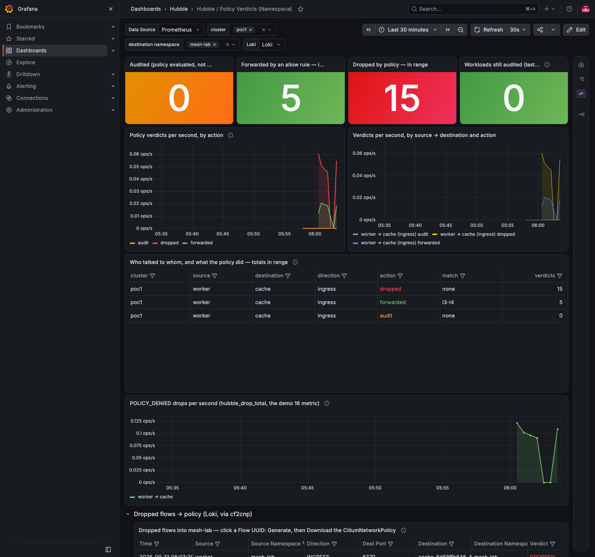
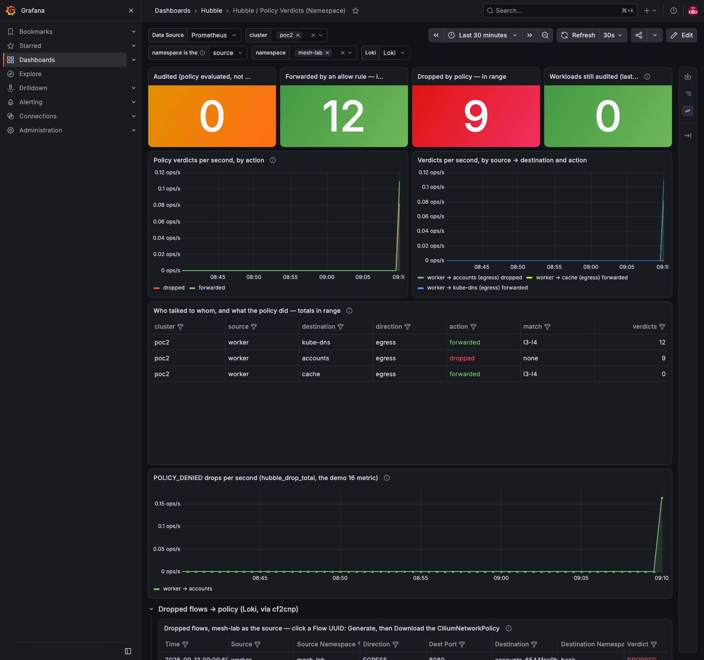

# Demo 29 — policy from a cross-cluster flow: the caller's cluster in the selector (E1), and its verdict on the hub's dashboard (E9)

**Where this sits in the whole:** [OBSERVABILITY-ARCHITECTURE.md](../../OBSERVABILITY-ARCHITECTURE.md). This is the
first demo of [enhancement 001](../../enhancements/001-policy-from-flows-enterprise.md): it runs the released
cf2cnp 0.6.0 (the fork, [`v0.6.0`](https://github.com/ephico2real2/cf2cnp/releases/tag/v0.6.0)) on the mesh
that demos 07 and 24 built, and proves items E1 and E9. The generation workflow is demo 26's, unchanged.

## Summary context — the enterprise case

A platform team runs one Cilium ClusterMesh: a *hub* cluster with shared services (here a cache in poc1)
and *spoke* clusters whose workloads call them (a batch worker in poc2) through global services. Policies are
generated from observed traffic. Since Cilium 1.19 a `fromEndpoints` selector without the
`io.cilium.k8s.policy.cluster` label selects endpoints of the **local cluster only**
(`clustermesh.policyDefaultLocalCluster=true`, [policy.rst v1.20.1 lines 49–56](https://raw.githubusercontent.com/cilium/cilium/v1.20.1/Documentation/network/clustermesh/policy.rst)),
and cf2cnp up to 0.5.1 dropped that label from the flow. The generated policy was then wrong in *both*
directions: it shut out the spoke's worker that actually called, and it admitted any pod at home that
happened to carry the same labels. Part 6 measures exactly that with the two versions side by side.

E9 is the other half of running a mesh from one place: a policy applied in a spoke is decided in the spoke,
and its verdicts have to land on the hub's Grafana under that spoke's name. Part 7 applies the generated egress
policy in poc2 and reads the verdict through poc1's Prometheus and the Policy Verdicts dashboard's `cluster`
variable.

| Piece | What | Where |
|---|---|---|
| the release | cf2cnp 0.6.0: chart 0.6.0 on the fork's Helm repository, image `ghcr.io/ephico2real2/cf2cnp:0.6.0`, four binaries + checksums on the tag (E10) | Part 0 |
| the consumer | the hubble-observer fork `develop` `e5077dd`: dependencies cf2cnp 0.6.0 and hubble-policy-verdicts 0.2.0; deployed on poc1 as release revision 23 | Part 0 |
| the metric | Hubble's `policy` metric enabled on poc2 (demo 16's values re-applied by demo 22's script) | Part 1 |
| the lab | `mesh-lab` in both clusters: `cache` (redis) in poc1 behind a global Service, `worker` in poc2 and a same-labelled twin in poc1 | Part 2 |
| the proof | 0.5.1 vs 0.6.0 on the same flows; each enforced in turn; the verdicts of the poc2 policy on the hub | Parts 5–7 |

## Part 0 — the release the cluster runs

```bash
gh release view v0.6.0 -R ephico2real2/cf2cnp --json tagName,assets
curl -s https://ephico2real2.github.io/cf2cnp/index.yaml | grep -E "^ *version:" | head -3
curl -s https://ephico2real2.github.io/hubble-policy-verdicts/index.yaml | grep -E "^ *version:" | head -3
demos/25-hubble-observer-loki/chart-from-fork.sh develop e5077dd
```

```text
cf2cnp: v0.6.0 cf2cnp_0.6.0_checksums.txt cf2cnp_0.6.0_darwin_amd64.tar.gz cf2cnp_0.6.0_darwin_arm64.tar.gz cf2cnp_0.6.0_linux_amd64.tar.gz cf2cnp_0.6.0_linux_arm64.tar.gz
chart:   version: 0.6.0 version: 0.5.1 version: 0.5.0
hubble-policy-verdicts:  version: 0.2.0 version: 0.1.1 version: 0.1.0
fork: https://github.com/ephico2real2/hubble-observer.git  branch: develop  commit: e5077dd chart: cf2cnp 0.6.0 and hubble-policy-verdicts 0.2.0
dependencies: cf2cnp-0.6.0.tgz hubble-policy-verdicts-0.2.0.tgz
STATUS: deployed
REVISION: 23
hubble-observer-cf2cnp-6c5f5f6f46-dcb9h   ghcr.io/ephico2real2/cf2cnp:0.6.0   true
the page through the Gateway (cf2cnp.poc.local): id="dnsVisibility" id="l7" id="peers" id="token"
the dashboard ConfigMap (chart 0.2.0): panels 10 | ['Dropped flows → policy (Loki, via cf2cnp)', 'Dropped flows into $namespace — …']
vars ['DS_PROMETHEUS', 'cluster', 'namespace', 'DS_LOKI', 'cf2cnpURL']
```

The image was pulled from the public package and `kind load`-ed as demos 27 and 28 did; the chart came through
the fork's Helm repository as the observer chart's dependency
([`values-hubble-observer.yaml`](../25-hubble-observer-loki/values-hubble-observer.yaml): tag `0.6.0`, and
`policyVerdictsDashboard.lokiRow` on for demo 34). The page's four new controls (`l7`, `dnsVisibility`,
`peers`, `token`) belong to demos 30–33; this demo uses the API.

## Part 1 — E9's prerequisite: the policy metric on poc2

Demo 22 delivered poc2's Cilium metrics to poc1's Prometheus, but demo 26 enabled Hubble's `policy` metric on
poc1 only. Demo 22's script re-applies demo 16's values file (which carries the metric since demo 26) with the
cluster label rewritten, so poc2 now exports `hubble_policy_verdicts_total` too.

```bash
grep -n "name: policy" demos/16-monitoring/values-cilium-metrics.yaml | head -2
demos/22-multicluster-observability/apply-poc2.sh
```

```text
77:          - name: policy     # demo 26: policy verdicts as a metric (hubble_policy_verdicts_total,
  cluster=poc2 relabelings: 7
Release "cilium" has been upgraded. Happy Helming!
daemon set "cilium" successfully rolled out
SERVICEMONITOR          PORT
hubble                  hubble-metrics
```

(The agents restart once — the same rollout demo 22 documents.)

## Part 2 — the lab, in both clusters

[`10-lab.yaml`](10-lab.yaml) goes to both clusters (a global service needs the Service in each);
[`11-cache-poc1.yaml`](11-cache-poc1.yaml) puts the only backend in poc1. `worker` exists twice on purpose: the
one in poc2 is the real caller, the one in poc1 is its twin with the **same labels** — the pod a cluster-blind
selector admits instead.

```bash
kubectl --context kind-poc1 apply -f demos/29-cross-cluster-policy/10-lab.yaml -f demos/29-cross-cluster-policy/11-cache-poc1.yaml
kubectl --context kind-poc2 apply -f demos/29-cross-cluster-policy/10-lab.yaml
```

```text
== poc1
cache-6d88ffb646-4nbtg Running 10.10.3.235 poc1-worker2
worker Running 10.10.3.208 poc1-worker2
cache 10.11.41.102 global=true
== poc2
worker Running 10.20.1.153 poc2-worker
cache 10.21.102.207 global=true
```

## Part 3 — the calls, and what each node records

```bash
for c in poc2 poc1; do kubectl --context kind-$c -n mesh-lab exec worker -- sh -c 'for i in 1 2 3; do redis-cli -h cache PING; done'; done
demos/29-cross-cluster-policy/flows-summary.sh mesh-lab 400
```

```text
worker@poc2 → cache: PONG PONG PONG
worker@poc1 → cache: PONG PONG PONG
node                direction  source@cluster → destination@cluster:port              verdict    type  n
poc2/poc2-worker    EGRESS     worker@poc2 → coredns-879947797-f4bdb@poc2:53    FORWARDED L3_L4 2
poc1/poc1-worker2   EGRESS     worker@poc2 → cache-6d88ffb646-4nbtg@poc1:6379  FORWARDED L3_L4 15
poc2/poc2-worker    EGRESS     worker@poc2 → cache-6d88ffb646-4nbtg@poc1:6379  FORWARDED L3_L4 15
poc1/poc1-worker2   EGRESS     worker@poc1 → cache-6d88ffb646-4nbtg@poc1:6379  FORWARDED L3_L4 15
```

Both sides of the mesh report the poc2 call — poc2's node as the worker's egress, poc1's node as the packets
arriving at the cache — and every flow names both clusters (`worker@poc2 → cache@poc1`). Note what is *not*
there: no `INGRESS` flow. Without a policy on the cache, its node only has trace events, and a trace event's
direction is derived from the emitting endpoint and the reply bit
([`parser.go` v1.20.1 lines 747–770](https://raw.githubusercontent.com/cilium/cilium/v1.20.1/pkg/hubble/parser/threefour/parser.go)) —
here `EGRESS` at `TO_ENDPOINT`. The flows that carry `INGRESS` are the policy-verdict events (lines 771–776,
`pvn.IsTrafficIngress()`), which exist once a policy selects the endpoint. That is why demo 26 starts with a
default-deny in audit mode, and so does Part 4.

## Part 4 — default-deny under audit, and the AUDIT flows from both sides

```bash
NS=mesh-lab demos/26-cf2cnp-policy-from-flows/audit-mode.sh cache Enabled
kubectl --context kind-poc1 apply -f demos/29-cross-cluster-policy/20-cache-default-deny-ingress.yaml
for c in poc2 poc1; do kubectl --context kind-$c -n mesh-lab exec worker -- sh -c 'for i in 1 2 3; do timeout 5 redis-cli -h cache PING; done'; done
hubble observe -P --kube-context kind-poc1 --to-pod mesh-lab/cache --port 6379 --last 200 -o json > policies/flows-cache-all.ndjson
hubble observe -P --kube-context kind-poc1 --from-pod mesh-lab/worker --node-name "poc2/*" --last 200 -o json   # → policies/flows-worker-poc2.ndjson (requests only)
```

```text
endpoint 703 (cep-name:mesh-lab/cache-6d88ffb646-4nbtg on poc1-worker2): PolicyAuditMode=Enabled
worker@poc2 → cache: PONG PONG PONG
worker@poc1 → cache: PONG PONG PONG
n  node / source@cluster / direction / observation point / event_type / verdict / denied_by
15 poc1/poc1-worker2 worker@poc1 EGRESS TO_ENDPOINT 4 FORWARDED
3 poc1/poc1-worker2 worker@poc1 INGRESS - 5 AUDIT
15 poc1/poc1-worker2 worker@poc2 EGRESS TO_ENDPOINT 4 FORWARDED
3 poc1/poc1-worker2 worker@poc2 INGRESS - 5 AUDIT
15 poc2/poc2-worker worker@poc2 EGRESS TO_OVERLAY 4 FORWARDED
worker@poc2 EGRESS request flows kept (poc2-worker):
  2 ('coredns-879947797-f4bdb@poc2', 53, 'FORWARDED')
  15 ('cache-6d88ffb646-4nbtg@poc1', 6379, 'FORWARDED')
  1 ('coredns-879947797-k8xkh@poc2', 53, 'FORWARDED')
```

Three `INGRESS AUDIT` verdicts per caller (one per connection, event type 5), nobody cut off, and the
`denied_by` empty as gotcha #82 says a default-deny leaves it. The second capture keeps worker@poc2's own egress
requests as its node saw them: DNS to kube-dns in poc2 and the cache in poc1 — the input for its policy in Part 7.

## Part 5 — the same three flows through 0.6.0 and through 0.5.1

The cache's policy is generated from the **poc2 caller's** AUDIT flows only — the twin is not a client, and
filtering by intent before generating is demo 27's lesson. 0.6.0 answers through the Gateway (the deployed
one); 0.5.1 is the released image run locally on the same bytes.

```bash
python3 … flows-cache-all.ndjson → policies/flows-cache-from-poc2.ndjson     # verdict AUDIT, INGRESS, source.cluster_name == poc2
demos/26-cf2cnp-policy-from-flows/generate.sh demos/29-cross-cluster-policy/policies/flows-cache-from-poc2.ndjson demos/29-cross-cluster-policy/policies/cnp-cache-0.6.0.yaml
docker run -d --rm --name cf2cnp-0.5.1 -p 127.0.0.1:28080:8080 ghcr.io/ephico2real2/cf2cnp:0.5.1
curl -s --fail-with-body -X POST http://127.0.0.1:28080/generate --data-binary @demos/29-cross-cluster-policy/policies/flows-cache-from-poc2.ndjson -o demos/29-cross-cluster-policy/policies/cnp-cache-0.5.1.yaml
diff demos/29-cross-cluster-policy/policies/cnp-cache-0.5.1.yaml demos/29-cross-cluster-policy/policies/cnp-cache-0.6.0.yaml
```

```text
AUDIT INGRESS flows from poc2 kept: 3 (the twin in poc1 is not a client — its flows are left out on purpose)
source.cluster_name: poc2 | source labels: ['k8s:app.kubernetes.io/component=batch', 'k8s:app.kubernetes.io/name=worker', …, 'k8s:io.cilium.k8s.policy.cluster=poc2']
http=200 → demos/29-cross-cluster-policy/policies/cnp-cache-0.6.0.yaml
0.5.1 (the image, run locally): 24 lines of YAML
20a21
>             io.cilium.k8s.policy.cluster: poc2
```

One line differs. [`cnp-cache-0.6.0.yaml`](policies/cnp-cache-0.6.0.yaml):

```yaml
metadata:
  name: cache-server            # name + component, the demo 27 rule
  labels: {app.kubernetes.io/component: server, app.kubernetes.io/managed-by: cf2cnp, app.kubernetes.io/name: cache}
spec:
  endpointSelector: {matchLabels: {app.kubernetes.io/component: server, app.kubernetes.io/name: cache}}
  ingress:
    - fromEndpoints:
        - matchLabels:
            app.kubernetes.io/component: batch
            app.kubernetes.io/name: worker
            io.cilium.k8s.policy.cluster: poc2      # ← E1: the caller's cluster, because it differs from the cache's
      toPorts: [{ports: [{port: "6379", protocol: TCP}]}]
```

The label is written only when source and destination clusters differ and both are known (the plan's rule, the
reviewers' C7). The egress policy for the worker, from its own flows, shows the other side of it —
[`cnp-worker-poc2.yaml`](policies/cnp-worker-poc2.yaml): `toEndpoints` kube-dns **without** a cluster label
(same cluster as the worker) and the cache **with** `io.cilium.k8s.policy.cluster: poc1`, "2 rules merged from
2 observed flows".

## Part 6 — the trap, measured: 0.5.1's policy enforced, then 0.6.0's

Audit off, the 0.5.1 policy applied, one call from each worker; then the 0.6.0 policy (same name — `kubectl
apply` replaces it, as demo 27 measured) and the calls again. `verdicts.sh` prints the policy-verdict events
with the policy that decided.

```bash
NS=mesh-lab demos/26-cf2cnp-policy-from-flows/audit-mode.sh cache Disabled
kubectl --context kind-poc1 apply -f demos/29-cross-cluster-policy/policies/cnp-cache-0.5.1.yaml
for c in poc2 poc1; do … timeout 5 redis-cli -h cache PING; echo rc=$? …; done
demos/29-cross-cluster-policy/verdicts.sh 100
kubectl --context kind-poc1 apply -f demos/29-cross-cluster-policy/policies/cnp-cache-0.6.0.yaml
for c in poc2 poc1; do … timeout 5 redis-cli -h cache PING; echo rc=$? …; done
demos/29-cross-cluster-policy/verdicts.sh 60
```

```text
ciliumnetworkpolicy.cilium.io/cache-server created
worker@poc2 → cache: Terminated rc=143            ← the real caller, cut off
worker@poc1 → cache: PONG rc=0                    ← the twin, admitted
  5 poc1/poc1-worker2   INGRESS  worker@poc2 → cache-6d88ffb646-4nbtg@poc1:6379 DROPPED (no policy named)
  1 poc1/poc1-worker2   INGRESS  worker@poc1 → cache-6d88ffb646-4nbtg@poc1:6379 FORWARDED ingress_allowed=cache-server

ciliumnetworkpolicy.cilium.io/cache-server configured
worker@poc2 → cache: PONG rc=0                    ← the real caller, allowed by the rule
worker@poc1 → cache: Terminated rc=143            ← the twin, no rule for it
  1 poc1/poc1-worker2   INGRESS  worker@poc2 → cache-6d88ffb646-4nbtg@poc1:6379 FORWARDED ingress_allowed=cache-server
  5 poc1/poc1-worker2   INGRESS  worker@poc1 → cache-6d88ffb646-4nbtg@poc1:6379 DROPPED (no policy named)
```

Each failed call left five `DROPPED` verdicts within its five seconds. Both policies are `VALID: True`;
the cluster-blind one enforced the opposite of what was observed. This is the whole of E1: on a mesh, a policy
generated from traffic without the caller's cluster is not incomplete, it is wrong.

## Part 7 — E9: a policy applied in poc2, its verdicts on poc1's Grafana

```bash
kubectl --context kind-poc2 apply -f demos/29-cross-cluster-policy/policies/cnp-worker-poc2.yaml
kubectl --context kind-poc2 -n mesh-lab exec worker -- sh -c 'timeout 5 redis-cli -h cache PING'
kubectl --context kind-poc2 -n mesh-lab exec worker -- sh -c 'timeout 5 redis-cli -h accounts.bank.svc.cluster.local -p 80 PING'
demos/29-cross-cluster-policy/verdicts.sh 120
demos/29-cross-cluster-policy/metric.sh mesh-lab
```

```text
ciliumnetworkpolicy.cilium.io/worker-batch created
allowed by the rule:  PONG rc=0
not in the rule (accounts.bank in poc2, port 80): Terminated rc=143
  3 poc2/poc2-worker    EGRESS   worker@poc2 → coredns-879947797-f4bdb@poc2:53 FORWARDED egress_allowed=worker-batch
  1 poc2/poc2-worker    EGRESS   worker@poc2 → cache-6d88ffb646-4nbtg@poc1:6379 FORWARDED egress_allowed=worker-batch
  5 poc2/poc2-worker    EGRESS   worker@poc2 → accounts-6544fcc9b8-5qt5k@poc2:8080 DROPPED (no policy named)
cluster action    source_namespace  destination_namespace  verdicts
poc1    audit     mesh-lab          mesh-lab               6
poc1    dropped   mesh-lab          mesh-lab               10
poc1    forwarded mesh-lab          mesh-lab               3
poc2    dropped   mesh-lab          bank                   5
poc2    forwarded mesh-lab          mesh-lab               1
poc2    forwarded mesh-lab          kube-system            5
```

Three facts in one screen. The verdicts are decided **in poc2** (node `poc2/poc2-worker`), by the policy
cf2cnp generated from poc2's own flows (`egress_allowed=worker-batch`). The denied call is dropped at the
accounts pod's port `8080`, not the Service's `80`: Cilium enforces on the pod port, which is what a
generated rule must name (demo 25's PR #9 was this same fact). And poc1's Prometheus holds the series with
`cluster="poc2"` (demo 22's remote write), which is what the dashboard's `cluster` variable selects:


## Part 8 — what the dashboard shows, and one thing it does not

With `cluster=poc2`, the table names `worker → cache (egress) forwarded` and the Loki row at the bottom (chart
0.2.0, demo 34) already lists the earlier `DROPPED` flows into `mesh-lab` from the observer's stream. The
drops to `bank` are **not** on that page: the dashboard is "by namespace" through the *destination* namespace
label, and those flows left `mesh-lab` for `bank`. `metric.sh` queries both labels (`or`) and shows all six
rows; a source-or-destination variable is a candidate change for the dashboard chart, noted in the
enhancements index.

With `cluster=poc1` the same page shows the cache's side of Part 6 — audited, then dropped and forwarded as
the two policies took turns:



## Part 9 (added later the same day) — the dashboard chart 0.2.1: the namespace filter chooses its side

Part 8's gap is closed: hubble-policy-verdicts 0.2.1 adds a `namespace is the` variable (`role`: **destination**,
the default, or **source**) that every query and the Loki row go through — `${role}=~"$namespace"` — so nothing is
counted twice and the same page answers both questions. Deployed through the observer fork (`46bd41c`,
release revision 31), verified in the provisioned ConfigMap, then three more calls from worker@poc2 to the
accounts pod and the page with the namespace as the source:

```bash
demos/25-hubble-observer-loki/chart-from-fork.sh develop 46bd41c
kubectl … -n monitoring get cm hubble-policy-verdicts -o jsonpath=… | python3 …   # the variable and the queries
kubectl --context kind-poc2 -n mesh-lab exec worker -- sh -c 'for i in 1 2 3; do timeout 3 redis-cli -h accounts.bank.svc.cluster.local -p 80 PING; done'
```

```text
REVISION: 31
role variable: namespace is the -> [('destination', 'destination_namespace'), ('source', 'source_namespace')]
queries through it: 9
```



`worker → accounts (egress) dropped 9` beside the forwarded verdicts to kube-dns and the cache, and the Loki row
retitled *Dropped flows, mesh-lab as the source* with the same drop from the observer's stream. Gotcha #86 keeps
the trap; the fix is the chart's.

## Cleanup

`demos/29-cross-cluster-policy/cleanup.sh` deletes `mesh-lab` in both clusters. Part 1 (the metric on poc2)
stays, as does the 0.6.0 release on poc1.

## What to take away

- **On a mesh, the caller's cluster is part of the identity.** A selector without
  `io.cilium.k8s.policy.cluster` is local-only since 1.19; cf2cnp 0.6.0 copies the label when the clusters
  differ, and single-cluster output is byte-identical to before.
- **Generate from the caller you mean.** The twin proved that a policy can be valid, applied and enforcing the
  wrong pod. Filter by intent, then read the verdicts with the policy name.
- **Without a policy there is no INGRESS flow to learn from.** Default-deny in audit mode is not a ritual: it is
  what produces the flows that name the destination as the subject.
- **Rules name pod ports.** The drop landed on `8080` while the client dialled `80`.
- **One Grafana for the mesh.** A spoke's verdict is one variable away, provided the spoke exports the metric
  (Part 1) and remote-writes it (demo 22).

## Evidence

Captured 2026-09-13 with `scripts/evidence/capture.js` and `scripts/evidence/collect.sh`
([`output/evidence.txt`](output/evidence.txt): pods in both clusters, the policies with the cluster label they
carry, the global annotation). Every command above is in [`output/transcript.txt`](output/transcript.txt);
the flows and the four policies are under [`policies/`](policies/).

| Capture | What it shows |
|---|---|
| [`grafana-policy-verdicts-cluster-poc2.png`](output/screenshots/grafana-policy-verdicts-cluster-poc2.png) | the dashboard with `cluster=poc2`: worker@poc2's egress verdict by `worker-batch`, and the Loki row's dropped flows |
| [`grafana-policy-verdicts-cluster-poc1.png`](output/screenshots/grafana-policy-verdicts-cluster-poc1.png) | the same with `cluster=poc1`: the cache's audit, drops and forwards of Part 6 |
| [`grafana-policy-verdicts-cluster-poc2-source.png`](output/screenshots/grafana-policy-verdicts-cluster-poc2-source.png) | Part 9, chart 0.2.1: `cluster=poc2` with the namespace as the source — the drops to `bank` on the page |
