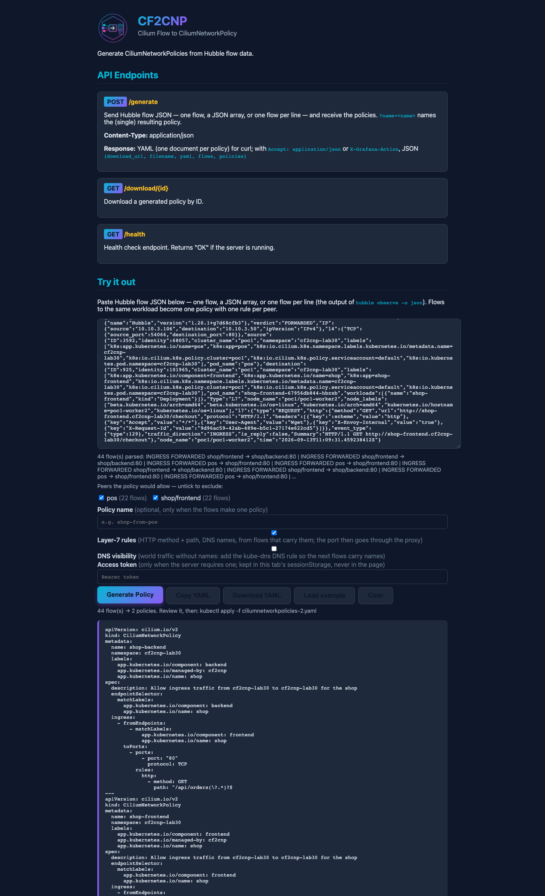
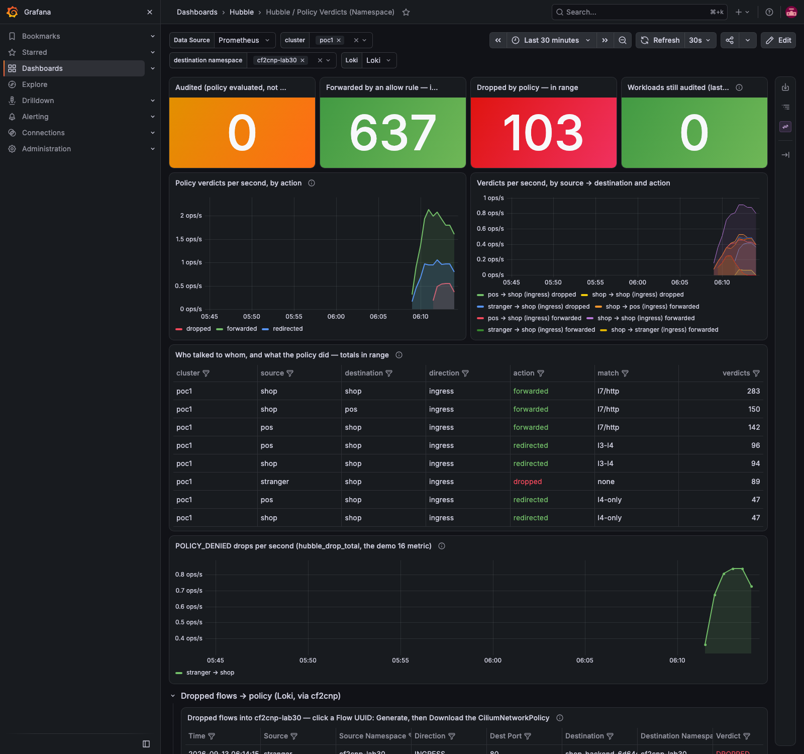
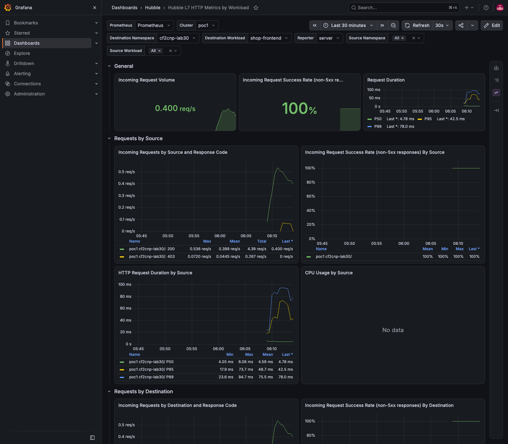

# Demo 30 — Layer-7 rules from the proxy's flows: method and path per port, generated, enforced, and measured (E2)

**Where this sits in the whole:** [OBSERVABILITY-ARCHITECTURE.md](../../OBSERVABILITY-ARCHITECTURE.md). Second demo
of [enhancement 001](../../enhancements/001-policy-from-flows-enterprise.md), on the cf2cnp 0.6.0 that
[demo 29](../29-cross-cluster-policy/README.md) deployed. Demo 27's shop lab, in its own namespace.

## Summary context — the enterprise case

An L3/L4 policy says *who* may reach a port. For an HTTP service that is rarely the intent: a point-of-sale
client may `GET /` and `GET /checkout` on the storefront, not `GET /admin`; a frontend may read
`/api/orders`, not write it. Cilium expresses this with `rules.http` (method and path regexes,
[`pkg/policy/api/http.go` v1.20.1](https://raw.githubusercontent.com/cilium/cilium/v1.20.1/pkg/policy/api/http.go)),
and a port with such a rule is served by the node-local Envoy proxy, which also reports every request to Hubble as
`flow.l7` ([layer7.rst v1.20.1 line 61](https://raw.githubusercontent.com/cilium/cilium/v1.20.1/Documentation/security/policy/layer7.rst)).
Up to 0.5.1 cf2cnp read only L3/L4 and wrote port-only rules even when the flow carried the method and the
path. 0.6.0's `--l7` (`?l7=true`, the page's *Layer-7 rules* box) turns the observed `(method, path)` pairs
into `rules.http` on the port they were seen on — and leaves ports without L7 records as they were, so the
two policies of Part 3 differ by nothing else.

The review's three corrections are visible here: the rule lives on **its** port (one port rule per port with
L7 records; a plain port stays a plain port), the path regex is anchored and escaped and **tolerates a query
string** (Envoy matches the whole `:path`, query included — `^/api/orders(\?.*)?$`), and only `REQUEST` records
produce rules.

| Piece | What | Where |
|---|---|---|
| the lab | [`10-lab.yaml`](10-lab.yaml): `shop-frontend` and `shop-backend` (nginx, a ConfigMap with real paths so every answer is a 200), `pos` calling `/` and `/checkout`, the frontend's sidecar calling `/api/orders` with and without a query, `stranger` calling `/admin` and `/api/orders` | Part 1 |
| visibility | [`20-http-visibility.yaml`](20-http-visibility.yaml): demo 16's shape on the shop — `:80` on the proxy, nothing denied | Part 1 |
| the flows | 47 HTTP flows with `l7`; 44 `REQUEST` records from the intended callers | Parts 2–3 |
| the policies | [`cnp-shop-l4.yaml`](policies/cnp-shop-l4.yaml) vs [`cnp-shop-l7.yaml`](policies/cnp-shop-l7.yaml): the diff is the `rules.http` blocks | Part 3 |
| enforcement | [`30-shop-default-deny-ingress.yaml`](30-shop-default-deny-ingress.yaml) + the L7 policies; eight calls with the status each caller saw | Part 4 |

## Part 1 — the lab, with L7 visibility

```bash
kubectl --context kind-poc1 apply -f demos/30-l7-rules/10-lab.yaml
kubectl --context kind-poc1 apply -f demos/30-l7-rules/20-http-visibility.yaml
```

```text
pos                              1/1     Running   10.10.3.106   poc1-worker2
shop-backend-6d64d6c6dc-rdr68    1/1     Running   10.10.3.54    poc1-worker2
shop-frontend-67956db844-hbzxb   2/2     Running   10.10.3.50    poc1-worker2
stranger                         1/1     Running   10.10.3.6     poc1-worker2
```

nginx answers `200` on `/`, `/checkout`, `/api/orders` and `/admin` (the ConfigMap in `10-lab.yaml`), so from
here on the only thing that can turn a `200` into a `403` is the policy.

## Part 2 — what the proxy reports

```bash
hubble observe -P --kube-context kind-poc1 --namespace cf2cnp-lab30 --protocol http --last 300 -o json > policies/flows-http-all.ndjson
demos/30-l7-rules/l7-summary.sh cf2cnp-lab30 300
```

```text
47 HTTP flows saved
  n source → destination         type      method  path                   code  direction verdict
 12 shop-frontend → shop-backend REQUEST   GET     /api/orders?id=42            INGRESS   FORWARDED
 12 shop-backend → shop-frontend RESPONSE  GET     /api/orders?id=42      200   INGRESS   FORWARDED
 12 pos → shop-frontend          REQUEST   GET     /                            INGRESS   FORWARDED
 12 pos → shop-frontend          REQUEST   GET     /checkout                    INGRESS   FORWARDED
  8 stranger → shop-frontend     REQUEST   GET     /admin                       INGRESS   FORWARDED
  8 stranger → shop-backend      REQUEST   GET     /api/orders                  INGRESS   FORWARDED
 11 shop-frontend → shop-backend REQUEST   GET     /api/orders                  INGRESS   FORWARDED
```

One record in full — the `REQUEST` side carries the method and the **full URL**, the `RESPONSE` side the code:

```json
{"traffic_direction": "INGRESS", "verdict": "FORWARDED", "Type": "L7"}
"l7": {"type": "REQUEST", "http": {"method": "GET", "url": "http://shop-backend.cf2cnp-lab30/api/orders?id=42", "protocol": "HTTP/1.1",
       "headers": [{"key": ":scheme", "value": "http"}, {"key": "Accept", "value": "*/*"}, {"key": "User-Agent", "value": "Wget"}, …]}}
```

Every L7 flow is `INGRESS` on the destination's node — the proxy sits there — which is also why the reporting
agent knows the destination workload (demo 16's gotcha #57) and why the generated policy is an ingress policy
for the shop.

## Part 3 — the same 44 flows without and with `--l7`

The intent filter is demo 27's: `REQUEST` records, the stranger left out.

```bash
python3 … flows-http-all.ndjson → policies/flows-http-intent.ndjson      # l7.type == REQUEST, source != stranger
demos/26-cf2cnp-policy-from-flows/generate.sh demos/30-l7-rules/policies/flows-http-intent.ndjson demos/30-l7-rules/policies/cnp-shop-l4.yaml
QUERY=l7=true demos/26-cf2cnp-policy-from-flows/generate.sh demos/30-l7-rules/policies/flows-http-intent.ndjson demos/30-l7-rules/policies/cnp-shop-l7.yaml
diff demos/30-l7-rules/policies/cnp-shop-l4.yaml demos/30-l7-rules/policies/cnp-shop-l7.yaml
```

```text
REQUEST records kept, stranger excluded: 44
http=200 → demos/30-l7-rules/policies/cnp-shop-l4.yaml
http=200 → demos/30-l7-rules/policies/cnp-shop-l7.yaml
24a25,28
>           rules:
>             http:
>               - method: GET
>                 path: ^/api/orders(\?.*)?$
48a53,58
>           rules:
>             http:
>               - method: GET
>                 path: ^/(\?.*)?$
>               - method: GET
>                 path: ^/checkout(\?.*)?$
```

Ten added lines, nothing else. [`cnp-shop-l7.yaml`](policies/cnp-shop-l7.yaml), the frontend's rule:

```yaml
  ingress:
    - fromEndpoints:
        - matchLabels: {app.kubernetes.io/name: pos}
      toPorts:
        - ports: [{port: "80", protocol: TCP}]
          rules:
            http:
              - {method: GET, path: ^/(\?.*)?$}
              - {method: GET, path: ^/checkout(\?.*)?$}
```

Three things to read in it. `/api/orders` and `/api/orders?id=42` became **one** rule: the path is taken from
the URL without its query, and the regex allows any query after it — Envoy matches the regex against the whole
`:path`, query included, so a rule that ignored this would have blocked `?id=42` the moment it was enforced
(the review's C4/C8). The regex is anchored and `QuoteMeta`-escaped: `/checkout` cannot match
`/checkout-admin`. And the rule is on the port that carried the records; a port with plain L4 flows from the
same peer would stay a plain port rule beside it.

## Part 4 — enforce, and probe every case

The visibility policy goes, the default-deny and the two generated policies come.

```bash
kubectl --context kind-poc1 delete -f demos/30-l7-rules/20-http-visibility.yaml
kubectl --context kind-poc1 apply -f demos/30-l7-rules/30-shop-default-deny-ingress.yaml -f demos/30-l7-rules/policies/cnp-shop-l7.yaml
demos/30-l7-rules/calls.sh
demos/30-l7-rules/l7-summary.sh cf2cnp-lab30 200
hubble observe -P --kube-context kind-poc1 --namespace cf2cnp-lab30 --verdict DROPPED --last 6
```

```text
pos        shop-frontend.cf2cnp-lab30/                     HTTP/1.1 200 OK rc=0
pos        shop-frontend.cf2cnp-lab30/checkout             HTTP/1.1 200 OK rc=0
pos        shop-frontend.cf2cnp-lab30/checkout?promo=1     HTTP/1.1 200 OK rc=0         ← a query string never seen: allowed
pos        shop-frontend.cf2cnp-lab30/admin                HTTP/1.1 403 Forbidden rc=0  ← a path never seen: the proxy says no
shop-frontend-67956db844-hbzxb shop-backend.cf2cnp-lab30/api/orders?id=7       HTTP/1.1 200 OK rc=0
shop-frontend-67956db844-hbzxb shop-backend.cf2cnp-lab30/admin                 HTTP/1.1 403 Forbidden rc=0
stranger   shop-frontend.cf2cnp-lab30/                   rc=1                            ← no rule at all: no answer
stranger   shop-backend.cf2cnp-lab30/api/orders          rc=1

  1 pos → shop-frontend          REQUEST   GET     /admin                       INGRESS   DROPPED
  1 shop-frontend → pos          RESPONSE  GET     /admin                 403   INGRESS   FORWARDED
  1 shop-frontend → shop-backend REQUEST   GET     /api/orders?id=7             INGRESS   FORWARDED
  1 shop-frontend → shop-backend REQUEST   GET     /admin                       INGRESS   DROPPED
  1 shop-backend → shop-frontend RESPONSE  GET     /admin                 403   INGRESS   FORWARDED

Sep 13 11:10:53.699: cf2cnp-lab30/stranger:45864 (ID:124395) <> cf2cnp-lab30/shop-frontend-…:80 (ID:101965) policy-verdict:none TRAFFIC_DIRECTION_UNKNOWN DENIED (TCP Flags: SYN)
Sep 13 11:10:53.699: cf2cnp-lab30/stranger:45864 (ID:124395) <> cf2cnp-lab30/shop-frontend-…:80 (ID:101965) Policy denied DROPPED (TCP Flags: SYN)
```

Two kinds of "no", from two layers. A caller with an L3/L4 rule whose request matches no L7 rule gets a
**`403` from the proxy** (nginx never saw the request; the `RESPONSE` record is the proxy's own) and Hubble
records the `REQUEST` as `DROPPED`. A caller with no rule at all is **dropped at the SYN** by the datapath, as in
every demo since 02. The client sees the difference too: `rc=0` with a status line versus a timeout.

## Part 5 — the page

Demo 26's page script, with the new `L7=1` switch ticking the *Layer-7 rules* box:

```bash
SHOTS_DIR=demos/30-l7-rules/output/screenshots L7=1 GW=… node demos/26-cf2cnp-policy-from-flows/ui-generate.js demos/30-l7-rules/policies/flows-http-intent.ndjson
```

```text
44 flow(s) → 2 policies. Review it, then: kubectl apply -f ciliumnetworkpolicies-2.yaml
```



The peer checklist above the box (`pos (22 flows)`, `shop/frontend (22 flows)`) is E4, demo 32's subject.

## Part 6 — the metrics

```bash
demos/30-l7-rules/metric.sh cf2cnp-lab30
```

```text
== sum by (action, match) (hubble_policy_verdicts_total{destination_namespace="cf2cnp-lab30"})
   action=dropped match=l7/http 16
   action=dropped match=none 122
   action=forwarded match=l7/http 764
   action=redirected match=l3-l4 260
   action=redirected match=l4-only 130
== sum by (status, destination_workload, reporter) (hubble_http_requests_total{destination_namespace="cf2cnp-lab30"})
   destination_workload=shop-backend reporter=server status=200 185
   destination_workload=shop-backend reporter=server status=403 8
   destination_workload=shop-frontend reporter=server status=200 189
   destination_workload=shop-frontend reporter=server status=403 8
```

The proxy's decisions are policy verdicts too — `hubble_policy_verdicts_total{match="l7/http"}` — so the Policy
Verdicts dashboard shows them next to the datapath's (`match="none"` for the stranger's drops, `redirected` for
the packets handed to the proxy). Hubble's L7 HTTP dashboard shows the `403`s as a status series of the
frontend:





## Cleanup

`demos/30-l7-rules/cleanup.sh` — deletes `cf2cnp-lab30`; `output/` and `policies/` stay.

## What to take away

- **L7 intent needs L7 evidence.** Only the proxy reports method and path; a visibility policy (nothing denied)
  is how you get the evidence before you have the rule.
- **Generate the rule on its port, from requests only.** Responses carry the status, not the intent; a plain
  port beside an L7 port stays plain.
- **The query string is part of `:path`.** An anchored regex without `(\?.*)?` blocks the first `?id=` in
  production. Measured here: `/checkout?promo=1` allowed, `/api/orders?id=7` allowed.
- **Two layers, two answers.** A `403` is a policy decision on a connection that was allowed; a dropped SYN is a
  connection that never was. Read both in Hubble, and both are on the verdict dashboard.
- **The rule is the intent, so review it.** `/admin` was denied because nobody called it during observation —
  which is right for pos, and something to add by hand if an admin client exists.

## Evidence

Captured 2026-09-13 with `scripts/evidence/capture.js`, `scripts/evidence/collect.sh`
([`output/evidence.txt`](output/evidence.txt): pods, the policies with their L7 paths, the eight calls) and
demo 26's page script. Every command above is in [`output/transcript.txt`](output/transcript.txt); the flows
and both policies are under [`policies/`](policies/).

| Capture | What it shows |
|---|---|
| [`grafana-policy-verdicts-cf2cnp-lab30.png`](output/screenshots/grafana-policy-verdicts-cf2cnp-lab30.png) | forwarded/dropped with `match = l7/http`, the stranger's `none`, `redirected` for the proxy hand-off |
| [`grafana-l7-http-shop-frontend.png`](output/screenshots/grafana-l7-http-shop-frontend.png) | Hubble L7 HTTP metrics: `200` and `403` series for the frontend |
| [`ui-1-empty.png`](output/screenshots/ui-1-empty.png), [`ui-2-pasted.png`](output/screenshots/ui-2-pasted.png), [`ui-3-generated.png`](output/screenshots/ui-3-generated.png) | the page: 44 flows pasted, the Layer-7 box ticked, both policies with `rules.http` |
