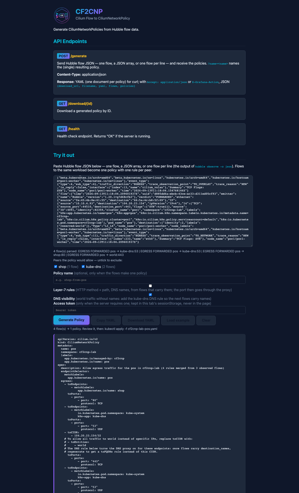
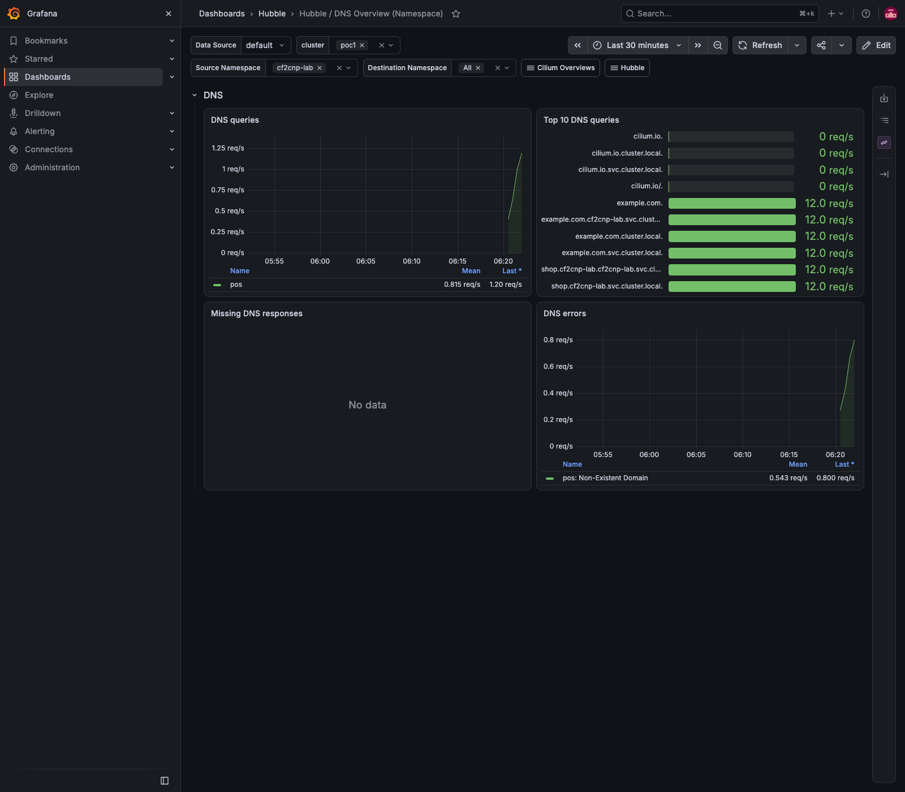

# Demo 31 — DNS visibility on demand: from a CIDR nobody wants to `toFQDNs`, in two generations (E3)

**Where this sits in the whole:** [OBSERVABILITY-ARCHITECTURE.md](../../OBSERVABILITY-ARCHITECTURE.md). Third demo
of [enhancement 001](../../enhancements/001-policy-from-flows-enterprise.md), on demo 26's lab and the cf2cnp 0.6.0
that [demo 29](../29-cross-cluster-policy/README.md) deployed. It closes the open end of
[demo 26 Part 3](../26-cf2cnp-policy-from-flows/README.md#part-3--the-ingress-problem-in-this-capture-nothing-reported-ingress):
`example.com` came out as `toCIDR: 104.20.23.154/32`.

## Summary context — the enterprise case

Egress to the internet is where generated policies go wrong quietly. A flow to a CDN carries an IP, the IP
becomes a `toCIDR`, and the policy is correct until the CDN rotates — then it blocks production. The right rule
is `toFQDNs: example.com`, but Cilium can only write it when the flow carries `destination_names`, and it only
does that for endpoints whose lookups pass through the **DNS proxy**, which an L7 `rules.dns` policy turns on
([layer3.rst v1.20.1 lines 502–506](https://raw.githubusercontent.com/cilium/cilium/v1.20.1/Documentation/security/policy/layer3.rst)).
A team that has never written that rule never sees a name, and every world policy it generates is a CIDR.

E3 is the missing step, done by the tool: `--dns-visibility` (`?dnsVisibility=true`, the page's *DNS visibility*
box) adds the kube-dns rule (`53/UDP`, `matchPattern: "*"`) to a policy whose world destinations have no names,
with a comment saying what to do next. Apply it, and the next flows carry the names; regenerate — no option
this time — and the CIDR is a `toFQDNs`. Two generations, one lab, measured below.

| Piece | What | Where |
|---|---|---|
| the lab | demo 26's `cf2cnp-lab`: `pos` calls `shop` and `https://example.com` every 5 s | Part 1 |
| the flows | pos's four egress requests (two kube-dns pods, shop, the world) — `names=-` on the world flow | Part 1 |
| the policies | [`cnp-pos-egress.yaml`](policies/cnp-pos-egress.yaml) (CIDR) → [`cnp-pos-dns-visibility.yaml`](policies/cnp-pos-dns-visibility.yaml) (+ the DNS rule) → [`cnp-pos-fqdn.yaml`](policies/cnp-pos-fqdn.yaml) (`toFQDNs`) | Parts 1–2 |
| enforcement | example.com answers; cilium.io resolves and is dropped, by name | Part 3 |
| a finding | the kube-dns rule twice — [ephico2real2/cf2cnp#1](https://github.com/ephico2real2/cf2cnp/issues/1) | Part 1 |

## Part 1 — pos today: the world by IP, and the two policies the same flows make

`egress-flows.sh` keeps the latest EGRESS request per destination and port (replies skipped) and prints the
names Hubble attached, if any.

```bash
demos/31-dns-visibility/egress-flows.sh cf2cnp-lab/pos demos/31-dns-visibility/policies/flows-pos-egress.ndjson 300
demos/26-cf2cnp-policy-from-flows/generate.sh demos/31-dns-visibility/policies/flows-pos-egress.ndjson demos/31-dns-visibility/policies/cnp-pos-egress.yaml
QUERY=dnsVisibility=true demos/26-cf2cnp-policy-from-flows/generate.sh demos/31-dns-visibility/policies/flows-pos-egress.ndjson demos/31-dns-visibility/policies/cnp-pos-dns-visibility.yaml
diff demos/31-dns-visibility/policies/cnp-pos-egress.yaml demos/31-dns-visibility/policies/cnp-pos-dns-visibility.yaml
```

```text
kept 4 request flows -> demos/31-dns-visibility/policies/flows-pos-egress.ndjson
  coredns-789c5fbdb4-qhj2d:53/UDP  ip=10.10.1.35       names=-  FORWARDED
  coredns-789c5fbdb4-vb8r9:53/UDP  ip=10.10.0.232      names=-  FORWARDED
  shop-6d7d797759-4ddlt:80/TCP  ip=10.10.3.7        names=-  FORWARDED
  reserved:world:443/TCP  ip=104.20.23.154    names=-  FORWARDED
10c10
<   description: Allow egress traffic for the pos in cf2cnp-lab (3 rules merged from 3 observed flows)
---
>   description: Allow egress traffic for the pos in cf2cnp-lab (4 rules merged from 3 observed flows)
40a41,51
>     - toEndpoints:
>         - matchLabels:
>             io.kubernetes.pod.namespace: kube-system
>             k8s-app: kube-dns
>       toPorts:
>         - ports:
>             - port: "53"
>               protocol: UDP
>           rules:
>             dns:
>               - matchPattern: '*'
```

The whole of pos's egress is captured on purpose — DNS, the shop, the world — so the generated policy is one
the pod can live under (an egress policy from the world flow alone would have cut pos off from `shop`).
[`cnp-pos-dns-visibility.yaml`](policies/cnp-pos-dns-visibility.yaml), the world rule with the tool's comment:

```yaml
    - toCIDR:
        - 104.20.23.154/32
    # To allow all traffic to world instead of specific IPs, replace toCIDR with:
    # - toEntities:
    #     - world
    # The DNS rule below turns the DNS proxy on for these endpoints: once flows carry destination_names,
    # regenerate to get a toFQDNs rule instead of this CIDR.
      toPorts:
        - ports: [{port: "443", protocol: TCP}]
```

**A finding, kept.** The policy carries kube-dns `53/UDP` twice: once as the plain L4 rule the DNS flows
produced, once as the L7 rule E3 appended. Cilium accepts it and it works (Part 2 proves the proxy is on), so it
is noise rather than a defect — filed as [ephico2real2/cf2cnp#1](https://github.com/ephico2real2/cf2cnp/issues/1)
for 0.6.1: set `rules.dns` on the existing kube-dns rule instead of appending one.

## Part 2 — apply it, and the names arrive

```bash
kubectl --context kind-poc1 apply -f demos/31-dns-visibility/policies/cnp-pos-dns-visibility.yaml
hubble observe -P --kube-context kind-poc1 --from-pod cf2cnp-lab/pos --protocol dns --last 6
demos/31-dns-visibility/egress-flows.sh cf2cnp-lab/pos demos/31-dns-visibility/policies/flows-pos-egress-named.ndjson 120
demos/26-cf2cnp-policy-from-flows/generate.sh demos/31-dns-visibility/policies/flows-pos-egress-named.ndjson demos/31-dns-visibility/policies/cnp-pos-fqdn.yaml
diff demos/31-dns-visibility/policies/cnp-pos-dns-visibility.yaml demos/31-dns-visibility/policies/cnp-pos-fqdn.yaml
```

```text
ciliumnetworkpolicy.cilium.io/pos created
Sep 13 11:19:56.434: cf2cnp-lab/pos:55170 (ID:82359) -> kube-system/coredns-…:53 (ID:80806) dns-request proxy FORWARDED (DNS Query example.com.svc.cluster.local. A)
Sep 13 11:19:56.449: cf2cnp-lab/pos:48219 (ID:82359) -> kube-system/coredns-…:53 (ID:80806) dns-request proxy FORWARDED (DNS Query example.com.cluster.local. A)
Sep 13 11:19:56.458: cf2cnp-lab/pos:33261 (ID:82359) -> kube-system/coredns-…:53 (ID:80806) dns-request proxy FORWARDED (DNS Query example.com. A)
kept 4 request flows -> demos/31-dns-visibility/policies/flows-pos-egress-named.ndjson
  reserved:world:443/TCP  ip=104.20.23.154    names=['example.com']  FORWARDED
30,36c30,31
<     - toCIDR:
<         - 104.20.23.154/32
<     # To allow all traffic to world instead of specific IPs, replace toCIDR with:
…
---
>     - toFQDNs:
>         - matchName: example.com
```

Three things happened in fourteen seconds. The lookups became `dns-request proxy` flows — the proxy is on, and
it reports the resolver's search-list attempts first (`example.com.svc.cluster.local.`, `…cluster.local.`),
which is what the review decided to keep as observed for L7 DNS rules. The world flow now says
`names=['example.com']`. And the same tool, with **no option**, wrote `toFQDNs` where it wrote a CIDR before —
the tool did not change, the evidence did. The DNS rule stays in the FQDN policy (a `toFQDNs` rule needs the
proxy: the FQDN path always added it), so the diff is the CIDR block alone.

## Part 3 — enforce: the listed name works, an unlisted one resolves but does not connect

```bash
kubectl --context kind-poc1 apply -f demos/31-dns-visibility/policies/cnp-pos-fqdn.yaml
for u in https://example.com/ https://cilium.io/ http://shop.cf2cnp-lab/; do … wget -S -qO- --timeout=5 $u …; done
hubble observe -P --kube-context kind-poc1 --from-pod cf2cnp-lab/pos --verdict DROPPED --last 3
hubble observe … --to-identity 2 -o json | python3 …   # destination, names, verdict, policy per world flow
```

```text
ciliumnetworkpolicy.cilium.io/pos configured
https://example.com/           HTTP/1.1 200 OK rc=0
https://cilium.io/             rc=1
http://shop.cf2cnp-lab/        HTTP/1.1 200 OK rc=0
Sep 13 11:21:00.558: cf2cnp-lab/pos:58178 (ID:82359) <> 104.198.14.52:443 (world) Policy denied DROPPED (TCP Flags: SYN)
Sep 13 11:21:01.581: cf2cnp-lab/pos:58178 (ID:82359) <> 104.198.14.52:443 (world) policy-verdict:none TRAFFIC_DIRECTION_UNKNOWN DENIED (TCP Flags: SYN)
10 104.198.14.52 ('cilium.io',) DROPPED -
NAME                        AGE   VALID   MANAGED-BY
pos                         83s   True    cf2cnp
```

`cilium.io` was **resolved** (the DNS rule allows every name, `matchPattern: "*"`) and then **dropped** at the
SYN: `toFQDNs` lists one name, and Cilium maps the allowed name to the IPs the proxy saw for it. The drop itself
is named — `destination_names: ["cilium.io"]` on a `DROPPED` flow — which is what makes "who tried to reach what"
answerable on the dashboards without a CIDR lookup. To refuse the lookup as well, narrow the DNS rule to
`matchName: example.com`; the tool leaves it wide because visibility, not restriction, was the ask.

## Part 4 — the page, and the DNS dashboard

Demo 26's page script with the new `DNS_VISIBILITY=1` switch (the box next to *Layer-7 rules*):

```text
page summary: 4 flow(s) parsed: EGRESS FORWARDED pos → kube-dns:53 | EGRESS FORWARDED pos → kube-dns:53 | EGRESS FORWARDED pos → shop:80 | EGRESS FORWARDED pos → world:443
apply hint: 4 flow(s) → 1 policy. Review it, then: kubectl apply -f cf2cnp-lab-pos.yaml
```



Hubble's DNS dashboard for the namespace was empty before Part 2 — no proxy, no `hubble_dns_*` — and shows
every query afterwards: `example.com.` and its search-list expansions at the same rate, `cilium.io.` from
Part 3, and the expansions again as *Non-Existent Domain* under DNS errors (that is what a search list costs:
three NXDOMAINs per lookup before the real name).



## Cleanup

`demos/31-dns-visibility/cleanup.sh` deletes the `pos` policy and leaves demo 26's lab as it was.

## What to take away

- **A CIDR from a flow is a symptom.** No `destination_names` means no DNS proxy for that endpoint; the fix is a
  DNS rule, not a wider CIDR.
- **Two generations, not one.** Visibility first (the tool adds the rule and says so), then the real policy from
  flows that carry names. Neither step needs a hand-written rule.
- **Capture the pod's whole egress.** An egress policy generated from the world flow alone would have cut pos off
  from `shop` and from DNS.
- **`toFQDNs` is enforced at connect time, by name.** The lookup succeeds, the SYN is dropped, and Hubble names the
  destination in the drop.
- **Search-list expansions are real queries.** They show on the DNS dashboard as NXDOMAINs; an L7 DNS allow-list
  that omits them breaks resolution (the review's C8), which is why cf2cnp keeps names exactly as observed.

## Evidence

Captured 2026-09-13 with `scripts/evidence/capture.js`, `scripts/evidence/collect.sh`
([`output/evidence.txt`](output/evidence.txt): pods, the policy's FQDN/CIDR and DNS rules, the policies by label)
and demo 26's page script. Every command above is in [`output/transcript.txt`](output/transcript.txt); the flows
before and after, and the three policies, are under [`policies/`](policies/).

| Capture | What it shows |
|---|---|
| [`grafana-hubble-dns-cf2cnp-lab.png`](output/screenshots/grafana-hubble-dns-cf2cnp-lab.png) | the DNS overview once the proxy is on: `example.com.` and its expansions, `cilium.io.`, the NXDOMAIN errors |
| [`ui-1-empty.png`](output/screenshots/ui-1-empty.png), [`ui-2-pasted.png`](output/screenshots/ui-2-pasted.png), [`ui-3-generated.png`](output/screenshots/ui-3-generated.png) | the page: four flows, the DNS-visibility box ticked, the policy with the CIDR, the comment and the DNS rule |
