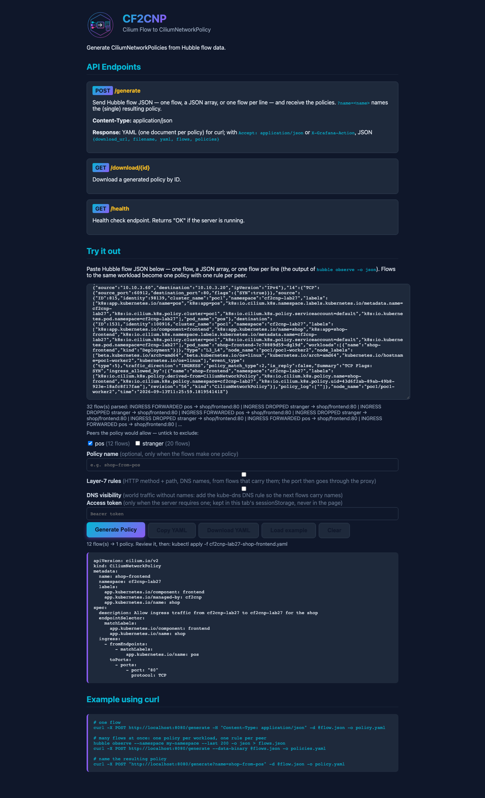
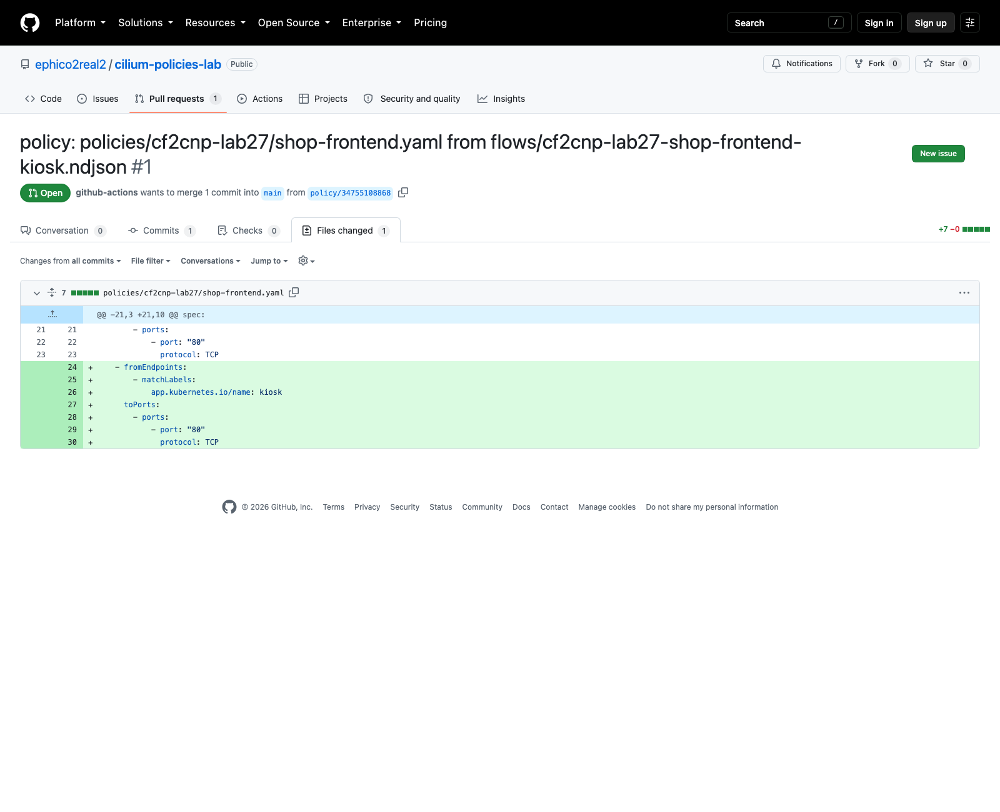

# Demo 32 — the operator's loop: intent before generation (E4), evolution instead of regeneration (E5), a pull request instead of a download (E10)

**Where this sits in the whole:** [OBSERVABILITY-ARCHITECTURE.md](../../OBSERVABILITY-ARCHITECTURE.md). Fourth demo
of [enhancement 001](../../enhancements/001-policy-from-flows-enterprise.md), on demo 27's lab (`cf2cnp-lab27`,
enforced since demo 27) and the cf2cnp that [demo 29](../29-cross-cluster-policy/README.md) deployed — which this
demo moves from 0.6.0 to **0.6.1**, because two of its measurements found things to fix.

## Summary context — the enterprise case

Generating a policy once is a demo; running policies from traffic for years is the job. Three things make it
a job rather than a series of demos:

- **Intent.** A capture contains every caller, the ones you meant and the ones you did not — including callers
  the policy already drops. cf2cnp reads flows, not verdicts, so a dropped stranger becomes an allow rule. E4 puts
  the review where it belongs: the page lists every peer, unticking one sends `exclude=`, and the API takes the
  same parameter.
- **Evolution.** On day two a new client appears. Regenerating the policy from a fresh capture throws away every
  hand-made edit; E5's `cf2cnp merge` adds the missing rules to the existing file and nothing else, and is
  idempotent, so it can run on every capture.
- **Review.** The file lives in the repository the cluster is reconciled from. E10 is a workflow template: flows
  committed → `merge` → offline validation against the CRD → a pull request whose diff is the change. Nothing
  reaches a cluster until a human merges.

Each part below measures one of the three, and two of them found a defect in 0.6.0 that a reviewer reading the
code could not see: `merge` re-serialised the whole file (the PR diff was the file, not the rule), and the
template's first real run failed twice on things outside the template. Both are fixed and recorded.

| Piece | What | Where |
|---|---|---|
| the binary | `cf2cnp_0.6.0_darwin_amd64.tar.gz` from the release, checksum verified (E10's other half) | Part 0 |
| intent | every caller of `shop-frontend` (pos forwarded, the stranger dropped) → `exclude=` and the page's checklist | Part 1 |
| evolution | `kiosk`, a new client, dropped → merged into demo 27's [`shop-frontend.yaml`](policies/shop-frontend.yaml) → 200 | Part 2 |
| the fix | 0.6.1: `merge` edits the YAML node tree — the diff is the rule; and one kube-dns rule (demo 31's finding) | Part 2b |
| review | [cilium-policies-lab](https://github.com/ephico2real2/cilium-policies-lab): three runs, two findings, [PR #1](https://github.com/ephico2real2/cilium-policies-lab/pull/1) | Part 3 |

## Part 0 — the release binary, verified

```bash
gh release download v0.6.0 -R ephico2real2/cf2cnp -p "cf2cnp_0.6.0_darwin_amd64.tar.gz" -p "cf2cnp_0.6.0_checksums.txt"
shasum -a 256 -c --ignore-missing cf2cnp_0.6.0_checksums.txt && tar -xzf cf2cnp_0.6.0_darwin_amd64.tar.gz && ./cf2cnp --help
```

```text
6bf9dd96f46f498ed2dccce503b4fdb1c36e8cb7a3b192a0d3f6d83230e2db7a  cf2cnp_0.6.0_darwin_amd64.tar.gz
5201d6ab4911f8054bcb622163166dfe78e2497b49833b9a7909a3370cb0a480  cf2cnp_0.6.0_linux_amd64.tar.gz
cf2cnp_0.6.0_darwin_amd64.tar.gz: OK
Available Commands:
  generate    Generate policies from flow files in a directory
  merge       Merge rules generated from flows into an existing CiliumNetworkPolicy file
  serve       Start HTTP server for policy generation
```

The E10 workflow (`.github/workflows/binary-release.yml` on the fork) builds four archives and the checksums
file on every `v*` tag; the pipeline in Part 3 installs the Linux one the same way, checksum first.

## Part 1 — E4: every caller, then the intended ones

```bash
demos/32-operator-loop/callers.sh cf2cnp-lab27/shop-frontend demos/32-operator-loop/policies/flows-frontend.ndjson 300
demos/26-cf2cnp-policy-from-flows/generate.sh demos/32-operator-loop/policies/flows-frontend.ndjson demos/32-operator-loop/policies/cnp-frontend-all.yaml
QUERY="exclude=app.kubernetes.io%2Fname%3Dstranger" demos/26-cf2cnp-policy-from-flows/generate.sh … demos/32-operator-loop/policies/cnp-frontend-intent.yaml
diff demos/32-operator-loop/policies/cnp-frontend-all.yaml demos/32-operator-loop/policies/cnp-frontend-intent.yaml
QUERY="exclude=…stranger&exclude=…pos" demos/26-cf2cnp-policy-from-flows/generate.sh demos/32-operator-loop/policies/flows-frontend.ndjson
```

```text
kept 32 INGRESS request flows -> demos/32-operator-loop/policies/flows-frontend.ndjson
   12 pos -> :80 FORWARDED shop-frontend
   20 stranger -> :80 DROPPED -
24,30d23
<     - fromEndpoints:
<         - matchLabels:
<             app.kubernetes.io/name: stranger
<       toPorts:
<         - ports:
<             - port: "80"
<               protocol: TCP
No valid flows found in request (every flow excluded, or none parsed)
[exit code: 22]
```

Twenty of the thirty-two flows are the stranger's, every one `DROPPED` by demo 27's policy — and without
`exclude=` they are a rule. With it, exactly that rule is gone; excluding everyone is a `400`, not an empty
policy. The page does the same with a checklist (demo 26's script, `EXCLUDE=app.kubernetes.io/name=stranger`):

```text
32 flow(s) parsed: INGRESS FORWARDED pos → shop/frontend:80 | INGRESS DROPPED stranger → shop/frontend:80 | …
Peers the policy would allow — untick to exclude:   [x] pos (12 flows)   [ ] stranger (20 flows)
12 flow(s) → 1 policy. Review it, then: kubectl apply -f cf2cnp-lab27-shop-frontend.yaml
```



A peer is its whole identifying label set (`name` + `component` + `instance`, the review's C10): unticking
`shop/frontend` in a two-component capture keeps `shop/backend`.

## Part 2 — E5: a new client, merged in

[`10-kiosk.yaml`](10-kiosk.yaml) adds `kiosk`, a client demo 27 never saw. Under the enforced policy it is dropped;
its flows are the input of `merge`, and demo 27's own [`shop-frontend.yaml`](policies/shop-frontend.yaml) (one of
the two documents in `cnp-shop.yaml`) is the existing file.

```bash
kubectl --context kind-poc1 apply -f demos/32-operator-loop/10-kiosk.yaml
kubectl … exec kiosk -- wget -S -qO- --timeout=3 http://shop-frontend.cf2cnp-lab27/
hubble observe -P --kube-context kind-poc1 --from-pod cf2cnp-lab27/kiosk --to-pod cf2cnp-lab27/shop-frontend --last 40 -o json > policies/flows-kiosk.ndjson
.tmp/cf2cnp-0.6.0/cf2cnp merge --existing demos/32-operator-loop/policies/shop-frontend.yaml --input demos/32-operator-loop/policies/flows-kiosk.ndjson --output demos/32-operator-loop/policies/shop-frontend-merged.yaml
diff demos/32-operator-loop/policies/shop-frontend.yaml demos/32-operator-loop/policies/shop-frontend-merged.yaml
.tmp/cf2cnp-0.6.0/cf2cnp merge --existing …/shop-frontend-merged.yaml --input …/flows-kiosk.ndjson --output …/shop-frontend-merged-again.yaml
kubectl --context kind-poc1 apply -f demos/32-operator-loop/policies/shop-frontend-merged.yaml
```

```text
rc=1                                                              ← kiosk, before
kiosk -> shop-frontend request flows: {('INGRESS', 'DROPPED', '-'): 18}
1 rule(s) added → demos/32-operator-loop/policies/shop-frontend-merged.yaml
4,9c4,9
<   name: shop-frontend
<   namespace: cf2cnp-lab27
<   labels:
…                                                                 ← 0.6.0: the WHOLE file differs
>     labels:
>         app.kubernetes.io/component: frontend
…
>         - fromEndpoints:
>             - matchLabels:
>                 app.kubernetes.io/name: kiosk
0 rule(s) added → demos/32-operator-loop/policies/shop-frontend-merged-again.yaml
second merge: byte-identical
ciliumnetworkpolicy.cilium.io/shop-frontend configured
kiosk       HTTP/1.1 200 OK rc=0
pos         HTTP/1.1 200 OK rc=0
stranger  rc=1
```

The semantics are right: one rule added, the second run adds nothing, kiosk answers, pos still answers, the
stranger is still dropped. The **file** is wrong for the job: 0.6.0 decoded the document into a map and
marshalled it back, so every key came out alphabetical (`labels` before `name`) at yaml.v3's 4-space
indentation — a pull request would show 30 changed lines for a 7-line rule, and a reviewer would have to read
the whole file to find the change. [`shop-frontend-merged.yaml`](policies/shop-frontend-merged.yaml) is that
output, kept.

## Part 2b — the fix, released as 0.6.1, and the merge again

`merge` now edits the YAML **node tree** (`yaml.Node`): key order, comments, quoting and flow-style lists survive,
the encoder writes the 2-space indentation `generate` uses, and the only thing yaml.v3 cannot keep is blank lines.
The same release drops the plain kube-dns rule that demo 31 found beside the DNS-visibility one. Tests:
`TestMergeDocument_KeepsTheDocumentAsItWas` (the output must *start* with the input, byte for byte),
`TestMergeDocument_KeepsOrderCommentsAndStyle`, `TestDNSVisibility_OneKubeDNSRule`.

```bash
demos/25-hubble-observer-loki/chart-from-fork.sh develop a00dd7e          # the observer fork with cf2cnp 0.6.1
gh release download v0.6.1 … && shasum -a 256 -c --ignore-missing cf2cnp_0.6.1_checksums.txt
.tmp/cf2cnp-0.6.1/cf2cnp merge --existing demos/32-operator-loop/policies/shop-frontend.yaml --input demos/32-operator-loop/policies/flows-kiosk.ndjson --output demos/32-operator-loop/policies/shop-frontend-merged-0.6.1.yaml
diff demos/32-operator-loop/policies/shop-frontend.yaml demos/32-operator-loop/policies/shop-frontend-merged-0.6.1.yaml
```

```text
v0.6.1 cf2cnp_0.6.1_checksums.txt cf2cnp_0.6.1_darwin_amd64.tar.gz cf2cnp_0.6.1_darwin_arm64.tar.gz cf2cnp_0.6.1_linux_amd64.tar.gz cf2cnp_0.6.1_linux_arm64.tar.gz
STATUS: deployed
REVISION: 24
hubble-observer-cf2cnp-bd6c55647-hwz24    ghcr.io/ephico2real2/cf2cnp:0.6.1   true
cf2cnp_0.6.1_darwin_amd64.tar.gz: OK
1 rule(s) added → demos/32-operator-loop/policies/shop-frontend-merged-0.6.1.yaml
23a24,30
>     - fromEndpoints:
>         - matchLabels:
>             app.kubernetes.io/name: kiosk
>       toPorts:
>         - ports:
>             - port: "80"
>               protocol: TCP
second merge: byte-identical
```

Seven added lines, nothing else — the diff a reviewer can read in the PR.

## Part 3 — E10: the template on a policies repository, three runs

A throwaway repository, [cilium-policies-lab](https://github.com/ephico2real2/cilium-policies-lab), holds the
template unchanged under `.github/workflows/`, the kiosk flows under `flows/` and demo 27's policy under
`policies/cf2cnp-lab27/`. `gh workflow run policy-pr.yml -f flows=… -f policy=… -f l7=false`, three times:

```text
run 34754970357: failure | Install cf2cnp (release archive, checksum verified)=failure
  sha256sum: cf2cnp_0.6.1_linux_amd64.tar.gz: No such file or directory
run 34755008479: failure | Install=success, Merge=success, setup-go=success, Validate against the CiliumNetworkPolicy CRD (offline)=success, Open the pull request=failure
  GitHub Actions is not permitted to create or approve pull requests. - https://docs.github.com/rest/pulls/pulls#create-a-pull-request
run 34755108868: success | Install=success, Merge=success, setup-go=success, Validate=success, Open the pull request=success
PR #1 policy: policies/cf2cnp-lab27/shop-frontend.yaml from flows/cf2cnp-lab27-shop-frontend-kiosk.ndjson
branch policy/34755108868  +7 -0 in 1 file
```

Two findings that two review passes could not make, because neither ran the file:

1. **The archive's name.** The reviewed step saved the asset as `cf2cnp.tgz` and verified a checksum line that
   names `cf2cnp_<version>_linux_amd64.tar.gz`. The template now keeps the asset's own name.
2. **A repository setting.** `permissions: {contents: write, pull-requests: write}` is necessary and not
   sufficient: *Allow GitHub Actions to create and approve pull requests* (off on a new repository, measured as
   `can_approve_pull_request_reviews=false`) gates the last step. Gotcha #87; noted in the template's header.

The third run's pull request — `merge` in the runner, `kubectl-validate` against the 1.20.1 CRD offline, only the
policy file committed, the diff the seven lines of Part 2b:



The PR is left open on purpose: nothing is applied until a human merges it and the reconciler picks it up —
that is the point of the loop.

## Cleanup

`demos/32-operator-loop/cleanup.sh` removes kiosk and puts demo 27's policy back; the repository and PR #1 stay.

## What to take away

- **Flows are not verdicts.** A dropped caller is a rule until you say otherwise; review the peers before
  generating, on the page or with `exclude=`.
- **Merge, don't regenerate.** The existing file carries decisions (a deny rule, an annotation, a comment); the
  new flows carry one rule. Add the rule.
- **A merge is judged by its diff.** Semantically right and byte-wise noisy is wrong for a PR-driven process;
  0.6.1 made the diff the change.
- **Run the template once before offering it.** Two clean reviews, two failures on the first run — the archive's
  name and a repository setting. Neither is visible in the file.
- **The PR is the control.** The workflow has no cluster credentials; the reconciler does. Keep it that way.

## Evidence

Captured 2026-09-13 with `scripts/evidence/capture.js`, `scripts/evidence/collect.sh`
([`output/evidence.txt`](output/evidence.txt): pods, the policy's peers, the PR list, the 0.6.1 release) and demo
26's page script. Every command above is in [`output/transcript.txt`](output/transcript.txt); the flows and every
policy version are under [`policies/`](policies/).

| Capture | What it shows |
|---|---|
| [`github-pr-1-files.png`](output/screenshots/github-pr-1-files.png) | the PR's files tab: one file, +7 −0, the kiosk rule |
| [`ui-1-empty.png`](output/screenshots/ui-1-empty.png), [`ui-2-pasted.png`](output/screenshots/ui-2-pasted.png), [`ui-3-generated.png`](output/screenshots/ui-3-generated.png) | the page: 32 flows, the peer checklist with the stranger unticked, the policy with pos alone |
