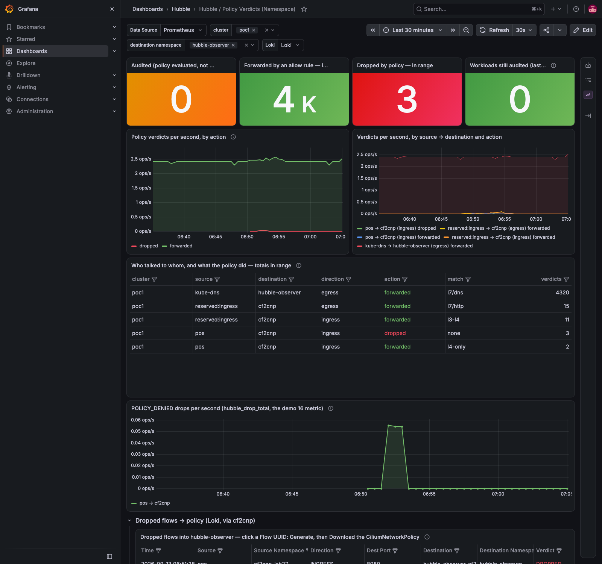

# Demo 33 — hardening a shared `/generate`: a policy for the pod, an Origin allow-list, and a token where it belongs (E6)

**Where this sits in the whole:** [OBSERVABILITY-ARCHITECTURE.md](../../OBSERVABILITY-ARCHITECTURE.md). Fifth demo of
[enhancement 001](../../enhancements/001-policy-from-flows-enterprise.md), on the observer release
[demo 32](../32-operator-loop/README.md) left at cf2cnp 0.6.1. Nothing new is generated here; what changes is
**who** can ask.

## Summary context — the enterprise case

cf2cnp turns flows into policies. Behind a Gateway with a Grafana action wired to it, its `/generate` is an
HTTP endpoint any pod in the cluster could POST to, and any web page a user visits could call from the
browser (`Access-Control-Allow-Origin: *`, demo 26's review). None of that leaks a secret — the answer is a
policy for the flows you sent — but an endpoint that nobody owns is the one that turns up in an audit. E6 gives
the chart three controls, each for a different caller:

| Caller | Control | Value |
|---|---|---|
| a pod in the cluster | a **CiliumNetworkPolicy** for the cf2cnp pod: ingress from the Gateway (`reserved:ingress`) and the kubelet (`reserved:host`) only, egress to kube-dns only | `cf2cnp.networkPolicy.enabled` |
| a browser on another site | an **Origin allow-list**: the Grafana origin is echoed, any other gets no CORS header | `cf2cnp.cors.allowedOrigins` |
| a machine, over the network | an optional **bearer token** on `/generate` and `/download` (never on the page, `/health` or preflight) | `cf2cnp.auth.token` / `existingSecret` |

Each control is measured below, and one measurement is the reason the parent chart needed a change too.

## Part 1 — today

```bash
kubectl … -n cf2cnp-lab27 exec pos -- wget -S --post-data='{}' http://hubble-observer-cf2cnp.hubble-observer/generate
curl … -X POST https://cf2cnp.poc.local/generate -H 'Origin: https://evil.example' -d '{}' -D -
hubble observe … --to-pod hubble-observer/hubble-observer-cf2cnp --port 8080 --type policy-verdict
```

```text
from a lab pod, straight to the Service (no Gateway):
  HTTP/1.1 400 Bad Request          ← answered (the body {} is refused, the request was not)
through the Gateway, with a foreign Origin:
access-control-allow-origin: *
13 reserved:host FORWARDED allow-hubble-observer-cf2cnp-ingress
1 pos FORWARDED allow-hubble-observer-cf2cnp-ingress
1 reserved:ingress FORWARDED allow-hubble-observer-cf2cnp-ingress
```

A lab pod reaches `/generate` by the Service name, and every origin is allowed. The policy that admits the pod
is the observer chart's own: `ciliumNetworkPolicy.cf2cnp.ingressFromEntities` defaults to `[cluster, world]`.

## Part 2 — the policy and the allow-list

Three values in [`values-hubble-observer.yaml`](../25-hubble-observer-loki/values-hubble-observer.yaml):

```yaml
cf2cnp:
  cors: {allowedOrigins: [https://grafana.poc.local]}
  networkPolicy: {enabled: true}               # fromEndpoints: [] — the Grafana action arrives through the Gateway
ciliumNetworkPolicy:
  cf2cnp: {ingressFromEntities: [ingress, host]}   # the parent chart's policy, narrowed to the same peers
```

**2a — the subchart's policy alone, measured (Helm revision 26).** With the parent chart's policy still at
`[cluster, world]`:

```text
allow-hubble-observer-cf2cnp-ingress    [cluster world]
hubble-observer-cf2cnp                  [ingress host]
from the lab pod, straight to the Service: rc=0        ← still answered
   2 pos -> hubble-observer-cf2cnp-69dc46c99-df4lj DROPPED allowed_by=
   1 pos -> hubble-observer-cf2cnp-69dc46c99-df4lj FORWARDED allowed_by=allow-hubble-observer-cf2cnp-ingress
```

The subchart's policy is there and changes nothing: Cilium policies **add** allows, and the widest one wins. (The
two drops are the new pod's first seconds during the rollout; the connection that followed was forwarded by the
parent's policy.) That is gotcha #88, and why the parent's value is part of E6's configuration.

**2b — the parent narrowed (revision 27).**

```text
allow-hubble-observer-cf2cnp-ingress    [ingress host]
hubble-observer-cf2cnp                  [ingress host]
from the lab pod, straight to the Service: rc=1        ← no answer
through the Gateway: HTTP 200
through the Gateway, Origin https://evil.example:      HTTP/2 400            ← no Access-Control-* header at all
through the Gateway, Origin https://grafana.poc.local: access-control-allow-origin: https://grafana.poc.local
                                                       vary: Origin
preflight from Grafana: HTTP/2 200, access-control-allow-origin: https://grafana.poc.local, …allow-methods: GET, POST, OPTIONS
13 reserved:host FORWARDED allow-hubble-observer-cf2cnp-ingress,hubble-observer-cf2cnp
1 reserved:ingress FORWARDED allow-hubble-observer-cf2cnp-ingress,hubble-observer-cf2cnp
3 pos DROPPED (no policy named)
```

The kubelet's probes (`reserved:host`) and the Gateway (`reserved:ingress`) are forwarded by both policies —
the review measured those two identities on the pod, which is why `host` is in the rule (without it the pod
fails its probes). The lab pod is dropped. A foreign origin gets an answer (CORS is a browser rule) but no
header a browser would accept; the Grafana origin is echoed with `Vary: Origin`; the preflight is answered.

## Part 3 — the token, for one revision

```bash
helm upgrade … --set cf2cnp.auth.token=demo-33-secret          # revision 28; the chart writes the Secret
```

```text
SECRET                        KEYS
hubble-observer-cf2cnp-auth   map[token:<redacted>]
no token:            HTTP/2 401  www-authenticate: Bearer realm="cf2cnp"
wrong token:         HTTP 401
right token:         HTTP 200
preflight, no token: HTTP 200
/health, no token:   HTTP 200
the page, no token:  HTTP 200
as the Grafana action sends it (X-Grafana-Action, no Authorization): HTTP 401
REVISION: 29                                                    ← token off again
cf2cnp secrets left: 0
```

Everything the review asked for holds: a wrong token of any length is refused the same way, the scheme is
case-insensitive, preflight is never challenged, the page and `/health` stay open, and the page has an *Access
token* field (sessionStorage, never in the page). And the last line is the design decision: the Grafana action's
request carries `X-Grafana-Action` and a `Content-Type`, nothing else — a dashboard JSON has no place for a
secret that is not in every viewer's browser. So the **shared** instance behind the dashboard runs without a
token, protected by the Gateway, the policy and the origin list; the token is for a cf2cnp that machines call
over the network (a CI job posting flows, a second instance for the API). The revert is recorded.

## Part 4 — the action, end to end, under the controls

```bash
GW=172.18.255.240 node demos/26-cf2cnp-policy-from-flows/grafana-generate.js cf2cnp-lab27
```

```text
menu offers: Generate CiliumNetworkPolicy from Flow | Download CiliumNetworkPolicy | Open this Flow UUID
confirmed the action
  POST https://cf2cnp.poc.local/generate headers={"x-grafana-device-id":"…","accept":"application/json, text/plain, */*","x-grafana-action":"1"} body={"flow":{"time":"2026-09-13T11:53:32…
    ← 200 {"download_url":"https://cf2cnp.poc.local/download/6b3f14d8-…","filename":"cf2cnp-lab27-shop-backend.yaml","flows":1,…
```

Through the Gateway as `reserved:ingress`, from the allowed origin: `200`. The dashboard for the observer
namespace shows the same picture from the pod's side — the kubelet and the Gateway forwarded, the lab pod
dropped:



## Cleanup

Nothing to undo: this is the state the values file commits. `cleanup.sh` prints it.

## What to take away

- **Three callers, three controls.** A network policy for pods, an origin list for browsers, a token for
  machines. They do not substitute for each other.
- **Policies add.** A stricter policy beside a wider one changes nothing; find the wider one (here the parent
  chart's default) and narrow it. Verdicts name both policies once they agree.
- **`reserved:host` is not optional.** The kubelet's probes arrive as the host identity; a policy without it
  takes the pod out of service.
- **A token has to live somewhere.** Not in a dashboard JSON. The action path is secured by where it comes from,
  not by what it carries.
- **Measure the negative.** The foreign origin still got a `400` — the request reached the server. CORS
  decides what a browser may read, not what the server receives; the policy is the network control.

## Evidence

Captured 2026-09-13 with `scripts/evidence/capture.js`, `scripts/evidence/collect.sh`
([`output/evidence.txt`](output/evidence.txt): pods, the policies with their entities, the container's arguments
with `--allowed-origins`, the release's values) and demo 26's Grafana script. Every command above, the token
revision included, is in [`output/transcript.txt`](output/transcript.txt).

| Capture | What it shows |
|---|---|
| [`grafana-policy-verdicts-hubble-observer.png`](output/screenshots/grafana-policy-verdicts-hubble-observer.png) | the verdict dashboard on the observer namespace: host and ingress forwarded, the lab pod dropped |
| `grafana-*.png` from the action script | the four steps of the action under the controls (see demo 26 Part 12 for the walkthrough) |
