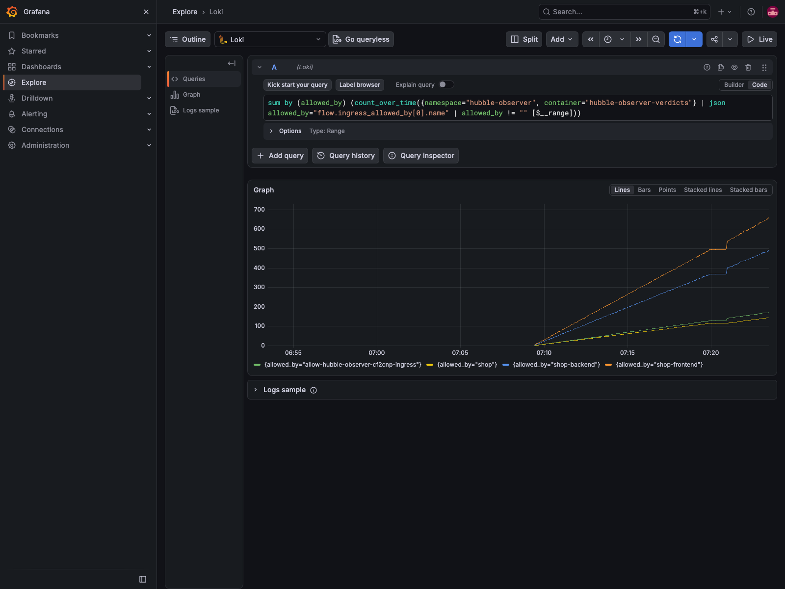
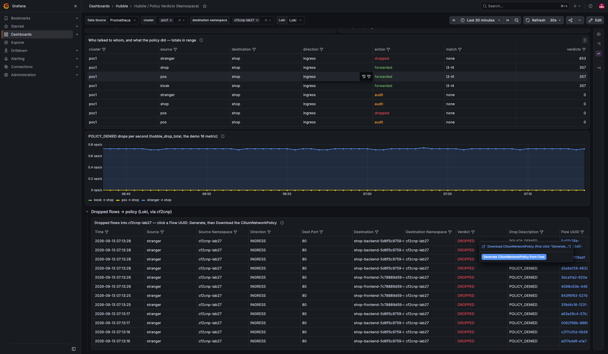
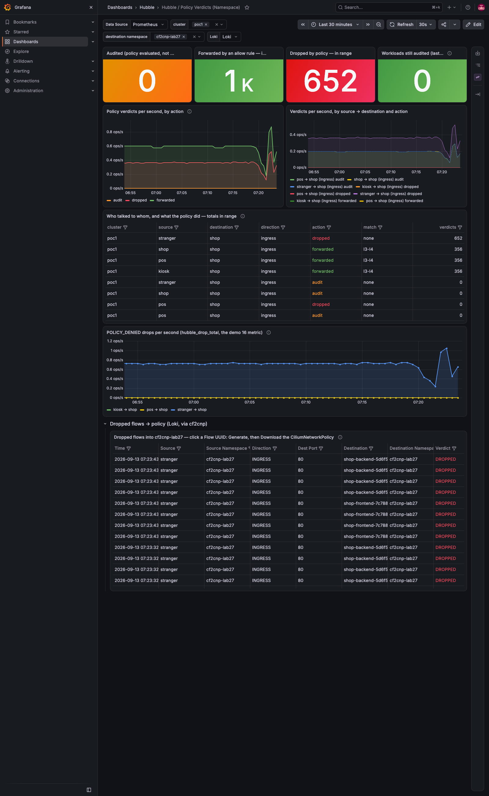

# Demo 34 — from a verdict to a policy on one page (E7), and "which policy allowed it" as a stream (E8)

**Where this sits in the whole:** [OBSERVABILITY-ARCHITECTURE.md](../../OBSERVABILITY-ARCHITECTURE.md). Last demo of
[enhancement 001](../../enhancements/001-policy-from-flows-enterprise.md): the two items that live in the
dashboard chart and the observer chart rather than in cf2cnp. Everything runs on what demos 29–33 deployed.

## Summary context — the enterprise case

The Policy Verdicts dashboard (demos 26, 28) answers *what did the policy do* — audited, forwarded, dropped,
per namespace, from Hubble's `policy` metric. Two questions it could not answer:

- **"Now make the rule."** The dropped flow the operator is looking at is on another dashboard (the observer's,
  demo 25) with the cf2cnp action. E7 puts a Loki-backed table of the namespace's dropped flows under the verdict
  panels, with the same *Generate* / *Download* actions — one page from the verdict to the policy.
- **"Which rule allowed it?"** A metric has an `action` and a `match`, not a policy name. Hubble's policy-verdict
  events do: `ingress_allowed_by`, `egress_allowed_by`, `*_denied_by`, each with the policy's name, kind,
  namespace and revision. E8 is a second release of the observer chart streaming those events into Loki — cheap,
  because they are a small share of all events (5.6 % measured in the plan) — so the question is one LogQL.

Both were reviewed twice and both, once run, hit one thing a render cannot show: the two observer releases
shared a container name, so in Loki they would have been one stream. Part 1 measures it and the fix.

| Piece | What | Where |
|---|---|---|
| the collector | demo 10's collector gains a second `filelog` glob for the verdicts pod (additive) | Part 0 |
| the stream | `hubble-observer-verdicts`, the fork's [example values](values-verdicts.yaml) verbatim: `--type policy-verdict`, the relay's mutual TLS, the agent image, its own **container name** | Part 1 |
| the question | `loki-verdicts.sh`: two streams, one raw verdict, "which policy allowed it" | Part 2 |
| the page | the Loki row on the verdict dashboard (chart 0.2.0), the cf2cnp action from it | Part 3 |

## Part 0 — the collector tails the second pod

```bash
kubectl --context kind-poc1 apply -f demos/10-tracing/otel-collector.yaml && kubectl --context kind-poc1 -n otel rollout restart ds/otel-collector
```

```text
67:          # name, hubble-observer-verdicts — the first glob's container segment does not match it.
68:          - /var/log/pods/hubble-observer_hubble-observer-verdicts-*/hubble-observer-verdicts/*.log
daemon set "otel-collector" successfully rolled out
globs naming the verdicts container in the live ConfigMap: 2
```

The kubelet writes a pod's logs under `/var/log/pods/<namespace>_<pod>-…/<container>/`; the container name is a
path segment, which is why Part 1's change needs this one.

## Part 1 — E8: the second release, and the container-name trap

The fork's example is copied verbatim to [`values-verdicts.yaml`](values-verdicts.yaml): `fullnameOverride`,
the Cilium agent image (the CLI with `--field-mask`, review finding), `verdictFilter: none` with
`extraArgs: ["--type", "policy-verdict"]`, the thirteen-field mask, the relay's port 443 and mutual-TLS secret,
cf2cnp and the dashboard off (the first release ships them), the chart's own policy on.

```bash
demos/25-hubble-observer-loki/chart-from-fork.sh develop 7853c77          # the first release, re-vendored chart
helm upgrade --install hubble-observer-verdicts demos/25-hubble-observer-loki/chart/hubble-observer -n hubble-observer -f demos/34-verdict-to-policy/values-verdicts.yaml
```

```text
POD                                         CONTAINER                  IMAGE                          READY
hubble-observer-6f865f8f94-4vvzb            hubble-observer            quay.io/cilium/cilium:v1.20.1  true
hubble-observer-cf2cnp-69dc46c99-7qjcm      cf2cnp                     ghcr.io/ephico2real2/cf2cnp:0.6.1   true
hubble-observer-verdicts-76dfcf966c-55696   hubble-observer-verdicts   quay.io/cilium/cilium:v1.20.1  true
hubble observe flows --not --drop-reason-desc 'UNSUPPORTED_L3_PROTOCOL' --follow --ip-translation --server hubble-relay.kube-system.svc.cluster.local:443 -o json --field-mask … --type policy-verdict
200 policy-verdict lines in the last 200; verdict / field / policy:
   63 FORWARDED ingress_allowed_by -
   38 REDIRECTED egress_allowed_by allow-hubble-observer-verdicts-to-hubble-relay
   18 REDIRECTED egress_allowed_by pos
   13 DROPPED - -
    7 FORWARDED ingress_allowed_by shop-frontend
```

The third pod's container is `hubble-observer-verdicts`. It was not, at first: the chart named every container
`{{ .Chart.Name }}`, so both observers were `hubble-observer` — and the collector turns the container name into
Loki's `container` label, the one every query in this stack selects on. The fork's README LogQL
(`{container="hubble-observer-verdicts"}`) would have matched nothing, and the dashboard's Loki row would have read
both streams. The fork now has `containerName` (default the chart's name — a single release changes nothing), the
example sets it, and gotcha #89 records it.

Two of the lines above need a word. `FORWARDED ingress_allowed_by -` (no name) is Cilium's implicit
`allow-localhost-ingress` — the node reaching a pod, `derived-from` in the labels, not a CRD. `DROPPED - -` is a
default-deny drop, which names no policy (gotcha #82).

## Part 2 — the stream in Loki, and the question

```bash
demos/34-verdict-to-policy/loki-verdicts.sh 15m
```

```text
== lines per container label, last 15m
   hubble-observer            1696
   hubble-observer-verdicts   3152
== one policy-verdict line, the fields that matter
   kiosk -> shop-frontend-7c78889d59-dgl9d FORWARDED INGRESS
   ingress_allowed_by: [{"name": "shop-frontend", "namespace": "cf2cnp-lab27", "labels": ["k8s:io.cilium.k8s.policy.derived-from=CiliumNetworkPolicy", "k8s:io.cilium.k8s.policy.name=shop-frontend", "k8s:io.cilium.k8s.policy.namespace=cf2cnp-lab27", "k8s:io.cilium.k8s.policy.uid=43d6f2ab-…"], "revision": "62", "kind": "CiliumNetworkPolicy"}]
== which policy allowed it (ingress), last 15m
      190  shop-frontend
      142  shop-backend
       48  allow-hubble-observer-cf2cnp-ingress
       44  shop
== which policy denied it, and the unnamed drops (default-deny), last 15m
      229  (no policy named — a default-deny drop, gotcha #82)
```

Two streams under one namespace, told apart by `container`. The raw line is the answer the metric cannot give:
`kiosk → shop-frontend` was forwarded by **`shop-frontend`**, a `CiliumNetworkPolicy` in `cf2cnp-lab27`, policy
revision 62 — the rule demo 32 merged in. The aggregation is the fork README's LogQL:

```logql
sum by (allowed_by) (count_over_time({container="hubble-observer-verdicts"} | json allowed_by="flow.ingress_allowed_by[0].name" | allowed_by != "" [$__range]))
```



The 229 unnamed drops are the stranger's, under demo 27's default-deny; a deny *rule* (`ingressDeny`) would be
named in `ingress_denied_by` the same way.

## Part 3 — E7: the action on the verdict dashboard's own row

Demo 26's action script with the new `DASH_URL` switch opens the verdict dashboard for `cf2cnp-lab27`, scrolls to
the Loki row, clicks the first Flow UUID and runs the action:

```bash
DASH_URL='https://grafana.poc.local/d/hubble-policy-verdicts?…&var-namespace=cf2cnp-lab27' GW=… node demos/26-cf2cnp-policy-from-flows/grafana-generate.js cf2cnp-lab27
```

```text
first flow in the table, uuid: 8a6fb38a-8d45-43a0-9dbe-48ea32119ad1
menu offers: Generate CiliumNetworkPolicy from Flow | Download CiliumNetworkPolicy
confirmed the action
  POST https://cf2cnp.poc.local/generate headers={"x-grafana-device-id":"…","accept":"application/json, text/plain, */*","x-grafana-action":"1"} body={"flow":{"time":"2026-09-13T12:13:27…","uuid":"8a6fb38a-…
    ← 200 {"download_url":"https://cf2cnp.poc.local/download/8a6fb38a-8d45-43a0-9dbe-48ea32119ad1","filename":"cf2cnp-lab27-shop-backend.yaml","flows":1,…
```



The row is the observer's drop stream (`container="hubble-observer"`, `flow.verdict="DROPPED"`, the namespace
variable applied to `flow.destination.namespace`), with `Line` kept in the frame and hidden — the action's body
(the review's C13). The Download link is a data link on the same cell. Under demo 33's controls the request
went through the Gateway from the Grafana origin: `200`.



## Cleanup

`demos/34-verdict-to-policy/cleanup.sh` uninstalls the second release; the row, the collector glob and the first
release are the committed state.

## What to take away

- **A metric says what, a flow says which.** Keep the `policy` metric for the panels and the verdict stream for the
  name; the stream is 5 % of events and already carries the correlation.
- **One chart, twice: every identity must be settable.** Names, labels, the container. A README's LogQL is a claim
  about a label a shipper produces — measure it.
- **The action belongs where the verdict is read.** A Loki table under the verdict panels closes the loop without a
  second dashboard; the contract is the 23862 dashboard's (`Line` in the frame).
- **Unnamed is a verdict too.** `ingress_denied_by` empty with `DROPPED` is a default-deny; `allowed_by` with no
  name and `derived-from=allow-localhost-ingress` is the node.

## Evidence

Captured 2026-09-13 with `scripts/evidence/capture.js`, `scripts/evidence/collect.sh`
([`output/evidence.txt`](output/evidence.txt): pods in the observer and collector namespaces, the two releases,
the container names, the dashboard's Loki panels) and demo 26's action script. Every command above is in
[`output/transcript.txt`](output/transcript.txt).

| Capture | What it shows |
|---|---|
| [`grafana-explore-which-policy-allowed-it.png`](output/screenshots/grafana-explore-which-policy-allowed-it.png) | Explore on the verdict stream: forwarded verdicts per allowing policy |
| [`grafana-policy-verdicts-loki-row.png`](output/screenshots/grafana-policy-verdicts-loki-row.png) | the verdict dashboard for `cf2cnp-lab27`, the Loki row at the bottom |
| [`grafana-1-dashboard-filtered.png`](output/screenshots/grafana-1-dashboard-filtered.png) … [`grafana-4-generated.png`](output/screenshots/grafana-4-generated.png) | the action from the Loki row, four steps |
