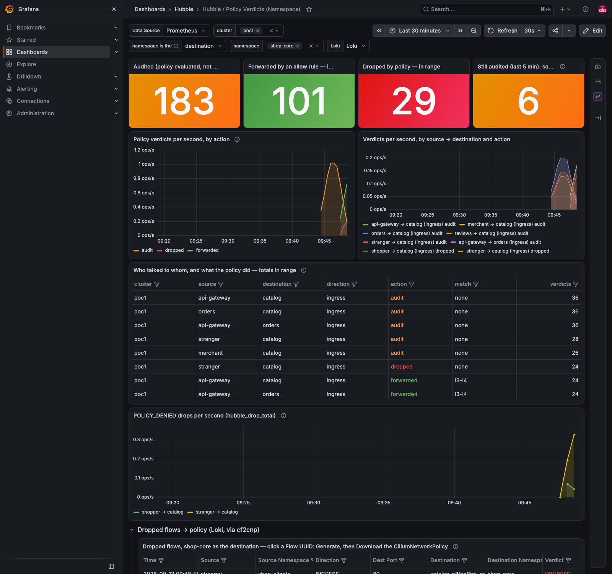
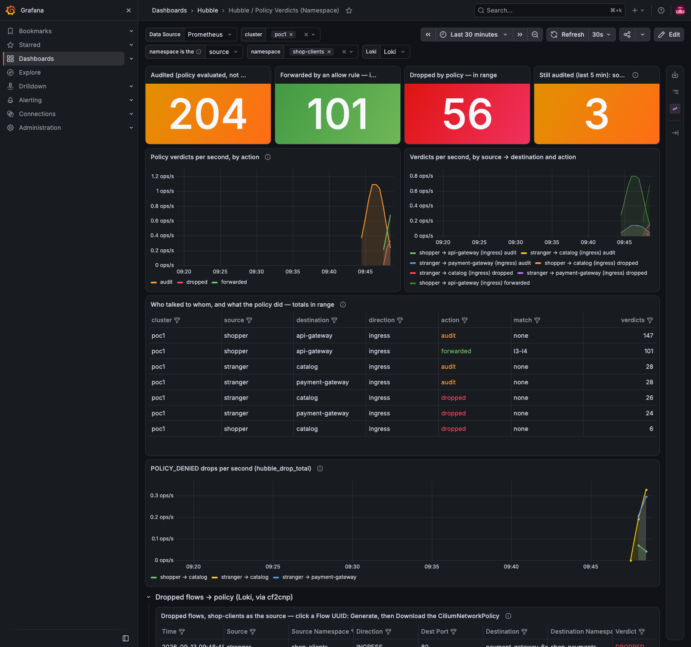
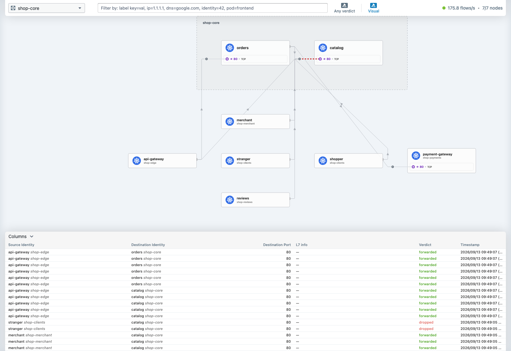

# Demo 35 — the shop platform: a shared service, four callers in three namespaces, a gateway in a fourth, one request, six policies

**Where this sits in the whole:** [OBSERVABILITY-ARCHITECTURE.md](../../OBSERVABILITY-ARCHITECTURE.md). The
platform-scale run of the workflow demos 26–34 built one piece at a time, on cf2cnp **0.6.3** — whose
descriptions this demo is the first to show — and the dashboard chart **0.2.2**.

## Summary context — the enterprise case

A real estate is not one namespace. A catalogue service is called by the orders service beside it, by the
merchant portal of another team, by the reviews service of a third, and by the API gateway that fronts all of
them for the clients; payments settle with the merchant; clients are supposed to enter through the gateway and
nowhere else. The policies for that are not hard to write; they are tedious to write *correctly* for every
service, and they go stale the day a team adds a caller. This demo builds that estate (six namespaces, eight
workloads, [`10-platform.yaml`](10-platform.yaml)), observes it under audit, and lets cf2cnp write the six
policies from one request — with cross-namespace peers named by their namespace in the selector and in the
description — then enforces them and probes every path, including the one that was never observed.

Two operator findings from the earlier demos are fixed here and visible: the generated policy's `description`
now says what the rules say (0.6.2/0.6.3), and the verdict dashboard's panels carry no PoC wording and read
`none` rather than `0` where nothing is audited (0.2.2).

| Piece | What | Where |
|---|---|---|
| the platform | `shop-edge` (api-gateway), `shop-core` (catalog, orders), `shop-payments` (payment-gateway), `shop-merchant` (merchant), `shop-reviews` (reviews, ratings), `shop-clients` (shopper, stranger) | Part 1 |
| observe | audit mode on seven endpoints, a default-deny per service namespace, 85 AUDIT flows in one file | Part 2 |
| the release | cf2cnp 0.6.3 and dashboard 0.2.2 through the observer fork (release revision 32) | Part 3 |
| generate | one request → six policies in six namespaces; the stranger excluded; the descriptions | Part 4 |
| enforce | nine probes: six `200`, three drops — the stranger twice, and the shopper straight at the catalog | Part 5 |

## Part 1 — the platform

```bash
kubectl --context kind-poc1 apply -f demos/35-shop-platform/10-platform.yaml
demos/35-shop-platform/probe.sh
```

```text
shop-edge      api-gateway-7d77448bf5-g59cc       Running  10.10.4.192
shop-core      catalog-c8fcd8bb-pcnwq             Running  10.10.4.245
shop-core      orders-6ccc94b59d-kwn5q            Running  10.10.4.215
shop-payments  payment-gateway-6c6846d6b5-85ccg   Running  10.10.4.23
shop-merchant  merchant-5c5cc7d9b6-zwn4s          Running  10.10.4.47
shop-reviews   ratings                            Running  10.10.4.22
shop-reviews   reviews-768b7bd9b6-pvj42           Running  10.10.4.154
shop-clients   shopper                            Running  10.10.4.12
shop-clients   stranger                           Running  10.10.4.153
shop-clients shopper   api-gateway.shop-edge/catalog/items              HTTP/1.1 200 OK rc=0
shop-clients shopper   api-gateway.shop-edge/orders/place               HTTP/1.1 200 OK rc=0
shop-clients shopper   api-gateway.shop-edge/reviews/latest             HTTP/1.1 200 OK rc=0
shop-clients shopper   api-gateway.shop-edge/pay/charge                 HTTP/1.1 200 OK rc=0
shop-merchant merchant-… catalog.shop-core/items                        HTTP/1.1 200 OK rc=0
shop-reviews ratings   reviews.shop-reviews/stars                       HTTP/1.1 200 OK rc=0
shop-clients stranger  catalog.shop-core/items                          HTTP/1.1 200 OK rc=0
shop-clients stranger  payment-gateway.shop-payments/charge             HTTP/1.1 200 OK rc=0
shop-clients shopper   catalog.shop-core/items                          HTTP/1.1 200 OK rc=0
```

The gateway is nginx with one `proxy_pass` per backend namespace (a `resolver` pointing at kube-dns, since
upstream names are resolved at request time); every service is nginx answering real paths from a ConfigMap, so
from here on a `200` is the service and anything else is the policy. The last three lines are the ones that
must change.

## Part 2 — observe first, across five namespaces at once

The input of every policy in this demo is a **file of Hubble flows**. This part builds it in four steps; each step
is one command, and each command's output is in the transcript.

### Step 1 — put every shop workload in audit mode

Audit mode is a per-endpoint switch in the Cilium agent: policy is *evaluated and reported* (verdict `AUDIT`),
nothing is blocked. It is set on the agent of the node the pod runs on, by the pod's CiliumEndpoint name, and it
dies with the pod. Demo 26's `audit-mode.sh` does one pod; [`audit-all.sh`](audit-all.sh) loops it over every pod
labelled `app.kubernetes.io/part-of=shop` in the five service namespaces:

```bash
demos/35-shop-platform/audit-all.sh Enabled
```

```text
endpoint 89 (cep-name:shop-edge/api-gateway-7d77448bf5-g59cc on poc1-worker): PolicyAuditMode=Enabled
endpoint 538 (cep-name:shop-core/catalog-c8fcd8bb-pcnwq on poc1-worker): PolicyAuditMode=Enabled
endpoint 2867 (cep-name:shop-core/orders-6ccc94b59d-kwn5q on poc1-worker): PolicyAuditMode=Enabled
endpoint 1815 (cep-name:shop-payments/payment-gateway-6c6846d6b5-85ccg on poc1-worker): PolicyAuditMode=Enabled
endpoint 131 (cep-name:shop-merchant/merchant-5c5cc7d9b6-zwn4s on poc1-worker): PolicyAuditMode=Enabled
endpoint 2452 (cep-name:shop-reviews/ratings on poc1-worker): PolicyAuditMode=Enabled
endpoint 2457 (cep-name:shop-reviews/reviews-768b7bd9b6-pvj42 on poc1-worker): PolicyAuditMode=Enabled
```

Manually, for one pod, this is what the script runs (the endpoint id comes from `cilium-dbg endpoint list` on
the agent of the pod's node, looked up by `cep-name:<namespace>/<pod>`):

```bash
kubectl --context kind-poc1 -n kube-system exec <cilium-agent-pod-on-that-node> -- cilium-dbg endpoint config <endpoint-id> PolicyAuditMode=Enabled
```

### Step 2 — give every service a default-deny, so that Hubble reports INGRESS

Without a policy that selects the destination, Hubble has no `INGRESS` verdict to report for it (demo 26 Part 3,
demo 29 Part 3): the destination's node sees trace events only. A default-deny ingress policy on the workloads
makes every incoming connection a policy decision — and, under audit mode, that decision is `AUDIT`, not
`DROPPED`. [`20-default-deny-ingress.yaml`](20-default-deny-ingress.yaml) holds one such policy per service
namespace, selecting `app.kubernetes.io/part-of: shop`:

```bash
kubectl --context kind-poc1 apply -f demos/35-shop-platform/20-default-deny-ingress.yaml
```

```text
ciliumnetworkpolicy.cilium.io/default-deny-ingress created   (× 5, one per namespace)
```

Wait about 30 seconds so every caller in the platform has made its calls under the new policy (the sidecars call
every 5–8 s), then confirm nothing broke: `demos/35-shop-platform/probe.sh` still answers nine `200`s.

### Step 3 — capture the AUDIT flows of every service namespace into one file

Hubble's relay on poc1 streams every node's flows. The command that reads them is `hubble observe`; the flags that
matter here:

| Flag | Why |
|---|---|
| `--kube-context kind-poc1` | the relay of this cluster (the CLI port-forwards to it, with the TLS settings demo 25 configured) |
| `-P` | print the node name on every flow (`node_name`), useful when reading the file later |
| `--to-namespace shop-core` | flows whose **destination** is in the namespace — the callers of its services, whatever namespace they come from |
| `--verdict AUDIT` | only the policy decisions made under audit mode: one per new connection, `INGRESS`, with the caller's identity |
| `--last 400` | the newest 400 matching flows the relay still has (each agent keeps a ring buffer of 4095 events, about 100 s on a busy node — capture soon after the calls) |
| `-o json` | one JSON object per line (NDJSON): the format cf2cnp reads |

**Manually**, one namespace at a time, appending to the same file (`>>`, not `>`, from the second namespace on):

```bash
hubble observe -P --kube-context kind-poc1 --to-namespace shop-edge     --verdict AUDIT --last 400 -o json >  demos/35-shop-platform/policies/flows-audit.ndjson
hubble observe -P --kube-context kind-poc1 --to-namespace shop-core     --verdict AUDIT --last 400 -o json >> demos/35-shop-platform/policies/flows-audit.ndjson
hubble observe -P --kube-context kind-poc1 --to-namespace shop-payments --verdict AUDIT --last 400 -o json >> demos/35-shop-platform/policies/flows-audit.ndjson
hubble observe -P --kube-context kind-poc1 --to-namespace shop-merchant --verdict AUDIT --last 400 -o json >> demos/35-shop-platform/policies/flows-audit.ndjson
hubble observe -P --kube-context kind-poc1 --to-namespace shop-reviews  --verdict AUDIT --last 400 -o json >> demos/35-shop-platform/policies/flows-audit.ndjson
```

**Scripted**, the same five commands plus a summary — [`audit-flows.sh`](audit-flows.sh):

```bash
demos/35-shop-platform/audit-flows.sh demos/35-shop-platform/policies/flows-audit.ndjson 400
```

```text
85 AUDIT INGRESS request flows -> demos/35-shop-platform/policies/flows-audit.ndjson
   24  shopper@shop-clients         -> api-gateway@shop-edge:80
    6  api-gateway@shop-edge        -> catalog@shop-core:80
    4  merchant@shop-merchant       -> catalog@shop-core:80
    6  orders@shop-core             -> catalog@shop-core:80
    4  reviews@shop-reviews         -> catalog@shop-core:80
    4  stranger@shop-clients        -> catalog@shop-core:80
    4  payment-gateway@shop-payments -> merchant@shop-merchant:80
    6  api-gateway@shop-edge        -> orders@shop-core:80
    6  api-gateway@shop-edge        -> payment-gateway@shop-payments:80
    6  orders@shop-core             -> payment-gateway@shop-payments:80
    4  stranger@shop-clients        -> payment-gateway@shop-payments:80
    6  api-gateway@shop-edge        -> reviews@shop-reviews:80
    5  ratings@shop-reviews         -> reviews@shop-reviews:80
```

Thirteen caller → service pairs; the catalog is called from four workloads in three namespaces, plus the
stranger. The stranger's flows are in the file on purpose — Part 4 shows what happens with and without them.

### Step 4 — look at the file before using it

```bash
wc -l demos/35-shop-platform/policies/flows-audit.ndjson                                  # 85 lines: one flow each
head -c 300 demos/35-shop-platform/policies/flows-audit.ndjson                             # every line starts {"flow":{"time":…,"verdict":"AUDIT",…
python3 -c 'import json; f=json.loads(open("demos/35-shop-platform/policies/flows-audit.ndjson").readline())["flow"]; print(f["source"]["namespace"], f["source"]["pod_name"], "->", f["destination"]["namespace"], f["destination"]["pod_name"], f["verdict"], f["traffic_direction"])'
```

```text
shop-clients shopper -> shop-edge api-gateway-7d77448bf5-g59cc AUDIT INGRESS
```

What cf2cnp reads from each line: `source.labels` and `source.namespace` (the peer), `destination.labels` and
`destination.namespace` (the policy's subject), `l4` (port and protocol), `traffic_direction`, and the cluster
names when they differ. It ignores the verdict — which is why the stranger, `AUDIT` here and `DROPPED` later, is a
rule until you exclude it.

## Part 3 — the release

cf2cnp 0.6.3 (`v0.6.3`: the description written from the rules, 0.6.2, with the subject named like the peers,
0.6.3) and hubble-policy-verdicts 0.2.2 (no PoC wording in the panels, the audited tile as pairs reading
`none`) through the observer fork:

```text
STATUS: deployed
REVISION: 32
hubble-observer-cf2cnp-5c7fd8df69-t8589   ghcr.io/ephico2real2/cf2cnp:0.6.3   true
['Audited (policy evaluated, not enforced) — in range', 'Still audited (last 5 min): source → destination pairs', 'POLICY_DENIED drops per second (hubble_drop_total)']
```

## Part 4 — one request, six policies, descriptions that read like the architecture

cf2cnp turns the file from Part 2 into policies. It runs as a pod behind the Gateway (demo 25), so the call is an
HTTP POST to `https://cf2cnp.poc.local/generate` with the file as the body; the answer is YAML, one document per
policy. Three ways to make that call; all three were used across demos 26–35 and give the same bytes.

### Step 1 — the call, manually

The Gateway's address comes from its status, the CA is this PoC's root, and `--resolve` maps the hostname to the
Gateway without an `/etc/hosts` entry:

```bash
GW=$(kubectl --context kind-poc1 -n routes get gateway routes-gw -o jsonpath='{.status.addresses[0].value}')
curl --silent --show-error --fail-with-body \
  --cacert docs/root-ca.crt --resolve "cf2cnp.poc.local:443:$GW" \
  -X POST "https://cf2cnp.poc.local/generate" \
  -H 'Content-Type: application/json' \
  --data-binary @demos/35-shop-platform/policies/flows-audit.ndjson \
  -o demos/35-shop-platform/policies/cnp-shop-all.yaml
```

- `--data-binary @file` sends the NDJSON as is (`-d` would strip the newlines that separate the flows).
- `--fail-with-body` makes an HTTP error an error: a 400 prints cf2cnp's message and writes no file.
- Query parameters go on the URL: `?exclude=<label>=<value>` drops a peer, `?l7=true` writes L7 rules (demo 30),
  `?dnsVisibility=true` adds the DNS rule (demo 31), `?name=<name>` names a single policy. A label key contains
  `/` and the value follows `=`, so both are URL-encoded: `app.kubernetes.io/name=stranger` is sent as
  `app.kubernetes.io%2Fname%3Dstranger`.

### Step 2 — the same call, scripted

[`demos/26-cf2cnp-policy-from-flows/generate.sh`](../26-cf2cnp-policy-from-flows/generate.sh) is that curl with
the Gateway lookup, the temp file (the output is written only from a 2xx answer) and a `QUERY` variable for the
parameters. First every flow as observed, then the stranger excluded:

```bash
demos/26-cf2cnp-policy-from-flows/generate.sh \
  demos/35-shop-platform/policies/flows-audit.ndjson \
  demos/35-shop-platform/policies/cnp-shop-all.yaml

QUERY="exclude=app.kubernetes.io%2Fname%3Dstranger" demos/26-cf2cnp-policy-from-flows/generate.sh \
  demos/35-shop-platform/policies/flows-audit.ndjson \
  demos/35-shop-platform/policies/cnp-shop-intent.yaml
```

```text
http=200 → demos/35-shop-platform/policies/cnp-shop-all.yaml
http=200 → demos/35-shop-platform/policies/cnp-shop-intent.yaml
```

The two other ways, for completeness: the **page** at `https://cf2cnp.poc.local/` (paste the file, untick
`stranger` in the peer checklist, *Generate Policy*, *Download YAML* — demo 32 Part 1 has the screenshots), and the
**binary** from the release, offline: `cf2cnp generate --input flows-audit.ndjson --output <dir>` writes one file
per policy (demo 32 Part 0 shows the download and checksum).

### Step 3 — read what came back

```bash
grep -c '^kind: CiliumNetworkPolicy' demos/35-shop-platform/policies/cnp-shop-all.yaml demos/35-shop-platform/policies/cnp-shop-intent.yaml
grep -c 'name: stranger' demos/35-shop-platform/policies/cnp-shop-all.yaml demos/35-shop-platform/policies/cnp-shop-intent.yaml
python3 -c 'import yaml
for d in yaml.safe_load_all(open("demos/35-shop-platform/policies/cnp-shop-intent.yaml")):
    if d: print("{:14} {:16} {}".format(d["metadata"]["namespace"], d["metadata"]["name"], d["spec"]["description"]))'
```

```text
policies: 6 (as observed: 6, stranger rules removed: 2)
shop-edge      api-gateway      Allow ingress to api-gateway in shop-edge: from shopper in shop-clients on TCP/80
shop-core      catalog          Allow ingress to catalog in shop-core: from orders on TCP/80; from api-gateway in shop-edge on TCP/80; from merchant in shop-merchant on TCP/80; from reviews in shop-reviews on TCP/80
shop-payments  payment-gateway  Allow ingress to payment-gateway in shop-payments: from orders in shop-core on TCP/80; from api-gateway in shop-edge on TCP/80
shop-core      orders           Allow ingress to orders in shop-core: from api-gateway in shop-edge on TCP/80
shop-reviews   reviews          Allow ingress to reviews in shop-reviews: from api-gateway in shop-edge on TCP/80; from ratings on TCP/80
shop-merchant  merchant         Allow ingress to merchant in shop-merchant: from payment-gateway in shop-payments on TCP/80
```

One POST with 85 flows from five namespaces gave six policies, each in the namespace of the service it protects
(cf2cnp groups flows by destination workload, and a workload is namespace + labels). The `exclude` removed the
stranger's two rules (on `catalog` and on `payment-gateway`) and nothing else. The descriptions are the policies
read aloud (cf2cnp 0.6.3). The catalog's rules, [`cnp-shop-intent.yaml`](policies/cnp-shop-intent.yaml):

```yaml
ingress:
  - fromEndpoints: [{matchLabels: {app.kubernetes.io/name: orders}}]                                                   # same namespace: no namespace label
    toPorts: [{ports: [{port: "80", protocol: TCP}]}]
  - fromEndpoints: [{matchLabels: {app.kubernetes.io/name: api-gateway, io.kubernetes.pod.namespace: shop-edge}}]     # another namespace: the label
    toPorts: [{ports: [{port: "80", protocol: TCP}]}]
  - fromEndpoints: [{matchLabels: {app.kubernetes.io/name: merchant, io.kubernetes.pod.namespace: shop-merchant}}]
    toPorts: [{ports: [{port: "80", protocol: TCP}]}]
  - fromEndpoints: [{matchLabels: {app.kubernetes.io/name: reviews, io.kubernetes.pod.namespace: shop-reviews}}]
    toPorts: [{ports: [{port: "80", protocol: TCP}]}]
```

A CiliumNetworkPolicy's `fromEndpoints` selector matches the policy's own namespace unless it names one — a bare
`app.kubernetes.io/name: merchant` would have admitted nothing (demo 33's `fromEndpoints` note, the review's C12)
— so the cross-namespace peers carry `io.kubernetes.pod.namespace`, and the description says "in shop-merchant"
exactly where the selector does. Before 0.6.2 every one of these six read
`Allow ingress traffic from <ns> to <ns> for the <name>`.

### Step 4 — review, then apply (Part 5)

The file is the review artefact: six documents, each a sentence you can accept or reject. Part 5 applies it while
the endpoints are still in audit (so a wrong rule shows as `AUDIT`, not as an outage), then switches audit off.

## Part 5 — enforce

```bash
kubectl --context kind-poc1 apply -f demos/35-shop-platform/policies/cnp-shop-intent.yaml
demos/35-shop-platform/audit-all.sh Disabled
demos/35-shop-platform/probe.sh
demos/35-shop-platform/verdicts.sh 200
```

```text
shop-clients shopper   api-gateway.shop-edge/catalog/items              HTTP/1.1 200 OK rc=0
shop-clients shopper   api-gateway.shop-edge/orders/place               HTTP/1.1 200 OK rc=0
shop-clients shopper   api-gateway.shop-edge/reviews/latest             HTTP/1.1 200 OK rc=0
shop-clients shopper   api-gateway.shop-edge/pay/charge                 HTTP/1.1 200 OK rc=0
shop-merchant merchant-… catalog.shop-core/items                        HTTP/1.1 200 OK rc=0
shop-reviews ratings   reviews.shop-reviews/stars                       HTTP/1.1 200 OK rc=0
shop-clients stranger  catalog.shop-core/items                        rc=1
shop-clients stranger  payment-gateway.shop-payments/charge           rc=1
shop-clients shopper   catalog.shop-core/items                        rc=1         ← never observed: not allowed
   40  shopper@shop-clients         -> api-gateway@shop-edge        FORWARDED api-gateway
    9  api-gateway@shop-edge        -> catalog@shop-core            FORWARDED catalog
    7  merchant@shop-merchant       -> catalog@shop-core            FORWARDED catalog
    8  orders@shop-core             -> catalog@shop-core            FORWARDED catalog
    5  reviews@shop-reviews         -> catalog@shop-core            FORWARDED catalog
    3  shopper@shop-clients         -> catalog@shop-core            DROPPED   (no policy named)
   11  stranger@shop-clients        -> catalog@shop-core            DROPPED   (no policy named)
    7  payment-gateway@shop-payments -> merchant@shop-merchant       FORWARDED merchant
   10  api-gateway@shop-edge        -> orders@shop-core             FORWARDED orders
   10  api-gateway@shop-edge        -> payment-gateway@shop-payments FORWARDED payment-gateway
    8  orders@shop-core             -> payment-gateway@shop-payments FORWARDED payment-gateway
   11  stranger@shop-clients        -> payment-gateway@shop-payments DROPPED   (no policy named)
    9  api-gateway@shop-edge        -> reviews@shop-reviews         FORWARDED reviews
    8  ratings@shop-reviews         -> reviews@shop-reviews         FORWARDED reviews
```

Every intended path answers and is forwarded by the policy named after its service; the stranger is dropped at
both services; and the shopper straight at the catalog is dropped too, although the shopper is a legitimate
client — because it was only ever observed calling the *gateway*, the catalog's policy names the gateway. The
intent "clients enter through the gateway" was never written down; it fell out of the observation.

The dashboard, chart 0.2.2, on `shop-core` (the namespace as the destination: who reaches the shared service) —
captured within five minutes of leaving audit, so the *Still audited* tile still counts the six pairs of the audit
window; it reads `none` once that window has passed:



and on `shop-clients` as the source — a client namespace's whole footprint on one page, the shopper forwarded
into the gateway, the stranger dropped at two services:



Hubble UI's service map for `shop-core`, the four callers and the dropped edges from `shop-clients`:



## Cleanup

`demos/35-shop-platform/cleanup.sh` — deletes the six namespaces.

## What to take away

- **Observe the estate, not the service.** One capture across five namespaces and one request gave six correct
  policies; the cross-namespace peers named their namespace in the selector and in the sentence.
- **The description is the review.** `from merchant in shop-merchant on TCP/80` is something a reviewer can
  accept or reject; `from shop-core to shop-core` was not.
- **A gateway pattern enforces itself.** Clients observed only through the gateway get no direct path — which is
  the intent, and also the thing to know before a client "just calls the service" from a script.
- **Exclude by intent, once.** One `exclude=` removed the stranger from every policy it had reached.
- **Read both sides.** The destination view says who reaches a service; the source view says what a namespace
  reaches. Both are one variable on the same page.

## Evidence

Captured 2026-09-13 with `scripts/evidence/capture.js` and `scripts/evidence/collect.sh`
([`output/evidence.txt`](output/evidence.txt): pods in six namespaces, every policy's description, the nine
probes). Every command above is in [`output/transcript.txt`](output/transcript.txt); the flows and both policy
files are under [`policies/`](policies/).

| Capture | What it shows |
|---|---|
| [`grafana-policy-verdicts-shop-core.png`](output/screenshots/grafana-policy-verdicts-shop-core.png) | the dashboard on shop-core as the destination: the audit phase, then four callers forwarded and two dropped; the audited tile still counts 6 pairs, the audit window being inside the last five minutes |
| [`grafana-policy-verdicts-shop-clients-source.png`](output/screenshots/grafana-policy-verdicts-shop-clients-source.png) | the dashboard on shop-clients as the source |
| [`hubble-ui-shop-core.png`](output/screenshots/hubble-ui-shop-core.png) | Hubble UI's service map for shop-core |
