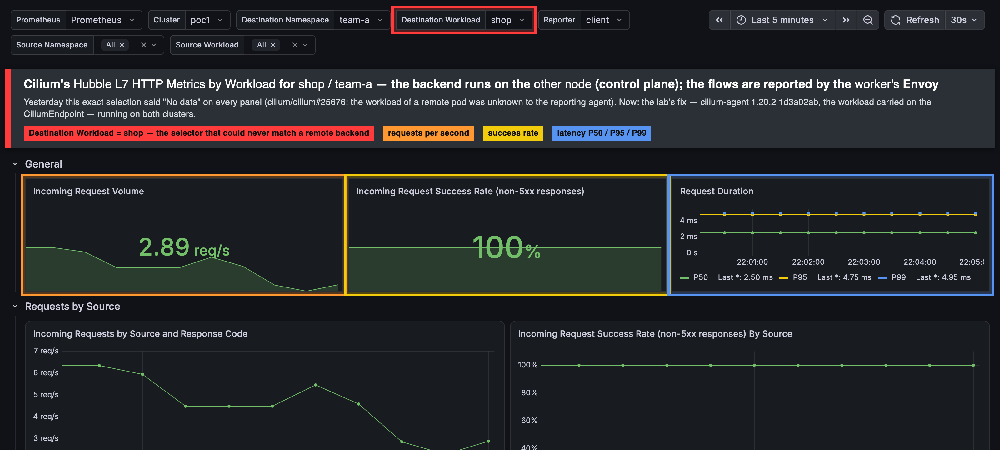

# Demo 39 — Fixing Cilium itself: the workload name of a pod on another node

The other demos use Cilium. This one changes it: takes a bug the lab measured (cilium/cilium#25676 — Hubble's
`destination_workload` is empty when the backend pod runs on a different node from the agent that reports the flow),
finds the lines that cause it, fixes them in a fork, builds the agent image on this Mac, runs it on `poc1`, and measures
the same thing again. Written so a junior engineer can follow each step and see the number change. The operator directed the work and
designed the test cases — the remote placement, the client on the other node, the same image on both clusters, the
before/after captures; the assistant carried them out.

| | |
|---|---|
| **The bug** | cilium/cilium#25676 (open since 2023); our measurement is comment `5723156870` there |
| **The fork** | `ephico2real2/cilium`, branch `hubble/remote-workload-via-cep`, from `v1.20.2` |
| **The lab** | both clusters (`poc1`, `poc2`, two kind nodes each) run the patched agent — the same Cilium everywhere, the operator's rule; the comparison is before/after the rollout, not between clusters |
| **The proof** | the placement table of `docs/HUBBLE-L7-LABELS.md` §3, rerun: `destination_workload` filled for a remote backend |

## 1. What is wrong, in plain words

Hubble labels every flow with where it came from and where it went. For a pod it can say the **namespace**, the **pod
name** and the **workload** — the Deployment or StatefulSet the pod belongs to. The workload name is the one people
put on dashboards, because pod names change on every restart.

Measured on this lab (2026-09-16/17, Cilium 1.20.1 and 1.20.2): when a request goes through a Cilium Gateway, the
flow is reported by the Envoy proxy on the **client's** node. If the backend pod runs on that same node, the workload
name is there. If it runs on the other node, the workload name is empty — the namespace and pod name are still there,
only the workload is missing. Cilium's own *Hubble L7 HTTP Metrics by Workload* dashboard filters on that label, so
for Gateway traffic it shows only the requests whose backend happened to be local.

## 2. Where it comes from — the three files

Read at `v1.20.2`:

1. `pkg/hubble/parser/common/endpoint.go` — Hubble turns an IP into an endpoint here. For a **local** pod it asks the
   agent's endpoint manager, gets the pod object, and reads the workload from the pod's owner references. For a
   **remote** pod it asks the **ipcache** (the agent's map of every IP in the cluster) for `K8sMetadata`, and builds
   the endpoint from that — with no `Workloads`, because:
2. `pkg/ipcache/ipcache.go:94` — `K8sMetadata` has three fields: `Namespace`, `PodName`, `NamedPorts`. Nothing about
   workloads. It is filled, for remote pods, by:
3. `pkg/k8s/watchers/cilium_endpoint.go:215` — the watcher of **CiliumEndpoint** objects (one per pod, written by the
   agent that owns the pod). The CiliumEndpoint's status (`pkg/k8s/apis/cilium.io/v2/types.go`, `EndpointStatus`) has
   identity, networking, named ports, a service account — and no workload.

The agent's pod watcher only sees the pods on its own node (`statedb.Table[k8sTables.LocalPod]`), so a remote agent
cannot look the workload up itself; it has to be told. Two earlier attempts upstream (#27974, #28373, 2023) did just
that and went stale.

## 3. The fix

Carry the workload in the CiliumEndpoint, read it into the ipcache, use it in Hubble:

| Layer | File | Change |
|---|---|---|
| the CRD | `pkg/k8s/apis/cilium.io/v2/types.go` | `EndpointStatus.Workloads []EndpointWorkload{Kind, Name}`; the CRD schema regenerated |
| the writer | `pkg/endpoint/endpoint_status.go` | the owning agent fills it from the pod's owner references (the same helper Hubble uses locally) |
| the wire | `pkg/k8s/types/types.go`, `pkg/k8s/factory_functions.go` | the slim CiliumEndpoint copy carries it |
| the reader | `pkg/k8s/watchers/cilium_endpoint.go`, `pkg/ipcache/ipcache.go` | `K8sMetadata.Workloads` |
| Hubble | `pkg/hubble/parser/common/endpoint.go` | the remote branch sets `Workloads` |

*(The sections below are filled as the work happens: the build, the deploy, the measurement, the review.)*

Three commits on the fork, and the order in which the second and third were found is the lesson of the demo:

| Commit | What | How it was found |
|---|---|---|
| `9a4b6d39` | the CRD field, the writer, the wire, the reader, the **common** resolver's remote branch | the design above, written from the code |
| `cc2cf2e0` | the **L7 parser** takes the workload from the ipcache too | **the measurement**: an hour after the first image ran, an L3/L4 flow from the worker to a control-plane pod named the workload, the Envoy-reported Gateway flow still did not. Hubble has two parsers — `pkg/hubble/parser/seven/parser.go` decodes Envoy's access log and resolves endpoints on its own, never calling the common resolver. OB1, reviewing the first commit at the same hour, wrote "commit 1 alone would have measured nothing on the L7 dashboard" |
| `1d3a02ab` | a local pod without an owner clears a stale value | Codex's review: with the metadata read first, a bare pod (no Deployment behind it) kept the ipcache's workload where it used to report none |

## 4. Build — on this Mac, from the fork

```sh
git clone --depth 1 --branch v1.20.2 https://github.com/cilium/cilium.git ~/gitRepos/cilium   # then the branch from the fork
cd ~/gitRepos/cilium && git fetch fork hubble/remote-workload-via-cep && git checkout FETCH_HEAD
make dev-docker-image DOCKER_IMAGE_TAG=remote-workload DOCKER_BUILD_FLAGS="--platform linux/arm64 --load"
#   → quay.io/cilium/cilium-dev:remote-workload   (979 MB; 86 s the first time with the builder's caches warm from the
#     unit tests, 39 s the second; the build compiles inside quay.io/cilium/cilium-builder, no Go toolchain needed here)
docker run --rm --entrypoint cilium-agent quay.io/cilium/cilium-dev:remote-workload --version
#   cilium-agent 1.20.2 1d3a02ab 2026-09-17T21:17:18-05:00 go version go1.26.8 linux/arm64
```

The commit hash in the version string is the proof you are running your build, not the release.

**Build for both architectures before you pin it.** The first push to the registry was the M5's `linux/arm64` image
alone; GitHub's runners are `linux/amd64`, and the first CI runs on the build died at `Init:ImagePullBackOff` (runs
35306692168, 35306892411). Cilium's Dockerfile cross-compiles (`FROM --platform=$BUILDPLATFORM` for the builder,
`GOARCH=$TARGETARCH` for the Go build), so:

```sh
make dev-docker-image DOCKER_IMAGE_TAG=remote-workload DOCKER_BUILD_FLAGS="--platform linux/amd64,linux/arm64 --load"
docker tag quay.io/cilium/cilium-dev:remote-workload ghcr.io/ephico2real2/cilium-dev:1.20.2-remote-workload-1d3a02ab
docker push ghcr.io/ephico2real2/cilium-dev:1.20.2-remote-workload-1d3a02ab      # both platforms in one index
```

(`docker images --tree` shows the two halves: amd64 258 MB, arm64 979 MB — the arm64 one carries the debug symbols the
builder's cache had; Docker Desktop's containerd image store keeps a multi-platform image locally.)

## 5. Deploy — the same image on both clusters, in this order

The CiliumEndpoint CRD on the cluster prunes fields it does not know: without the schema update the agent's write of
`status.workloads` **succeeds and the field silently disappears** (the API server drops unknown keys; the CRD's status
has no `x-kubernetes-preserve-unknown-fields`). The operator updates the CRD only when the cluster's label
`io.cilium.k8s.crd.schema.version` is lower than the version compiled into the operator — the release operator says
1.33.12, so by hand:

```sh
for c in poc1 poc2; do
  kind load docker-image quay.io/cilium/cilium-dev:remote-workload --name $c          # a locally built image needs the load (gotcha #113)
  kubectl --context kind-$c apply -f ~/gitRepos/cilium/pkg/k8s/apis/cilium.io/client/crds/v2/ciliumendpoints.yaml
  kubectl --context kind-$c label crd ciliumendpoints.cilium.io io.cilium.k8s.crd.schema.version=1.33.13 --overwrite
  kubectl --context kind-$c get crd ciliumendpoints.cilium.io -o jsonpath='{.spec.versions[0].schema.openAPIV3Schema.properties.status.properties.workloads.type}'   # must print: array
  helm upgrade cilium cilium/cilium --version 1.20.2 -n kube-system --kube-context kind-$c --reset-then-reuse-values \
    --set image.repository=quay.io/cilium/cilium-dev --set image.tag=remote-workload --set image.useDigest=false --set image.pullPolicy=IfNotPresent
  kubectl --context kind-$c -n kube-system rollout status ds/cilium --timeout=6m
done
```

Measured: each DaemonSet rolled in 15–16 s; all four agents answer `cilium-agent 1.20.2 1d3a02ab`; `cilium status` OK and
ClusterMesh OK on both. The writer works at once — every CiliumEndpoint carries the field:

```text
$ kubectl --context kind-poc1 -n team-a get ciliumendpoints -o json | jq -r '.items[] | "\(.metadata.name) \(.status.workloads)"'
probe-85dbf9566d-zj56n [{"kind":"Deployment","name":"probe"}]
shop-7fcb74f6f6-rx97q  [{"kind":"Deployment","name":"shop"}]
```

(`--reset-then-reuse-values`, not `--reuse-values` — gotcha #117: the latter would have kept the release image.)

## 6. The measurement — the same query as before the fix

The setup that showed the bug: the `shop` pods of `team-a` and `team-b` run on the **control plane**; the client
`forensic/client` runs on the **worker**; it calls the two Gateway addresses, so the Envoy on the **worker** reports
the flows, and the backend is remote to it.

```sh
kubectl --context kind-poc1 -n forensic exec client -- sh -c 'for i in $(seq 1 40); do
  curl -sk -o /dev/null --resolve shop-a.poc.local:443:172.18.255.240 https://shop-a.poc.local/
  curl -sk -o /dev/null --resolve shop.team-b.poc.local:443:172.18.255.243 https://shop.team-b.poc.local/; done'
curl -s http://172.18.0.3:9965/metrics | grep '^hubble_http_requests_total' | grep 'destination_namespace="team-'   # the worker's agent
```

| Agent image | L3/L4 flow, worker → control-plane pod (`hubble observe`) | L7 Gateway flow, reporter = worker, backend on control plane (`hubble_http_requests_total`) |
|---|---|---|
| **1.20.2** (2026-09-17 morning) | `destination.workloads` absent | `destination_workload=""` |
| **commit 1** `9a4b6d39` | **`[{Deployment shop}]`** | `destination_workload=""` — unchanged |
| **commit 3** `1d3a02ab` | `[{Deployment shop}]` | **`destination_workload="shop"`**, 40/40 for both teams |

And where people look — Cilium's own *Hubble L7 HTTP Metrics by Workload* dashboard, filtered to destination workload
`shop` in `team-a`, reporter `client` — the selection that was "No data" for a remote backend yesterday
(`docs/upstream/images/l7-by-workload-team-a-no-data.png`):



The boxes and the banner are drawn by the capture script over the live page (`capture-highlight.js`), not part of
the dashboard — one colour each, named in the banner's key: **red** the selector *Destination Workload = shop*, which
could never match a remote backend before; **orange** requests per second, **yellow** the success rate, **blue** the
latency percentiles — the three panels that said "No data". The unmarked full page: [`output/l7-by-workload-remote-backend-after-fix.png`](output/l7-by-workload-remote-backend-after-fix.png).

1.71 req/s, 100 % non-5xx, P50/P95/P99. The one empty panel, *CPU Usage by Source*, reads kube-state-metrics for the
source's workload — the client is a bare pod, so by the third commit's rule it has none: correct, not a gap.

## 6b. The measurement as a script — `check.sh`

[`check.sh`](check.sh) does §6 unattended and prints three PASS/FAIL rows: it finds the backend pod and its node,
starts a curl pod on the **other** node, sends the Gateway requests from there, reads that node's agent's Hubble
metrics and names the build that answered (`cilium-agent 1.20.2 1d3a02ab`). It is what the CI runs on the patched
image. On this lab, 2026-09-18:

```text
  PASS   The reporting agent is on a different node than the backend            client on poc1-worker, backend on poc1-control-plane
  PASS   Gateway requests reached the backend                                    40/40 HTTP 200
  PASS   Hubble names the remote backend's workload on the Envoy-reported flow   destination_workload="shop" (3 series)
```

On release 1.20.2 the third row is FAIL with `destination_workload=""` — the same script, the same placement.

## 7. What the reviewers said, and where this goes

`docs/REVIEW_CILIUM_FIX.md`. OB1 (Fable 5.1) and Codex agree: correct for a pod on another node of the same cluster
with CiliumEndpointSlices off — the lab's case; **not** carried through CiliumEndpointSlices or across a Cluster Mesh
(the field is not on the slice or on the kvstore's `IPIdentityPair`); the documentation says so. And both found what
this exercise could not know from the code alone: upstream already has an open draft — **cilium/cilium#48563** (2026-09-08,
46 files) — doing the same with CES, the kvstore path and all three parsers; its 2025 predecessor #36011 was closed for
being CEP-only, which is exactly this branch's shape. So this is not a competing pull request. What the lab can bring
to #48563 is what it has and the draft lacks: the CRD schema-version bump (`register.go` is not among its files) and a
measured, two-node reproduction of the Gateway/Envoy case. That text is drafted under `docs/upstream/drafts/` for the
operator to read; nothing is posted without their word.

## 8. What to take away

- A fix you can build, load and roll on a laptop in under two minutes is a fix you can *measure* — and the measurement,
  not the code reading, found the second parser.
- A CRD field that the cluster's schema does not know is dropped **silently**; check the schema before you trust a
  status write.
- Before writing a fix, search the project's open pull requests as hard as its issues: the shape you arrive at may be
  a draft someone is already defending.
- The same Cilium on every cluster, always — the comparison is before/after, not poc1/poc2.
