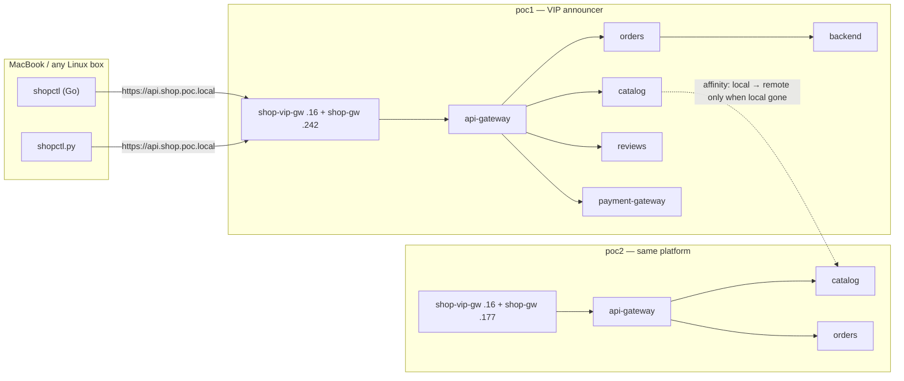

# Demo 41 — the shop platform on the mesh, phase 1: the platform behind the doors, global, one URL

**Where this sits in the whole:** [enhancement 002](../../enhancements/002-shop-platform-clustermesh.md)
revision 4, tracking issue #42, §4 row 1. Demo 40 laid the doors; this phase puts demo 35's
platform behind them, twice, with global services that prefer home. Nothing from phases 2–5
(no database, no egress gateway, no HPA, no failure scenarios). Builds happened in demo 40;
this phase **measures** (gotcha #118: no docker on the VM while measuring).

## Summary context — the enterprise case

One public URL, a door per cluster, the same platform twice. An external customer keeps calling
`https://api.shop.poc.local`; what happens behind that address is the mesh's business. Each
cluster also has its own door (`api.poc1.shop.poc.local`, `api.poc2.shop.poc.local`) so an
operator can watch one side without going through the VIP.

The platform is byte-identical in both clusters: the same namespaces, the same Deployments, every
stateless Service annotated `service.cilium.io/global: "true"` and `service.cilium.io/affinity:
local`. The only per-cluster value is `CLUSTER` for the Go backend, and that lives in
ConfigMap `shop-cluster` written by `apply-both.sh` (`data.name=poc1` / `poc2`), not in the
manifest.

`X-Served-By` is set by the Gateway in the cluster the request **entered**. It names the door,
not whether the backend behind api-gateway was local or remote. That second question is Hubble's
`destination.cluster_name`, measured in phase 5.



## Files

| File | What |
|---|---|
| [`10-platform.yaml`](10-platform.yaml) | demo 35's platform, cluster-neutral and global, plus `backend` (`shopapi:local`) |
| [`20-routes-poc1.yaml`](20-routes-poc1.yaml) / [`20-routes-poc2.yaml`](20-routes-poc2.yaml) | two files a junior can read (demo 40's choice): HTTPRoute on both doors, `X-Served-By`, :80→301 |
| [`20-default-deny-ingress.yaml`](20-default-deny-ingress.yaml) | demo 35's default-deny, applied to both clusters |
| [`apply-both.sh`](apply-both.sh) | ConfigMap, platform, routes, Mac probes, global-service measurement |
| [`probe.sh`](probe.sh) | both `shopctl`s; needs `/etc/hosts` |
| [`audit-both.sh`](audit-both.sh) / [`flows-both.sh`](flows-both.sh) / [`generate-both.sh`](generate-both.sh) / [`verdicts-both.sh`](verdicts-both.sh) | demo 35's workflow, generalised |
| [`observe-and-enforce.sh`](observe-and-enforce.sh) | the R10 sequence as one command |
| [`check.sh`](check.sh) | PASS/FAIL rows; exit = FAIL count |
| [`cleanup.sh`](cleanup.sh) | routes, policies, platform; leaves demo 40's doors |
| [`policies/poc1/`](policies/poc1/) / [`policies/poc2/`](policies/poc2/) | generated CNPs and the AUDIT flows they came from |
| clients | still in [`demos/40-shop-mesh-phase0/client/`](../40-shop-mesh-phase0/client/) (built in phase 0) |

## Steps

From the repo root, both clusters up, demo 40 applied (`shopapi:local` on the nodes, both
`shopctl`s built). Do not rebuild.

```bash
demos/41-shop-mesh-phase1/apply-both.sh
demos/40-shop-mesh-phase0/hosts-entries.sh | sudo tee -a /etc/hosts   # once; probe.sh needs it
demos/41-shop-mesh-phase1/observe-and-enforce.sh
demos/41-shop-mesh-phase1/probe.sh
demos/41-shop-mesh-phase1/check.sh
```

`apply-both.sh` writes ConfigMap `shop-cluster` per context, applies the byte-identical platform,
waits for every Deployment Available (≤ 180 s), applies the per-cluster routes, waits for both
HTTPRoutes Accepted+ResolvedRefs on both doors, prints the four hosts names, probes the three
doors from the Mac with `curl --resolve`, and records `cilium-dbg service list` for catalog.
Every command goes through `scripts/record.sh` into [`output/transcript.txt`](output/transcript.txt).

Final table from this run (header parsing of HTTP/2's lowercase `x-served-by` is in `check.sh`;
the live curls are below):

```text
CLUSTER  DEPLOYMENTS  HTTPROUTES                         VIP                         POC1_DOOR                    POC2_DOOR
poc1     7/7          2/2 accepted, 2/2 resolved         200 X-Served-By=poc1         200 X-Served-By=poc1         200 X-Served-By=poc2
poc2     7/7          2/2 accepted, 2/2 resolved         200 X-Served-By=poc1         200 X-Served-By=poc1         200 X-Served-By=poc2
```

The three door probes, recorded 2026-09-18 (`curl -sk --resolve … -D -`):

```text
https://api.shop.poc.local/          @ 172.18.255.16   HTTP/2 200  x-served-by: poc1
https://api.poc1.shop.poc.local/     @ 172.18.255.242  HTTP/2 200  x-served-by: poc1
https://api.poc2.shop.poc.local/     @ 172.18.255.177  HTTP/2 200  x-served-by: poc2
```

`scripts/vip-takeover.sh --status` named poc1; the VIP header matches. The header is set by the
Gateway that served the **door**.

The client's three paths through the VIP (and the same on each per-cluster door):

```text
GET /healthz  HTTP/2 200  x-served-by: poc1    (api-gateway's own nginx)
GET /ready    HTTP/2 503  x-served-by: poc1    (proxied to backend; no database until phase 2)
GET /orders   HTTP/2 503  x-served-by: poc1    (proxied to backend; same)
```

`probe.sh` runs both `shopctl`s against `https://api.shop.poc.local` and expects exactly that.
On this Mac `api.shop.poc.local` was not in `/etc/hosts`; the script printed the four names and
stopped (exit 2). `check.sh` uses `curl --resolve` so it does not depend on hosts.

`check.sh` (exit 0), recorded 2026-09-18 (condensed):

```text
  PASS   every platform Deployment Available in both clusters (7+7)
  PASS   HTTPRoutes Accepted+ResolvedRefs on both doors in both clusters (shop-api, shop-redirect)
  PASS   VIP @ .16 → 200 X-Served-By=poc1 (announcer=poc1)
  PASS   .242 → 200 X-Served-By=poc1; .177 → 200 X-Served-By=poc2
  WARN   catalog remote backends omitted under affinity:local (both clusters)
  PASS   enforced shop policies exist (7 CNPs per cluster, managed-by=cf2cnp)
  PASS   VIP /healthz still 200 after policies; X-Served-By present
```

## What was measured

**The three doors answer, and the header names the door.** A `ResponseHeaderModifier` `set` of
`X-Served-By` on an HTTPRoute attached to both `shop-vip-gw` and `shop-gw` was Accepted on every
parent (Cilium 1.20.2, the same filter demo 37 uses as `X-Door`). HTTP/2 prints the header
lowercase. The VIP's value followed `vip-takeover.sh --status` (poc1). Hitting `.177` produced
`poc2` even though the VIP is announced by poc1 — each door is its own Gateway.

**Global services with `affinity: local` hide remote backends in `cilium-dbg service list`.**
Catalog is annotated `global=true` + `affinity=local` in both clusters. While a local backend is
healthy, the service list shows only that backend (`poc1 10.10.0.46`, `poc2 10.20.0.135`). The
JSON has no `global` / `affinity` flag; `bpf lb list` has no affinity column — the flags read
`[ClusterIP, non-routable]`. Removing the affinity annotation (diagnostic, then restored) made
the remote appear immediately:

```text
poc1 catalog  1 => 10.10.0.46:80 (local)   2 => 10.20.0.135:80 (poc2)
poc2 catalog  1 => 10.10.0.46:80 (poc1)    2 => 10.20.0.135:80 (local)
```

Restoring `affinity: local` hid them again. Demo 07's `rebel-base` (global, **no** affinity)
still lists four backends spanning both CIDRs, so the mesh itself is fine. `check.sh` WARNs
this, it does not FAIL it. A shopper wget of `http://catalog.shop-core.svc.cluster.local/healthz`
from poc1 returned `ok`.

**cf2cnp is poc1-only; Hubble on poc2 is enough.** poc1 runs `hubble-observer-cf2cnp` 1/1;
poc2 has no cf2cnp Deployment. Both clusters' relays answered `hubble observe --kube-context`.
`generate-both.sh` POSTed each cluster's flows to `https://cf2cnp.poc.local/generate` on poc1
(demo 26's path through `routes-gw`). poc1: 214 AUDIT INGRESS flows; poc2: 218. Seven policies
each, stranger excluded.

**The generated selectors have no cluster label.** `grep io.cilium.k8s.policy.cluster` on both
YAML files is 0. Cilium 1.19+ (`policy.rst`): a selector without that label matches the **local**
cluster only. The flows were same-cluster (phase 1 does not produce S2's cross-cluster calls),
so cf2cnp correctly omitted it. Copying poc1's YAML onto poc2 would have been valid; it was
unnecessary because poc2 generated its own. api-gateway's policy also has `fromEntities:
[ingress]` — the Gateway's identity, measured.

```text
shop-edge      api-gateway      Allow ingress to api-gateway in shop-edge: from shopper in shop-clients on TCP/80; from entities ingress on TCP/80
shop-core      backend          Allow ingress to backend in shop-core: from orders on TCP/8080; from api-gateway in shop-edge on TCP/8080
shop-core      catalog          Allow ingress to catalog in shop-core: from orders on TCP/80; from api-gateway in shop-edge on TCP/80; from merchant in shop-merchant on TCP/80; from reviews in shop-reviews on TCP/80
shop-payments  payment-gateway  Allow ingress to payment-gateway in shop-payments: from orders in shop-core on TCP/80; from api-gateway in shop-edge on TCP/80
shop-core      orders           Allow ingress to orders in shop-core: from api-gateway in shop-edge on TCP/80
shop-reviews   reviews          Allow ingress to reviews in shop-reviews: from api-gateway in shop-edge on TCP/80; from ratings on TCP/80
shop-merchant  merchant         Allow ingress to merchant in shop-merchant: from payment-gateway in shop-payments on TCP/80
```

After `audit-both.sh Disabled`, `/healthz` through all three doors stayed 200 with the header.
Intended paths that had been AUDIT became FORWARDED by the named policy; the stranger stayed
without a rule.

## Known limitations

`/ready` and `/orders` are **503** until phase 2. api-gateway proxies both to `backend`
(`shopapi`); `/ready` is `SELECT 1` against `db-service.poc.local`, and there is no database
yet. Readiness on the backend Deployment is `/healthz` this phase (the pod stays Ready);
phase 2 moves it to `/ready` so a backend that cannot reach the DB is taken out of the Service.

`probe.sh` needs the `/etc/hosts` block. It never writes the file. `check.sh` and `apply-both.sh`
pin the name with `curl --resolve`.

Scaling catalog to 0 in poc1 to watch affinity fail over is scenario S2 of phase 5, not an
exercise here.

## Cleanup

```bash
demos/41-shop-mesh-phase1/cleanup.sh
```

Removes the HTTPRoutes, the generated policies, and the platform in both clusters. KEPT: demo
40's doors (`shop-gw`, `shop-vip-gw`, `shop-tls`), `shop-vip-announce`, `shared-vip-pool`,
namespace `shop-edge`.

## Where phase 2 starts

Demo 42 adds `shop-db` in poc1 only, `db-gw` with a TCPRoute on 5432, CoreDNS `hosts` for
`db-service.poc.local` in both clusters, and moves backend readiness to `/ready`. Then `/ready`
and `/orders` through the public URL become 200, and the backend's policy is regenerated as
`toFQDNs`.
