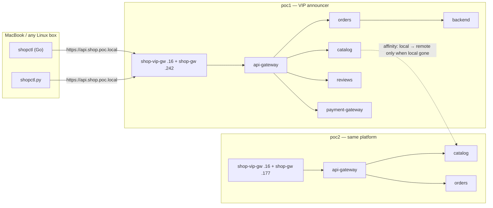

# Demo 41 — the shop platform on the mesh, phase 1: the platform behind the doors, global, one URL

For the reader in a hurry: [RECAP.md](RECAP.md) — what this demo did and proved, in plain English.

**Where this sits in the whole:** [enhancement 002](../../enhancements/002-shop-platform-clustermesh.md)
revision 4, tracking issue #42, §4 row 1. Demo 40 laid the doors; this phase puts demo 35's
platform behind them, twice, with global services that prefer home. Nothing from phases 2–5
(no database, no egress gateway, no HPA, no failure scenarios). Builds happened in demo 40;
this phase **measures** (gotcha #118: no docker on the VM while measuring).

## Summary context — the enterprise case

One public URL, a door per cluster, the same platform twice. An external customer keeps calling
`https://api.shop.poc.local`; what happens behind that address is the mesh's business. Each
cluster also has its own door (`api.poc1.shop.poc.local`, `api.poc2.shop.poc.local`) so an
operator can watch one side without going through the VIP.

The platform is byte-identical in both clusters: the same namespaces, the same Deployments, every
stateless Service annotated `service.cilium.io/global: "true"` and `service.cilium.io/affinity:
local`. The only per-cluster value is `CLUSTER` for the Go backend, and that lives in
ConfigMap `shop-cluster` written by `apply-both.sh` (`data.name=poc1` / `poc2`), not in the
manifest.

`X-Served-By` is set by the Gateway in the cluster the request **entered**. It names the door,
not whether the backend behind api-gateway was local or remote. That second question is Hubble's
`destination.cluster_name`, measured in phase 5.



## Files

| File | What |
|---|---|
| [`10-platform.yaml`](10-platform.yaml) | demo 35's platform, cluster-neutral and global, plus `backend` (`shopapi:local`) |
| [`20-routes-poc1.yaml`](20-routes-poc1.yaml) / [`20-routes-poc2.yaml`](20-routes-poc2.yaml) | two files a junior can read (demo 40's choice): HTTPRoute on both doors, `X-Served-By`, :80→301 |
| [`20-default-deny-ingress.yaml`](20-default-deny-ingress.yaml) | demo 35's default-deny, applied to both clusters |
| [`apply-both.sh`](apply-both.sh) | ConfigMap, platform, routes, Mac probes, global-service measurement |
| [`probe.sh`](probe.sh) | both `shopctl`s; needs `/etc/hosts` |
| [`audit-both.sh`](audit-both.sh) / [`flows-both.sh`](flows-both.sh) / [`generate-both.sh`](generate-both.sh) / [`verdicts-both.sh`](verdicts-both.sh) | demo 35's workflow, generalised |
| [`observe-and-enforce.sh`](observe-and-enforce.sh) | the R10 sequence as one command |
| [`check.sh`](check.sh) | PASS/FAIL rows; exit = FAIL count |
| [`cleanup.sh`](cleanup.sh) | routes, policies, platform; leaves demo 40's doors |
| [`policies/poc1/`](policies/poc1/) / [`policies/poc2/`](policies/poc2/) | generated CNPs and the AUDIT flows they came from |
| clients | still in [`demos/40-shop-mesh-phase0/client/`](../40-shop-mesh-phase0/client/) (built in phase 0) |

## Steps

From the repo root, both clusters up, demo 40 applied (`shopapi:local` on the nodes, both
`shopctl`s built). Do not rebuild.

```bash
demos/41-shop-mesh-phase1/apply-both.sh
demos/40-shop-mesh-phase0/hosts-entries.sh | sudo tee -a /etc/hosts   # once; probe.sh needs it
demos/41-shop-mesh-phase1/observe-and-enforce.sh
demos/41-shop-mesh-phase1/probe.sh
demos/41-shop-mesh-phase1/check.sh
```

`apply-both.sh` writes ConfigMap `shop-cluster` per context, applies the byte-identical platform,
waits for every Deployment Available (≤ 180 s), applies the per-cluster routes, waits for both
HTTPRoutes Accepted+ResolvedRefs on both doors, prints the four hosts names, probes the three
doors from the Mac with `curl --resolve`, and records `cilium-dbg service list` for catalog.
Every command goes through `scripts/record.sh` into [`output/transcript.txt`](output/transcript.txt).

Final table from this run (`apply-both.sh` step 9, 2026-09-18T14:32:17Z). HTTP/2 prints
`x-served-by` lowercase with `\r`; `header_of` strips CR and matches the name
case-insensitively:

```text
CLUSTER  DEPLOYMENTS    HTTPROUTES             VIP                          POC1_DOOR                    POC2_DOOR
poc1     7/7            2/2 accepted, 2/2 resolved 200 X-Served-By=poc1         200 X-Served-By=poc1         200 X-Served-By=poc2
poc2     7/7            2/2 accepted, 2/2 resolved 200 X-Served-By=poc1         200 X-Served-By=poc1         200 X-Served-By=poc2
```

The three door probes, recorded 2026-09-18T14:32:11Z (`curl -sk --resolve … -D -`):

```text
https://api.shop.poc.local/          @ 172.18.255.16   HTTP/2 200  x-served-by: poc1
https://api.poc1.shop.poc.local/     @ 172.18.255.242  HTTP/2 200  x-served-by: poc1
https://api.poc2.shop.poc.local/     @ 172.18.255.177  HTTP/2 200  x-served-by: poc2
```

`scripts/vip-takeover.sh --status` named poc1; the VIP header matches. The header is set by the
Gateway that served the **door**.

`:80` with the HTTP Host header is a 301 to HTTPS (Location includes `:443`). A bare
`http://172.18.255.16/` (no Host match) is **404**:

```text
http://api.shop.poc.local/ @ 172.18.255.16  HTTP/1.1 301  Location: https://api.shop.poc.local:443/
http://172.18.255.16/                       HTTP/1.1 404  (no Host header, no route)
```

The client's three paths through the VIP (and the same on each per-cluster door):

```text
GET /healthz  HTTP/2 200  x-served-by: poc1    (api-gateway's own nginx)
GET /ready    HTTP/2 503  x-served-by: poc1    (proxied to backend; no database until phase 2)
GET /orders   HTTP/2 503  x-served-by: poc1    (proxied to backend; same)
```

`probe.sh` runs both `shopctl`s against `https://api.shop.poc.local` and expects exactly that.
It compares the resolved address to the live `shop-vip-gw` VIP; a stale `/etc/hosts` entry
exits 2. `check.sh` uses `curl --resolve` so it does not depend on hosts.

`check.sh` (exit 0), recorded 2026-09-18T14:32:18Z through `apply-both.sh` (condensed from
the transcript; every line below is a transcript row):

```text
  PASS   VIP https://api.shop.poc.local @ 172.18.255.16                         http_code=200 X-Served-By=poc1 announcer=poc1        200 and X-Served-By equals vip-takeover.sh --status
  PASS   https://api.poc1.shop.poc.local @ 172.18.255.242                       http_code=200 X-Served-By=poc1                       200 and X-Served-By=poc1
  PASS   https://api.poc2.shop.poc.local @ 172.18.255.177                       http_code=200 X-Served-By=poc2                       200 and X-Served-By=poc2
  PASS   http://api.shop.poc.local @ 172.18.255.16 redirects                    http_code=301 Location=https://api.shop.poc.local:443/ 301 and exactly one Location beginning https://api.shop.poc.local/ (optional :443)
  PASS   poc1 catalog backends under affinity:local                             known=2 (clustermesh=1) selected=1 local             affinity local — remote backends known, not selected while a local one is Active (pkg/clustermesh/selectbackends.go)
  PASS   poc2 catalog backends under affinity:local                             known=2 (clustermesh=1) selected=1 local             affinity local — remote backends known, not selected while a local one is Active (pkg/clustermesh/selectbackends.go)
  PASS   poc1 has exactly the seven generated shop policies                     7/7 exact names                                      exact generated policy inventory, managed-by=cf2cnp
  PASS   poc1 shop endpoints enforce ingress policy                             8/8 policy-enabled, PolicyAuditMode=Disabled         every service endpoint and ratings enforces policy with audit disabled
  PASS   poc2 has exactly the seven generated shop policies                     7/7 exact names                                      exact generated policy inventory, managed-by=cf2cnp
  PASS   poc2 shop endpoints enforce ingress policy                             8/8 policy-enabled, PolicyAuditMode=Disabled         every service endpoint and ratings enforces policy with audit disabled
  PASS   VIP /healthz still 200 after policies                                  http_code=200 X-Served-By=poc1                       probe /healthz is 200 with the header
```

## What was measured

**The three doors answer, and the header names the door.** A `ResponseHeaderModifier` `set` of
`X-Served-By` on an HTTPRoute attached to both `shop-vip-gw` and `shop-gw` was Accepted on every
parent (Cilium 1.20.2, the same filter demo 37 uses as `X-Door`). HTTP/2 prints the header
lowercase. The VIP's value followed `vip-takeover.sh --status` (poc1). Hitting `.177` produced
`poc2` even though the VIP is announced by poc1 — each door is its own Gateway.

**Global services with `affinity: local` keep remote backends known, not selected, while a
local one is Active.** Catalog is annotated `global=true` + `affinity=local` in both clusters.
Cilium 1.20.2 `pkg/clustermesh/selectbackends.go` sets
`useRemote = localActiveBackends == 0 && remoteBackends > 0`; the yield loop skips
`be.Source == source.ClusterMesh` when `!useRemote`. They are not hidden from a display: they
are not in the datapath. They take over the instant the last local Active backend goes — the
other cluster's copy is known and held in reserve, not in the path, until the last local one
dies. Phase 5's S2 shows the switch.

Live (poc1 agent, `check.sh`): `cilium-dbg statedb backends` has two `shop-core/catalog` rows —
`10.10.0.46` (`Source` k8s) and `10.20.0.135` (`Source` clustermesh). `cilium-dbg bpf lb list`
for `10.11.58.134:80` selects only `10.10.0.46`. poc2 is the mirror (`10.21.123.1:80` →
`10.20.0.135`). `check.sh` PASSes `known=2 (clustermesh=1) selected=1 local` on both clusters.
`cilium-dbg service list` prints that selected set (one backend). Under enforced policy a
shopper wget of `http://catalog.shop-core.svc.cluster.local/healthz` times out: shopper is not a
catalog caller (it goes through api-gateway).

**cf2cnp is poc1-only; Hubble on poc2 is enough.** poc1 runs `hubble-observer-cf2cnp` 1/1;
poc2 has no cf2cnp Deployment. Both clusters' relays answered `hubble observe --kube-context`.
`hubble observe` has `--cluster` (also `--from-cluster` / `--to-cluster` / `--node-name`).
Capture goes through the mesh relay, so each file is filtered to its own cluster:
`.flow.node_name` is `<cluster>/<node>` (measured). `flows-both.sh` now passes `--cluster <name>`
and keeps lines whose `node_name` starts with that cluster.

The input to each cluster's `/generate` is that filtered file, POSTed to
`https://cf2cnp.poc.local/generate` on poc1 (demo 26's path through `routes-gw`):

- `policies/poc1/flows-audit.ndjson` — 151 lines, all `node_name` `poc1/…` (the mixed capture had 214, of
  which 136 were poc2 nodes → 78 poc1 lines; then two poc1-only captures were appended, see below)
- `policies/poc2/flows-audit.ndjson` — 140 lines, all `node_name` `poc2/…` (was 218, of which 78
  were poc1 nodes)

Regenerating from those files: poc2's YAML came out byte-identical to the applied policies. poc1's first
regenerate (78 lines) **dropped** `fromEntities: ingress` on api-gateway and `from api-gateway` on backend —
in the mixed capture those two rules had been inferred from poc2-node flows; poc1's own window had held no
Gateway traffic through poc1's door. The evidence was completed from poc1 alone: six requests to
`api.poc1.shop.poc.local` and the VIP, then `hubble observe --cluster poc1 --to-label app=api-gateway` filtered
to `node_name poc1/…` and `reserved:ingress` sources — **43 flows**, both poc1 nodes; then `/orders` and
`/ready` through poc1's door and the api-gateway → backend flows — **30 flows**. Regenerated from the 151-line
poc1 file, **every applied ingress rule is reproduced identically** (compared spec by spec with
`kubectl apply --dry-run=client -o json`). cf2cnp adds two things the applied set does not carry, both
rejected in review: an *egress* rule for api-gateway → backend (phase 1's set is ingress-only, demo 35's
model) and a `default/unknown` egress policy with an **empty `endpointSelector`** generated for the
`reserved:ingress` source — a cf2cnp defect on reserved-identity sources (an empty selector in a policy
would select every endpoint in its namespace), recorded for the cf2cnp fork. Seven policies each,
`app.kubernetes.io/managed-by: cf2cnp`, stranger excluded; the live policies were not changed.

**The generated selectors have no cluster label.** `grep io.cilium.k8s.policy.cluster` on both
YAML files is 0. Cilium 1.19+ (`policy.rst`): a selector without that label matches the **local**
cluster only. The flows were same-cluster (phase 1 does not produce S2's cross-cluster calls),
so cf2cnp correctly omitted it. Copying poc1's YAML onto poc2 would have been valid; it was
unnecessary because poc2 generated its own. api-gateway's policy also has `fromEntities:
[ingress]` — the Gateway's identity, measured.

```text
shop-edge      api-gateway      Allow ingress to api-gateway in shop-edge: from shopper in shop-clients on TCP/80; from entities ingress on TCP/80
shop-core      backend          Allow ingress to backend in shop-core: from orders on TCP/8080; from api-gateway in shop-edge on TCP/8080
shop-core      catalog          Allow ingress to catalog in shop-core: from orders on TCP/80; from api-gateway in shop-edge on TCP/80; from merchant in shop-merchant on TCP/80; from reviews in shop-reviews on TCP/80
shop-payments  payment-gateway  Allow ingress to payment-gateway in shop-payments: from orders in shop-core on TCP/80; from api-gateway in shop-edge on TCP/80
shop-core      orders           Allow ingress to orders in shop-core: from api-gateway in shop-edge on TCP/80
shop-reviews   reviews          Allow ingress to reviews in shop-reviews: from api-gateway in shop-edge on TCP/80; from ratings on TCP/80
shop-merchant  merchant         Allow ingress to merchant in shop-merchant: from payment-gateway in shop-payments on TCP/80
```

After `audit-both.sh Disabled`, `/healthz` through all three doors stayed 200 with the header.
Enforcement, recorded 2026-09-18T14:32:51Z on both clusters: stranger's
`wget http://catalog.shop-core/healthz` failed (`rc=1 output=wget: download timed out`);
shopper's `wget http://api-gateway.shop-edge/catalog/healthz` returned the catalog pod name;
`hubble observe --verdict DROPPED` showed `stranger -> catalog-… shop-core DROPPED` and
`--verdict FORWARDED` showed `api-gateway-… -> catalog-… FORWARDED`.

**Resources (the platform ×2 on the four nodes), measured 2026-09-18 beside the plan's §8
baseline (17.0 GiB used, ~1.1 cores).** `kubectl top nodes`:

```text
poc1-control-plane   396m   7431Mi
poc1-worker          244m   5534Mi
poc2-control-plane   200m   3351Mi
poc2-worker          167m   3079Mi
```

Sum: 1007m CPU (~1.0 core), 19395 Mi (~18.9 GiB). `docker stats --no-stream` on the four kind
nodes: 7.168 + 5.393 + 3.302 + 3.031 = 18.894 GiB. Delta vs §8: about **+1.9 GiB** RAM, CPU
unchanged around one core. The declared platform requests (310m CPU / 480Mi across both
clusters) sit inside that headroom.

## Known limitations

`/ready` and `/orders` are **503** until phase 2. api-gateway proxies both to `backend`
(`shopapi`); `/ready` is `SELECT 1` against `db-service.poc.local`, and there is no database
yet. Readiness on the backend Deployment is `/healthz` this phase (the pod stays Ready);
phase 2 moves it to `/ready` so a backend that cannot reach the DB is taken out of the Service.

`probe.sh` needs the `/etc/hosts` block. It never writes the file. `check.sh` and `apply-both.sh`
pin the name with `curl --resolve`.

Scaling catalog to 0 in poc1 to watch affinity fail over is scenario S2 of phase 5, not an
exercise here.

## Cleanup

```bash
demos/41-shop-mesh-phase1/cleanup.sh
```

Removes the HTTPRoutes, the generated policies, and the platform in both clusters. KEPT: demo
40's doors (`shop-gw`, `shop-vip-gw`, `shop-tls`), `shop-vip-announce`, `shared-vip-pool`,
namespace `shop-edge`.

## Where phase 2 starts

Demo 42 adds `shop-db` in poc1 only, `db-gw` with a TCPRoute on 5432, CoreDNS `hosts` for
`db-service.poc.local` in both clusters, and moves backend readiness to `/ready`. Then `/ready`
and `/orders` through the public URL become 200, and the backend's policy is regenerated as
`toFQDNs`.
