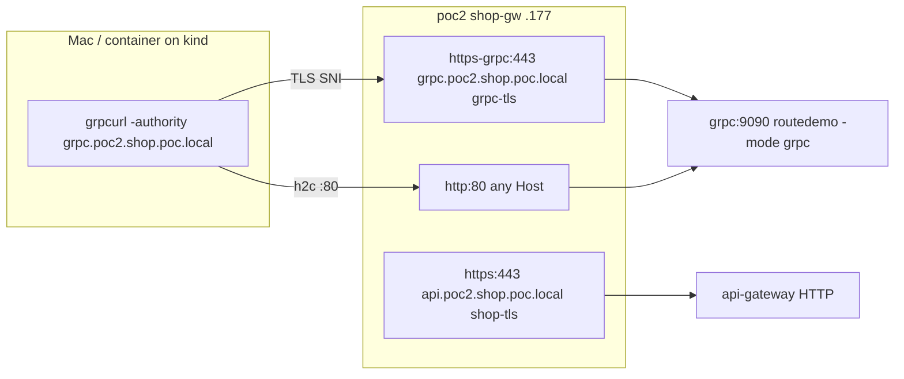

# Demo 53 — gRPC parity on the Cilium clusters

For the reader in a hurry: [RECAP.md](RECAP.md) — what this demo did and proved, in plain English.

**Where this sits in the whole:** [enhancement 007](https://github.com/ephico2real2/cilium-implementation-poc/blob/enh-007-envoy-gateway-lab/enhancements/007-envoy-gateway-lab.md)
§1 R10, §4 row 3b, §5 D9; tracking issue [#58](https://github.com/ephico2real2/cilium-implementation-poc/issues/58)
(parent [#53](https://github.com/ephico2real2/cilium-implementation-poc/issues/53)). Demo 09 put gRPC behind
`routes-gw` on poc1. Demos 40 and 41 put HTTP behind `shop-gw` on poc2. This demo puts the **same app and
the same test** on poc2's shop door, so both Cilium clusters answer `SERVING` before demos 51/52 do it
on Envoy Gateway. The plan file lives on branch `enh-007-envoy-gateway-lab`; this branch does not edit it.
Row 3b's real file names are the ones in **Files** below.

No docker build (gotcha #118). `routedemo:local` is already on all four nodes.

## Summary context — the enterprise case

HTTP and gRPC through the **same door**, not a second load balancer. An operator who already has
`shop-gw` at `172.18.255.177` for `api.poc2.shop.poc.local` adds a gRPC name on that Gateway. The
customer still has one address; SNI and `:authority` pick the protocol.

A Gateway listener has **one** hostname. `shop-gw`'s `https` listener is already
`api.poc2.shop.poc.local` (demo 40), and demo 41's `HTTPRoute` `shop-api` occupies that name. Two
Gateway API rules then force a third listener:

1. **Listener hostname must intersect the route hostname.** If both specify hostnames and none
   intersect, the route is not accepted (`GRPCRouteSpec.hostnames` in Gateway API v1.6.1,
   `crds/gateway-api/v1.6.1/gateway.networking.k8s.io_grpcroutes.yaml`).
   `grpc.poc2.shop.poc.local` does not intersect `api.poc2.shop.poc.local`.
2. Gateway API requires an implementation to accept exactly one HTTPRoute or GRPCRoute when the two
   route kinds overlap on the same listener and hostname. Cilium 1.20.2 does not implement that cross-kind arbitration
   in its route-status path: it validates HTTPRoutes and GRPCRoutes
   separately, then appends both kinds during Gateway ingestion. A hypothetical GRPCRoute using
   `api.poc2.shop.poc.local` would therefore likely be accepted and rendered alongside `shop-api`.
   This demo does not rely on that non-conforming behavior: the distinct
   `grpc.poc2.shop.poc.local` listener avoids the conflict and remains portable to conforming
   Gateway API implementations. Read from the code, not measured: the MUST is
   `vendor/sigs.k8s.io/gateway-api/apis/v1/grpcroute_types.go:126-137` in `~/gitRepos/cilium`;
   Cilium 1.20.2 evaluates the kinds separately in `operator/pkg/gateway-api/routechecks` /
   `status_route.go:77-98,144-150,178-207` and appends both in `ingestion/gateway.go:194-210`.
   This demo does not apply a conflicting route.

So poc2 gets listener `https-grpc` on **the same port 443**, distinguished by SNI — the same
pattern as demo 09's two HTTPS listeners — and a second Certificate `grpc-tls` (CN and SAN
`grpc.poc2.shop.poc.local`, ClusterIssuer `ca-issuer`, the same root as `shop-tls`). The `:80`
listener has **no** hostname and already serves plaintext for any `Host`; the GRPCRoute attaches
there too, which is **h2c** (HTTP/2 cleartext). TLS on `:443` is HTTP/2 over the leaf. `:authority`
is the HTTP/2 pseudo-header the route's `hostnames` match on; `grpcurl -authority` sets it (and
is also the TLS server name — grpcurl **errors** if you pass both `-authority` and `-servername`).



## Files

| File | What |
|---|---|
| [`10-poc2-grpc-app.yaml`](10-poc2-grpc-app.yaml) | `grpc` Deployment + Service in `shop-edge` (demo 09's image/mode; TCP probes; `appProtocol: kubernetes.io/h2c`) and CNP `grpc` (`fromEntities: ingress` on 9090 — measured, see below) |
| [`20-poc2-grpc-listener.yaml`](20-poc2-grpc-listener.yaml) | **not applied** — pointer only. The listener and Certificate live in demo 40 so that apply stays the source of truth |
| [`../40-shop-mesh-phase0/20-certificates.yaml`](../40-shop-mesh-phase0/20-certificates.yaml) | `Certificate/grpc-tls` added under a `---` |
| [`../40-shop-mesh-phase0/30-gateways-poc2.yaml`](../40-shop-mesh-phase0/30-gateways-poc2.yaml) | `shop-gw` listener `https-grpc` |
| [`30-poc2-grpcroute.yaml`](30-poc2-grpcroute.yaml) | `GRPCRoute` `grpc` on `https-grpc` and `http`, three method matches from demo 09 |
| [`apply.sh`](apply.sh) | restore poc1 if needed; poc2 door + app + route; appends the transcript; records `check.sh`, then `policy-proof.sh` and `tls-proof.sh` |
| [`check.sh`](check.sh) | PASS/FAIL rows; exit = FAIL count |
| [`policy-proof.sh`](policy-proof.sh) | every apply re-proves CNP `grpc`: delete → Health/Check fails → Hubble DROPPED from `(ingress)` identity 8 → re-apply → SERVING |
| [`tls-proof.sh`](tls-proof.sh) | leaf SAN/issuer/fingerprint/dates; live root OK; `docs/root-ca.crt` failed (issue [#60](https://github.com/ephico2real2/cilium-implementation-poc/issues/60)) |
| [`cleanup.sh`](cleanup.sh) | route, app, CNP, `grpc-tls` cert+secret; **the listener stays** |
| [`GUIDE.md`](GUIDE.md) | three exercises |

## Steps

From the repo root, both clusters up, demos 40 and 41 applied. Do not rebuild `routedemo:local`.

```bash
demos/53-grpc-parity/apply.sh
demos/53-grpc-parity/check.sh
```

`apply.sh` exports the live root (`scripts/lab-trust.sh export` → `.tmp/root-ca.crt`), restores
demo 09's apps and routes on poc1 if `grpcroute/grpc` is absent (`lab-stack.sh` applies only
`01-gateway.yaml` — measured empty at the start of this run), applies demo 40's certificate and
Gateway files on poc2 (`grpc-tls` Ready ≤ 90 s; `shop-gw` Programmed with **3** listeners), the
app (Available ≤ 120 s), the route (Accepted+ResolvedRefs on both parents), records an unmatched
method, then `check.sh`. After the check it records [`policy-proof.sh`](policy-proof.sh) (every
apply re-proves the policy) and [`tls-proof.sh`](tls-proof.sh). It appends a timestamped run
header to [`output/transcript.txt`](output/transcript.txt) and does not truncate it. Every
command goes through `scripts/record.sh`.

`check.sh` (exit 0), recorded 2026-09-18T19:04:46Z (condensed from the transcript):

```text
  PASS   root CA for TLS rows                                                   .tmp/root-ca.crt (live)
  PASS   poc1 h2c Health/Check @ 172.18.255.240:80                              { "status": "SERVING" }
  PASS   poc1 TLS Health/Check @ 172.18.255.240:443                             { "status": "SERVING" }
  PASS   poc1 grpcurl list via reflection                                       grpc.health.v1.Health + both ServerReflection
  PASS   poc2 h2c Health/Check @ 172.18.255.177:80                              { "status": "SERVING" }
  PASS   poc2 TLS Health/Check @ 172.18.255.177:443                             { "status": "SERVING" }
  PASS   poc2 grpcurl list via reflection                                       grpc.health.v1.Health + both ServerReflection
  PASS   poc2 grpcroute/grpc Accepted on both parents                           accepted=2/2 resolved=2/2
  PASS   poc2 shop-gw listener https-grpc Programmed                            Programmed=True
  PASS   poc2 grpc-tls Ready                                                    Ready=True
  WARN   Mac grpcurl (not installed)                                            brew install grpcurl
```

The grpcurl client is a container on the `kind` network (demo 09). The Mac has no `grpcurl`;
that row is a WARN with the brew line, not a FAIL.

## What was measured

**poc1's GRPCRoute was absent.** The brief's measured fact was that `routes/grpc` on `routes-gw`
(.240) still existed from demo 09. This cluster: `kubectl --context kind-poc1 get grpcroute -A`
was empty; `lab-stack.sh`'s `step_routes` applies only `01-gateway.yaml`. `apply.sh` restored
`02-apps.yaml` + `03-routes.yaml` on poc1 so the re-run had a target. After that, plaintext and
TLS `Health/Check` against `grpc.poc.local` @ `172.18.255.240` both returned `"status": "SERVING"`.

**`docs/root-ca.crt` does not validate the live leaf** ([issue #60](https://github.com/ephico2real2/cilium-implementation-poc/issues/60)).
`tls-proof.sh`, recorded on every apply:

```text
subject=CN=grpc.poc2.shop.poc.local
issuer=CN=clustermesh-root-ca
X509v3 Subject Alternative Name: 
    DNS:grpc.poc2.shop.poc.local
sha256 Fingerprint=DD:A5:35:55:F6:93:90:9D:B4:BD:22:C1:E2:1D:94:36:E6:53:59:C1:65:AC:F6:86:3B:32:4C:FF:DB:0E:42:CF
notBefore=Sep 18 19:02:42 2026 GMT
notAfter=Dec 17 19:02:42 2026 GMT
```

```text
.tmp/grpc-poc2.crt: OK
```

```text
CN=grpc.poc2.shop.poc.local
error 20 at 0 depth lookup: unable to get local issuer certificate
error .tmp/grpc-poc2.crt: verification failed
```

The live root in the same transcript:
`sha256 Fingerprint=F4:FD:F8:B7:78:D9:D3:9E:69:53:E1:CB:FB:26:CD:1A:9B:85:48:66:D4:48:8D:08:0F:E9:73:7E:8A:97:BF:27`.
TLS rows mount `.tmp/root-ca.crt` (demo 39's pattern). grpcurl uses `-authority` only: combining
`-authority` and `-servername` is an error (`fullstorydev/grpcurl:latest`, 2026-09-18).

**`list` does not show `routedemo.Echo`.** Demo 09's README already printed only:

```text
grpc.health.v1.Health
grpc.reflection.v1.ServerReflection
grpc.reflection.v1alpha.ServerReflection
```

`routedemo.Echo` is a **health serving-status name** (`hs.SetServingStatus("routedemo.Echo", SERVING)`
in `demos/09-routes/app/main.go`); it is not a reflected service. Both clusters' `list` match demo 09.

**The empty default-deny does not allow Gateway traffic.** `policy-proof.sh`, recorded after
`check.sh` on every apply: delete CNP `grpc`, then `Health/Check` from the client container:

```text
Error invoking method "grpc.health.v1.Health/Check": rpc error: code = DeadlineExceeded desc = failed to query for service descriptor "grpc.health.v1.Health": context deadline exceeded
```

Hubble (`--to-pod shop-edge/grpc-c59b4f578-dqr55 --verdict DROPPED --last 5 -o compact`):

```text
Sep 18 19:37:18.678: 10.20.0.33:53156 (ingress) <> shop-edge/grpc-c59b4f578-dqr55:9090 (ID:145376) Policy denied DROPPED (TCP Flags: SYN)
source identity 8 (reserved:ingress)
```

Demo 41's `default-deny-ingress` in `shop-edge` selects `app.kubernetes.io/part-of: shop`. The
spec is `ingress: [{}]` — that section contains no explicit allow (gotcha #80: one empty rule is
default-deny, not allow-all). Realized allowing-ingress on the grpc endpoint was **localhost only**
(`allow-localhost-ingress`); kubelet TCP probes (reserved:host) worked, Envoy (`reserved:ingress`)
did not. Re-applying [`10-poc2-grpc-app.yaml`](10-poc2-grpc-app.yaml) restored CNP `grpc`
(`fromEntities: [ingress]` on TCP/9090) and `Health/Check` returned `"status": "SERVING"` again.

**An unmatched method.** `grpcurl … routedemo.Echo/DoesNotExist` returned:

```text
Error invoking method "routedemo.Echo/DoesNotExist": target server does not expose service "routedemo.Echo"
```

grpcurl uses reflection (which **is** matched) to look up the descriptor, then the backend says
the service is not there — not an Envoy 404. `foo.Bar/Baz` is the same sentence. A wrong
`:authority` (`wrong.poc.local` on `.177:80`): `server does not support the reflection API` —
no GRPCRoute matched, so reflection is not forwarded. That is Cilium's Envoy for "this Host is
not gRPC". An HTTP GET with `Host: grpc.poc2.shop.poc.local` on `:80` is Envoy **404** (gRPC is
not HTTP/1.1). `Host: api.poc2.shop.poc.local` on the same listener is still demo 41's **301**.

**The leaf.** Recorded by `tls-proof.sh`:

```text
subject=CN=grpc.poc2.shop.poc.local
issuer=CN=clustermesh-root-ca
X509v3 Subject Alternative Name: 
    DNS:grpc.poc2.shop.poc.local
sha256 Fingerprint=DD:A5:35:55:F6:93:90:9D:B4:BD:22:C1:E2:1D:94:36:E6:53:59:C1:65:AC:F6:86:3B:32:4C:FF:DB:0E:42:CF
notBefore=Sep 18 19:02:42 2026 GMT
notAfter=Dec 17 19:02:42 2026 GMT
```

`shop-gw` listeners after apply: `https` `api.poc2.shop.poc.local`, `https-grpc`
`grpc.poc2.shop.poc.local`, `http` (no hostname). All three Programmed.

**TCP probes.** The process speaks HTTP/2 on `:9090`. An `httpGet` would be a protocol error. A
`grpc` probe exists in Kubernetes ≥ 1.24; TCP is enough because `serveGRPC` sets SERVING at
start and `Health/Check` from outside is the real health check. Host→pod is allowed by Cilium's
localhost-ingress rule (measured FORWARDED).

**The listener was addable; the route was accepted.** No contradiction on those two. The
contradictions were the missing poc1 route, the docs root, `list` vs `routedemo.Echo`, grpcurl's
`-servername` flag, and the policy drop — all recorded above.

## Cleanup

```bash
demos/53-grpc-parity/cleanup.sh
```

Removes the route, the app, CNP `grpc`, and `grpc-tls` (Certificate + Secret). **The `https-grpc`
listener stays** — it is demo 40's door now. Re-apply `20-certificates.yaml` to restore the leaf.

## Where demos 51/52 pick this up

Demo 51 (kube-vip) and 52 (MetalLB) put this **same** `routedemo -mode grpc` and this **same**
`GRPCRoute` shape on Envoy Gateway's doors (`grpc.eg1.poc.local` / `grpc.eg2.poc.local` / the
VIP), with `grpcurl` from a container on that lab's bridge. The two `SERVING` lines from this
demo (poc1 `.240`, poc2 `.177`) are the Cilium column of `docs/EG-VS-CILIUM.md`'s gRPC row;
that file is enhancement 007 phase 4 and is not created here.
