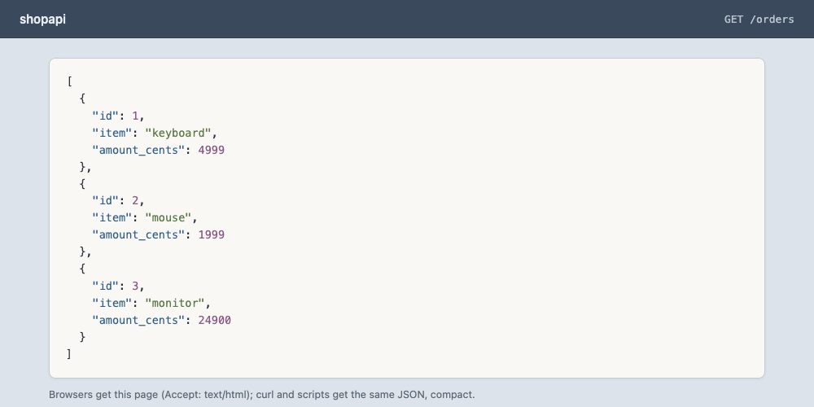

# Demo 54 — one cluster, kube-vip, two Gateways

For the reader in a hurry: [RECAP.md](RECAP.md) — what this demo did and
proved, in plain English.

**Where this sits in the whole:** [enhancement 007](../../enhancements/007-envoy-gateway-lab.md)
revision 2, §3.1 the `eg-poc1` `/26`, §4 row 2b, D5/D8/D10/D11; tracking
issue [#53](https://github.com/ephico2real2/cilium-implementation-poc/issues/53).
Demo 51 is the two-cluster lab with the fail cases. This demo is the
one-cluster proof the operator asked for.

The operator, 2026-09-19:

> a single cluster demo with kubevip and default cni and envoy gateway
> api. We are not testing all the failed test cases. I only wanna test
> grpc and http routes. Use two gateways to isolate http from grpc and
> we're not doing too many tests. We only want to show that it works
> and document what we did in docker and proof that kube-vip can do
> the L2 announcements and that the application is accessible
> externally from our clients running on the macbook and in the
> browser.

Cluster name: `eg-poc1`. No docker build (gotcha #118 — `kind load` of
existing `shopapi:local` and `routedemo:local` is not a build).
poc1/poc2 stay paused (gotcha #119). The `kind` network is not touched.
eg1 and eg2 have been deleted (`scripts/eg-down.sh`); `scripts/eg-net.sh`
recreates `kind-eg` when it is gone.

## Summary context — the enterprise case

One kind cluster, stock networking (kindnet + kube-proxy iptables, no
Cilium), Envoy Gateway, kube-vip. Two doors, not one: `http-gw` at
`172.19.255.100` serves HTTP and HTTPS for `api.eg-poc1.poc.local`;
`grpc-gw` at `172.19.255.101` serves h2c and TLS for
`grpc.eg-poc1.poc.local`. No HTTPRoute attaches to the gRPC door and no
GRPCRoute attaches to the HTTP door. That is the isolation.

The contract a team learns is the same as demo 51 (D11): the
`EnvoyProxy` attached to the Gateway names the load balancer
(`envoyService.loadBalancerClass: kube-vip.io/kube-vip-class`) and pins
the address (`kube-vip.io/loadbalancerIPs`). The class is immutable —
each `EnvoyProxy` is in the same file, before its Gateway. kube-vip
runs class-only. The RBAC, DaemonSet and cloud-provider are
[`clusters/eg/kube-vip-*.yaml`](../../clusters/eg/kube-vip-ds.yaml) —
one source of truth, not copied.

The HTTP door's `:80` listener has a hostname and **no redirect**, so
the browser works over plain `http://`. Demo 51's `:80` is a 301; this
lab is the opposite on purpose.

The lab root is minted on `eg-poc1` itself (`scripts/eg-up.sh eg-poc1`)
and exported as `.tmp/eg-poc1-root-ca.crt` (gitignored, issue #60). D8's
one-root rule holds per lab.

## Files

| File | What |
|---|---|
| [`clusters/eg/kube-vip-rbac.yaml`](../../clusters/eg/kube-vip-rbac.yaml), [`kube-vip-ds.yaml`](../../clusters/eg/kube-vip-ds.yaml), [`kube-vip-cloud-provider.yaml`](../../clusters/eg/kube-vip-cloud-provider.yaml) | **one source of truth** — not copied |
| [`10-kubevip-cm.yaml`](10-kubevip-cm.yaml) | the `kubevip` ConfigMap (`range-envoy-gateway-system` `.100–.110`, `range-default` `.72–.79`) |
| [`00-namespace.yaml`](00-namespace.yaml) | namespace `shop` |
| [`20-certificate.yaml`](20-certificate.yaml) | `Certificate` `eg-poc1-tls`, CN `api.eg-poc1.poc.local`, two dnsNames, 90d/30d |
| [`30-gateways.yaml`](30-gateways.yaml) | EnvoyProxy then Gateway, twice: `http-gw` `.100`, `grpc-gw` `.101` |
| [`40-app.yaml`](40-app.yaml) | `shopapi` + `grpc` (`routedemo:local -mode grpc`, `appProtocol: kubernetes.io/h2c`) |
| [`45-shop-db.yaml`](45-shop-db.yaml) | `shop-db` (postgres:16-alpine, emptyDir; local to this demo — not enhancement 002 R3) |
| [`50-routes.yaml`](50-routes.yaml) | `HTTPRoute` shop-api → http-gw only; `GRPCRoute` grpc → grpc-gw only |
| [`apply.sh`](apply.sh) | idempotent; every step through `scripts/record.sh` |
| [`check.sh`](check.sh) | at most 15 PASS/FAIL rows; exit = FAIL count |
| [`cleanup.sh`](cleanup.sh) | doors, app, kube-vip, `shop` — leaves the cluster |
| [`hosts-entries.sh`](hosts-entries.sh) | the two names from live Gateway addresses; never writes `/etc/hosts` |
| [`GUIDE.md`](GUIDE.md) | hosts-block prerequisite (operator, sudo) and three read-only exercises |

The lab root PEM is **`.tmp/eg-poc1-root-ca.crt`** (gitignored, issue #60).

## Steps

From the repo root. poc1/poc2 stay paused. Bring the cluster up first:

```bash
scripts/eg-up.sh eg-poc1
demos/54-eg-poc1-kube-vip/apply.sh
demos/54-eg-poc1-kube-vip/check.sh
```

Every command is recorded through `scripts/record.sh` into
[`output/transcript.txt`](output/transcript.txt) (append, never
truncate). The transcript is created by the first apply.

## What we did in Docker

apply.sh step 1 records the `kind-eg` network (IPv4 `Subnet` / `IPRange`
/ `Gateway` only — the IPv6 block's `IPRange` prints `invalid Prefix`),
the two `eg-poc1` nodes with their `kind-eg` IPv4 and MAC
(`docker inspect` uses `index` because the network name is hyphenated),
`kubectl get nodes -o wide`, the kube-proxy mode from its ConfigMap, and
the kindnet DaemonSet. Stock networking is kindnet + kube-proxy
`iptables`; there is no Cilium. Recorded (fourth apply):

```text
---- kind-eg IPv4 (IPv6 IPRange prints invalid Prefix; skip that block) ----
Subnet=172.19.0.0/16 IPRange=172.19.0.0/17 Gateway=172.19.0.1
---- eg-poc1 nodes on kind-eg (IPv4 + MAC) ----
eg-poc1-control-plane Up 2 hours
eg-poc1-worker Up 2 hours
eg-poc1-control-plane 172.19.0.2 e6:61:1d:ac:15:3a
eg-poc1-worker 172.19.0.3 fa:1f:d6:0f:1e:ae
---- kubectl get nodes -o wide ----
NAME                    STATUS   ROLES           AGE    VERSION   INTERNAL-IP   EXTERNAL-IP   OS-IMAGE                       KERNEL-VERSION            CONTAINER-RUNTIME
eg-poc1-control-plane   Ready    control-plane   122m   v1.36.4   172.19.0.2    <none>        Debian GNU/Linux 13 (trixie)   7.0.12-linuxkit (arm64)   containerd://2.3.4
eg-poc1-worker          Ready    <none>          122m   v1.36.4   172.19.0.3    <none>        Debian GNU/Linux 13 (trixie)   7.0.12-linuxkit (arm64)   containerd://2.3.4
---- stock networking: kube-proxy mode + kindnet DS ----
    mode: iptables
NAME         DESIRED   CURRENT   READY   UP-TO-DATE   AVAILABLE   NODE SELECTOR            AGE
kindnet      2         2         2       2            2           kubernetes.io/os=linux   122m
kube-proxy   2         2         2       2            2           kubernetes.io/os=linux   122m
```

## How kube-vip announces

For each door, apply.sh step 7 records:

1. `arping -b -c 3 -I eth0 <ip>` from `busybox:1.36` on `kind-eg`
   (`--cap-add NET_RAW`). `-b` keeps every probe a broadcast (busybox
   otherwise goes unicast after the first reply — demo 51 review A10).
2. The reply MAC mapped to a node name from `docker inspect`.
3. `docker exec <that node> ip -4 addr show eth0` — the VIP is a `/32`
   on the node's `eth0`. That is kube-vip's L2 announcement made visible
   in Docker.
4. The kube-vip DaemonSet log (`--tail=-1 --prefix`): `adding VIP`,
   `successful add IP`, `layer 2 broadcaster starting` — one present
   or ABSENT line per phrase.

`scope global deprecated` on the two `/32`s is kube-vip adding each
address with a zero preferred lifetime so the node never uses the VIP
as a source address (kube-vip v1.2.4 `pkg/vip/address.go:172-176`:
`PreferedLft = 0` "so it isn't used as source address according to
RFC 3484"; `ValidLft = math.MaxInt`). The kernel
(`net/ipv4/devinet.c` `set_ifa_lifetime`) turns a zero preferred
lifetime into `IFA_F_DEPRECATED` and an infinite valid lifetime into
`IFA_F_PERMANENT`; `inet_fill_ifaddr` then reports both lifetimes as
infinity for a PERMANENT address, so `ip` prints `deprecated` with
`preferred_lft forever`.

Both VIPs sit on `eg-poc1-worker` because kube-vip runs `svc_election`
and the door Services are `externalTrafficPolicy: Local` (Envoy
Gateway's default): a node is a candidate only while it has a Ready
Envoy endpoint (kube-vip v1.2.4 `pkg/services/leader.go:98-102`,
`pkg/endpoints/endpoints_generic.go:93-95`), and both Envoy
Deployments and the `envoy-gateway` pod were scheduled on the worker.
Move an Envoy pod and the announcer moves with it.

The log lines are pod-prefixed. Both pods logged `adding VIP` at
13:14:15; the worker logged `successful add IP` at
13:14:26.716945797Z. Those are the first apply's in-cluster
timestamps, reprinted by the whole-log read. Recorded (fourth apply):

```text
---- arping -b -c 3 172.19.255.100 ----
ARPING 172.19.255.100 from 172.19.0.4 eth0
Unicast reply from 172.19.255.100 [fa:1f:d6:0f:1e:ae] 0.005ms
Unicast reply from 172.19.255.100 [fa:1f:d6:0f:1e:ae] 0.014ms
Unicast reply from 172.19.255.100 [fa:1f:d6:0f:1e:ae] 0.010ms
Sent 3 probe(s) (0 broadcast(s))
Received 3 response(s) (0 request(s), 0 broadcast(s))
MAC fa:1f:d6:0f:1e:ae → node eg-poc1-worker
---- docker exec eg-poc1-worker ip -4 addr show eth0 ----
11: eth0@if21: <BROADCAST,MULTICAST,UP,LOWER_UP> mtu 65535 qdisc noqueue state UP group default  link-netnsid 0
    inet 172.19.0.3/16 brd 172.19.255.255 scope global eth0
       valid_lft forever preferred_lft forever
    inet 172.19.255.100/32 scope global deprecated eth0
       valid_lft forever preferred_lft forever
    inet 172.19.255.101/32 scope global deprecated eth0
       valid_lft forever preferred_lft forever
---- kube-vip DS logs for 172.19.255.100 (adding VIP / successful add IP; whole log, pod-prefixed) ----
[pod/kube-vip-ds-lm6zw/kube-vip] 2026-09-19T13:14:15.362709375Z 2026/09/19 13:14:15 INFO new instance namespace=envoy-gateway-system service=envoy-shop-http-gw-fccf2727 addresses=[172.19.255.100] hostnames=[]
[pod/kube-vip-ds-lm6zw/kube-vip] 2026-09-19T13:14:15.362905875Z 2026/09/19 13:14:15 INFO (svcs) adding VIP ip=172.19.255.100 interface=eth0 namespace=envoy-gateway-system name=envoy-shop-http-gw-fccf2727
[pod/kube-vip-ds-xm9rf/kube-vip] 2026-09-19T13:14:15.362849167Z 2026/09/19 13:14:15 INFO new instance namespace=envoy-gateway-system service=envoy-shop-http-gw-fccf2727 addresses=[172.19.255.100] hostnames=[]
[pod/kube-vip-ds-xm9rf/kube-vip] 2026-09-19T13:14:15.363006000Z 2026/09/19 13:14:15 INFO (svcs) adding VIP ip=172.19.255.100 interface=eth0 namespace=envoy-gateway-system name=envoy-shop-http-gw-fccf2727
[pod/kube-vip-ds-xm9rf/kube-vip] 2026-09-19T13:14:26.716945797Z 2026/09/19 13:14:26 INFO successful add IP address=172.19.255.100
[pod/kube-vip-ds-xm9rf/kube-vip] 2026-09-19T13:14:26.716946422Z 2026/09/19 13:14:26 INFO layer 2 broadcaster starting IP=172.19.255.100 device=eth0
[pod/kube-vip-ds-xm9rf/kube-vip] 2026-09-19T13:14:26.716946922Z 2026/09/19 13:14:26 INFO [ARP manager] inserting ARP/NDP instance name=172.19.255.100/32-eth0
adding VIP for 172.19.255.100: present
successful add IP for 172.19.255.100: present
layer 2 broadcaster starting for 172.19.255.100: present
```

Recorded (fourth apply):

```text
---- arping -b -c 3 172.19.255.101 ----
ARPING 172.19.255.101 from 172.19.0.4 eth0
Unicast reply from 172.19.255.101 [fa:1f:d6:0f:1e:ae] 0.006ms
Unicast reply from 172.19.255.101 [fa:1f:d6:0f:1e:ae] 0.026ms
Unicast reply from 172.19.255.101 [fa:1f:d6:0f:1e:ae] 0.015ms
Sent 3 probe(s) (0 broadcast(s))
Received 3 response(s) (0 request(s), 0 broadcast(s))
MAC fa:1f:d6:0f:1e:ae → node eg-poc1-worker
---- docker exec eg-poc1-worker ip -4 addr show eth0 ----
11: eth0@if21: <BROADCAST,MULTICAST,UP,LOWER_UP> mtu 65535 qdisc noqueue state UP group default  link-netnsid 0
    inet 172.19.0.3/16 brd 172.19.255.255 scope global eth0
       valid_lft forever preferred_lft forever
    inet 172.19.255.100/32 scope global deprecated eth0
       valid_lft forever preferred_lft forever
    inet 172.19.255.101/32 scope global deprecated eth0
       valid_lft forever preferred_lft forever
---- kube-vip DS logs for 172.19.255.101 (adding VIP / successful add IP; whole log, pod-prefixed) ----
[pod/kube-vip-ds-lm6zw/kube-vip] 2026-09-19T13:14:15.561115792Z 2026/09/19 13:14:15 INFO new instance namespace=envoy-gateway-system service=envoy-shop-grpc-gw-8c4f0319 addresses=[172.19.255.101] hostnames=[]
[pod/kube-vip-ds-lm6zw/kube-vip] 2026-09-19T13:14:15.561421625Z 2026/09/19 13:14:15 INFO (svcs) adding VIP ip=172.19.255.101 interface=eth0 namespace=envoy-gateway-system name=envoy-shop-grpc-gw-8c4f0319
[pod/kube-vip-ds-xm9rf/kube-vip] 2026-09-19T13:14:15.561219334Z 2026/09/19 13:14:15 INFO new instance namespace=envoy-gateway-system service=envoy-shop-grpc-gw-8c4f0319 addresses=[172.19.255.101] hostnames=[]
[pod/kube-vip-ds-xm9rf/kube-vip] 2026-09-19T13:14:15.561319334Z 2026/09/19 13:14:15 INFO (svcs) adding VIP ip=172.19.255.101 interface=eth0 namespace=envoy-gateway-system name=envoy-shop-grpc-gw-8c4f0319
[pod/kube-vip-ds-xm9rf/kube-vip] 2026-09-19T13:14:26.727077672Z 2026/09/19 13:14:26 INFO successful add IP address=172.19.255.101
[pod/kube-vip-ds-xm9rf/kube-vip] 2026-09-19T13:14:26.727190839Z 2026/09/19 13:14:26 INFO layer 2 broadcaster starting IP=172.19.255.101 device=eth0
[pod/kube-vip-ds-xm9rf/kube-vip] 2026-09-19T13:14:26.727198047Z 2026/09/19 13:14:26 INFO [ARP manager] inserting ARP/NDP instance name=172.19.255.101/32-eth0
adding VIP for 172.19.255.101: present
successful add IP for 172.19.255.101: present
layer 2 broadcaster starting for 172.19.255.101: present
```

## From the MacBook

The Mac routes `172.19/16` to the Docker VM. apply.sh records
`netstat -rn | grep 172.19`; if the route is absent it prints the
`sudo route` command and continues (no script runs sudo).

The recorded clients (checks use `--resolve`; HTTPS uses `--cacert`
`.tmp/eg-poc1-root-ca.crt` and does not skip verification):

```bash
curl -s --resolve api.eg-poc1.poc.local:80:172.19.255.100 \
  -D - -o /dev/null http://api.eg-poc1.poc.local/healthz
# expect 200 and X-Served-By: eg-poc1

curl -s --resolve api.eg-poc1.poc.local:443:172.19.255.100 \
  --cacert .tmp/eg-poc1-root-ca.crt \
  -D - -o /dev/null https://api.eg-poc1.poc.local/healthz
# expect 200

curl -s --resolve api.eg-poc1.poc.local:80:172.19.255.100 \
  -D - -H "Accept: application/json" \
  http://api.eg-poc1.poc.local/orders
# expect 200, X-Served-By: eg-poc1, and a JSON array of orders

go run github.com/fullstorydev/grpcurl/cmd/grpcurl@v1.9.4 \
  -plaintext -authority grpc.eg-poc1.poc.local \
  172.19.255.101:80 grpc.health.v1.Health/Check
# expect {"status": "SERVING"}

go run github.com/fullstorydev/grpcurl/cmd/grpcurl@v1.9.4 \
  -cacert .tmp/eg-poc1-root-ca.crt -authority grpc.eg-poc1.poc.local \
  172.19.255.101:443 grpc.health.v1.Health/Check
# expect {"status": "SERVING"}
```

Isolation is shown once each way: grpcurl against `172.19.255.100:80`
with the gRPC authority is not SERVING; curl
`http://api.eg-poc1.poc.local/healthz` at `172.19.255.101` is not 200.
Two lines, not a test suite. Recorded (fourth apply):

```text
172.19             192.168.64.2       UGSc            bridge100
http://api.eg-poc1.poc.local/healthz @ 172.19.255.100:80 → 200 X-Served-By=eg-poc1 curl_rc=0
https://api.eg-poc1.poc.local/healthz @ 172.19.255.100:443 → 200 X-Served-By=eg-poc1 curl_rc=0
http://api.eg-poc1.poc.local/orders @ 172.19.255.100:80 → 200 X-Served-By=eg-poc1 curl_rc=0 body_head:
[{"id":1,"item":"keyboard","amount_cents":4999},{"id":2,"item":"mouse","amount_cents":1999},{"id":3,"item":"monitor","amount_cents":24900}]
-- gRPC h2c grpc.eg-poc1.poc.local 172.19.255.101:80
{
  "status": "SERVING"
}
grpcurl_h2c_rc=0
-- gRPC TLS grpc.eg-poc1.poc.local 172.19.255.101:443
{
  "status": "SERVING"
}
grpcurl_tls_rc=0
-- gRPC list (reflection) grpc.eg-poc1.poc.local 172.19.255.101:80
grpc.health.v1.Health
grpc.reflection.v1.ServerReflection
grpc.reflection.v1alpha.ServerReflection
grpcurl_list_rc=0
-- isolation: grpcurl against HTTP door 172.19.255.100:80 with grpc authority (expect not SERVING)
Error invoking method "grpc.health.v1.Health/Check": failed to query for service descriptor "grpc.health.v1.Health": server does not support the reflection API
exit status 1
isolation_grpcurl_rc=1
-- isolation: curl http://api.eg-poc1.poc.local/healthz at gRPC door 172.19.255.101:80 (expect not 200)
isolation_http_code=404 curl_rc=0
```

## The browser

apply.sh takes a headless Chrome screenshot from the Mac. No `/etc/hosts`
is needed for that shot — Chrome's `--host-resolver-rules` maps the
name. The wait is for the PNG (polled every 0.2 s, 60 s ceiling): a
non-empty file is not enough — the size must be stable across two
polls. Chrome exited on its own within the wait in the recorded run
(`chrome_rc=0`). When Chrome is still running once the file is
complete, the harness kills it. The artefact on disk is the result
(gotcha [#121](../../docs/GOTCHAS.md#121)).

Recorded (fourth apply):

```text
/Applications/Google Chrome.app/Contents/MacOS/Google Chrome --headless=new --disable-gpu --no-first-run --window-size=1000,500 --user-data-dir=<tmp> --host-resolver-rules="MAP api.eg-poc1.poc.local 172.19.255.100" --screenshot=/Users/olasumbo/gitRepos/cilium-implementation-poc/demos/54-eg-poc1-kube-vip/output/browser.png http://api.eg-poc1.poc.local/orders
screenshot written after 2.0 s; chrome_rc=0
demos/54-eg-poc1-kube-vip/output/browser.png: PNG image data, 1000 x 500, 8-bit/color RGB, non-interlaced
```



For the real browser, add the hosts block (the script never writes
`/etc/hosts`):

```bash
demos/54-eg-poc1-kube-vip/hosts-entries.sh
# then, if you want the names in the real browser:
#   demos/54-eg-poc1-kube-vip/hosts-entries.sh | sudo tee -a /etc/hosts
```

Recorded (fourth apply):

```text
# ---- cilium-kind-poc demo54 (generated 2026-09-19T15:12Z by demos/54-eg-poc1-kube-vip/hosts-entries.sh) ----
172.19.255.100  api.eg-poc1.poc.local
172.19.255.101  grpc.eg-poc1.poc.local
# ---- end cilium-kind-poc demo54 ----
```

Then open `http://api.eg-poc1.poc.local/orders`.

## Final table

Recorded (fourth apply):

```text
DOOR       ADDRESS          PROG   CLASS                        ANNOUNCED_BY           HTTP_or_GRPC
http-gw    172.19.255.100   True   kube-vip.io/kube-vip-class   eg-poc1-worker         HTTP 200/eg-poc1
grpc-gw    172.19.255.101   True   kube-vip.io/kube-vip-class   eg-poc1-worker         GRPC SERVING
```

`check.sh` (exit 0), 15 PASS, 0 FAIL.

Recorded (fourth apply):

```text
### 2026-09-19T15:12:49Z
$ demos/54-eg-poc1-kube-vip/check.sh
== demo 54 — one cluster, kube-vip, two Gateways (HTTP isolated from gRPC)
  STATUS WHAT                                                                   MEASURED                                             RULE
  PASS   kube-vip DS ready                                                      ready=2/2                                            R4 — kube-vip-ds ready (v1.2.4, lb_class_only, no taint)
  PASS   kube-vip-cloud-provider Available                                      Available=True                                       R4 — cloud-provider v0.0.12 Available
  PASS   http-gw Programmed at 172.19.255.100                                   addr=172.19.255.100 svcIngress=172.19.255.100 Programmed=True R4 / R8 — Gateway address and Service ingress both equal 172.19.255.100
  PASS   grpc-gw Programmed at 172.19.255.101                                   addr=172.19.255.101 svcIngress=172.19.255.101 Programmed=True R4 / R8 — Gateway address and Service ingress both equal 172.19.255.101
  PASS   both Envoy Services carry the class                                    http=kube-vip.io/kube-vip-class grpc=kube-vip.io/kube-vip-class D11 — EnvoyProxy names kube-vip.io/kube-vip-class on both doors
  PASS   ARP http-gw 172.19.255.100 one responder 3/3                           replies=3 unique_mac=1 node=eg-poc1-worker           R4 / R8 — arping 3 of 3 from ONE MAC
  PASS   ARP grpc-gw 172.19.255.101 one responder 3/3                           replies=3 unique_mac=1 node=eg-poc1-worker           R4 / R8 — arping 3 of 3 from ONE MAC
  PASS   VIP 172.19.255.100 on the elected node's eth0                          node=eg-poc1-worker /32                              R4 — kube-vip announces the /32 on the elected node's eth0
  PASS   VIP 172.19.255.101 on the elected node's eth0                          node=eg-poc1-worker /32                              R4 — kube-vip announces the /32 on the elected node's eth0
  PASS   http://api.eg-poc1.poc.local 200 + X-Served-By                         http_code=200 X-Served-By=eg-poc1                    R8 — 200 and X-Served-By=eg-poc1
  PASS   https://api.eg-poc1.poc.local 200                                      http_code=200                                        R8 — 200 against the lab root
  PASS   http://api.eg-poc1.poc.local /orders 200 (the page behind the door)    http_code=200 items=3                                the page behind the door — 200 and a JSON array (≥ 1)
  PASS   gRPC h2c grpc.eg-poc1.poc.local @ 172.19.255.101:80                    SERVING                                              R10 — grpcurl -plaintext Health/Check → SERVING
  PASS   gRPC TLS grpc.eg-poc1.poc.local @ 172.19.255.101:443                   SERVING                                              R10 — grpcurl -cacert Health/Check → SERVING
  PASS   stock networking                                                       kube-proxy=iptables cilium_ds=0 cilium_crd=0         R2 — kube-proxy iptables, 0 Cilium DS/CRD
demo 54 check: 0 FAIL
```

## The first two runs

The fourth apply is the one this page quotes. The first two are why
apply.sh records the Mac's route and why
[`45-shop-db.yaml`](45-shop-db.yaml) exists.

The first apply (2026-09-19T13:14Z) found no route. Every Mac client
timed out while the cluster was healthy — gotcha
[#120](../../docs/GOTCHAS.md#120). Recorded (first apply):

```text
no 172.19 route on this Mac — the clients below will fail until:
```

The second apply (2026-09-19T14:09Z) had the route. `/healthz` and gRPC
worked; `/orders` did not, because shopapi's default `DB_URL` points at
the mesh lab's database. Recorded (second apply):

```text
failed to connect to `user=shop database=shop`: hostname resolving error: lookup db-service.poc.local on 10.71.0.10:53: dial udp 10.71.0.10:53: i/o timeout
```

## The two doors

```text
                  MacBook
           curl / grpcurl / browser
                    │
     ┌──────────────┴──────────────┐
     │                             │
     ▼                             ▼
 http-gw                    grpc-gw
 172.19.255.100             172.19.255.101
 api.eg-poc1.poc.local      grpc.eg-poc1.poc.local
  http :80  → 200           h2c :80  → SERVING
  https:443 → 200           https-grpc:443 → SERVING
     │                             │
     ▼                             ▼
 shopapi                    grpc (routedemo -mode grpc)
 X-Served-By: eg-poc1       appProtocol: kubernetes.io/h2c
     │
     ▼
 shop-db (postgres:16-alpine, this demo)
```

kube-vip: `range-envoy-gateway-system` `.100–.110`; `range-default`
`.72–.79`; class `kube-vip.io/kube-vip-class` only. One node answers ARP
for each address. The VIP is a `/32` on that node's `eth0`.

## What is deliberately not here

The fail cases, MetalLB, the class-less exhibit, the silent-`externalIPs`
experiment (R7), and the VIP move live in
[demo 51](../51-eg-kube-vip/README.md). This demo only shows that HTTP
and gRPC work through two isolated Gateways, that kube-vip announces
them on L2, and that the MacBook and the browser can reach them.

## Cleanup

```bash
demos/54-eg-poc1-kube-vip/cleanup.sh
```

Removes the routes, app, Gateways + EnvoyProxies, certificate + secret,
kube-vip, and namespace `shop`. Leaves `eg-poc1`, Envoy Gateway,
`GatewayClass eg`, cert-manager, and `.tmp/eg-poc1-root-ca.crt`. Does
not touch poc1, poc2, CRC, or the `kind` network. The cluster itself is
`scripts/eg-down.sh`.
