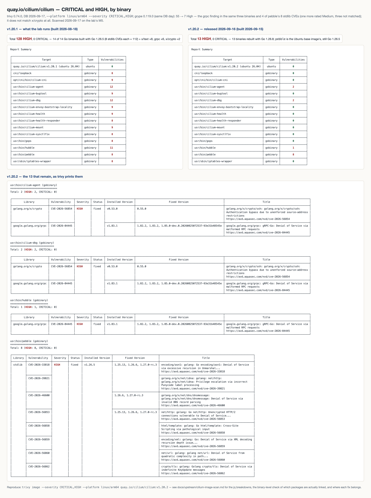

# The Cilium agent image, rescanned — what is in it, what remains, and where each fix belongs

Scanned 2026-09-17 on the lab's M5 with **trivy 0.74.0** (vulnerability DB of the same day) and **grype 0.119.0** (DB
built 2026-09-17T06:31Z), `--platform linux/arm64` because that is the architecture the lab pulls. Two images: the one
the lab runs and the patch release that came out the day before the scan.

| Image | Digest (index) | Built | Toolchain of the Cilium binaries |
|---|---|---|---|
| `quay.io/cilium/cilium:v1.20.1` | `sha256:ae9ea21f…` | 2026-08-18 | Go 1.26.5 |
| `quay.io/cilium/cilium:v1.20.2` | `sha256:2939231d…` | 2026-09-15 (released 09-16) | Go 1.26.8 |

The earlier scan "had a lot of bugs" — 128 HIGH — and the question was whether they are Cilium's, whether they are
still there, and what to do about them. The answer, measured: **112 of the 128 were one thing** (eight Go standard
library CVEs, counted once per binary in an image with fourteen Go binaries), the patch release fixes all of those
except in one binary Cilium does not build, and the five that remain in Cilium's own binaries are version matches on
packages whose vulnerable code is not linked into them.

## 1. The result in one screen



The full text of both reports as trivy printed them is checked in: [`scans/trivy-cilium-v1.20.1.txt`](scans/trivy-cilium-v1.20.1.txt)
(694 lines) and [`scans/trivy-cilium-v1.20.2.txt`](scans/trivy-cilium-v1.20.2.txt) (128 lines).

| | v1.20.1 | v1.20.2 |
|---|---|---|
| trivy CRITICAL | 0 | 0 |
| trivy HIGH | **128** | **13** |
| … of which Go stdlib (Go 1.26.5) | 112 = 8 CVEs × 14 binaries | 8 = 8 CVEs × 1 binary (`pebble`) |
| … `golang.org/x/text` 0.38.0 | 8 (CVE-2026-56852) | 0 |
| … `google.golang.org/grpc` 1.82.1 → 1.83.1 | 6 (CVE-2026-84304 ×3, CVE-2026-84445 ×3) | 3 (CVE-2026-84445, fix 1.83.2) |
| … `golang.org/x/crypto` 0.53.0 | 2 | 2 (CVE-2026-56854, fix 0.55.0) |
| Ubuntu 26.04 packages, CRITICAL/HIGH | 0 | 0 |
| grype High / Medium / Low / Negligible | 55 / 204 / 30 / 2 | 7 / 99 / 7 / 2 |

The two scanners agree on the shape and differ on the edges: grype's seven Highs are the grpc finding in the same three
binaries plus four of pebble's eight stdlib CVEs (it rates a fifth Medium and does not carry the other three); it does
not match `x/crypto` at all. Grype's 99 Mediums are almost all Ubuntu packages with no fix published (`95 deb
fix=not-fixed`, led by `rust-coreutils` ×20, `jq`/`libjq1` ×20, `perl-base` ×7) — Canonical's queue, not Cilium's.

## 2. Why v1.20.1 had 128 and how to read a number like that

Trivy scans every Go binary in the image separately and reports each CVE once per binary. The image carries fourteen:
`cilium-agent`, `cilium-dbg`, `cilium-cni`, `cni/loopback`, `cilium-bugtool`, `cilium-health`,
`cilium-health-responder`, `cilium-mount`, `cilium-sysctlfix`, `cilium-envoy-bootstrap-locality`, `hubble`, `gops`,
`iptables-wrapper` and `pebble`. All fourteen in v1.20.1 were built with Go 1.26.5, and Go 1.26.6 fixed eight HIGH
CVEs in the standard library (`encoding/asn1`, `net/http`, `net/url`, `html/template`, `encoding/xml`,
`crypto/tls`, and the vendored `x/net` `idna` and `dnsmessage` code). Eight CVEs × fourteen binaries = 112 rows for **one
cause: the toolchain**. The other sixteen rows were three library versions in the binaries that import them.

So "128 HIGH" was never 128 problems; it was one toolchain and three modules. The count to watch is *distinct causes*,
and the jq below produces it:

```sh
# CVE → how many binaries carry it, and the package it lives in
jq -r '.Results[] | .Target as $t | .Vulnerabilities[]? | "\(.VulnerabilityID) \(.PkgName) \(.InstalledVersion) → \(.FixedVersion)"' trivy.json \
  | sort | uniq -c | sort -rn
```

## 3. What v1.20.2 changed

Cilium 1.20.2 was built with **Go 1.26.8** (`go version -m /usr/bin/cilium-agent` → `go1.26.8`;
`images/runtime/Dockerfile` on the `v1.20.2` tag pins `GOLANG_IMAGE=docker.io/library/golang:1.26.8@sha256:3c3e25a4…`).
That single bump removed 104 of the 112 stdlib rows and, with `x/text` moved to 0.39.0 and grpc to 1.83.1, 115 of the
128 in total. Thirteen remain, in four binaries:

| Binary | Finding | Installed → fixed | Whose fix it is |
|---|---|---|---|
| `usr/bin/pebble` | 8 × Go stdlib (the same eight CVEs) | Go 1.26.5 → 1.26.6 | the Ubuntu base image — see §4 |
| `usr/bin/cilium-agent`, `usr/bin/cilium-dbg`, `usr/bin/hubble` | CVE-2026-84445 `google.golang.org/grpc` | 1.83.1 → 1.83.2 | Cilium's `go.mod` on the `v1.20` branch — see §5 |
| `usr/bin/cilium-agent`, `usr/bin/cilium-dbg` | CVE-2026-56854 `golang.org/x/crypto` | 0.53.0 → 0.55.0 | Cilium's `go.mod` on the `v1.20` branch — see §5 |

## 4. `pebble` — not Cilium's binary, and the fix is already published

`pebble` is Canonical's service manager. Cilium does not build it, install it, or run it: `images/runtime/Dockerfile`
builds only `gops`, the CNI plugins and `iptables-wrapper` (`build-gops.sh`, `build-cni.sh`, `build-iptables-wrapper.sh`),
and `install-runtime-deps.sh` installs apt packages. The binary comes in with the **rootfs of the Ubuntu base image**
— `docker.io/library/ubuntu:26.04` ships `/usr/bin/pebble` — and Cilium's `cilium-runtime` image copies that rootfs.
Measured, step by step:

```sh
# inside the Cilium image: the binary is there, no dpkg package owns it, it was built with Go 1.26.5
docker run --rm --platform linux/arm64 --entrypoint sh quay.io/cilium/cilium:v1.20.2 -c 'ls -la /usr/bin/pebble; dpkg -S /usr/bin/pebble; pebble version'
#   -rwxr-xr-x 1 root root 9240738 Jul 21 21:43 /usr/bin/pebble
#   dpkg-query: no path found matching pattern /usr/bin/pebble
#   client  v1.32.1
go version -m pebble | head -3     # (binary copied out with docker cp)
#   pebble: go1.26.5
#   path  github.com/canonical/pebble/cmd/pebble
#   mod   github.com/canonical/pebble  v1.32.2-0.20260721212932-7becfc3a9fad

# what the v1.20.2 runtime image is built FROM
gh api "repos/cilium/cilium/contents/images/runtime/Dockerfile?ref=v1.20.2" --jq .content | base64 -d | grep '^ARG UBUNTU_IMAGE'
#   ARG UBUNTU_IMAGE=docker.io/library/ubuntu:26.04@sha256:513c074113a871b51a8d16ab445c88779d6452d937a164fb5cc479f32668a41d

# that exact base image (created 2026-09-01) carries the same pebble
docker run --rm --platform linux/arm64 ubuntu@sha256:513c0741…41d sh -c 'ls -la /usr/bin/pebble; pebble version | head -1'
#   -rwxr-xr-x 1 root root 9240738 Jul 21 21:43 /usr/bin/pebble
#   client  v1.32.1

# the CURRENT ubuntu:26.04 tag (sha256:cd21a4f6…, created 2026-09-12) carries a rebuilt pebble with nothing HIGH
docker run --rm --platform linux/arm64 ubuntu:26.04 sh -c 'ls -la /usr/bin/pebble; pebble version | head -1'
#   -rwxr-xr-x 1 root root 9240738 Sep  8 07:20 /usr/bin/pebble
#   client  v1.32.2
trivy image --severity CRITICAL,HIGH --platform linux/arm64 ubuntu:26.04
#   docker.io/library/ubuntu:26.04 (ubuntu 26.04)  ubuntu    0
#   usr/bin/pebble                                 gobinary  0
```

So the eight remaining stdlib rows are gone the moment Cilium's runtime image moves its `UBUNTU_IMAGE` digest forward
— which Renovate does routinely (`chore(deps): update base-images (v1.20)`, e.g. cilium/cilium#48672 merged
2026-09-14 — its base-images commit (`26debbee` on `v1.20`) moved only the `GOLANG_IMAGE` digest in `images/runtime/Dockerfile`; both `main` and `v1.20` still pin `UBUNTU_IMAGE` at `513c0741…` as of this scan) and
which then needs a `cilium-runtime` rebuild (`images/runtime/update-cilium-runtime-image.sh`) before the next patch
release picks it up. Nothing for this lab to write code for; the two things worth doing upstream are in §6.

One thing to note for the risk reading: pebble is never executed in a Cilium pod (the entrypoint is `cilium-agent`;
nothing in the image references pebble), so these eight are "a vulnerable binary present in the filesystem", not a
reachable service. Scanners count it all the same, and so do compliance gates — which is exactly why it is worth removing.

## 5. The five in Cilium's own binaries — version matches, vulnerable code not linked

Trivy and grype match a Go binary's **module versions** from its build info (`go version -m`). They cannot see which
*packages* of a module were linked. For the two library findings the vulnerable package is specific, so it was checked
against the binaries themselves. The binaries are stripped (`-s -w`; `go tool nm` finds no symbol table), but the Go
runtime keeps every linked function's name in the `pclntab` for stack traces, and `strings` reads it:

```sh
cid=$(docker create --platform linux/arm64 quay.io/cilium/cilium:v1.20.2)
docker cp "$cid:/usr/bin/cilium-agent" .; docker cp "$cid:/usr/bin/cilium-dbg" .; docker cp "$cid:/usr/bin/hubble" .; docker rm "$cid"

for b in cilium-agent cilium-dbg hubble; do
  echo "$b  x/crypto/ssh functions: $(strings $b | grep -cE 'golang\.org/x/crypto/ssh\.')   grpc/xds functions: $(strings $b | grep -cE 'google\.golang\.org/grpc/xds')"
  strings $b | grep -oE 'golang\.org/x/crypto/[a-z0-9_/]+\.' | sort | uniq -c | sort -rn | head -4
done
#   cilium-agent  x/crypto/ssh functions: 0   grpc/xds functions: 0
#      59 golang.org/x/crypto/cryptobyte.   13 …/chacha20poly1305.   13 …/internal/poly1305.   11 …/chacha20.
#   cilium-dbg    x/crypto/ssh functions: 0   grpc/xds functions: 0
#   hubble        x/crypto/ssh functions: 0   grpc/xds functions: 0
```

- **CVE-2026-56854** is in `golang.org/x/crypto/ssh` (an authentication bypass in the SSH *server*'s source-address
  restriction). Cilium imports `x/crypto/ssh` only in `test/helpers/` (`ssh_command.go`, `node.go`; GitHub code search,
  2 hits); the shipped binaries link `cryptobyte`, `chacha20poly1305`, `chacha20` and `poly1305` from that module — no
  `ssh` package. The finding is a module-version match with no vulnerable code in the binary.
- **CVE-2026-84445** (GHSA-2v4p-qf9q-27wj) is a panic in gRPC-Go servers built with `xds.NewGRPCServer()` when a request
  carries neither `:authority` nor `Host`. Cilium has zero references to `google.golang.org/grpc/xds` (code search: 0)
  and the binaries link no `grpc/xds` function. Same class: the module is at a flagged version; the affected server
  type is not in the program.

Both are still worth bumping — a scanner gate does not read pclntabs — and upstream already has: `main` is at grpc
**1.83.2** and x/crypto **0.57.0**, and the `v1.18` branch got the grpc fix (cilium/cilium#48576, merged 2026-09-09). The
`v1.20` branch did not: Renovate's PR **cilium/cilium#48575** "fix(deps): update module google.golang.org/grpc to v1.83.2
[security] (v1.20)" was opened and **autoclosed by the bot five minutes later** (2026-09-09T05:09Z), the grouped
`update all-dependencies (v1.20)` PR #48619 that merged on 09-14 touched only image pins (Dockerfiles, the devcontainer, `runtime-image.txt`), and `go.mod` on `v1.20` still
reads `google.golang.org/grpc v1.83.1` and `golang.org/x/crypto v0.53.0` (as does `v1.19`'s grpc). That is why 1.20.2,
released a week after the fix, still carries both.

## 6. What belongs upstream — two candidates, drafted, posted only on the operator's word

Per [README §2](README.md#2-how-ciliumcilium-takes-a-change--the-process-from-their-guide) these go in as issues first;
the fix for each is a one-line Renovate-style change a maintainer will land themselves, so the value of the report is
the evidence, not a patch.

**Candidate A — `v1.20`: grpc 1.83.2 / x/crypto 0.55.0 security bumps missing (Renovate autoclosed #48575).**
Bug report template fields: *Cilium version* 1.20.2 (`quay.io/cilium/cilium:v1.20.2@sha256:2939231d…`); *What
happened*: the image ships `google.golang.org/grpc v1.83.1` (CVE-2026-84445, fixed 1.83.2) and `golang.org/x/crypto
v0.53.0` (CVE-2026-56854, fixed 0.55.0) in `cilium-agent`, `cilium-dbg`, `hubble`; `main` and `v1.18` have 1.83.2, the
`v1.20` Renovate PR #48575 was autoclosed 2026-09-09 and never replaced; *How to reproduce*: the trivy command in §7;
*Anything else*: neither vulnerable package is linked into the binaries (the `strings` check in §5), so this is a
scanner-gate fix, not an exploitable one — said plainly so the maintainers can label it `release-note/misc`.

**Candidate B — `images/runtime`: the Ubuntu base's `pebble` binary is the last Go 1.26.5 binary in the image; bump
the digest, or drop the binary.** Feature request / cleanup: `ubuntu:26.04@sha256:513c0741…` (2026-09-01) ships
`/usr/bin/pebble` built with Go 1.26.5 (8 HIGH stdlib CVEs); the current `ubuntu:26.04` digest `sha256:cd21a4f6…`
(2026-09-12) ships a rebuilt one with 0; Cilium never executes pebble. Two fixes, either is fine: let Renovate's next
`base-images` bump move the digest (and rebuild `cilium-runtime`), or add `rm -f /usr/bin/pebble` to
`images/runtime/install-runtime-deps.sh` so a base-image toolchain lag never shows up in a Cilium scan again. The
second is the durable one and is what this report would suggest.

Both drafts carry the AI declaration paragraph from [README §2a](README.md#2a-their-generative-ai-policy--it-applies-to-every-contribution-this-lab-makes).
Before posting, re-run §7: if the `v1.20` `go.mod` has moved or the digest has been bumped, the candidate is closed.

## 7. Reproduce it

```sh
brew install trivy grype                      # trivy 0.74.0, grype 0.119.0 on 2026-09-17

for v in v1.20.1 v1.20.2; do
  trivy image -q --severity CRITICAL,HIGH --platform linux/arm64 --scanners vuln -f json -o trivy-$v.json quay.io/cilium/cilium:$v
  trivy image -q --severity CRITICAL,HIGH --platform linux/arm64 --scanners vuln quay.io/cilium/cilium:$v > trivy-$v.txt
  grype -q --platform linux/arm64 -o json quay.io/cilium/cilium:$v > grype-$v.json
done

# totals by severity
jq -r '[.Results[] | .Vulnerabilities[]?] | group_by(.Severity) | map("\(.[0].Severity) \(length)") | join(", ")' trivy-v1.20.2.json
jq -r '[.matches[].vulnerability.severity] | group_by(.) | map("\(.[0]) \(length)") | join(", ")' grype-v1.20.2.json

# per binary: findings, how many are stdlib, and the Go toolchain that built it
jq -r '.Results[] | select((.Vulnerabilities // [])|length>0) | "\(.Target) \(.Vulnerabilities|length) stdlib=\([.Vulnerabilities[]|select(.PkgName=="stdlib")]|length) go=\(.Packages[]?|select(.Name=="stdlib")|.Version)"' trivy-v1.20.2.json

# the digests and build dates the tables above quote
jq -r '.Metadata.RepoDigests[0], .Metadata.ImageConfig.created' trivy-v1.20.2.json

# upstream state at the moment you read this
for ref in v1.20 main; do gh api "repos/cilium/cilium/contents/go.mod?ref=$ref" --jq .content | base64 -d | grep -E 'google.golang.org/grpc |golang.org/x/crypto '; done
gh api "repos/cilium/cilium/contents/images/runtime/Dockerfile?ref=v1.20" --jq .content | base64 -d | grep '^ARG UBUNTU_IMAGE'
```

The screenshot in §1 is the two `Report Summary` blocks and the v1.20.2 findings from the `.txt` outputs, rendered to
one page and captured with the lab's Chromium (Playwright, `deviceScaleFactor: 2`).

## 8. What it means for this lab

The lab runs 1.20.1 (`scripts/lab-stack.sh` `CILIUM_VERSION=1.20.1`, the README's versions table). Moving to
**1.20.2** takes the agent image from 128 HIGH to 13, of which none is reachable code in a Cilium binary; it is a
patch release on the same chart (`helm upgrade … --version 1.20.2 --reuse-values`), and the lab's preflight, gotchas
and CI pin the version in one place each. That upgrade is recommended here and not performed — the operator decides
when the clusters take a rolling agent restart (an agent rollout takes the Gateway off the air — gotcha #42; ~45 s measured on this lab under #116).
