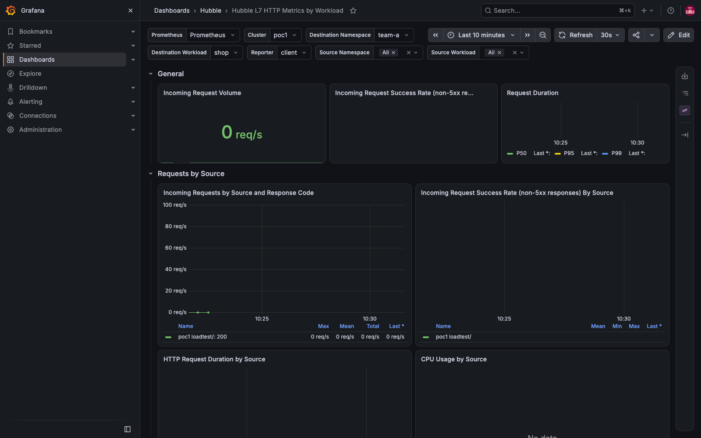
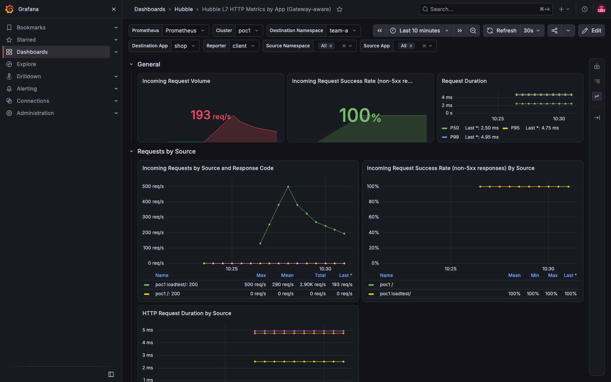
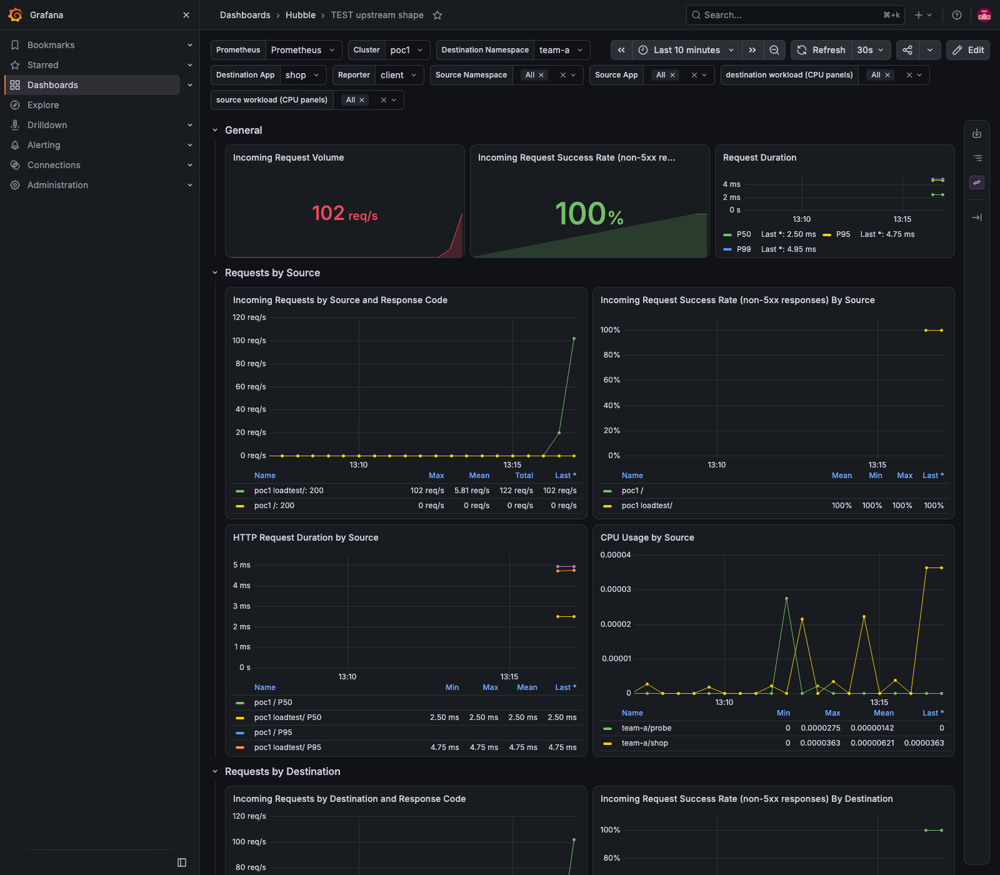

# Hubble's L7 dashboard and Gateway traffic — the report, the fix, and the upstream change, step by step

For an engineer meeting this for the first time. Every number here was measured on the lab on 2026-09-16/17; the
reasoning document with the references is [docs/HUBBLE-L7-LABELS.md](../HUBBLE-L7-LABELS.md), the gotchas are #115
and #116, the demo that found it is [demo 37](../../demos/37-two-gateways/README.md).

## 1. The problem, in one screen

Cilium ships a Grafana dashboard, *Hubble L7 HTTP Metrics by Workload*, meant to show a workload's HTTP traffic: how
many requests, how many failed, how long they took, from whom. Under 300 requests per second through a Cilium Gateway to
`team-a`, it showed this:



and the lab's copy, keyed on a different label, showed this for the same namespace at the same moment:



Same metric, same Prometheus, same traffic. The difference is one label.

## 2. Where the data comes from — the path from a request to a panel

1. A client sends `GET https://shop-a.poc.local/`. The request lands on the Cilium **Gateway** — which on Cilium is not a
   pod of its own but a set of listeners inside the **`cilium-envoy`** process that runs on every node.
2. That Envoy terminates TLS, picks the backend (`team-a/shop`, a pod on some node) and forwards the request. It also
   hands Hubble an **L7 flow record**: who asked, whom, method, path, status, duration.
3. The **Cilium agent** on that node turns flow records into **Prometheus metrics** — the `httpV2` family —
   `hubble_http_requests_total` (a counter) and `hubble_http_request_duration_seconds` (a histogram) — with the labels the
   operator configured under `hubble.metrics.enabled` (`labelsContext`, `sourceContext`, `destinationContext`; the lab's
   values are in [`demos/16-monitoring/values-cilium-metrics.yaml`](../../demos/16-monitoring/values-cilium-metrics.yaml)).
   The agent serves them on port **9965**.
4. **Prometheus** scrapes every agent's 9965 (the `hubble` ServiceMonitor, demo 16) and stamps `cluster=poc1`.
5. **Grafana** runs the dashboard's queries against Prometheus. The chart's dashboard filters 29 of its 32 queries on
   `destination_workload=~"${destination_workload}"`.

So a panel is empty when the label the query filters on is empty on the series that carry the traffic.

## 3. What was captured, and how

The series were read straight from Prometheus, grouped by every label, and lined up with where the pods ran at that
moment (`kube_pod_info` holds the node per pod — the same Prometheus, same instant):

```bash
# every label on the team's series, and the rate — through the API server's proxy to Prometheus (no port-forward)
kubectl --context kind-poc1 get --raw "/api/v1/namespaces/monitoring/services/monitoring-kube-prometheus-prometheus:9090/proxy/api/v1/query?query=$(python3 -c 'import urllib.parse; print(urllib.parse.quote("sum by (destination_namespace, destination, destination_workload, destination_app) (rate(hubble_http_requests_total{destination_namespace=~\"team-.*\", source=\"reserved:ingress\"}[2m]))"))')" | jq -r '.data.result[] | "\(.metric)  \(.value[1])"'
# where the pods were
kubectl --context kind-poc1 get --raw ".../api/v1/query?time=2026-09-16T14:57:30Z&query=kube_pod_info{namespace=~\"team-.*\"}" | jq -r '.data.result[] | "\(.metric.namespace)/\(.metric.pod) @ \(.metric.node)"'
```

| time | backend pod | reporting Envoy (= the client's node) | `destination_workload` | `destination` | req/s |
|---|---|---|---|---|---|
| 14:57Z | `team-b/shop` @ worker | worker | **`shop`** | `shop` | 937 |
| 14:57Z | `team-a/probe` @ control plane | control plane | **`probe`** | `probe` | 6 |
| 14:57Z | `team-a/shop` @ control plane | worker | *(empty)* | `shop` | 7,405 |
| 14:57Z | `team-b/probe` @ worker | control plane | *(empty)* | `probe` | 5 |
| 15:16Z | all four @ control plane | worker | *(empty)* on all | present | 7,214 / 5 / 5 |

**The rule, from eleven series with no exception:** `destination_workload` is filled when the backend pod is on the
**same node** as the Envoy that reported the flow, and empty when it is on another node. The `destination` label —
built from the pod's `app` label, which travels with its security identity and is known to every node — is always
there. Two facts make this matter more than a lab curiosity:

- for an **in-cluster client**, the reporting Envoy is on the *client's* node (measured in demo 37: the client's node's
  Envoy carried the load, 0.3–0.85 cores; the VIP's node's Envoy sat at 0.01) — so the backend is remote whenever the
  client and the backend are on different nodes, which is the usual case;
- for an **external client**, the reporting Envoy is the node that holds the address (L2 lease / BGP), and backends are
  wherever the scheduler put them — usually elsewhere.

So in a real cluster **most Gateway traffic takes the label-less shape**, and a dashboard filtering on that label shows
the local fraction — or nothing. Worse than empty, because the fraction looks like data.

## 4. The fix, from the written sources

Cilium's metrics reference ([Monitoring & Metrics](https://docs.cilium.io/en/stable/observability/metrics/)) lists
what `labelsContext` may carry: beside `*_workload` there is **`source_app` / `destination_app`** — "the pod's app name
from labels (`app.kubernetes.io/name`, `k8s-app`, or `app`)". That name is part of the identity, so every node knows it
for every peer. The source at the lab's version confirms the label set
([`pkg/hubble/metrics/api/context.go` @ v1.20.1](https://github.com/cilium/cilium/blob/v1.20.1/pkg/hubble/metrics/api/context.go), line 59).

Three steps, each measured:

1. **Emit the label** — add `source_app` and `destination_app` to `httpV2`'s `labelsContext` in the Helm values, on every
   cluster ([values-cilium-metrics.yaml](../../demos/16-monitoring/values-cilium-metrics.yaml), line ~101).
2. **Restart the agents** — `kubectl -n kube-system rollout restart ds/cilium`. Not optional: the dynamic metrics config
   refuses a label-set change on a metric already registered ("label set cannot be changed without restarting
   Prometheus", logged every 10 s), and a `helm upgrade` that changes only a ConfigMap restarts nothing (gotcha #116).
   Cost: the Gateway is off the air for the rollout (~45 s here) and the VIPs' L2 leases re-elect (gotcha #42).
   Check: the worker's agent, for a backend on the other node —

   ```text
   hubble_http_requests_total{destination="shop",destination_app="shop",destination_namespace="team-b",destination_workload="",…,source="reserved:ingress"}
   ```

   `destination_app` present, `destination_workload` empty: the fix works exactly where the gap was.
3. **Key the dashboard on it** — [`l7-by-app-dashboard.py`](../../demos/37-two-gateways/l7-by-app-dashboard.py) reads the
   chart's dashboard and rewrites every Hubble query's `destination_workload` → `destination_app`, `source_workload` →
   `source_app`, the two variables likewise, and sets `allValue: ".*"` on the multi-value source variables (a second
   hole, in the chart's dashboard too: Grafana's "All" is a regex of the *listed* values, and the Gateway's
   `source_app` is empty — `reserved:ingress` has no app — so "All" never matched it). The lab's copy drops the two CPU
   panels (they join a *workload* name onto kube-state-metrics; an app name is not a workload name). `lab-stack.sh`
   provisions it beside Cilium's untouched original.

## 5. Does the dashboard say what the traffic was? — the alignment

500 requests per second through each door for 120 s, from the worker's fortio pods, both backends on the other node:

| same 120 s window | team-a | team-b |
|---|---|---|
| fortio's achieved rate | 499 qps | 499 qps |
| the new dashboard's query, `sum by (destination_app)` | **499.9 req/s** | **499.94 req/s** |
| Cilium's dashboard's query, `sum by (destination_workload)` | **0** | **0** |
| fortio p50 / p99 (client side) | 0.61 / 1.38 ms | 0.61 / 1.48 ms |
| Hubble p50 / p99 (`destination_app="shop"`) | 2.50 / 4.95 ms | 2.50 / 4.95 ms |

Volume matches to a tenth of a request per second. **The latency rows are the histogram, not the path**: Hubble's
duration histogram uses Prometheus' default buckets — `0.005 0.01 0.025 0.05 0.1 …` — so **5 ms is the first bucket**,
and any request faster than that interpolates inside it (p50 → 2.5, p99 → 4.95, whatever the true 0.6–1.5 ms). Below
5 ms the dashboard's percentiles measure the bucket; fortio and Envoy's own histogram are the sources for that range.
Say this in any report so nobody reads 4.95 ms as Envoy's cost.

## 6. The benefits

- **Gateway traffic becomes visible per application** on the standard Hubble dashboard — request volume, success rate,
  by-source and by-destination breakdowns — where today it is a local fraction or *No data*.
- **No new tooling**: one `labelsContext` value the reference already documents, one dashboard label; the metric's
  cardinality changes by one label whose values are the app names already present as `destination`.
- **Honest percentiles**: the alignment names the histogram's floor, so a team reading the dashboard knows which number
  to trust for sub-5 ms services.
- **A path to the real fix**: the bug report gives Cilium the placement table as a repro, so the agent can fill
  `destination_workload` for remote backends (the mechanism, [cilium#27974](https://github.com/cilium/cilium/pull/27974),
  exists; it does not reach Envoy-reported L7 flows on 1.20.1).

## 7. Going upstream — the exact steps

### 7a. The bug report (first)

Go to https://github.com/cilium/cilium/issues/new/choose → *Bug report*. The template's fields and what to put:

| Field | Content |
|---|---|
| Is there an existing issue? | search `destination_workload empty` / `hubble metrics workload gateway` — none found on 2026-09-17; say so |
| Version | `1.20.1` |
| What happened? | the paragraph and the table of §3 (the placement table is the evidence); the `destination_app` counter-check of §4 step 2 |
| How can we reproduce? | two nodes; a Deployment pinned to node B behind a Cilium Gateway; a client pod on node A calling the Gateway's LoadBalancer IP with the hostname (`-resolve`); read node A's agent `:9965/metrics` → `destination_workload=""`; move the Deployment to node A → `destination_workload="<name>"` |
| Cilium / kernel / Kubernetes versions | `cilium version` → 1.20.1; the kind node kernel (`uname -r` on a node); `v1.36.4` |
| Regression | unknown (not tested on an earlier release) |
| Sysdump | `cilium sysdump` from poc1, attached |
| Relevant log output | none — the agent logs nothing for this; the series themselves are the output |
| Anything else? | a link to [docs/HUBBLE-L7-LABELS.md](../HUBBLE-L7-LABELS.md) and the expected behaviour: the label populated for a remote backend as for a local one, or the limitation documented beside `labelsContext` |

The full text as it would be posted is drafted in [HUBBLE-L7-LABELS.md §7](../HUBBLE-L7-LABELS.md).

### 7b. The dashboard pull request (after the issue exists)

The change is to two files that are the same dashboard:
`install/kubernetes/cilium/files/hubble/dashboards/hubble-l7-http-metrics-by-workload.json` (what the chart ships) and
`examples/kubernetes/addons/prometheus/files/grafana-dashboards/hubble-l7-http-metrics-by-workload.json` (the addon).
The proposed content is made by the lab's generator in its upstream mode — same title and uid, the CPU panels **kept**
with their workload variables now sourced from kube-state-metrics (always complete) instead of Hubble's label:

```bash
demos/37-two-gateways/l7-by-app-dashboard.py --upstream <upstream file> > install/kubernetes/cilium/files/hubble/dashboards/hubble-l7-http-metrics-by-workload.json
```

The result is checked in here as [`patches/hubble-l7-http-metrics-by-workload.json`](patches/hubble-l7-http-metrics-by-workload.json)
with its diff against v1.20.1 ([`patches/hubble-l7-http-metrics-by-workload.diff`](patches/hubble-l7-http-metrics-by-workload.diff),
134 changed lines: the queries' labels, the two variables, two new CPU-panel variables, `allValue`). It was provisioned
on the lab under a test uid and read in Chromium under 300 req/s: 11 panels, none without data, the CPU panels showing
`team-a/shop` and `team-a/probe`:



The steps, with Cilium's rules from the guide:

```bash
# 1. fork cilium/cilium on GitHub (once), then
git clone git@github.com:<you>/cilium.git && cd cilium
git remote add upstream https://github.com/cilium/cilium.git && git fetch upstream
git checkout -b hubble/l7-dashboard-app-labels upstream/main
# 2. the change — the generator's upstream mode over the file on main (not v1.20.1: main is where PRs land)
<lab>/demos/37-two-gateways/l7-by-app-dashboard.py --upstream install/kubernetes/cilium/files/hubble/dashboards/hubble-l7-http-metrics-by-workload.json > /tmp/new.json
mv /tmp/new.json install/kubernetes/cilium/files/hubble/dashboards/hubble-l7-http-metrics-by-workload.json
cp install/kubernetes/cilium/files/hubble/dashboards/hubble-l7-http-metrics-by-workload.json examples/kubernetes/addons/prometheus/files/grafana-dashboards/
# 3. the commit: subject "area: what", body = why + the measurement, the trailers; -s adds the DCO sign-off
git commit -s -a -m "hubble/dashboards: key the L7 HTTP dashboard on the app labels

destination_workload / source_workload are filled only when the pod is local to
the node whose Envoy reported the flow; for Gateway traffic the backend is
usually remote, so the workload-filtered panels showed a fraction of the
traffic or nothing. destination_app / source_app (labelsContext) come from the
identity labels every agent knows. Measured: 500 req/s through a Gateway to a
remote backend — by app 499.9 req/s, by workload 0. The CPU panels keep a
workload variable, now from kube-state-metrics. 'All' on the source variables
now matches the empty value the Gateway's traffic carries.

Fixes: #<the issue from 7a>
"
# 4. push and open the PR against main
git push -u origin hubble/l7-dashboard-app-labels
```

The PR body: the motivation (one paragraph of §3), the before/after screenshots of §1 and §7b, the alignment table of
§5, and the release-note block:

```text
```release-note
Hubble L7 HTTP Metrics dashboard: panels are keyed on the app labels (destination_app / source_app), so Gateway traffic to backends on other nodes is shown; "All" on the source filters now includes flows without a source app.
```

```

Labels, if you can set them: `release-note/minor`, `kind/enhancement`, `area/hubble`. Reviewers come from CODEOWNERS.
The note the reviewers will want answered is in the commit: the dashboard now expects `*_app` in `labelsContext`, which
the reference's own `httpV2` example (`Documentation/observability/metrics.rst`, the line with `labelsContext=…`) does
not include — the PR should add the two values to that example in the same commit so the dashboard and the documented
configuration agree.

### 7c. The `cluster` variable for *Hubble Metrics and Monitoring*

The same shape, smaller: [`hubble-metrics-cluster-dashboard.py`](../../demos/22-multicluster-observability/hubble-metrics-cluster-dashboard.py)
over `install/kubernetes/cilium/files/hubble/dashboards/hubble-dashboard.json` adds the variable and the selector to all
35 queries; the lab measured the original showing the sum of two clusters (259.6 = 212.2 + 47.4). A `kind/enhancement`
PR with that measurement and a screenshot per cluster; no issue needed for a dashboard-only change of this size
(the guide's "anything but the smallest fix" is a judgement; state the measurement and let the reviewer say).

## 8. Running it yourself on this lab

```bash
scripts/lab-up.sh poc1 poc2 && scripts/lab-all.sh                                   # the lab (README's Quick start)
kubectl --context kind-poc1 apply -f demos/37-two-gateways/00-namespaces.yaml       # demo 37 phase 1 …
demos/37-two-gateways/check.sh                                                      # … and its evidence
kubectl --context kind-poc1 apply -f demos/37-two-gateways/60-perf.yaml             # the load rig
kubectl --context kind-poc1 -n loadtest exec load -- fortio load -qps 500 -c 8 -t 120s -nocatchup -uniform -resolve 172.18.255.240 -cacert /ca/ca.crt https://shop-a.poc.local/
# then open https://grafana.poc.local → Hubble → "… by App (Gateway-aware)" and "… by Workload" side by side for team-a
```
