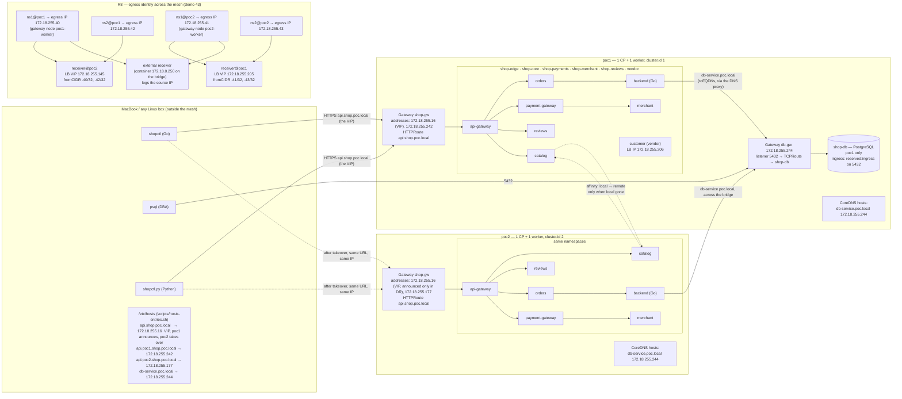

# Enhancement 002 — the shop platform on the mesh: global services, a gateway per cluster, an "external" database behind a TCPRoute, egress IPs, load, HPA and DR

Status: **plan, revision 4** (2026-09-18) — the operator: *"We need a new demo now. We need to implement"* this plan.
Revision 4 re-measures the lab (§8): the demo numbers move to **40–45** (36–39 were taken since revision 3), most of
phase 0 already happened (poc2 has the Gateway API, L2, its own pools, metrics-server; cf2cnp 0.9.0 has `fromCIDR`), both
clusters run Cilium **1.20.2 with the lab's own build** and are 1 control plane + 1 worker each, and the lab runs in CI.
Revision 3 (2026-09-13) had folded D1–D5 in and redesigned the egress-IP part (R8, demo 43) as "egress identity across
the mesh, three ways" with cost, risk and performance measured (§3.5, decision D6). Nothing built yet. Written from the
operator's summary, the Cilium documentation, and measurements on poc1/poc2; every fact that shaped a decision is in §2
with its source.

## 1. The brief, rewritten

Take demo 35's shop platform and run it as a **ClusterMesh application**: the same namespaces in poc1 and poc2,
stateless services deployed in both and declared global so each cluster serves itself and fails over to the other,
one database in poc1 that the platform treats as an **external database** — reached by an IP and a DNS name
through a TCPRoute, never by a Kubernetes Service name — an API gateway in each cluster behind one public URL that
an external customer's client keeps calling through every failure, load with health checks and autoscaling, a
vendor namespace whose traffic carries addresses Cilium assigns, and a series of failures and a DR exercise that
prove the whole thing behaves. Every policy is generated from observed flows with cf2cnp (the descriptions saying
who may reach whom, in which cluster, by which name), and every claim is measured.

| # | Requirement | Cilium feature it exercises |
|---|---|---|
| R1 | The platform's namespaces exist in **both** clusters with the same names; the stateless services (`api-gateway`, `catalog`, `orders`, `payment-gateway`, `merchant`, `reviews`, `backend`) run in both | ClusterMesh: identical name + namespace is what makes a service global |
| R2 | Every stateless service is a **global service that prefers its own cluster** and falls over to the other only when its local backends are gone | `service.cilium.io/global: "true"` + `service.cilium.io/affinity: local` |
| R3 | The **database** (`shop-db`, PostgreSQL) runs in **poc1 only** and is treated as an **external database**: it is published on the poc1 Gateway with a **TCPRoute** on port 5432, a **pinned address** and the DNS name **`db-service.poc.local`**; the backend in both clusters connects to that name, not to a Service name | Gateway API `TCPRoute`, LB IPAM static address, the DNS proxy (`toFQDNs`) |
| R4 | The backend's egress policy is **generated as `toFQDNs: matchName: db-service.poc.local`** (plus DNS) and nothing else; the database admits ingress **only from the Gateway that fronts it** (the way an external database's firewall admits the gateway's address) | DNS visibility → `toFQDNs` (demo 31's path), `reserved:ingress` |
| R5 | An **API gateway per cluster**; **one public URL** `api.shop.poc.local` on a **virtual address that poc1 announces and poc2 takes over in DR**, plus one address per cluster for observation; a script produces the MacBook's `/etc/hosts` block from live state | Gateway API in both clusters, LB IPAM static addresses, L2 announcements as the takeover mechanism |
| R6 | **Two external clients**, one in Go and one in Python, on the MacBook (or any Linux box): they know **only the URL**, check health, generate load, report per-second success and the serving cluster, and have a flag to skip CA verification; what happens behind the URL is the mesh's business | the platform seen from outside the mesh |
| R7 | Every workload has **liveness and readiness probes**; the stateless services **autoscale** (HPA on CPU) under the clients' load | metrics-server + HPA, so the failure scenarios are honest |
| R8 | **Egress identity across the mesh, three ways.** Two caller namespaces, `ns1` and `ns2`, exist in both clusters; a receiver service in each cluster and one outside both. (a) **Egress IPs**: each (namespace, cluster) pair gets its **own egress IP** — `ns1@poc1`, `ns1@poc2`, `ns2@poc1`, `ns2@poc2`, four addresses on the gateway nodes — and the receivers see those addresses in their flows, so their policies are `fromCIDR` per caller; (b) **a LoadBalancer VIP per receiver** with no egress gateway: callers cross the bridge masqueraded to their **node** addresses; (c) the **mesh's own identity** (global service, cluster-aware selectors) as the baseline. Cost, risk and performance of the three are measured side by side | Egress Gateway (per cluster, per namespace), LB IPAM, BPF masquerade, ClusterMesh identities |
| R9 | **Failure and DR scenarios**, each measured from the client and from Hubble: a pod dies, a service scales to zero in one cluster, a node is drained, a whole cluster is paused and poc2 takes over the public address, the mesh link is cut, the database is lost, everything comes back | global services, affinity, L2 takeover, health |
| R10 | Policies for all of it are **generated from flows**, reviewed by their descriptions, applied under audit first, then enforced; the verdict dashboards show both clusters | enhancement 001 end to end, on the mesh |

## 2. What research and measurement changed in the brief

| Fact | Source | Consequence in the plan |
|---|---|---|
| A global service load-balances across clusters when the Service has the **identical name and namespace** in each cluster; `shared: "false"` keeps a cluster's backends to itself while still consuming remote ones | [Global Services, 1.20](https://docs.cilium.io/en/stable/network/clustermesh/global-services/) | R1 as written; the stateless services are global in both clusters |
| `service.cilium.io/affinity: local` — "the Global Service will load-balance across healthy local backends, and only use remote endpoints if and only if all of local backends are not available or unhealthy" | [Service Affinity, 1.20](https://docs.cilium.io/en/stable/network/clustermesh/affinity/) | R2 is the documented behaviour; scenario S2 measures it |
| The egress gateway docs say, verbatim: "Egress gateway is not compatible with the Cluster Mesh feature. **The gateway selected by an egress gateway policy must be in the same cluster as the selected pods.**" It needs BPF masquerade + KPR (on here), CRD identities (on here), applies only to destinations **outside** the cluster ("any IP … which is also an internal cluster IP (e.g. pods, nodes, Kubernetes API server) will be excluded"), the egress IP "must be assigned to a network device on the node", and when several nodes match the selector "the first node in lexical ordering based on their name will be selected" (no HA in OSS) | [Egress Gateway, 1.20.1](https://docs.cilium.io/en/stable/network/egress-gateway/egress-gateway/) | The second sentence is the scope of the incompatibility: a policy may not pick a gateway in the **other** cluster. R8's design never does — every policy selects pods and a gateway node in its own cluster. Demo 43 therefore **enables the feature on poc1 and poc2 and measures the mesh before and after** (global services, remote endpoints, the DB path) with `destinationCIDRs` narrowed to the receivers' addresses so cross-cluster pod traffic is never SNATed; the throwaway `poc5` stays as the fallback if the measurement says otherwise. Secondary addresses are added to the gateway nodes' `eth0` (kind nodes are privileged containers; measured: `poc1-worker2` 172.18.0.4/16, `poc2-worker` 172.18.0.9/16). The docs' sentence and the measurement go into a gotcha either way |
| A Gateway takes its address from LB IPAM; a **specific address** is requested with `spec.addresses` (type `IPAddress`) | [Gateway API, 1.20](https://docs.cilium.io/en/v1.20/network/servicemesh/gateway-api/gateway-api/) | R3, R5: pinned addresses for the shop gateways and the DB route |
| A Gateway's `TCPRoute` forwards a TCP listener to a Service; demo 09 ran one on poc1 (the line-echo server) with the native Go client | demo 09, [Gateway API — TCPRoute support](https://docs.cilium.io/en/v1.20/network/servicemesh/gateway-api/gateway-api/) | R3: the DB behind a `TCPRoute` on a dedicated Gateway listener (port 5432), the Envoy proxy in between |
| A source that is an unknown external address arrives as `reserved:world`; cf2cnp today turns a world **source** into `fromEntities` (its `IngressRule` has no `fromCIDR`), while a world **destination** becomes `toCIDR` | cf2cnp `internal/policy/types.go`, `generateEntityIngressRules` (read today) | R8(a) needs the ingress mirror of `toCIDR` — and the forensic pass it triggered found the tool models 20 of the spec's 291 paths: **[enhancement 003](003-cf2cnp-cilium-policy-api.md)** makes cf2cnp consume Cilium's own policy types (0.7.0), with `fromCIDR` as its first new field — the prerequisite of phase 0 |
| Traffic that reaches a pod **through the Gateway carries the Gateway's identity, `reserved:ingress`**, not the caller's (measured in demo 33 on cf2cnp) | demo 33 Part 2, the review's C12 | R4: the DB's policy admits `reserved:ingress` on 5432 — the backend's identity ends at the proxy, exactly as with an external database and its firewall. The **backend's** policy is where "only the backend may reach the DB" lives, as `toFQDNs` |
| `toFQDNs` needs the DNS proxy: an egress L7 DNS rule on the endpoint; the names must resolve through kube-dns for the proxy to see them | [layer3.rst v1.20.1 lines 502–506](https://raw.githubusercontent.com/cilium/cilium/v1.20.1/Documentation/security/policy/layer3.rst), demo 31 | R3/R4: `db-service.poc.local` must resolve **inside** both clusters: a CoreDNS `hosts` entry (the `.poc.local` zone is not a cluster domain), then cf2cnp's `--dns-visibility` → `toFQDNs` on the next run, as demo 31 did |
| Two clusters on one bridge can each announce addresses with L2 announcements; an address announced by both at once is an ARP conflict. Cilium's L2 announcer holds a lease per service and sends gratuitous ARP when it takes one | [L2 Announcements, 1.20](https://docs.cilium.io/en/v1.20/network/l2-announcements/) | R5/R9: the public VIP is in **both** clusters' Gateways but **announced by poc1 only**; poc2's `CiliumL2AnnouncementPolicy` for it is applied by the DR runbook (`scripts/vip-takeover.sh poc2`) — an active/passive takeover the client never sees except as a pause |
| **poc2 has no Gateway API CRDs, no L2 announcement policy, no LB pool and `gatewayAPI` off** (measured) | `kubectl --context kind-poc2 get crd`, `helm get values` | Phase 0 brings poc2 to poc1's level, with a pool disjoint from poc1's |
| **No metrics-server in either cluster** (measured) | `kubectl top nodes` | R7: metrics-server on both (kind needs `--kubelet-insecure-tls`), HPA v2 on CPU |
| The MacBook reaches the kind bridge directly (measured: the Gateway at 172.18.255.240 → 200) | this session | R6 works with a hosts entry; the DBA's `psql` reaches the DB route the same way |
| Both clusters run VXLAN, BPF masquerade, KPR, CRD identities; the wildcard `*.poc.local` certificate comes from the enterprise root in poc1 and cert-manager runs in poc2 | `cilium-dbg status`, `cilium-config`, `get certificate` | poc2's Gateway carries a certificate from the same root; the clients trust one CA, or skip verification with the flag |

## 3. Architecture

Namespaces are identical in poc1 and poc2 (R1). The R8 box is demo 43's own lab (§3.5). Solid arrows are the calls the application makes; dotted arrows
are what Cilium adds or what DR changes: cross-cluster backends for the global services, used only when the local
ones are gone (R2), and the public VIP served by poc2 after the takeover (R5, S4). The database is on the far side
of a Gateway for **everyone** — the backends in both clusters and the DBA on the MacBook reach the same address
and name (R3).

### 3.1 The database as an external database — what that buys and what it costs

- **Buys:** the backend's configuration is a hostname and a port, as it would be for RDS or an on-prem Postgres; the
  policy cf2cnp writes for it is the one an external dependency gets, `toFQDNs: matchName: db-service.poc.local`,
  discovered from the flows once the DNS proxy is on (demo 31's two generations); the same name and address work
  from poc1, from poc2 and from the DBA's laptop; moving the database out of the cluster later changes one hosts
  entry, no policy.
- **Costs:** the Gateway's Envoy sits in the path, so the DB pod sees `reserved:ingress`, not the backend — the
  backend's identity is enforced on the backend's egress (R4), and the DB's own policy admits the Gateway on 5432
  and nothing else. The hop is measured in demo 42 (Hubble shows `backend → db-gw` as `toFQDNs`-allowed egress and
  `reserved:ingress → shop-db` as the DB's ingress). A pod in poc1 could also reach the Gateway's address by its
  Service path; the policy names the FQDN, so the path does not matter to it.

### 3.2 Workloads

| Namespace | Workload | Image | Where | Service / route | Probes | HPA |
|---|---|---|---|---|---|---|
| shop-edge | api-gateway (nginx reverse proxy) | nginx + ConfigMap | poc1, poc2 | global, affinity local; behind `shop-gw` (HTTPRoute `api.shop.poc.local`) which adds `X-Served-By: <cluster>` | `/healthz`, `/ready` (proxies catalog `/healthz`) | CPU 60 %, 1–3 |
| shop-core | catalog, orders | nginx + ConfigMap | poc1, poc2 | global, affinity local | `/healthz`, `/ready` | CPU 60 %, 1–3 |
| shop-core | **backend** (Go, `shopapi`) | built here, `kind load` into both | poc1, poc2 | global, affinity local; `DB_URL=postgres://…@db-service.poc.local:5432/shop` | `/healthz`; `/ready` = `SELECT 1` | CPU 60 %, 1–3 |
| shop-core | **shop-db** (PostgreSQL) | postgres:16-alpine (on the nodes) | **poc1 only** | ClusterIP for the TCPRoute only; `db-gw` Gateway, listener 5432, address `172.18.255.244`, name `db-service.poc.local` | `pg_isready` | none |
| shop-payments | payment-gateway | nginx + ConfigMap | poc1, poc2 | global, affinity local | as above | 1–3 |
| shop-merchant | merchant | nginx + ConfigMap | poc1, poc2 | global, affinity local | as above | 1–3 |
| shop-reviews | reviews, ratings | nginx + ConfigMap; alpine caller | poc1, poc2 | global, affinity local | as above | 1–3 |
| shop-clients | shopper, stranger | alpine callers | poc1, poc2 | — | — | — |
| ns1, ns2 (demo 43) | caller (alpine, calls the receivers) | alpine | poc1, poc2 | egress IPs `172.18.255.40–173`, one per (namespace, cluster) | — | — |
| receivers (demo 43) | receiver (nginx logging `$remote_addr`) | nginx + ConfigMap | poc1 (`LB VIP .205`), poc2 (`LB VIP .145`), a container on the bridge (`172.18.0.250`) | LB IPAM static addresses | `/healthz` | — |

`shopapi` is the one workload that must be a program: it opens a PostgreSQL connection to `db-service.poc.local`,
so the DB policy is measured on a real query. It is a small Go service (`/orders` reads a table, `/ready` runs
`SELECT 1`, `/healthz` answers), one static binary like demo 09's `routedemo`.

### 3.3 The external clients

Two implementations of one contract, so a customer with either toolchain can run it:

| | `demos/41-…/client/go/shopctl` | `demos/41-…/client/python/shopctl.py` |
|---|---|---|
| runtime | Go, one static binary for macOS/Linux | Python 3.9+, standard library only (`urllib`, `ssl`, `threading`) |
| `probe` | every path once, status and `X-Served-By` per path | same |
| `load --rate N --duration M` | N requests/s for M seconds, per-second success/failure and which cluster served, a latency histogram at the end | same |
| `--url https://api.shop.poc.local` | the only address it knows | same |
| `--cacert docs/root-ca.crt` | trust the enterprise root | same |
| `--insecure` / `-k` | skip CA verification (the operator's flag) | same |
| exit code | the number of failed checks / non-2xx seconds | same |

Neither client knows there are two clusters; `X-Served-By` is only reported, never used.

### 3.4 Policy matrix (what cf2cnp generates from the observed flows)

| Subject | Ingress from | Egress to |
|---|---|---|
| api-gateway (shop-edge) | `reserved:ingress` (the Gateway), shopper | catalog, orders, reviews, payment-gateway (local by affinity), kube-dns |
| catalog (shop-core) | orders, api-gateway (shop-edge), merchant (shop-merchant), reviews (shop-reviews) — **from both clusters** once S2 has produced the cross-cluster flows, so the remote peers carry `io.cilium.k8s.policy.cluster` | kube-dns |
| orders (shop-core) | api-gateway | catalog, payment-gateway, backend, kube-dns |
| **backend** (shop-core) | orders (both clusters) | **`toFQDNs: db-service.poc.local` on TCP/5432** and the kube-dns DNS rule — nothing else, measured with a call to catalog that must be dropped |
| **shop-db** (shop-core, poc1) | **`reserved:ingress` on TCP/5432** (the `db-gw` Envoy) — nothing else | none |
| payment-gateway, merchant, reviews | as demo 35, both clusters | as demo 35 |
| receiver@poc2 (demo 43a) | `fromCIDR` 172.18.255.40/32 (ns1@poc1) and .42/32 (ns2@poc1) — **generated** by cf2cnp 0.7.0 from the flows that arrive as `reserved:world` with those source addresses; ns1@poc2 by identity (same cluster) | — |
| receiver@poc1 (demo 43a) | `fromCIDR` .41/32 (ns1@poc2) and .43/32 (ns2@poc2); ns1@poc1 by identity | — |
| ns1, ns2 callers (demo 43a) | — | `toCIDR` the receivers' VIPs and the external receiver on TCP/80, kube-dns |

### 3.5 Egress identity across the mesh — three ways (R8, demo 43)

The question a security team asks when a service in one cluster calls a service in another, or outside: **what
does the receiver see, and what can it enforce on?** Three answers, built on the same callers (`ns1`, `ns2` in both
clusters) and the same receivers, so the comparison is fair.

| | (a) Egress IP per (namespace, cluster) | (b) LB VIP per receiver, no egress gateway | (c) Mesh identity (global service) |
|---|---|---|---|
| **What the receiver sees** | the caller's egress IP (`reserved:world` + address) — one address per namespace per cluster, four here | the caller's **node** address (BPF masquerade to the node: any pod on that node looks the same) | the caller's identity: labels + namespace + **cluster** (`io.cilium.k8s.policy.cluster`) |
| **The policy on the receiver** | `fromCIDR: <egress IP>/32` per caller (cf2cnp 0.7.0 generates it from the flows) | `fromCIDR: <node IP>/32` per node — coarse, and changes when nodes do | `fromEndpoints` with the namespace and cluster labels (demo 29) |
| **Path** | pod → VXLAN to the **gateway node** → SNAT → bridge → receiver's VIP (an extra hop) | pod → node SNAT → bridge → receiver's VIP | pod → VXLAN → pod in the other cluster (no SNAT, no VIP) |
| **What it costs** | one routable address per (namespace, cluster) on a gateway node's interface; a gateway node per policy (first by name if several match); connection tracking on the gateway | one VIP per receiver from the pool; nothing on the callers | nothing beyond the mesh |
| **Risk** | the gateway node is a single point of failure for that namespace's egress (no HA in OSS 1.20.1); in-flight connections break on gateway restart; a short window after a pod starts before the policy applies (docs); the mesh must be re-measured with the feature on | the node address is shared by every pod on the node — the policy admits more than the caller; node replacement changes the address | none of the above; only works between mesh members, not for an external receiver |
| **Performance** | measured: latency and throughput of caller → receiver with `shopctl load` and `iperf3`, versus (b) and (c) | measured | measured (baseline) |

Demo 43 runs all three on the same pairs, in this order, each recorded: (0) a pre-check that enabling the egress
gateway on poc1 and poc2 leaves the mesh intact (global services, the DB path, `cilium clustermesh status`);
(a) egress IPs — secondary addresses on the gateway nodes, four `CiliumEgressGatewayPolicy` objects (each selects
its namespace and a gateway node **in its own cluster**, `destinationCIDRs` = the receivers' addresses only),
`cilium-dbg bpf egress list`, the receivers' flows showing the four addresses, the policies generated (`fromCIDR`),
enforced, and a caller from the wrong namespace dropped; the external receiver's access log as the outside view;
(b) the egress policies removed, the same calls, the receivers now seeing node addresses, the coarser policy, and
the demonstration that a pod from another namespace on the same node passes it; (c) the global-service path with
cluster-aware selectors as the baseline. Then the numbers side by side, and the recommendation: identity inside the
mesh, an egress IP only where a receiver outside the mesh must enforce on an address.

## 4. Phases, demos, and the scripts each one adds

| Phase | Demo | What it delivers | Scripts / files it adds | Reqs |
|---|---|---|---|---|
| 0 — poc2 catches up, the tooling | 40 | The shared VIP pool in both clusters (`172.18.255.16–.31`), the L2 exclusion so neither `kind-l2-announce` ARPs for `shop-vip-gw`, two empty Gateways per cluster (per-cluster door + VIP door), the leaf from the shared root, `shopapi:local` built and loaded, both `shopctl`s built. Doors answer 404 until phase 1. | `cilium/lb-ippool-shared.yaml`, `cilium/l2-shop-vip-announce.yaml`, `scripts/vip-takeover.sh`, `demos/40-shop-mesh-phase0/{apply.sh,check.sh,cleanup.sh,hosts-entries.sh,00-namespaces.yaml,20-certificates.yaml,30-gateways-poc1.yaml,30-gateways-poc2.yaml,shopapi/,client/}` | R1, R5, R7 |
| 1 — the platform, global, one URL | 41 | The platform in both clusters (`apply-both.sh`), every stateless Service `global` + `affinity: local`; `shop-gw` in both with the VIP and a per-cluster address, HTTPRoute `api.shop.poc.local`, the `X-Served-By` header; the hosts block; `shopctl probe` from the MacBook (Go and Python); observe-first in both clusters, one `/generate` per cluster, descriptions reviewed, audit, enforce; the dashboards per cluster | `demos/41-shop-mesh-phase1/{10-platform.yaml,20-routes-poc1.yaml,20-routes-poc2.yaml,20-default-deny-ingress.yaml,apply-both.sh,probe.sh,audit-both.sh,flows-both.sh,generate-both.sh,verdicts-both.sh,observe-and-enforce.sh,check.sh,cleanup.sh,policies/}`; clients stay in `demos/40-shop-mesh-phase0/client/` (built in phase 0); hosts block is `demos/40-shop-mesh-phase0/hosts-entries.sh` | R1, R2, R5, R6, R10 |
| 2 — the external database | 42 | `shop-db` in poc1; `db-gw` with the TCPRoute and the pinned address; CoreDNS `hosts` entries in both clusters; `backend` configured with the FQDN; the DBA's `psql` from the MacBook; the backend's flows show the world IP first (no names) → `--dns-visibility` → the next flows carry `db-service.poc.local` → `toFQDNs`; the DB's policy (`reserved:ingress` on 5432); a backend call to catalog dropped; poc2's backend reaching the DB across the bridge with a real query | `demos/42/db.yaml` (StatefulSet, ClusterIP), `demos/42/db-gateway.yaml` (Gateway + TCPRoute + ReferenceGrant), `demos/42/coredns-hosts.sh`, `demos/42/db-check.sh` (psql from the MacBook and from each backend) | R3, R4 |
| 3 — egress identity across the mesh, three ways | 43 | §3.5: the pre-check (egress gateway enabled on both clusters, the mesh re-measured, `poc5` as the fallback), four egress IPs on the gateway nodes, the receivers (two pods with LB VIPs, one container outside), the flows at the receivers with the four addresses, `fromCIDR` policies generated by cf2cnp 0.7.0 and enforced, then the VIP-and-node-address variant, then the identity baseline; latency and throughput of the three paths; the comparison table filled with measurements; gotcha on the docs' Cluster Mesh sentence | `demos/43/egress-gateway-enable.sh` (helm upgrade both clusters + rollback), `demos/43/gateway-node-ips.sh` (secondary addresses on/off), `demos/43/callers.yaml`, `demos/43/receivers.yaml`, `demos/43/receiver-external.sh`, `demos/43/egress-policies.yaml`, `demos/43/measure.sh` (the three paths), `clusters/poc5.yaml` (fallback only) | R8 |
| 4 — load, health, autoscaling | 44 | `shopctl load` from the MacBook (both clients); HPA scaling catalog / orders / api-gateway up and back (`kubectl get hpa -w` recorded in both clusters); readiness taking a backend out of the endpoints when the DB is unreachable; verdicts staying forwarded through the scale events | `demos/44/hpa.yaml`, `demos/44/load.sh` (wraps the clients), `demos/44/watch.sh` | R7 |
| 5 — failures and DR | 45 | The scenario table below, each with the clients' per-second view and Hubble's | `demos/45/scenario.sh <S1..S7>`, `scripts/vip-takeover.sh <cluster>` (applies / removes the L2 policy for the VIP), `scripts/cluster-pause.sh` (exists) | R9 |

Every demo keeps the house rules: `scripts/record.sh` on every command into `output/transcript.txt`, `evidence.json`
captures, a README with the enterprise case, a GUIDE with exercises, a cleanup script.

### 4.1 Failure and DR scenarios (demo 45)

| # | Scenario | Action | Expected, to be measured (client + Hubble) |
|---|---|---|---|
| S1 | A pod dies | `kubectl delete pod` of catalog in poc1 (HPA min 2 for this demo) | the other replica serves; the clients' success stays 100 % |
| S2 | A service is gone in one cluster | `kubectl scale deploy/catalog --replicas=0` in poc1 | **affinity fallback**: poc1's api-gateway reaches catalog in poc2 (`destination.cluster_name: poc2` in Hubble, `X-Served-By` still poc1); no client error; scale back → local again |
| S3 | A node is drained | `kubectl drain poc1-worker` (the control plane is untainted on this lab, so the pods have somewhere to go) | pods reschedule; the L2 lease for the VIP moves to the other poc1 node (gratuitous ARP; the clients see at most a pause); failover counter 0 |
| S4 | A whole cluster is paused — **DR** | `scripts/cluster-pause.sh poc1`, then `scripts/vip-takeover.sh poc2` | the VIP stops answering; after the takeover the **same URL and IP** answer from poc2 (`X-Served-By: poc2`); everything serves **except** the DB path (the DB is in poc1 — `backend /ready` fails, orders that need it degrade): the honest picture of a single-site database, and the argument for a replica in poc2 as a follow-up |
| S5 | The mesh link is cut | scale `clustermesh-apiserver` to 0 in poc1 (or a policy on 2379) | each cluster keeps serving locally (affinity local); on restore the remote endpoints return |
| S6 | The database is lost | scale shop-db to 0 | backend `/ready` fails in both clusters, orders degrade, everything else serves; the readiness probe keeps the gateway from routing to a backend that cannot answer |
| S7 | Everything back | resume poc1, `vip-takeover.sh poc1`, scale up | the VIP back on poc1 (`X-Served-By: poc1`), the DB path back, verdicts on the local paths |

## 5. Decision log

| # | Decision | Outcome |
|---|---|---|
| D1 + D2 | The database as an **external database**: a TCPRoute on a Gateway, a pinned address, the name `db-service.poc.local`, the backend on the FQDN, the policy auto-generated as `toFQDNs` | **Taken** (operator, 2026-09-13). The DB's own policy admits the Gateway's identity; the backend's identity is enforced on its egress (§3.1) |
| D1 (egress IP) | The vendor namespace's egress IP on a throwaway cluster, since the feature is documented as incompatible with Cluster Mesh | **Taken** |
| D3 | The backend as a Go service with a real PostgreSQL query | **Taken** |
| D4 | The client knows only the URL; failover is the mesh's business | **Taken** — the public VIP is announced by poc1 and taken over by poc2 in DR (L2 announcements); two clients, Go and Python, with `--insecure` |
| D5 | Demos 40–45, scripts per demo, steps a junior can follow | **Taken** |
| D6 | The egress-IP part redesigned (operator, revision 3): per-(namespace, cluster) egress IPs on the mesh clusters themselves, receivers that see and enforce on them, then the VIP/node-address variant and the identity baseline, with cost, risk and performance measured | **Taken** — §3.5; the docs' Cluster Mesh sentence read as its second sentence says (a gateway must be in the pods' own cluster), verified by measurement before anything else is built on it; `poc5` only as the fallback |

## 6. Stack facts the plan relies on

| Fact | Source |
|---|---|
| Global services: identical name + namespace in each cluster; `shared: "false"` keeps backends local | [docs.cilium.io — Global Services](https://docs.cilium.io/en/stable/network/clustermesh/global-services/) |
| `affinity: local` uses remote endpoints only when every local backend is unavailable or unhealthy | [docs.cilium.io — Service Affinity](https://docs.cilium.io/en/stable/network/clustermesh/affinity/) |
| Egress gateway: "not compatible with the Cluster Mesh feature. The gateway selected by an egress gateway policy must be in the same cluster as the selected pods"; BPF masquerade + KPR; CRD identities; cluster-external destinations only; the egress IP must be on a node device; several matching nodes → the first by name; `cilium-dbg bpf egress list` | [docs.cilium.io — Egress Gateway 1.20.1](https://docs.cilium.io/en/stable/network/egress-gateway/egress-gateway/) |
| Gateway addresses from LB IPAM; a static address via `spec.addresses`; TCPRoute supported | [docs.cilium.io — Gateway API](https://docs.cilium.io/en/v1.20/network/servicemesh/gateway-api/gateway-api/), demo 09 |
| L2 announcements: leases per service, gratuitous ARP on takeover | [docs.cilium.io — L2 Announcements](https://docs.cilium.io/en/v1.20/network/l2-announcements/) |
| `toFQDNs` needs the DNS proxy (an L7 DNS rule); names come from the DNS answers the proxy sees | [layer3.rst v1.20.1](https://raw.githubusercontent.com/cilium/cilium/v1.20.1/Documentation/security/policy/layer3.rst), demo 31 |
| A request through a Cilium Gateway reaches the pod as `reserved:ingress` | demo 33 Part 2 (measured) |
| A selector without the cluster label matches the local cluster only (1.19+) | [policy.rst v1.20.1](https://raw.githubusercontent.com/cilium/cilium/v1.20.1/Documentation/network/clustermesh/policy.rst), demo 29 |
| poc1: KPR, VXLAN, BPF masquerade, L2, Gateway API, pools `.200–239` / `.240–250`, gateways at `.240`/`.241`; poc2: KPR, VXLAN, BPF masquerade, no Gateway API/L2/pool; no metrics-server; the MacBook reaches the bridge | measured 2026-09-13 |

## 7. Risks

- **Memory.** Seven kind nodes plus the observability stack already run on the Docker Desktop VM; `poc5` exists for
  one demo and is deleted after. HPA maxima stay at 3.
- **Two L2 announcers on one bridge.** The pools are disjoint; the VIP is in both clusters' Gateways but announced by
  one at a time — the takeover script applies one cluster's L2 policy and removes the other's, in that order, and
  the demo measures the ARP change from the MacBook (`arp -n`).
- **`.poc.local` inside the clusters.** The name is served by a CoreDNS `hosts` entry; the DNS proxy sees the answer,
  which is what `toFQDNs` needs. Checked in demo 42 before any policy.
- **A Gateway on poc2** needs the CRDs, the feature flag and a certificate — phase 0 exists for them.
- **Egress gateway on mesh members.** The docs say the feature "is not compatible with the Cluster Mesh feature" and then scope it to cross-cluster gateway selection. Demo 43 enables it on both clusters with narrow `destinationCIDRs` and measures the mesh first; if anything regresses, the helm upgrade is rolled back (the script keeps the previous values) and the egress-IP part moves to `poc5`.
- **Four routable addresses on node interfaces** are added by `ip addr add` inside the kind node containers; they do not survive a container restart, so the script that adds them is idempotent and the DR scenarios note it.

## 8. Revision 4 — the lab re-measured on 2026-09-18, and what it changes

| Revision 3 assumed (2026-09-13) | Measured 2026-09-18 | Consequence |
|---|---|---|
| Demos 36–41 free | Demos 36 (trust everywhere), 37 (two gateways), 38 (Grafana visual grammar), 39 (the remote-workload fix) exist | The phases are **demos 40–45**; every `demos/NN/` path in §4 renumbered |
| poc1 = 3 CP + 2 workers; egress node `poc1-worker2` | poc1 = `poc1-control-plane` + `poc1-worker`; poc2 = `poc2-control-plane` + `poc2-worker` (`kubectl get nodes`) | The R8 gateway nodes are the two workers; S3 drains `poc1-worker`; HPA maxima stay at 3 |
| Cilium 1.20.1 | **1.20.2 with the lab's own build** `ghcr.io/ephico2real2/cilium-dev:1.20.2-remote-workload-1d3a02ab` on both clusters (`versions.env`); Hubble names the workload of a remote pod (demo 39) | The dashboards in demos 41/44/45 can key on `destination_workload` across nodes; the same image on both clusters stays the rule |
| poc2 has no Gateway API CRDs, no L2 policy, no LB pool, `gatewayAPI` off | poc2: 10 `gateway.networking.k8s.io` CRDs, `enable-gateway-api: true`, `enable-l2-announcements: true`, pools `kind-docker-pool .136–.175` and `gateway-pool .176–.186` (`cilium/lb-ippool-poc2.yaml`), `rebel-base-lb` at `.136` | Phase 0 loses its biggest item; what is left of it is in the row below |
| No metrics-server | `metrics-server 1/1` in both clusters (`kubectl top` answers) | Phase 0 loses `metrics-server.sh`; demo 44's HPA needs nothing installed |
| cf2cnp 0.7.0 from enhancement 003 is a prerequisite (`fromCIDR`) | cf2cnp **0.9.0** (`internal/policy/generator.go` writes `FromCIDR`); the observer chart pins the subchart at 0.7.0 | The prerequisite is met; demo 43's `fromCIDR` policies come from the running tool |
| A wildcard certificate from the enterprise root on poc2 | poc2 has no `wildcard-poc-local-tls`; trust-manager runs in both clusters (demo 36) and the root is `clustermesh-root-ca` in poc1's cert-manager | **Still phase 0:** a Certificate for `*.shop.poc.local` in poc2 from the same root (the demo 36 path), or the clients trust `docs/root-ca.crt` |
| The shared VIP block `172.18.255.0/26` in a pool present in both clusters | No pool covers it in either cluster (`get ciliumloadbalancerippools`) | **Still phase 0:** `cilium/lb-ippool-shared.yaml` (the VIP `.16`, §8.1) applied to both, announced by one |
| poc1's gateway-pool `.240–.250` free above `.241`; revision 3's addresses (`.160` VIP, `.142`, `.245`, `.243`, egress `.170–.173`) | `.240` routes-gw, `.241` sw-gateway, `.243` team-b-gw (demo 37) in use; `.160` and `.170–.173` fall inside poc2's *service* range `.136–.175`, `.245`/`.243` inside poc1's Gateway-only pool, `.142` inside poc2's service range — none of them was where the design's blocks put it | **The address plan is redone (below):** the VIP `.16` in the shared block; the shop gateways `.242` (poc1) and `.177` (poc2); plain LB Services in the service ranges (`.205`, `.206`, `.145`); the egress IPs `.40–.43` in the shared block, outside any pool |
| Seven kind nodes on the Docker VM | Four nodes; the VM (10 CPU / 24 GiB) at **17.0 GiB used**, ~1.1 cores busy; a Cilium builder container's `go test` on the same VM OOM-killed all four Tetragon agents in one second and the restarted agents burned 1.6–4.2 cores re-walking the VM's cgroup tree (gotcha #118, PR #44: the limit goes to 1Gi) | Memory headroom ≈ 7 GiB against ≈ 1–2 GiB the platform adds at HPA maximum — no resize; §7's memory risk downgraded; **no build containers on the VM while a demo measures** (gotcha #118) |
| The lab is hand-driven | `scripts/lab-up.sh`, `lab-stack.sh`, `lab-apps.sh` and the `lab-regression` Action build it on a runner (enhancement 004, demo 39's step) | Every demo of this plan ships an `apply` that is idempotent from a fresh `lab-up`, and demo 41 adds a regression row (the VIP answers, `X-Served-By` names a cluster) so CI keeps it honest |

Phase 0 (demo 40) after this revision: the shared-VIP pool in both clusters, the poc2 wildcard certificate, the platform
manifests parameterised for both contexts, `shopapi` built and loaded into all four nodes, both clients built. Everything
else in its original row is done and verified above.

### 8.1 The address plan, revision 4 (every address inside the block the design gives its cluster)

| Address | What | Block / pool | Who announces |
|---|---|---|---|
| `172.18.255.16` | the public VIP `api.shop.poc.local` — `spec.addresses` on **`shop-vip-gw`**, its own Gateway in **both** clusters (demo 40: a Gateway with two addresses gets both IPs on one Service, but an L2 policy selects Services, not IPs — so the VIP door is separate from the per-cluster door) | shared `172.18.255.0/26`; pool `shared-vip-pool` `.16–.31` in both clusters (`cilium/lb-ippool-shared.yaml`, `owning-gateway In [shop-vip-gw]`) | exactly one cluster: `cilium/l2-shop-vip-announce.yaml`, moved by `scripts/vip-takeover.sh` (delete-other-first; `--force` in DR); both `kind-l2-announce` policies exclude it |
| `172.18.255.242` | `api.poc1.shop.poc.local` — poc1's own address on `shop-gw` | poc1 `gateway-pool .240–.250` (`.240`, `.241`, `.243` taken) | poc1 |
| `172.18.255.244` | `db-service.poc.local` — `db-gw`, the TCPRoute to `shop-db` | poc1 `gateway-pool` | poc1 |
| `172.18.255.177` | `api.poc2.shop.poc.local` — poc2's own address on `shop-gw` | poc2 `gateway-pool .176–.186` | poc2 |
| `172.18.255.205` | receiver@poc1's LB VIP (demo 43) | poc1 `kind-docker-pool .200–.239` (`.201` hubble-ui) | poc1 |
| `172.18.255.206` | the vendor `customer` LB (if kept) | poc1 `kind-docker-pool` | poc1 |
| `172.18.255.145` | receiver@poc2's LB VIP (demo 43) | poc2 `kind-docker-pool .136–.175` (`.136` rebel-base-lb) | poc2 |
| `172.18.255.40–.43` | the four egress IPs — `ns1@poc1 .40`, `ns1@poc2 .41`, `ns2@poc1 .42`, `ns2@poc2 .43` — secondary addresses on the workers' `eth0`, **not** LB IPAM | shared `172.18.255.0/26`, reserved `.40–.47` for node-held addresses, outside every pool | the node that holds it (ARP by the kernel) |
| `172.18.0.250` | the external receiver, a container on the bridge | Docker's own range (the CI lab creates the network with `--ip-range 172.18.0.0/17`) | Docker |

`NETWORKING_DESIGN.md` §3 carries the two rows (the shared pool's range and the node-held reservation) since demo 40 (PR #46).
