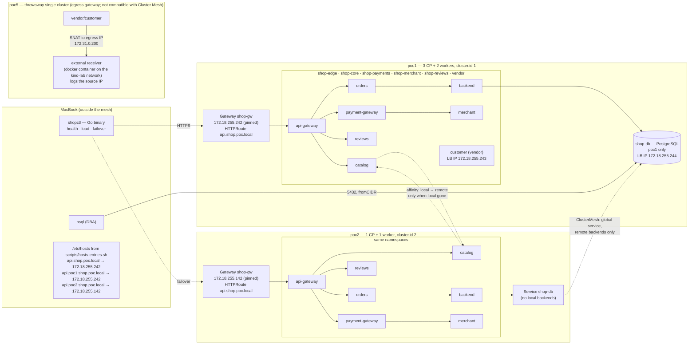

# Enhancement 002 — the shop platform on the mesh: global services, a gateway per cluster, a database with a policy, egress IPs, load, HPA and DR

Status: **plan for review** (2026-09-13). Nothing built yet. Written from the operator's summary, the Cilium 1.20.1
documentation, and measurements on poc1/poc2 taken today; every fact that shaped a decision is in §2 with its source.

## 1. The brief, rewritten

Take demo 35's shop platform and run it as a **ClusterMesh application**: the same namespaces in poc1 and poc2,
stateless services deployed in both and declared global so each cluster serves itself and fails over to the other,
one stateful database in poc1 only, an API gateway in each cluster with its own pinned address and DNS name, an
external client on the MacBook calling the public URL, load with health checks and autoscaling, a vendor
namespace whose traffic to the outside world carries an egress IP Cilium assigns, and a series of failures and a DR
exercise that prove the whole thing behaves. Every step generates its policies from observed flows with cf2cnp
(the descriptions saying who may reach whom, in which cluster), and every claim is measured.

The requirements, numbered so the plan and the demos can point at them:

| # | Requirement | Cilium feature it exercises |
|---|---|---|
| R1 | The platform's namespaces exist in **both** clusters with the same names; stateless services (`api-gateway`, `catalog`, `orders`, `payment-gateway`, `merchant`, `reviews`, `backend`) run in both | ClusterMesh: identical name + namespace is what makes a service global |
| R2 | Every stateless service is a **global service that prefers its own cluster** and falls over to the other only when its local backends are gone | `service.cilium.io/global: "true"` + `service.cilium.io/affinity: local` |
| R3 | A **database** (`shop-db`, PostgreSQL) runs in **poc1 only**; a global service in both clusters, so the backend in poc2 reaches it; its Service is **not shared back** (nothing to share) | global + `service.cilium.io/shared` semantics; cross-cluster ClusterIP |
| R4 | The DB accepts ingress **only from the backend**, from whichever cluster the backend runs in; the backend's egress is **only the DB and DNS** (and the services it must call) | cluster-aware selectors (`io.cilium.k8s.policy.cluster`), generated by cf2cnp 0.6.x from observed flows, egress policies |
| R5 | An **API gateway per cluster**, each with a **pinned LoadBalancer address** from that cluster's pool and a DNS name; a script produces the MacBook's `/etc/hosts` block from live state | Gateway API on both clusters, LB IPAM with a static address (`spec.addresses`), L2 announcements |
| R6 | An **external client** — a binary on the MacBook — calls the public gateway URL, checks health, generates load, and **fails over** to the other cluster's gateway when one goes away | the platform seen from outside the mesh |
| R7 | Every workload has **liveness and readiness probes**; the stateless services **autoscale** (HPA on CPU) under the client's load | not Cilium: metrics-server + HPA, needed for the failure scenarios to be honest |
| R8 | A **vendor namespace** with a `customer` service gets addresses **from Cilium's pool**: an ingress LoadBalancer IP, and an **egress IP** on its traffic to the outside | LB IPAM (on the mesh clusters); **Egress Gateway** (see §2 — on a separate cluster, by documented constraint) |
| R9 | **Failure and DR scenarios**, each measured: a pod dies, a service scales to zero in one cluster (affinity fallback), a node is drained, a whole cluster is paused (the client fails over), the mesh link is cut, the DB is lost (degraded mode), everything comes back | global services, affinity, health, Hubble verdicts throughout |
| R10 | Policies for all of it are **generated from flows** (cf2cnp), reviewed by their descriptions, applied under audit first, then enforced; the dashboards show the verdicts per cluster | enhancement 001 end to end, on the mesh |

## 2. What research and measurement changed in the brief

Each row is a fact checked today against the documentation or the running clusters, and what the plan does about it.

| Fact | Source | Consequence in the plan |
|---|---|---|
| A global service load-balances across clusters when the Service has the **identical name and namespace** in each cluster; `shared: "false"` keeps a cluster's backends to itself while still consuming remote ones | [Global Services, 1.20](https://docs.cilium.io/en/stable/network/clustermesh/global-services/) | R1/R3 as written; the DB Service exists in both clusters (poc2's has no backends and points across the mesh) |
| `service.cilium.io/affinity: local` — "the Global Service will load-balance across healthy local backends, and only use remote endpoints if and only if all of local backends are not available or unhealthy" | [Service Affinity, 1.20](https://docs.cilium.io/en/stable/network/clustermesh/affinity/) | R2 is the documented behaviour; scenario S2 (scale to zero) is its measurement |
| **Egress gateway is not compatible with Cluster Mesh** — "the gateway selected by an egress gateway policy must be in the same cluster as the selected pods"; it needs BPF masquerade and kube-proxy replacement (both on here), CRD identity mode (on here), and applies only to destinations **outside** the cluster | [Egress Gateway, 1.20.1](https://docs.cilium.io/en/stable/network/egress-gateway/egress-gateway/) | R8's egress IP cannot be shown on poc1/poc2. Plan: a **throwaway single cluster (`poc5`)** as demo 13 did for ztunnel, the vendor namespace deployed there, an external receiver on the docker network measuring the source IP. The ingress LB IP part of R8 stays on the mesh. Recorded as a gotcha |
| A Gateway takes its address from LB IPAM; a **specific address** is requested with `spec.addresses` (type `IPAddress`) — the `io.cilium/lb-ipam-ips` annotation also works but is to be deprecated | [Gateway API, 1.20](https://docs.cilium.io/en/v1.20/network/servicemesh/gateway-api/gateway-api/) | R5: one Gateway per cluster with a pinned address in `spec.addresses` |
| **poc2 has no Gateway API CRDs, no L2 announcement policy, no LB pool and `gatewayAPI` off** (measured: 0 CRDs vs poc1's 8; `l2announcements`/`gatewayAPI` null in its values) | `kubectl --context kind-poc2 get crd`, `helm get values` | Phase 0 brings poc2 to poc1's level: CRDs v1.6.1, `gatewayAPI.enabled`, `l2announcements`, a pool that does not overlap poc1's (both clusters share the `kind` bridge `172.18.0.0/16`, so L2-announced addresses must be disjoint) |
| **No metrics-server in either cluster** (measured: `Metrics API not available`) | `kubectl top nodes` | R7: install metrics-server on both (kind needs `--kubelet-insecure-tls`), then HPA v2 on CPU |
| The MacBook reaches the kind bridge directly (measured: `curl` to the Gateway at 172.18.255.240 → 200) | this session | R6 works with a hosts entry and the pinned addresses; no port-forward |
| Both clusters run VXLAN tunnel routing, BPF masquerade, KPR, CRD identities; the wildcard `*.poc.local` certificate is issued by the enterprise root in poc1 and cert-manager is present in poc2 | `cilium-dbg status`, `cilium-config`, `get certificate` | poc2's Gateway can carry a certificate from the **same root**, so the MacBook client trusts both gateways with one CA |
| Docker Desktop hosts 7 kind nodes today; a throwaway cluster adds 2–3 more | demo 13 built `poc4` as 1 CP + 2 workers on its own network | `poc5` is created only for demo 39 and deleted after; `scripts/cluster-pause.sh` frees memory during it |
| A DNS-level failover between two gateways (GSLB) is outside kind and this PoC | — | R6's failover is **client-side**: the binary knows both gateway addresses and retries on the other; the hosts block lists a primary name and one name per cluster |
| "Give the db an egress IP": a database does not initiate connections, and egress IPs apply to traffic *leaving* the cluster | Egress Gateway docs | Interpreted as **a fixed, dedicated address for the DB**: a LoadBalancer IP from the pool, reachable from the MacBook (a DBA's `psql`), with a policy admitting only the backend (both clusters) and that operator CIDR. **Open decision D2 below** |

## 3. Architecture

Namespaces are identical in poc1 and poc2 (R1). Solid arrows are the calls the application makes; dotted arrows
are what Cilium adds: cross-cluster backends for the global services, used only when the local ones are gone
(R2), the DB reached from poc2 through the mesh (R3), and the client's failover (R6).

### 3.1 Workloads

| Namespace | Workload | Image | Where | Service annotations | Probes | HPA |
|---|---|---|---|---|---|---|
| shop-edge | api-gateway (nginx reverse proxy) | nginx:1.27-alpine + ConfigMap | poc1, poc2 | global, affinity local | `/healthz` (liveness), `/ready` (readiness — a `proxy_pass` to catalog `/healthz`) | CPU 60 %, 1–3 |
| shop-core | catalog, orders | nginx + ConfigMap | poc1, poc2 | global, affinity local | `/healthz`, `/ready` | CPU 60 %, 1–3 |
| shop-core | **backend** (Go, `shopapi`) | new image, built here, `kind load` into both | poc1, poc2 | global, affinity local | `/healthz`; `/ready` = a `SELECT 1` on the DB | CPU 60 %, 1–3 |
| shop-core | **shop-db** (PostgreSQL) | postgres:16-alpine (on the nodes) | **poc1 only**; the Service in both | global (poc2's Service consumes poc1's backends); LB IP pinned for the DBA (D2) | `pg_isready` | none (stateful) |
| shop-payments | payment-gateway | nginx + ConfigMap | poc1, poc2 | global, affinity local | as above | 1–3 |
| shop-merchant | merchant | nginx + ConfigMap | poc1, poc2 | global, affinity local | as above | 1–3 |
| shop-reviews | reviews, ratings | nginx + ConfigMap; alpine caller | poc1, poc2 | global, affinity local | as above | 1–3 |
| shop-clients | shopper, stranger | alpine callers | poc1, poc2 | — | — | — |
| vendor | customer | nginx + ConfigMap | poc1, poc2 (LB IP); **poc5** (egress IP) | LB IP from the pool (R8) | as above | — |

The backend is the one workload that must be a real program: it opens a PostgreSQL connection, so the DB policy
(R4) is measured on a real query, not on a TCP handshake. It is a ~100-line Go service (`/orders` reads a table,
`/ready` runs `SELECT 1`, `/healthz` answers), built with the same one-static-binary approach as demo 09's
`routedemo`. The external client `shopctl` is the second Go binary: `probe` (every path, both gateways, the
status and the serving cluster from a response header the gateway sets), `load` (N req/s for M minutes, a latency
histogram), `failover` (primary first, the other gateway on error, counts per cluster).

### 3.2 Policy matrix (what cf2cnp generates from the observed flows)

| Subject | Ingress from | Egress to |
|---|---|---|
| api-gateway (shop-edge) | the Gateway's Envoy (`reserved:ingress`), shopper | catalog, orders, reviews, payment-gateway (same cluster; the global service keeps it local), kube-dns |
| catalog (shop-core) | orders, api-gateway (shop-edge), merchant (shop-merchant), reviews (shop-reviews) — **each from both clusters**, so the selectors carry `io.cilium.k8s.policy.cluster` for the remote one | kube-dns |
| orders (shop-core) | api-gateway | catalog, payment-gateway, backend, kube-dns |
| backend (shop-core) | orders (both clusters) | **shop-db on TCP/5432 only, plus kube-dns** (R4) — and nothing else, measured with a call to catalog that must fail |
| shop-db (shop-core, poc1) | **backend from poc1 and from poc2** (two `fromEndpoints`, the second with `cluster: poc2`); the DBA's address as `fromCIDR` (D2) | none |
| payment-gateway, merchant, reviews | as demo 35, both clusters | as demo 35 |
| customer (vendor) | the LB IP's callers (`reserved:world` through the LB), the MacBook | the external receiver only (poc5), through the egress gateway |

The cross-cluster rows are exactly the case demo 29 proved: a peer in the other cluster needs its cluster label
or the policy admits the wrong pod.

## 4. Phases and demos

| Phase | Demo | What it delivers | Requirements |
|---|---|---|---|
| 0 — poc2 catches up | 36 | Gateway API CRDs, `gatewayAPI.enabled`, `l2announcements`, an LB pool (`172.18.255.128–159` gateway, `172.18.255.100–127` services) and a wildcard certificate from the enterprise root on poc2; metrics-server on both clusters; the platform manifests parameterised for both clusters (the same files, `kubectl apply` to both contexts); the `shopapi` and `shopctl` binaries built | R1, R5, R7 (prerequisites) |
| 1 — the platform, global | 37 | The platform in both clusters, every stateless Service `global` + `affinity: local`, the DB in poc1 with its Service in both; a Gateway per cluster with a pinned address and `api.shop.poc.local`; the hosts block script; `shopctl probe` from the MacBook showing which cluster served; observe-first across both clusters, one `/generate` per cluster (flows carry the cluster names), descriptions reviewed, applied under audit, enforced; the dashboards per cluster | R1, R2, R5, R6, R10 |
| 2 — the database | 38 | `backend` and `shop-db`; the DB's policy from flows of both clusters' backends (the cluster labels); the backend's egress policy (DB + DNS only), a call from backend to catalog dropped; the DB's LB IP and the DBA's `fromCIDR` (D2); poc2's backend reaching poc1's DB through the mesh, measured with a real query | R3, R4 |
| 3 — the vendor and the egress IP | 39 | `customer` with a pinned LB IP on the mesh clusters; `poc5` created (`clusters/poc5.yaml`, its own network `kind-lab`, `egressGateway.enabled`), the vendor namespace deployed there, an external receiver container on that network, the source IP measured **without** and **with** the `CiliumEgressGatewayPolicy` (`cilium-dbg bpf egress list` on the gateway node), `poc5` deleted; gotcha: egress gateway and Cluster Mesh | R8 |
| 4 — load, health, autoscaling | 40 | `shopctl load` against `api.shop.poc.local`; HPA scaling catalog/orders/api-gateway up and back down (`kubectl get hpa -w` recorded); the readiness probes taking a pod out of the endpoints when its DB is unreachable (backend's `/ready`); Hubble verdicts staying forwarded through the scale events | R7 |
| 5 — failures and DR | 41 | The scenario table below, each with the client's view (`shopctl failover` counts per cluster) and Hubble's | R9 |

### 4.1 Failure and DR scenarios (demo 41)

| # | Scenario | Action | Expected, to be measured |
|---|---|---|---|
| S1 | A pod dies | `kubectl delete pod` of catalog in poc1 | the other replica (HPA min 1 → set min 2 for this) serves; no client error |
| S2 | A service is gone in one cluster | `kubectl scale deploy/catalog --replicas=0` in poc1 | **affinity fallback**: poc1's api-gateway reaches catalog in poc2 (Hubble: `destination.cluster_name: poc2`); the client sees no error; scale back → local again |
| S3 | A node is drained | `kubectl drain poc1-worker2` | pods reschedule; the Gateway's L2 address moves to another node (`cilium-dbg` shows the new leaseholder); the client's failover counter stays at 0 |
| S4 | A whole cluster is paused | `scripts/cluster-pause.sh poc1` | the primary gateway stops answering; `shopctl failover` switches to poc2's gateway; poc2 serves everything **except** what needs the DB (backend `/ready` fails, orders that need it degrade) — the honest picture of a single-region database |
| S5 | The mesh link is cut | scale `clustermesh-apiserver` to 0 in poc1 (or a policy blocking 2379) | each cluster keeps serving locally (affinity local); poc2's DB calls fail; on restore the remote endpoints return |
| S6 | The database is lost | scale shop-db to 0 | backend `/ready` fails in both clusters, orders degrade, everything else serves; the readiness probe is what keeps the gateway from routing to a backend that cannot answer |
| S7 | Everything back | resume, scale up | the client's counters return to poc1; Hubble shows the verdicts back on the local paths |

Each scenario records: the command, `shopctl`'s per-cluster counts and error rate over the window, the verdict
dashboard for the namespace on both clusters, and the flows-summary of who served.

## 5. Open decisions for the operator

| # | Decision | Recommendation |
|---|---|---|
| D1 | The egress IP on a throwaway `poc5` (documented incompatibility with Cluster Mesh), or drop the egress-IP part and keep only the LB IP for the vendor namespace | **poc5**, as demo 13 did: the feature is real and worth showing, and the gotcha is worth writing down |
| D2 | What "the DB's egress IP" should mean | **A pinned LoadBalancer IP for the DB plus a `fromCIDR` for the MacBook DBA** in the DB's policy, beside the two backend rules — it demonstrates LB IPAM and CIDR policies on the stateful piece. If you meant something else, say so |
| D3 | The backend as a small Go service with a real PostgreSQL query (needs a build and `kind load`), or a `psql`-in-a-loop sidecar like the other callers | **Go service**: the readiness-on-DB behaviour in S4/S6 needs a program that knows whether its DB answers |
| D4 | Failover from the MacBook: client-side in `shopctl` (proposed) — there is no DNS-level failover in kind | **client-side**, with the hosts block listing the primary and one name per cluster |
| D5 | Numbering: demos 36–41 as above, or fold phases 0 and 1 into one demo | **36–41**: six demos, each one measurement set, in the style of 29–35 |

## 6. Stack facts the plan relies on

| Fact | Source |
|---|---|
| Global services: identical name + namespace in each cluster; `shared: "false"` keeps backends local | [docs.cilium.io — Global Services](https://docs.cilium.io/en/stable/network/clustermesh/global-services/) |
| `affinity: local` uses remote endpoints only when every local backend is unavailable or unhealthy | [docs.cilium.io — Service Affinity](https://docs.cilium.io/en/stable/network/clustermesh/affinity/) |
| Egress gateway: not compatible with Cluster Mesh; needs BPF masquerade + KPR; CRD identities; applies to cluster-external destinations; new pods have a short window before the policy applies; `cilium-dbg bpf egress list` | [docs.cilium.io — Egress Gateway 1.20.1](https://docs.cilium.io/en/stable/network/egress-gateway/egress-gateway/) |
| Gateway addresses from LB IPAM; a static address via `spec.addresses` (IPAddress); `io.cilium/lb-ipam-ips` to be deprecated | [docs.cilium.io — Gateway API](https://docs.cilium.io/en/v1.20/network/servicemesh/gateway-api/gateway-api/) |
| poc1: KPR, VXLAN, BPF masquerade, L2 announcements, Gateway API on, pools `172.18.255.200–239` and `240–250`, gateways at `.240`/`.241`, hubble-ui at `.201`; poc2: KPR, VXLAN, BPF masquerade, no Gateway API, no L2, no pool; no metrics-server anywhere; the MacBook reaches the bridge | measured 2026-09-13 (this session) |
| A default-deny in policy audit mode is how the INGRESS flows to generate from are produced | demos 26, 29, 35 |
| A selector without the cluster label matches the local cluster only (1.19+) | [policy.rst v1.20.1](https://raw.githubusercontent.com/cilium/cilium/v1.20.1/Documentation/network/clustermesh/policy.rst), demo 29 |

## 7. Risks

- **Memory.** Seven kind nodes plus Loki, Prometheus, Grafana and two Cilium installs already run on the Docker
  Desktop VM; `poc5` adds nodes for one demo and is deleted after. HPA maxima stay at 3.
- **Two L2 announcers on one bridge.** poc1 and poc2 both answer ARP on `172.18.0.0/16`; the pools must not overlap
  (they do not in the plan) and a pinned address must belong to its cluster's pool.
- **A Gateway on poc2 needs the CRDs, the feature flag and a certificate** — three things that took poc1 demos 05, 08
  and 09; phase 0 exists for them.
- **The client's failover is not DNS.** Stated as such in every demo that uses it.
- **Egress gateway on a fresh cluster** is a new install path (native routing or tunnel; the docs list no tunnel
  restriction in 1.20.1, and the phase measures it rather than assuming).
