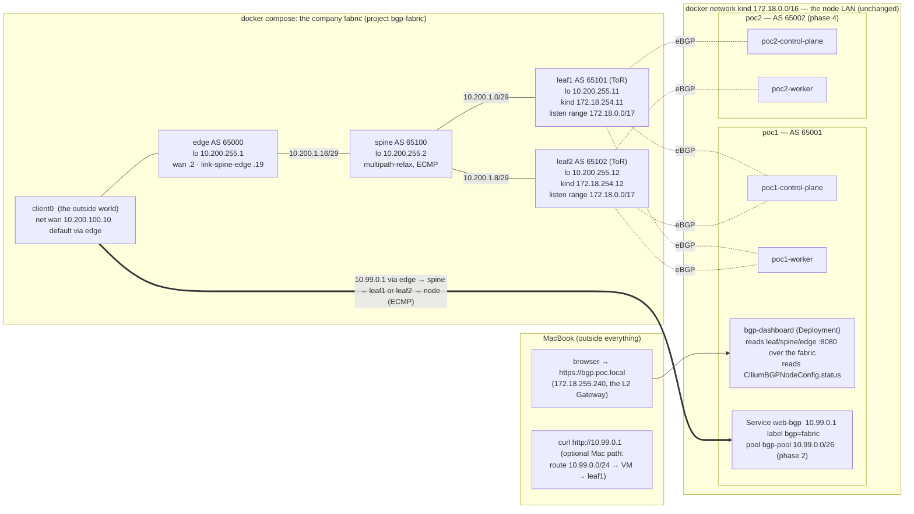
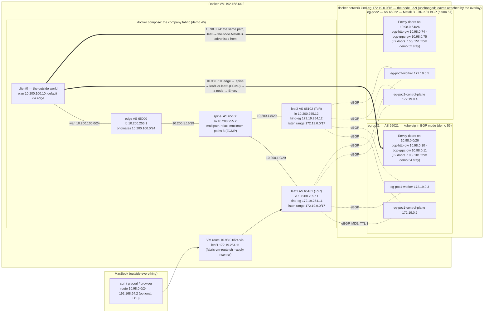

# Enhancement 006 — the BGP tutorial: a four-router company fabric in docker compose, an external router peering with Cilium, and the live dashboard running in Kubernetes

Status: **plan, revision 1 + §9 — demo 46 fabric (phase 1) written** — tracking issue [#52](https://github.com/ephico2real2/cilium-implementation-poc/issues/52) (2026-09-18). Written from the operator's brief, a full read of
[vadaszgergo/bgp-lab-with-dashboard](https://github.com/vadaszgergo/bgp-lab-with-dashboard) (cloned to
`~/gitRepos/bgp-lab-with-dashboard`, commit `aaaaac1`) and its blog post
[Make BGP visible: a live topology dashboard with Containerlab](https://gergovadasz.hu/make-bgp-visible-a-live-topology-dashboard-with-containerlab/),
the Cilium 1.20.2 documentation sources at the tag the lab runs, the FRR 10.7.1 user manual, Docker's and kind's
sources, RFC 6996 / 7938, and this lab's own design (`NETWORKING_DESIGN.md`, the parked
[docs/summary/BGP_FRR_PLAN.md](../docs/summary/BGP_FRR_PLAN.md), enhancement 002 §8). Every fact that shaped a
decision is in §2 or §6 with its source; measurements taken today are marked *measured*. Open questions for the
operator are in §5 and marked **OPEN**. This plan **absorbs the parked demo-11 plan** (its research, its off-LAN
pool, its dynamic-neighbour decision are kept; its single ToR becomes the four-router fabric); when this plan is approved
that file gets a pointer here and `enhancements/README.md` gains the 006 row.

## 0. The source, read in full — what the concept is

| What | Where in the source | In one line |
|---|---|---|
| Four FRR routers, two companies dual-homed to two ISPs: companyA **AS 65001** (`10.1.1.0/24`), companyB **AS 65002** (`192.168.1.0/24`), ISP1 **AS 65100**, ISP2 **AS 65200**; the ISPs originate nothing and only transit | `README.md:3`, `README.md:12-27`, `configs/*/frr.conf:19` | "the bread-and-butter BGP knobs: AS-path prepend, LOCAL_PREF, MED, and failover" |
| **containerlab** topology: `kind: linux`, image `quay.io/frrouting/frr:10.5.3`, five point-to-point **veth** links (`/30` each), a management network `172.22.20.0/24`, the FRR config, `daemons` and `vtysh.conf` bind-mounted per router | `simple.clab.yml:3-6`, `:9-11`, `:14-33`, `:48-58` | containerlab wires the routers with real veth pairs and gives every node an `eth0` on a management bridge |
| FRR config shape: `frr defaults traditional`, `no bgp ebgp-requires-policy`, `network` statements for the company prefixes, `soft-reconfiguration inbound`, `send-community all`, loopback "pingable hosts"; `bgpd=yes staticd=yes`, VTYs bound to `127.0.0.1` | `configs/companya/frr.conf:2,17-35`, `configs/*/daemons:1,15,19-21` | plain eBGP with RFC 8212 switched off for the lab |
| The **dashboard** is a FastAPI app that polls every router **every 2 s** by `docker exec … vtysh -c "show ip bgp summary json"` and `"show ip bgp detail json"` through the **Docker socket**, diffs the snapshot, and pushes `state` plus `session` / `bestpath` **events** over a WebSocket (`/ws`); `/api/state` serves the last snapshot | `dashboard/app/main.py:17,66-89`, `dashboard/app/poller.py:24,80-105,107-142`, `dashboard/README.md:3,92-103` | FRR's JSON output is the data source; the diff is the event log |
| The router inventory comes from the **clab YAML** (every node except `dashboard`); the ASN is **regex-guessed** from `configs/<node>/frr.conf` | `poller.py:28-45` | the dashboard knows the lab from its topology file, not from BGP |
| The frontend is **Cytoscape 3.30.4 from unpkg**; one node per router, one edge per session, edge colour = state (`Established` green, transitional amber, `Idle` red); edges are built from each router's `peers` by mapping `remoteAs → node` — **one node per ASN** is assumed (`asToNode`); a `/isp/` name heuristic colours transit routers | `static/index.html:7`, `static/dashboard.js:15-28,62-65,81-107` | the graph is derived from BGP sessions, not drawn by hand |
| Deployed as a fifth clab node with `/var/run/docker.sock`, the topology and `configs/` mounted, port `8088:8080`; image `vadaszgergo/bgp-dashboard:0.1.0` (single-arch, *measured*) | `simple.clab.yml:34-46`, `README.md:89`, `docker manifest inspect` | works only where the Docker socket is; the author says so: "No authentication. Run on a trusted network" (`dashboard/README.md:128`; blog: "the Docker socket is exposed, so run this only in a trusted lab environment!") |
| Exercises 0–5: baseline, AS-path prepend (inbound TE), LOCAL_PREF (outbound), MED ("MED is weak"), failover by `ip link set eth1 down` (hold timer), prepend + LOCAL_PREF combined | `README.md:127-356` | the learning path we keep, re-cast onto our company fabric |
| **No licence file**; GitHub reports `license: null` | `ls -a`, `gh api repos/vadaszgergo/bgp-lab-with-dashboard` (*measured*) | GitHub: "without a license, the default copyright laws apply … no one may reproduce, distribute, or create derivative works" ([docs.github.com](https://docs.github.com/en/repositories/managing-your-repositorys-settings-and-features/customizing-your-repository/licensing-a-repository)) — we take the **idea**, not the code (§5 D9, **OPEN**) |

## 1. The brief, rewritten

Build a BGP tutorial for this lab: **one company's network of four FRR routers, each in its own private AS**, running in
**docker compose on their own docker networks**, so that one of them is an **external router outside Kubernetes** that
the kind nodes peer with through Cilium's BGP control plane. Take the source repository's idea — a live topology
dashboard fed by FRR's JSON — and **run it in Kubernetes**. Use it to **test Cilium's BGP support** end to end: a
LoadBalancer address advertised by the nodes, learned by the fabric, reached from a client that is *not* on the node
LAN, the path moving when a node or a link dies. Along the way produce **what the network team must prepare in
advance** — the CIDR blocks, ASNs, peering addresses and filters — as a sheet they can fill in before any cluster
exists.

| # | Requirement | What it exercises |
|---|---|---|
| R1 | **Four FRR routers, one company, four different private ASNs**, in docker compose on their own docker networks: a border/edge router, a spine, and two leaves (ToRs) — the RFC 7938 shape at toy scale | FRR 10.7.1, eBGP everywhere, compose networks as links |
| R2 | The **leaves are the external routers**: they sit on the `kind` bridge (the node LAN) with fixed addresses and peer with the kind nodes; the spine and the edge are **not** on the node LAN; an **external client** lives behind the edge and reaches the cluster only through the fabric | "a router outside the cluster on the node network" |
| R3 | **Cilium BGP control plane on poc1** (`bgpControlPlane.enabled`), every node **dual-homed** to both leaves, eBGP with the cluster's own ASN, MD5 password, fast timers, graceful restart | `CiliumBGPClusterConfig`, `CiliumBGPPeerConfig`, `CiliumBGPAdvertisement` |
| R4 | A **routed VIP block per cluster, off the node LAN**, in a new `CiliumLoadBalancerIPPool` advertised by BGP; the existing L2-announced pools and every pinned address stay exactly as they are; a Service in the BGP pool is reachable from the external client **only** via the route the fabric learned | LB IPAM + BGP, L2 and BGP side by side on different pools |
| R5 | **Active-active**: the same `/32` from every node, ECMP on the leaves and spine, measured against L2's one-announcer-per-address | `bgp bestpath as-path multipath-relax`, kernel multipath hashing |
| R6 | **Failure scenarios measured** from the client and on the dashboard: a node paused (withdraw time with and without graceful restart), the agent restarted (no loss with graceful restart), a leaf link down (path via the other leaf), a Service losing its backends, `externalTrafficPolicy: Local` vs `Cluster` | the operation guide's failure catalogue, measured here |
| R7 | The **dashboard runs in Kubernetes** (poc1), reads the routers through a **read-only vtysh agent** over HTTP and the Cilium side from **`CiliumBGPNodeConfig.status`**, and is served on the platform Gateway as `bgp.poc.local`; no Docker socket anywhere | the source's concept, re-homed |
| R8 | **The network team's pre-work sheet**: ASN plan, peering addresses, the blocks each cluster may announce, prefix-lists and `maximum-prefix`, MD5, timers — written *before* the cluster side, and **enforced**: a cluster announcing outside its block is rejected by the leaf (measured) | RFC 8212 policy on, `bgp listen range`, route-maps |
| R9 | **poc2 joins the same fabric** as a second AS with its own block; two clusters, one network team policy; optionally the shop VIP as an **anycast** address advertised by both clusters (the BGP answer to `scripts/vip-takeover.sh`) | multi-cluster on one fabric |
| R10 | Everything idempotent from `scripts/lab-up.sh`, runnable on the Linux CI runner (no Mac route needed there), transcripts and evidence per demo, a regression row | the house rules (enhancement 004) |

## 2. What research and measurement changed in the brief

| Fact | Source | Consequence in the plan |
|---|---|---|
| containerlab does **not** run natively on macOS: "It is not only Docker that containerlab is based on. We leverage some Linux kernel APIs (like netlink)"; the supported ways are an arm64 Linux VM (OrbStack) or a privileged devcontainer | [containerlab.dev/macos](https://containerlab.dev/macos/); the source README says the same (`README.md:83`) | The operator's instinct is confirmed: **docker compose**, which runs on the Mac's Docker Desktop (*measured*: Docker 29.8.0 linux/arm64, Compose v5.5.1, Desktop 4.91.0) and on the Ubuntu runner alike. A containerlab **link** (a veth pair) becomes a **docker bridge network per link** |
| A docker bridge reserves its gateway address in every subnet; a `/30` therefore leaves one usable address | Docker bridge driver: "The bridge is normally assigned the network's `--gateway` address" ([docs](https://docs.docker.com/engine/network/drivers/bridge/)) | Links are **`/29`**, not the source's `/30`; addresses come from compose IPAM (`ipv4_address`), so `frr.conf` carries **no `interface` stanzas** and interface names never matter |
| Compose can pin the interface name (`interface_name`, Compose ≥ 2.36.0) and the default gateway (`gw_priority`, ≥ 2.33.1); `priority` only orders attachment | [compose spec — services](https://docs.docker.com/reference/compose-file/services/), [docker/compose#12574](https://github.com/docker/compose/issues/12574) | Used where it helps (`eth0` on the management side), never relied on: the client's default route is set explicitly in its command |
| Containers on different bridge networks "can only communicate with each other using published ports" — the host drops forwarding between two of its bridges (`DOCKER-ISOLATION-STAGE-1/2`) | [Docker bridge docs](https://docs.docker.com/engine/network/drivers/bridge/) | **The host can never be a shortcut.** A node sending to the client's network via its default route (`172.18.0.1`, the Docker VM) is dropped; the only path is the fabric. A router container forwarding between *its own* two interfaces is not host forwarding — the design leans on that and phase 0 measures it |
| A static `--ip` may be chosen **outside `--ip-range`** and inside the subnet: "One way to guarantee that the IP address is available is to specify an `--ip-range` when creating the network, and choose the static IP address(es) from outside that range" | [docker network connect](https://docs.docker.com/reference/cli/docker/network/connect/) | `scripts/lab-up.sh` already creates `kind` with `--ip-range 172.18.0.0/17`. The leaves get **`172.18.254.11` / `.12`** — a new **`172.18.254.0/24` "network devices" block**, outside Docker's dynamic range and below the VIP `/24`. (Both the parked plan and enhancement 002 §8.1 pencilled `172.18.0.250`, which is *inside* Docker's dynamic range — safe only by allocation order) |
| **Cilium does not install routes learned from peers.** Cilium's own lab: "These static routes are needed because Cilium cannot import routes currently"; CFP #23464 closed *not planned* (2023-04-17); CFP #31091 closed 2024-03-04 after the maintainer: "Importing routes from BGP is a huge change and overkill" | [contrib/containerlab/service/topo.yaml @ v1.20.2](https://github.com/cilium/cilium/blob/v1.20.2/contrib/containerlab/service/topo.yaml), [#23464](https://github.com/cilium/cilium/issues/23464), [#31091](https://github.com/cilium/cilium/issues/31091) | The kind nodes need **one static route to the company supernet via both leaves** (`scripts/fabric-node-routes.sh`, `ip route replace … nexthop via leaf1 nexthop via leaf2`). This is the real-world fact the tutorial teaches: *Cilium advertises; the server's gateway is still the network team's business* (in a rack the ToR **is** the default gateway; here the default route must stay on the Docker bridge for image pulls, so the fabric gets a specific route) |
| "BGP Control Plane does not program the datapath"; Service VIPs are advertised as exact `/32`s; ECMP "to load-balance traffic to the Service across multiple nodes by advertising the same virtual IPs from multiple nodes"; with `externalTrafficPolicy: Local` a node "stops advertisement when there's no local endpoint" | `bgp-control-plane.rst:12-16`, `bgp-control-plane-configuration.rst:662-663,693-696,833-841` (v1.20.2) | R5 and R6 as written; the L2 comparison is one Service in each pool |
| By default the agent is BGP-**active** ("instantiates each router instance without a listening port … can only initiate connections"); `localPort` needs `CAP_NET_BIND_SERVICE` | `bgp-control-plane-configuration.rst:43-54` | The leaves **listen**, the nodes **dial**: FRR `bgp listen range 172.18.0.0/17 peer-group CILIUM` — node addresses never appear in router config (node IPs reshuffle, README finding #3). Nothing changes on the agent's capabilities |
| Timers default 120 / 90 / 30; the docs recommend `holdTimeSeconds=9`, `keepAliveTimeSeconds=3`, `connectRetryTimeSeconds` "5 or less"; minimum hold 3 / keepalive 1; "Cilium does not support" BFD | `bgp-control-plane-configuration.rst:283-296`, `bgp-control-plane-operation.rst:437-443` | Fast timers on the Cilium peer config; failover on node death is bounded by the hold time (no BFD between nodes and leaves); BFD stays a leaf–spine exercise |
| Graceful restart keeps routes on the peer through an agent restart, but on a **node** failure "the BGP peer may need hold time + restart time to withdraw routes" | `bgp-control-plane-operation.rst:385-398` | Demo 48 measures **both**: agent restart with GR (no failed request) and node pause with GR on (hold + restart) vs off (hold) |
| `CiliumBGPNodeConfig.status` "maintains real-time BGP operational state … for automation or monitoring": `peeringState`, `establishedTime`, `routeCount` advertised/received, applied timers; on by default (`bgpControlPlane.statusReport.enabled`) | `bgp-control-plane-operation.rst:139-205,206-213` | The dashboard reads the Cilium side from the Kubernetes API with a read-only ClusterRole — no exec into agents, no CLI |
| Agent metrics `bgp_control_plane_session_state`, `_advertised_routes`, `_received_routes` (labels `neighbor`, `neighbor_asn`, …) exist once BGP is on | `Documentation/observability/metrics.rst:811-818` (v1.20.2) | A Grafana row in the observer dashboard is a cheap companion (demo 38's grammar); not on the critical path |
| LB IPAM allocates; "other features are responsible for load balancing and/or advertisement of these IPs"; BGP announces a Service whose `loadBalancerClass` is `io.cilium/bgp-control-plane` **or unspecified**; L2 announces one whose class is `io.cilium/l2-announcer` **or unspecified** | [lb-ipam.rst @ v1.20.2](https://raw.githubusercontent.com/cilium/cilium/v1.20.2/Documentation/network/lb-ipam.rst), `bgp-control-plane-configuration.rst:824-829`, [L2 announcements 1.20](https://docs.cilium.io/en/v1.20/network/l2-announcements/) | A class-less Service matching both an L2 policy and a BGP advertisement would be announced **twice**. The BGP Services carry the label `bgp: fabric`; the new pool, the advertisement **and** an exclusion in `kind-l2-announce`'s `serviceSelector` all key on it — the same discipline as `shop-vip-gw`'s exclusion in `cilium/lb-ippool-poc1.yaml:77-96` |
| L2: "one node receives all ARP/NDP requests for a specific IP, so no load balancing can happen before traffic hits the cluster"; leases 15 / 5 / 2 s; "primarily intended for on-premises deployments within networks without BGP based routing" | [L2 announcements 1.20](https://docs.cilium.io/en/v1.20/network/l2-announcements/) | The teaching contrast of R5: the same app behind an L2 address (one announcer, `arp -n` shows one MAC) and a BGP address (N paths on the leaf) |
| RFC 6996 private ASNs `64512–65534`; RFC 7938 §5.2.1: one ASN for the Tier-1 set, one per Tier-2 set, "a unique ASN … to every Tier 3 device (e.g., ToR)"; §6.2: implementations "must support load-sharing over paths with different AS_PATH attribute values" (multipath relax) | [RFC 6996](https://www.rfc-editor.org/rfc/rfc6996.html), [RFC 7938](https://www.rfc-editor.org/rfc/rfc7938.html) | The "one company, four routers, four ASNs" shape is the RFC's: edge **65000**, spine **65100**, leaf1 **65101**, leaf2 **65102**; the clusters are the servers under the ToRs, poc1 **65001**, poc2 **65002** (their `cluster.id` as the last digit). `multipath-relax` on spine and edge so paths `65101 65001` and `65102 65001` are one ECMP route |
| FRR: `bgp ebgp-requires-policy` "is enabled by default for the traditional configuration and turned off by default for datacenter configuration"; `maximum-prefix` tears the session down ("generally preferable to use a prefix-list"); `bgp listen limit` defaults to 100; `listen range` with MD5 needs kernel ≥ 4.14 | [bgp.rst @ frr-10.7.1](https://github.com/FRRouting/frr/blob/frr-10.7.1/doc/user/bgp.rst) lines 504-512, 1745-1770, 1981-1996 | The source switched RFC 8212 **off**; we keep it **on** and write the policy — that policy *is* the network team's pre-work (§8). Prefix-lists first, `maximum-prefix` as the backstop, `listen limit` sized to the node count |
| Linux ECMP hashes on L3 by default (`fib_multipath_hash_policy=0`); `1` = the 5-tuple | [ip-sysctl](https://www.kernel.org/doc/html/latest/networking/ip-sysctl.html) | `net.ipv4.fib_multipath_hash_policy=1` on every router (compose `sysctls`), or one client's flows all land on one node and "active-active" is invisible |
| `quay.io/frrouting/frr:10.7.1` (2026-08-26) and `10.5.3` are manifest lists with **arm64 and amd64**; the FRR image is Alpine 3.22 + `tini`, `CMD /usr/lib/frr/docker-start` → `watchfrr $(daemon_list)` from `/etc/frr/daemons` | quay API + `docker manifest inspect` (*measured*), [docker/alpine/Dockerfile, docker-start @ frr-10.7.1](https://github.com/FRRouting/frr/tree/frr-10.7.1/docker/alpine) | Pin **10.7.1** (the parked plan's pin; multi-arch, so the Mac and the runner pull the same tag). The read-only agent is added to that image with a wrapper CMD (§3.3) |
| The lab today: Cilium **1.20.2** (lab build), `l2announcements.enabled: true`, **no** `bgpControlPlane` in either values file; poc1 and poc2 are **1 CP + 1 worker** each; `poc3` is the kindnet control cluster (`clusters/poc3.yaml`) on `kind-classic`; the VM at ~17 of 24 GiB | `scripts/bootstrap/versions.env`, `grep bgp cilium/values-*.yaml` (none), enhancement 002 §8, `NETWORKING_DESIGN.md` §2b | **No new cluster** (§5 D2): poc1 first, poc2 in phase 4. The reserved L2 block `172.18.255.64/26` stays reserved for a real third cluster; the BGP blocks live off-LAN |
| kind honours `KIND_EXPERIMENTAL_DOCKER_NETWORK` with "Here be dragons! This is not supported currently" | [kind v0.33.0 provider.go:70-76](https://github.com/kubernetes-sigs/kind/blob/v0.33.0/pkg/cluster/internal/providers/docker/provider.go) | Not needed: the clusters stay on `kind`; the **leaves** join that network, not the other way round |
| The Mac reaches the kind bridge through the Docker VM today: demo 41's probe from the Mac, `VIP https://api.shop.poc.local @ 172.18.255.16 … http_code=200` | `demos/41-shop-mesh-phase1/output/transcript.txt:272` (2026-09-18) | The Mac path into the BGP block is the same class of path plus one VM route (`ip route add 10.99.0.0/24 via 172.18.254.11`) — a convenience; the **proof** is the client container behind the edge |
| The dashboard's graph keys nodes by **ASN** (`asToNode`), so N kind nodes in one AS collapse into one; it discovers routers from a **file**, not from BGP | `dashboard/app/static/dashboard.js:81-107`, `poller.py:28-37` | Our implementation keys edges by **peer address** and takes the router inventory from a ConfigMap and the node inventory from the Kubernetes API (poc1) or the leaves' dynamic-neighbour tables (poc2) |

## 3. Architecture

Solid lines are docker networks (one bridge per link, the `kind` bridge for the node LAN); dotted lines are BGP
sessions; the double arrow is the request the tutorial is about. Nothing on the `kind` network changes for the
clusters: the leaves are two more containers on it, with fixed addresses in a block Docker can never allocate from.

### 3.1 The address and ASN plan (the sheet of §8, filled in for this lab)

| Item | Value | Why here |
|---|---|---|
| Company supernet (everything the fabric owns) | **`10.200.0.0/16`** | one prefix → one static route on every kind node; free (*measured*: no `10.200.` anywhere in the repo; pods `10.10/10.20/10.30/10.40`, services `10.11/10.21/10.31/10.41`) |
| Router loopbacks / router-ids | edge `10.200.255.1`, spine `.2`, leaf1 `.11`, leaf2 `.12` (`/32` on `lo`) | reachable over the fabric; the dashboard's agent addresses |
| Fabric links (docker bridges, `/29`; Docker keeps `.1/.9/.17`) | leaf1–spine `10.200.1.0/29` (leaf1 `.2`, spine `.3`); leaf2–spine `10.200.1.8/29` (`.10`, `.11`); spine–edge `10.200.1.16/29` (`.18`, `.19`) | the "point-to-point" links |
| The outside world (behind the edge) | `wan` `10.200.100.0/24`: edge `.2`, `client0` `.10` (default route → `.2`) | the client that is not on the node LAN |
| Node LAN (exists) | `kind` `172.18.0.0/16`, Docker allocates from `172.18.0.0/17` only | `scripts/lab-up.sh`, `NETWORKING_DESIGN.md` §3 |
| **New: network-devices block on the node LAN** | **`172.18.254.0/24`**: leaf1 `.11`, leaf2 `.12` (static, compose `ipv4_address`) | outside `--ip-range`, below the VIP `/24`; to be added to `NETWORKING_DESIGN.md` §3 and `cilium/lb-ippool-poc1.yaml`'s header table |
| **Routed VIP block (BGP-advertised, off-LAN)** | **`10.99.0.0/24`** → poc1 `10.99.0.0/26`, poc2 `10.99.0.64/26`, reserved `10.99.0.128/26`, anycast/shared `10.99.0.192/26` | the parked plan's block, subdivided per cluster like the L2 `/24` (gotcha #94's lesson, once more) |
| ASNs (RFC 6996 private) | edge **65000**, spine **65100**, leaf1 **65101**, leaf2 **65102**, poc1 **65001**, poc2 **65002** | RFC 7938 tiers; a cluster's ASN ends in its `cluster.id` |
| Cilium router-id | default mode = the node's IPv4 (`bgp-control-plane-configuration.rst:1055-1060`) | no `CiliumBGPNodeConfigOverride` needed |
| Peering | nodes → leaf1 `172.18.254.11:179` and leaf2 `172.18.254.12:179`, eBGP, TTL 1 (same segment), MD5 from Secret `kube-system/bgp-auth-secret`; FRR `neighbor CILIUM password` | `bgp-control-plane-configuration.rst:225-236,318-323` |
| Timers | Cilium peer config `hold 9 / keepalive 3 / connectRetry 5`; leaf–spine–edge `timers 3 9`; graceful restart `enabled, restartTimeSeconds: 15` (measured on and off in demo 48) | docs' recommendation; FRR negotiates to the lower hold |

### 3.2 The fabric in docker compose (`demos/46-bgp-fabric/fabric/`)

- `compose.yaml`: networks `kind` (`external: true`), `link-leaf1-spine`, `link-leaf2-spine`, `link-spine-edge`, `wan`
  (each with `ipam.config.subnet`); services `edge`, `spine`, `leaf1`, `leaf2` from the lab's `frr-agent` image (§3.3),
  `cap_add: [NET_ADMIN, NET_RAW, SYS_ADMIN]` rather than `privileged` (phase 0 measures which are needed),
  `sysctls: {net.ipv4.ip_forward: 1, net.ipv4.fib_multipath_hash_policy: 1}`, `ipv4_address` per network,
  `interface_name` where the config names an interface, `/etc/frr/frr.conf` + `daemons` bind-mounted read-only from
  `fabric/frr/<router>/`; `client0` (`nicolaka/netshoot`, the image Cilium's own lab uses for its servers) on `wan`
  with `command: sh -c 'ip route replace default via 10.200.100.2 && sleep infinity'`.
- `frr/<router>/frr.conf`: `frr defaults traditional` (RFC 8212 **on**), `router bgp <asn>`, `bgp router-id`, the
  neighbours by address with `remote-as`, `bgp bestpath as-path multipath-relax` on spine and edge, `network`
  statements only where a prefix is *originated* (edge: `10.200.100.0/24`; every router: its loopback), prefix-lists
  and route-maps from §8, `maximum-prefix` as the backstop. The leaves add
  `neighbor CILIUM peer-group`, `neighbor CILIUM remote-as external`, `neighbor CILIUM password …`,
  `bgp listen range 172.18.0.0/17 peer-group CILIUM`, `bgp listen limit 16`, `neighbor CILIUM route-map CILIUM-IN in`,
  `neighbor CILIUM route-map NOTHING out` (the servers import nothing anyway — §2), `soft-reconfiguration inbound`
  (so the dashboard's `received-routes` view has data even for rejected prefixes).
- `scripts/fabric-up.sh` / `fabric-down.sh`: `docker compose -p bgp-fabric up -d --wait`, then a convergence check
  (`vtysh -c 'show bgp summary json'` on all four: every session `Established`, loopbacks pingable end to end).
- `scripts/fabric-node-routes.sh <cluster>`: for every node container of the cluster,
  `docker exec <node> ip route replace 10.200.0.0/16 nexthop via 172.18.254.11 nexthop via 172.18.254.12`; idempotent,
  re-run after any node restart (the route does not survive one — same caveat enhancement 002 records for the egress
  addresses on `eth0`).
- Optional Mac path (`demos/46-bgp-fabric/mac-route.sh`, prints the two commands, never runs `sudo`): in the VM
  `ip route add 10.99.0.0/24 via 172.18.254.11` (the parked plan's `nsenter` line), on the Mac
  `sudo route -n add -net 10.99.0.0/24 192.168.64.2`.

### 3.3 The dashboard in Kubernetes (`demos/46-bgp-fabric/dashboard/`)

| Piece | The source did | Here |
|---|---|---|
| Router data | `docker exec <router> vtysh -c "show … json"` via the Docker socket (`poller.py:80-105`) | **`frr-agent`**: the pinned FRR image plus a small Go binary that serves `GET /show/<command>` by running `vtysh -c "show <command> json"` — `show` only (allow-listed), JSON only, bound to the router's addresses, **no port published to the host**; started by a wrapper `CMD` that backgrounds the agent and `exec`s `/usr/lib/frr/docker-start` under the image's `tini`. The dashboard calls `http://10.200.255.{1,2,11,12}:8080/…` **over the fabric** (the node route of §3.2 is what makes that reachable). Alternative kept in the decision log: a sidecar sharing the netns and `/var/run/frr` |
| Cilium data | none (Cilium was not a node) | the Kubernetes API: `ciliumbgpnodeconfigs` (`status.bgpInstances[].peers[]`: `peeringState`, `establishedTime`, `routeCount`, applied timers), `ciliumbgpclusterconfigs`, `nodes` — a ServiceAccount with a read-only ClusterRole (`get/list/watch`). Poll → diff → the same `session` events as for routers |
| Inventory | the clab YAML + regex on `frr.conf` (`poller.py:28-45`) | a ConfigMap `topology.yaml`: routers (name, ASN, agent URL, role), the local cluster (ASN, context name) — and the leaves' dynamic neighbours discovered from `show bgp summary json` for anything not in the file (poc2's nodes in phase 4) |
| Graph | Cytoscape 3.30.4 from unpkg; edges keyed by `remoteAs → node` | Cytoscape **vendored** into the image (the lab runs offline-safe; the CDN is a dependency the source's README does not mention); edges keyed by **peer address ↔ node**; roles from the ConfigMap, not a name regex |
| Transport to the browser | WebSocket `/ws`, snapshot + `state` + `event` messages (`main.py:66-89`) | the same protocol shape; served as `bgp.poc.local` by an `HTTPRoute` on the shared `routes-gw` (demo 37's attachment model; the wildcard certificate and `scripts/hosts-entries.sh` already exist) |
| Policy | none | a `CiliumNetworkPolicy` generated from its flows (enhancement 001's loop): egress `toCIDR 10.200.255.0/24` port 8080, the API server, DNS; ingress from `reserved:ingress` only |
| Licence | none (`license: null`) | a **clean-room implementation of the idea** in Go (the lab's language for `shopapi` / `shopctl`), the blog credited in the demo README; an issue on the author's repo asking for a licence goes out **only with the operator's word** (memory: upstream posts gate) — §5 D9 |

### 3.4 The learner's story (what demo 46 → 49 show, in order)

1. **A network, alive.** Four routers come up in compose; the dashboard (in poc1) draws them from their sessions; `clear bgp *` on the spine flickers every edge red then green, the event log lists each FSM transition. The source's exercises 1–5 (prepend, LOCAL_PREF, MED, failover) run **inside the company fabric** — edge ↔ spine ↔ leaves — and each shows up as a `bestpath` event. Cilium is not involved yet.
2. **The cluster joins.** `bgpControlPlane.enabled: true` on poc1; two new nodes appear on the graph as dynamic neighbours of both leaves, `cilium bgp peers` shows four sessions `established`, `CiliumBGPNodeConfig` status agrees, and `show bgp summary` on a leaf shows `(Policy)` nowhere because the network team wrote the policy first.
3. **An address the fabric learned.** A Service in `bgp-pool` takes `10.99.0.1`; `cilium bgp routes advertised` shows the `/32` from both nodes; the leaf shows two paths, the spine four (`65101 65001`, `65102 65001` × 2 — ECMP by `multipath-relax`), the edge its best; `client0` gets `200` through four hops (`traceroute -n`); Hubble sees the request enter at a node from `reserved:world`. Beside it, the **same app on an L2 address** answers only from the one node that holds the lease (`arp -n` on a plain container: one MAC).
4. **Things break.** A node paused: with graceful restart off the leaf withdraws at the hold time (**9 s**, measured), with it on at hold + restart (**24 s**, measured), the client's per-second log shows the gap; the agent restarted with GR on: no failed request; `leaf1`'s link down (`docker network disconnect`): the client's path moves to `leaf2` within one hold time and the dashboard's edge goes red; `externalTrafficPolicy: Local` with one replica: exactly one path on the leaf; scale to zero: the route is gone. Every number lands in `FINDINGS.md`.
5. **A second cluster, one policy.** poc2 peers as **AS 65002**; its Service lands in `10.99.0.64/26`; a deliberate misconfiguration (poc2 given poc1's block) is **rejected by the leaf's route-map** — the sheet of §8 was not paperwork. Optionally the shop VIP is anycast (`10.99.0.192`) from both clusters: what `scripts/vip-takeover.sh` does by hand, BGP does by withdrawing.

## 4. Phases, demos, and the scripts each one adds

| Phase | Demo | What it delivers | Scripts / files it adds | Reqs |
|---|---|---|---|---|
| 0 — verify the ground (no demo number) | — | The facts the design leans on, measured on this Docker before anything is written: a router container forwards between two compose bridges (client → edge → spine loopback) while the host drops the shortcut (node → `172.18.0.1` → `wan`: no reply); a static `ipv4_address` in `172.18.254.0/24` on the `kind` network is accepted alongside `--ip-range /17`; `fib_multipath_hash_policy` is settable from compose `sysctls` (namespaced) or must be set in the VM; the FRR 10.7.1 image starts with a wrapper `CMD`; `docker exec <kind-node> ip route replace … nexthop …` works and what a node restart does to it | a scratch `compose.yaml` under `/tmp`, results into §2 of this plan (revision 2) | R1, R2 |
| 1 — the fabric and the dashboard | **46** | The four routers in compose, converged, the source's exercises re-cast (edge ↔ spine ↔ leaves), the `frr-agent` image and the dashboard image built and pushed to `ghcr.io/ephico2real2/`, the dashboard deployed in poc1 and served as `bgp.poc.local`, reading the four routers over the fabric; node routes applied; no Cilium BGP yet | `demos/46-bgp-fabric/{fabric/compose.yaml,fabric/frr/*/frr.conf,fabric/frr/*/daemons,frr-agent/,dashboard/,10-dashboard.yaml,20-route.yaml,apply.sh,check.sh,cleanup.sh,GUIDE.md}`, `scripts/fabric-up.sh`, `scripts/fabric-down.sh`, `scripts/fabric-node-routes.sh` | R1, R2, R7 |
| 2 — the cluster joins the fabric | **47** | `bgpControlPlane.enabled: true` in `cilium/values-poc1.yaml` (helm upgrade + `rollout restart ds/cilium`, timed for no other demo — gotcha #42's outage), `CiliumBGPClusterConfig` (both leaves), `CiliumBGPPeerConfig` (MD5, timers, GR), `CiliumBGPAdvertisement` (`LoadBalancerIP`, selector `bgp=fabric`), `bgp-pool 10.99.0.0/26` (selector `bgp=fabric`), `kind-l2-announce` gains `bgp NotIn [fabric]`; the demo 09 web app exposed twice (`web-bgp` in the BGP pool, `web-l2` in the L2 pool); the client's `200` through the fabric, ECMP on leaf and spine, the L2 contrast, Hubble's view | `demos/47-cilium-joins-fabric/{10-bgp.yaml,20-pool.yaml,30-services.yaml,apply.sh,check.sh,client-probe.sh,cleanup.sh}`; edits to `cilium/values-poc1.yaml`, `cilium/lb-ippool-poc1.yaml` (the L2 exclusion + header table row) | R3, R4, R5 |
| 3 — failures, measured | **48** | The scenario table (§4.1) from the client (`client0`, per-second) and the dashboard (event log screenshots); GR on vs off; timers default vs 9/3; `externalTrafficPolicy` both ways; the `FINDINGS.md` numbers and the gotchas that bit | `demos/48-bgp-failures/{scenario.sh <S1..S6>,watch.sh,README.md}` | R6 |
| 4 — the second cluster and the hand-off | **49** | poc2 as AS 65002 (`values-poc2.yaml`, its CRs, `bgp-pool 10.99.0.64/26`), the leaves' policy admitting each cluster to its own block only, the negative test (poc2 announcing from poc1's block → rejected, `show bgp neighbors … json` counts it), the filled-in sheet (§8) as `docs/BGP-NETWORK-TEAM-SHEET.md`, `NETWORKING_DESIGN.md` §5.3 option B upgraded from "planned" to "measured" with §7's L3 rows; the regression row (leaf sessions `Established`, the BGP VIP answers from `client0`); optional: the anycast VIP | `demos/49-two-clusters-one-fabric/{10-bgp-poc2.yaml,20-pool-poc2.yaml,apply.sh,check.sh,negative.sh,cleanup.sh}`, `docs/BGP-NETWORK-TEAM-SHEET.md`, a row in `scripts/lab-regression.sh`, `.github/workflows/lab-regression.yaml` paths | R8, R9, R10 |

Every demo keeps the house rules: `scripts/record.sh` into `output/transcript.txt`, `evidence.json`, a README with the
enterprise case, a GUIDE with exercises, a RECAP in plain English, a cleanup script; the adversarial-review skill on
every PR (`docs/REVIEW_ENH-006.md`); the changelog skill per session. Demos 42–45 remain enhancement 002's.

### 4.1 Failure scenarios (demo 48)

| # | Scenario | Action | Expected, to be measured (client0 per-second log + leaf `show bgp` + dashboard events) |
|---|---|---|---|
| S1 | Agent restart, GR on | `kubectl -n kube-system rollout restart ds/cilium` | leaf keeps the `/32` (stale, `RestartTime` 15 s), **0 failed requests**; sessions flap on the dashboard, no `bestpath` event |
| S2 | Node paused, GR on | `docker pause poc1-worker` | withdraw after **hold + restart = 9 + 15 s**; requests hashed to that node fail until then |
| S3 | Node paused, GR off | same, with `gracefulRestart.enabled: false` | withdraw at the **hold time, 9 s** (default timers: 90 s — one run each) |
| S4 | Leaf link down | `docker network disconnect kind bgp-fabric-leaf1-1` | node ↔ leaf1 sessions drop (kernel sees the link — immediately or ≤ 9 s); spine's ECMP collapses to the `65102` path; client unaffected beyond the gap |
| S5 | `externalTrafficPolicy: Local`, one replica | patch `web-bgp` | exactly **one** path on each leaf, from the node with the pod; scale to 2 → two |
| S6 | Service loses every backend | `kubectl scale deploy/web --replicas=0` | `Cluster`: the `/32` stays (`--enable-no-service-endpoints-routable` default true) and the client gets a reset; `Local`: the `/32` is withdrawn and the client gets "no route" from the edge |

## 5. Decision log

| # | Decision | Outcome |
|---|---|---|
| D1 | **Docker compose, not containerlab**, for the routers | **Taken.** containerlab is not native on macOS (needs a Linux VM or a privileged devcontainer); compose runs on the Mac's Docker Desktop and on the CI runner from one file. Cost: links are bridges (`/29`), not veths — nothing in the tutorial depends on the difference, and the plan says so where a learner might wonder |
| D2 | **No third cluster.** poc1 joins in phase 2, poc2 in phase 4; the reserved L2 block `172.18.255.64/26` stays for a real `poc3` (the name is taken by the kindnet control cluster anyway) | **Taken.** A third Cilium cluster costs ~2 GiB on a VM at ~17 of 24 GiB and would prove nothing the two existing ones do not; two clusters on one fabric is the multi-tenant lesson (R9) |
| D3 | **The BGP VIP block is off the node LAN** (`10.99.0.0/24`), subdivided per cluster like the L2 `/24` | **Taken.** On-LAN the Mac's `/16` route and ARP would reach it regardless and BGP would prove nothing (the parked plan's decision 1, unchanged); a routed VIP subnet is the shape `NETWORKING_DESIGN.md` §7 already offers the network team |
| D4 | **Four routers as RFC 7938 tiers with unique private ASNs** (edge 65000, spine 65100, leaf1 65101, leaf2 65102), clusters as the servers (65001, 65002); eBGP everywhere; `multipath-relax` on spine and edge | **Taken.** "One company, four routers, different ASNs" is exactly the RFC's Clos numbering; the two-ISP story of the source becomes dual-homed ToRs, which is what a Cilium node sees in a rack (Cilium's own `multi-homing` lab) |
| D5 | **The leaves listen (`bgp listen range 172.18.0.0/17`), the nodes dial**; MD5 on the peer-group; RFC 8212 policy **on** with an explicit `CILIUM-IN` route-map | **Taken.** Node addresses never enter router config (they reshuffle); the agent stays active-mode with no new capability; the policy is the network team's artefact (§8), enforced and measured (demo 49's negative) |
| D6 | **Static route on every node to `10.200.0.0/16` via both leaves**, applied by a script, default route untouched | **Taken.** Cilium does not import routes (Cilium's own lab writes the same static routes); the default route must stay on the Docker bridge for pulls; a specific route is the honest equivalent of "the ToR is the server's gateway" |
| D7 | **Leaves on the `kind` network at `172.18.254.11/.12`**, a new "network devices" block outside `--ip-range` | **Taken.** Docker's documented way to guarantee a static address; replaces the `172.18.0.250` habit (inside Docker's dynamic range). Proposed as a new row of `NETWORKING_DESIGN.md` §3 — enhancement 002's external receiver could move to `172.18.254.100` when it is built (**OPEN**, theirs to decide) |
| D8 | **The dashboard reads routers through a read-only `show`-only HTTP agent baked into the FRR image**, over the fabric, and Cilium through `CiliumBGPNodeConfig.status` | **Taken.** A Kubernetes pod cannot and must not hold the Docker socket (the source's own warning); `status` is the documented monitoring surface. Alternative recorded: FRR's telnet VTY on TCP 2605 (`-A 0.0.0.0`, a `line vty` password) — rejected: a clear-text config channel where a read-only one will do |
| D9 | **Clean-room re-implementation of the dashboard idea** (Go backend, vendored Cytoscape), the blog credited | **Taken as the default — OPEN for the operator:** the source has **no licence**, so copying or adapting its code is not permitted by default. Options: (a) write ours from the concept (~450 lines in the source; a day), (b) ask the author to add a licence and then fork — the ask itself is an upstream post and waits for the operator's word. (a) is the plan; (b) can run in parallel |
| D10 | **Timers 9/3/5 and graceful restart 15 s** on the Cilium side; both GR states and both timer sets measured | **Taken.** The docs recommend them; the tutorial's value is the measured difference, not the setting |
| D11 | **Fabric runs in CI too** (the Linux runner): `fabric-up.sh` in `lab-up.sh` behind a flag, `client0` as the tester, a regression row | **Taken, phase 4.** Nothing in the design needs the Mac; the Mac route is a documented convenience |
| D12 | The anycast shop VIP from both clusters (`10.99.0.192`) | **OPEN.** Cheap once phase 4 exists; it changes enhancement 002's DR story (S4 becomes automatic). Do it only if the operator wants the two plans to meet |
| D13 | Where the fabric and dashboard code live: this repo under `demos/46-bgp-fabric/` (configs, compose, Go sources), images on `ghcr.io/ephico2real2/{frr-agent,bgp-dashboard}` | **Taken — OPEN if the operator prefers a separate repository** (the lab's forks live in their own repos; this is not a fork) |
| D14 | Name of the tutorial's namespace and host: `bgp-observer` / `bgp.poc.local` | **OPEN**, cosmetic |

## 6. Stack facts the plan relies on

| Fact | Source |
|---|---|
| BGP CP v2 CRDs: `CiliumBGPClusterConfig` (instances, peers, `nodeSelector`), `CiliumBGPPeerConfig` (MD5, timers, multihop, GR, transport, families → advertisements by label), `CiliumBGPAdvertisement` (`PodCIDR`, `Service` with `addresses` `LoadBalancerIP/ClusterIP/ExternalIP` + `selector`, `Interface`), `CiliumBGPNodeConfigOverride` (`routerID`, `localPort`, `localASN`, per-peer `localAddress`); one `CiliumBGPClusterConfig` may select a node | [bgp-control-plane-configuration.rst @ v1.20.2](https://raw.githubusercontent.com/cilium/cilium/v1.20.2/Documentation/network/bgp-control-plane/bgp-control-plane-configuration.rst) lines 16-19, 181-224, 533-545, 653-704, 764-841, 1020-1102; troubleshooting.rst ("Selecting the same node(s) with ClusterConfig(s)") |
| Enable: `bgpControlPlane.enabled=true` then `kubectl -n kube-system rollout restart ds/cilium`; "does not program the datapath" | [bgp-control-plane.rst @ v1.20.2](https://raw.githubusercontent.com/cilium/cilium/v1.20.2/Documentation/network/bgp-control-plane/bgp-control-plane.rst) lines 12-16, 32-39 |
| Active mode by default, `localPort` needs `CAP_NET_BIND_SERVICE`; timers 120/90/30 and the 9/3 recommendation; GR semantics; TTL 1 for eBGP; `transport.sourceInterface`; router-id = node IPv4 in `default` mode | configuration.rst lines 43-54, 279-336, 337-380, 381-410, 1055-1074 |
| `status` of `CiliumBGPNodeConfig` (`peeringState`, `establishedTime`, `routeCount`, timers); `bgpControlPlane.statusReport.enabled`; `cilium bgp peers`, `cilium bgp routes available \| advertised ipv4 unicast`; failure catalogue (agent down, node down with GR, link down, min timers 3/1, **no BFD**, operator down, service losing backends with`--enable-no-service-endpoints-routable`) | [bgp-control-plane-operation.rst @ v1.20.2](https://raw.githubusercontent.com/cilium/cilium/v1.20.2/Documentation/network/bgp-control-plane/bgp-control-plane-operation.rst) lines 48-95, 139-213, 328-486 |
| Cilium's own lab: `frrouting/frr:v8.4.0`, `multipath-relax`, `no bgp ebgp-requires-policy`, `neighbor CILIUM peer-group / remote-as external / password`, `bgp-auth-secret`, `gracefulRestart 15`, nodes labelled `bgp=65001`; **"Cilium cannot import routes currently"**; a `multi-homing` variant with two routers (65000, 65011) and `CiliumBGPNodeConfigOverride` router-ids | [contrib/containerlab/{service,multi-homing} @ v1.20.2](https://github.com/cilium/cilium/tree/v1.20.2/contrib/containerlab) |
| Route import: CFP #23464 closed *not planned* (2023-04-17); CFP #31091 closed 2024-03-04, maintainer: "Importing routes from BGP is a huge change and overkill" | [#23464](https://github.com/cilium/cilium/issues/23464), [#31091](https://github.com/cilium/cilium/issues/31091) (`gh api`, *measured*) |
| LB IPAM allocates, BGP/L2 advertise; `Conflicting` on overlap; `lbipam.cilium.io/ips`; `loadBalancerClass` `io.cilium/bgp-control-plane` / `io.cilium/l2-announcer` or unspecified | [lb-ipam.rst @ v1.20.2](https://raw.githubusercontent.com/cilium/cilium/v1.20.2/Documentation/network/lb-ipam.rst), configuration.rst 824-829, [L2 announcements 1.20](https://docs.cilium.io/en/v1.20/network/l2-announcements/) |
| BGP metrics `bgp_control_plane_session_state`, `_advertised_routes`, `_received_routes` | [metrics.rst @ v1.20.2](https://raw.githubusercontent.com/cilium/cilium/v1.20.2/Documentation/observability/metrics.rst) lines 805-818 |
| FRR: `bgp ebgp-requires-policy` default per profile; `bgp listen range … peer-group`, `bgp listen limit` (100); `maximum-prefix` tears down; `neighbor PEER timers`; `prefix-list` / `route-map … in \| out`;`multipath-relax` | [doc/user/bgp.rst @ frr-10.7.1](https://github.com/FRRouting/frr/blob/frr-10.7.1/doc/user/bgp.rst) lines 399, 504-512, 1745-1770, 1981-1996, 2380-2383, 2439-2446 |
| FRR image: Alpine 3.22 + `tini`, `CMD /usr/lib/frr/docker-start` → `watchfrr $(daemon_list)`; `quay.io/frrouting/frr:10.7.1` and `10.5.3` are multi-arch (amd64, arm64, …) | [docker/alpine @ frr-10.7.1](https://github.com/FRRouting/frr/tree/frr-10.7.1/docker/alpine); `docker manifest inspect` (*measured 2026-09-18*) |
| Docker: static `--ip` outside `--ip-range`; bridges isolated from each other ("only … using published ports"); `internal` networks; compose `ipv4_address`, `priority`, `gw_priority` (≥ 2.33.1), `interface_name` (≥ 2.36.0), `network_mode: service:`, `sysctls`, `cap_add` | [network connect](https://docs.docker.com/reference/cli/docker/network/connect/), [bridge driver](https://docs.docker.com/engine/network/drivers/bridge/), [compose services](https://docs.docker.com/reference/compose-file/services/), [docker/compose#12574](https://github.com/docker/compose/issues/12574) |
| This machine: Docker 29.8.0 linux/arm64, Compose v5.5.1, Docker Desktop 4.91.0, `uname -m` arm64; docker networks present: `bridge 172.17/16`, `kind 172.18/16` | *measured 2026-09-18* (`NETWORKING_DESIGN.md` still says 25.0.3 / 4.27.2 — a doc follow-up) |
| kind: `KIND_EXPERIMENTAL_DOCKER_NETWORK` is a warned, unsupported override | [kind v0.33.0 provider.go:70-76](https://github.com/kubernetes-sigs/kind/blob/v0.33.0/pkg/cluster/internal/providers/docker/provider.go) |
| RFC 6996 private ASNs 64512–65534 ("MUST be removed … before being advertised to the global Internet"); RFC 7938 §5.2.1 ASN scheme, §6.2 multipath relax | [RFC 6996](https://www.rfc-editor.org/rfc/rfc6996.html), [RFC 7938](https://www.rfc-editor.org/rfc/rfc7938.html) |
| Linux `fib_multipath_hash_policy`: 0 = L3 (default), 1 = L4 5-tuple | [ip-sysctl](https://www.kernel.org/doc/html/latest/networking/ip-sysctl.html) |
| containerlab on macOS: not native; VM or devcontainer | [containerlab.dev/macos](https://containerlab.dev/macos/), [containerlab.dev/install](https://containerlab.dev/install/) |
| The lab: Cilium 1.20.2 (`versions.env`), `l2announcements.enabled: true` and no `bgpControlPlane` in `cilium/values-poc1.yaml` / `-poc2.yaml`; `kind` created with `--ip-range 172.18.0.0/17` (`scripts/lab-up.sh:124-129`); the `/26` blocks and their reasons (`cilium/lb-ippool-poc1.yaml:6-20`, gotcha #94); poc1/poc2 1 CP + 1 worker (enhancement 002 §8); the Mac → VIP path answers 200 (`demos/41-shop-mesh-phase1/output/transcript.txt:272`); 0 listeners on TCP 179 on the bridge (parked plan, 2026-09-11); the parked plan's research and decisions (`docs/summary/BGP_FRR_PLAN.md`) | this repository, read 2026-09-18 |

## 7. Risks

- **Bridges are not veths.** A docker bridge answers ARP for its gateway, keeps an address, and may run `br_netfilter`; a router forwarding between two of them is the design's load-bearing assumption. Phase 0 measures it before a line of FRR config is written; if it fails, the fallback is `macvlan`-free: one flat compose network per link is already the minimum, so the next step would be the source's containerlab in an OrbStack VM on the Mac (CI unaffected).
- **Docker version drift.** `NETWORKING_DESIGN.md` documents Docker 25.0.3 / Desktop 4.27.2; this machine runs 29.8.0 / 4.91.0 (*measured*). Whatever changed in bridge filtering between the two, the Mac → bridge path still answers today (demo 41's transcript), and the design never asks the host to forward between bridges. The compose features the plan uses (`interface_name` ≥ 2.36.0, `gw_priority` ≥ 2.33.1) are present here (Compose v5.5.1); the runner's compose version is **not measured** — `scripts/lab-preflight.sh` gains the check in phase 4, and both features are conveniences the fabric works without (§2).
- **The node route is volatile.** `ip route replace` inside a kind node does not survive the node container's restart; `fabric-node-routes.sh` is idempotent and `check.sh` asserts the route before every measurement. Cilium's `bpf.masquerade` SNATs pod → fabric traffic to the node address (destination outside the cluster), which the route covers.
- **Two announcers for one address.** A class-less Service that matches both `kind-l2-announce` and the BGP advertisement is announced by ARP and by BGP; the `bgp=fabric` label keys the pool, the advertisement **and** the L2 exclusion, and `check.sh` greps `cilium-l2announce-*` leases for the BGP Services (expected: none).
- **Hold time is the floor.** No BFD between nodes and leaves (Cilium does not support it), so node death is detected at 9 s at best; the tutorial says so and measures it rather than hiding it.
- **Memory.** Four FRR routers (~50 MB each per the source), one client, one dashboard pod: well under 1 GiB on a VM with ~7 GiB headroom; no build containers while a demo measures (gotcha #118).
- **Restarting agents** takes the Gateway off the air for 2–3 minutes (gotcha #42); phase 2's helm upgrade is scheduled when nothing else is being recorded, and GR is measured to show the BGP VIP itself does not blink.
- **Licence.** The source has none; the plan copies no code (D9). If the operator prefers a fork, nothing is built until the author has licensed it.
- **`listen range` + MD5** needs kernel ≥ 4.14 (FRR docs); the VM kernel is 6.6 — fine; recorded so a different host is not surprised.

## 8. What the network team prepares in advance — the sheet

The point of R8: **every value below exists before the first `kubectl apply`.** In production the team hands this over
and the platform team only fills in the `CiliumBGP*` objects from it. The lab's column is what demos 47/49 use; the
"how it is enforced" column is what the leaves' `frr.conf` implements and demo 49's negative test proves.

| # | The team decides | This lab | How it is enforced on the router |
|---|---|---|---|
| 1 | **ASN plan** (RFC 6996 private range): one per router tier/device, one per cluster | edge 65000, spine 65100, leaf1 65101, leaf2 65102; poc1 **65001**, poc2 **65002** | `router bgp <asn>`; `neighbor CILIUM remote-as external` (any AS but ours) + `bgp as-path access-list FROM-POC1 permit ^65001$` per cluster in the route-map |
| 2 | **Peering addresses**: the ToR addresses the servers dial, and the server range allowed to dial | leaf1 `172.18.254.11`, leaf2 `172.18.254.12`; servers from `172.18.0.0/17` | `bgp listen range 172.18.0.0/17 peer-group CILIUM`; `bgp listen limit 16` (nodes × 2 with headroom) |
| 3 | **Session security**: MD5 password, TTL | one password per fabric, in `kube-system/bgp-auth-secret` and `neighbor CILIUM password`; TTL 1 (same segment, `ebgpMultihop` unset) | `neighbor CILIUM password …`; optionally `neighbor CILIUM ttl-security hops 1` |
| 4 | **The prefixes each cluster may announce** (routed VIP blocks, off the node LAN) | poc1 `10.99.0.0/26`, poc2 `10.99.0.64/26`, reserved `10.99.0.128/26`, anycast `10.99.0.192/26`; **exact `/32`s only** (Cilium's default; no `aggregationLength`) | `ip prefix-list POC1-VIPS seq 10 permit 10.99.0.0/26 ge 32`; `route-map CILIUM-IN permit 10: match as-path FROM-POC1, match ip address prefix-list POC1-VIPS`; `… permit 20` for poc2; implicit deny |
| 5 | **What the servers may receive** | nothing (Cilium does not import) | `route-map NOTHING deny 10`; `neighbor CILIUM route-map NOTHING out` — RFC 8212 satisfied both ways |
| 6 | **Backstops** | `maximum-prefix 64` per Cilium neighbour; `maximum-prefix 256` leaf ↔ spine | `neighbor CILIUM maximum-prefix 64` (session torn down — the last line of defence, prefix-lists first) |
| 7 | **Timers** | hold 9 / keepalive 3 on the Cilium sessions (Cilium side sets them; FRR negotiates down); 9/3 on fabric links; GR accepted (`bgp graceful-restart` on leaves, restart time from the speaker) | `neighbor CILIUM timers 3 9`; `bgp graceful-restart` |
| 8 | **The route back to the servers' networks** | the server LAN `172.18.0.0/16` is connected on both leaves; nothing else routes to nodes | connected routes only; the spine/edge learn VIP `/32`s with the leaf as next hop |
| 9 | **What the fabric originates** | edge: `10.200.100.0/24` (the outside world); every router: its `/32` loopback; the company supernet `10.200.0.0/16` is what the servers route to the leaves | `network` statements; `ip prefix-list COMPANY permit 10.200.0.0/16 le 32` on fabric sessions |
| 10 | **Hand-off record** | this sheet as `docs/BGP-NETWORK-TEAM-SHEET.md` (demo 49), plus the `NETWORKING_DESIGN.md` §3 rows: `172.18.254.0/24` network devices, `10.99.0.0/24` routed VIPs by cluster | `scripts/network-plan.sh` prints the BGP pools and the leaves' sessions beside the L2 leases |

The reading for a learner: rows 1–3 are *who may talk to whom*, 4–6 are *what they may say*, 7 is *how fast we notice
when they stop*, 8–9 are *how packets get back*. None of it is Kubernetes; all of it must exist first.

## 9. The fabric as a lab of its own, attachable to any cluster lab (2026-09-20)

The operator, 2026-09-20: *"The bgp with metallb and kube-vip will be awesome as separate clusters and envoy in both"*,
then *"the bgp setup itself as its own lab and we will use it elsewhere in the other labs."* This section is that
re-cut. Nothing above is withdrawn — the Cilium side (phases 2–4, demos 47–49) stays as planned; what changes is that
**the fabric is built first as a standalone lab (demo 46) that any cluster lab attaches to**, and the first two labs to
attach are the Envoy Gateway one-cluster labs: `eg-poc1` with kube-vip in BGP mode (demo 56) and `eg-poc2` with MetalLB
in FRR-K8s BGP mode (demo 57), Envoy Gateway doors in both.

### 9.0 The picture — the fabric with the two Envoy Gateway clusters attached

Solid lines are docker networks (one bridge per fabric link; the `kind-eg` bridge for the node LAN); dotted lines are
BGP sessions (every node dials both leaves — the listen range accepts them; nothing per node is configured on the
routers); the double arrows are the requests the two demos measure. The routed blocks (`10.98.0.0/24`) exist only in
BGP: no bridge has them, no node interface carries them, which is why the Mac needs the VM route and `client0` does not.

**What each cluster announces, and who answers:** with kube-vip in BGP mode **every** node of `eg-poc1` announces the
door's `/32` (no leader election), so the spine holds two paths and spreads flows (ECMP) — demo 54's "one node answers
ARP" becomes "two nodes answer BGP"; with MetalLB the nodes that announce are the ones its `ServiceBGPStatus` names,
all of them under `externalTrafficPolicy: Cluster`, only the ones with the Envoy pod under `Local`.

### 9.1 What "attachable" means

The fabric (`demos/46-bgp-fabric/fabric/compose.yaml`) is edge, spine, leaf1, leaf2 and `client0` on their own docker
bridges — it does not know any cluster. A cluster lab attaches by **one compose overlay** that puts the two leaves on
that lab's node LAN at that LAN's network-devices block and sets the leaves' `bgp listen range` to that LAN's node half:

| Overlay | Node LAN | Leaves | Listen range | Cluster ASNs | Routed VIP block |
|---|---|---|---|---|---|
| `compose.lan-eg.yaml` (demos 56, 57) | `kind-eg` `172.19.0.0/16` | `172.19.254.11` / `.12` (the block §3.1 of enhancement 007 reserved for "network devices") | `172.19.0.0/17` | eg-poc1 **65021**, eg-poc2 **65022** | **`10.98.0.0/24`** → eg-poc1 `10.98.0.0/26`, eg-poc2 `10.98.0.64/26`, reserved `.128/26`, anycast `.192/26` |
| `compose.lan-cilium.yaml` (demos 47–49) | `kind` `172.18.0.0/16` | `172.18.254.11` / `.12` (§3.1 above) | `172.18.0.0/17` | poc1 65001, poc2 65002 | `10.99.0.0/24` (§3.1) |

Both overlays may be applied together (a leaf with two server-facing interfaces — a ToR with two server VLANs). The
listen range is the whole of the network team's pre-work for *who may dial*: a new cluster on the LAN peers without
any per-node router configuration, and the prefix-list per cluster ASN is *what it may say*.

### 9.2 What the two Envoy Gateway demos prove

- **Demo 56 — kube-vip in BGP mode on `eg-poc1`.** kube-vip's docs: *"When using BGP without leader election … all
  nodes announce the VIP and usually an upstream router distributes traffic via ECMP"* — the opposite of its L2 mode's
  one-announcer-per-address (demo 54). `bgp_enable=true`, `bgp_as=65021`, `bgp_peers=172.19.254.11:65101:<pass>:false,
  172.19.254.12:65102:<pass>:false`, `vip_arp=false`, still class-only; the cloud-provider unchanged with a new range
  from `10.98.0.0/26`. Two new doors beside demo 54's L2 doors — `bgp-http-gw` `10.98.0.10`, `bgp-grpc-gw` `10.98.0.11`
  — so one cluster shows both announcement modes side by side. Measured: both nodes' sessions Established on both
  leaves, the `/32` with two paths on the spine (ECMP), `client0` reaching the doors through edge → spine → leaf → node,
  the Mac through the VM route, and one failure: a node paused → the route withdrawn on the leaves, the door still
  answering through the other node.
- **Demo 57 — MetalLB in FRR-K8s BGP mode on `eg-poc2`.** `frrk8s.enabled=true` (the chart's default, off in demo 52),
  `BGPPeer` × 2 (leaf1 65101, leaf2 65102, `myASN 65022`, password from a Secret), an `IPAddressPool` from
  `10.98.0.64/26` with a `BGPAdvertisement` (aggregation length 32), doors `bgp-http-gw` `10.98.0.74` and `bgp-grpc-gw`
  `.75`; MetalLB's own `ServiceBGPStatus` naming the advertising nodes; the same measurements as 56, plus the
  `externalTrafficPolicy` effect (Local: only nodes with the Envoy pod advertise; Cluster: every node) — the BGP-mode
  counterpart of demo 52's `nodesWithEndpoint`.
- Both demos keep the gRPC matrix from demo 52 pointed at the BGP door, run from `client0` (the outside world) and from
  the Mac.

### 9.3 Decisions added

| # | Decision | Status |
|---|---|---|
| D15 | The fabric is a standalone lab (demo 46: compose, FRR configs, `fabric-up/down/status.sh`, the network-team sheet filled for both LANs); cluster labs attach by overlay, never by editing the fabric | **Taken** (the operator's instruction) |
| D16 | FRR image `quay.io/frrouting/frr:10.5.3` — the tag MetalLB 0.16.0's chart pins for its own FRR (measured in `helm show values`); no lab image in phase 1 | **Taken**; the `frr-agent` image (D8) arrives with the dashboard |
| D17 | The dashboard (D8/D9) is phase 2 of the fabric lab; phase 1 reads the routers with `vtysh` through `docker exec` and records `show bgp summary json` / `show ip bgp` — enough for the two Envoy demos | **Taken** |
| D18 | The Mac path is optional and two lines: the VM route through a privileged `nsenter` (`fabric-vm-route.sh --apply`, measured: the VM's table is reachable, `172.19.0.0/16 dev br-…`), the Mac route printed for the operator (`sudo`, never run by a script). `client0` is the recorded outside-world client | **Taken** |
| D19 | Demo numbers: 46 the fabric (as §4), 56/57 the Envoy Gateway attachments, 47–49 stay the Cilium attachment | **Taken** |
