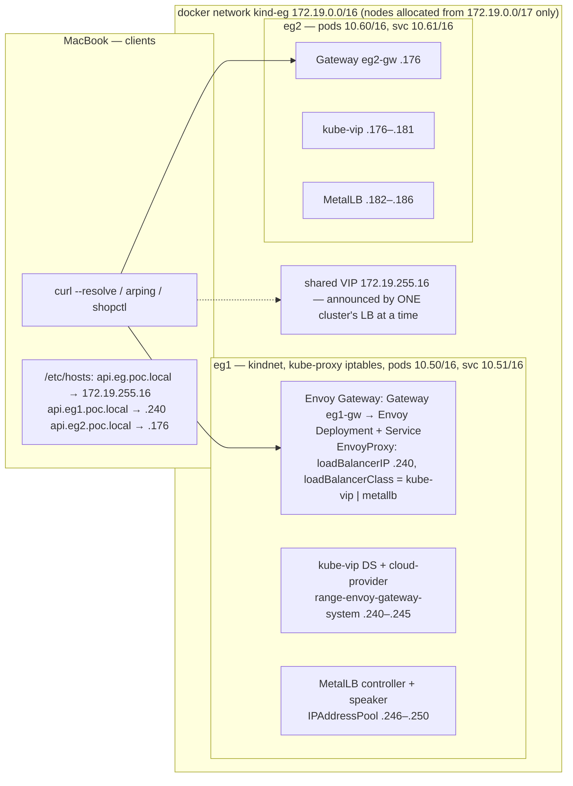

# Enhancement 007 — the vanilla lab: two kind clusters, Envoy Gateway, kube-proxy and kindnet, and the two software load balancers side by side

Status: **plan, revision 2** (2026-09-18, after phase 0 — `docs/EG-PHASE0.md`, issue #54) — **phase 1 done** (demo 50:
both clusters, the three-command install, the lab root; no load balancers, no Gateways — those are demos 51/52).
**What phase 0 changed:** Envoy Gateway is installed as three commands from the get-go — upstream's standard CRDs, the vendor's
`gateway-crds-helm` for Envoy Gateway's own eight CRDs, then `gateway-helm` with `crds.enabled=false` (its only switch
is all-or-nothing); the chart creates no `GatewayClass` (apply `eg`); **the two load balancers coexist** —
three filters are required (kube-vip `--lbClassOnly`, the cloud-provider's `KUBEVIP_ENABLE_LOADBALANCERCLASS=true`,
MetalLB `--lb-class` on controller and speaker), so the sequential swap is dropped; MetalLB's chart defaults
`frrk8s.enabled: true` (off for L2); no kube-vip `--taint`; the `EnvoyProxy` with its `loadBalancerClass` must exist
when the Gateway is created (the class is immutable — recreate, never attach later); `Gateway.spec.addresses` alone →
`externalIPs`, **0 ARP replies**, the `EnvoyProxy` field → one responder, measured on both LBs; gRPC on `:80` works
with `appProtocol: kubernetes.io/h2c` and no BackendTrafficPolicy; the Mac's route `172.19/16 → 192.168.64.2` exists
now (the operator ran it); pins in `scripts/bootstrap/versions-eg.env`; **D1 closed** (poc1/poc2 paused — gotcha #119
on why the first pause did not hold), **D2 closed** (this repository). Revision 1 (2026-09-18) was written from the
operator's three messages the same day; facts below are cited to their source.

## 1. Why, in one paragraph

Demos 40 and 41 taught the Gateway API story on Cilium: a Gateway is a Service plus listeners in the node's shared Envoy;
LB IPAM hands out the address; L2 announcements make one node answer ARP for it; a static address is one field on the
Gateway; a shared address moves between clusters with one policy. On Cilium all of that is *one product*. The vanilla
stack — kindnet for the CNI, kube-proxy in iptables mode, the Gateway API CRDs from the release YAML, **Envoy Gateway** as
the Gateway API implementation — has no load balancer at all: `type: LoadBalancer` is a request, and a separate
controller must fulfil it. This enhancement builds that stack twice over, on the same two clusters, with the two
software load balancers a bare-metal team actually chooses between — **MetalLB** and **kube-vip** — and shows, on the
same Gateway objects and the same reserved addresses, what each one does with them. The point is not which is better;
it is that the reader can name every part Cilium bundled.

| # | Requirement | What it exercises |
|---|---|---|
| R1 | **Two kind clusters** `eg1`, `eg2` on **their own Docker network** with the lab's reservation trick: Docker allocates node addresses from the lower half only; the top `/24` is carved into `/26` blocks per cluster from **the same CIDR as the node network** | `docker network create --ip-range`, `KIND_EXPERIMENTAL_DOCKER_NETWORK`, NETWORKING_DESIGN §3's block layout |
| R2 | **Stock networking**: kindnet CNI, kube-proxy `iptables`; no Cilium anywhere on these clusters | kind's defaults (`kubeProxyMode` unset, `disableDefaultCNI` unset) |
| R3 | **Gateway API CRDs installed from the release YAML** (standard channel), then **Envoy Gateway's own CRDs from the vendor's CRD chart, then the controller** — the installation is three commands from the get-go (the operator, 2026-09-18) | `standard-install.yaml`; `gateway-crds-helm --set crds.envoyGateway.enabled=true`; `gateway-helm --set crds.enabled=false` (its one switch is all-or-nothing, measured); `GatewayClass eg` applied |
| R4 | **Demo A — kube-vip**: the DaemonSet + the cloud-provider Deployment + one ConfigMap of ranges; a Gateway per cluster on a **static address**; the shared address on one cluster | ARP mode, per-Service leader election, `kube-vip.io/loadbalancerIPs`, `range-<namespace>` |
| R5 | **Demo B — MetalLB**: `IPAddressPool` + `L2Advertisement`; the same Gateways, the same addresses, the same static-address trick | L2 mode, `metallb.io/loadBalancerIPs`, `L2Advertisement` selecting Services |
| R6 | **Both on the same clusters at once**, each owning only its Services, through **`loadBalancerClass`** — or, if measurement says they cannot coexist, sequentially with a clean swap script | `EnvoyProxy.envoyService.loadBalancerClass`; kube-vip's `kube-vip.io/kube-vip-class`; MetalLB's `--lb-class` |
| R7 | The **static-address experiment** that carries the lesson: `Gateway.spec.addresses` (Envoy Gateway writes it to the Service's `externalIPs`, which neither LB announces) versus the LB's own field on the `EnvoyProxy` Service (announced) — measured on both LBs | the difference between "configured" and "answered on the wire" |
| R8 | The same **reader's tests** as demo 40: `curl --resolve` from the Mac, `arping` from the bridge, the leaf certificate, a `check.sh` with PASS/FAIL rows, a `RECAP.md` | the demo-recap skill |
| R9 | **CI**: the two clusters build on a runner from one script, both demos run, a regression row per LB | enhancement 004's pattern |
| R10 | **gRPC through the doors** (operator, 2026-09-18: *"testing grpc route as part of the envoy [lab] … deployed into the clusters poc1 or poc2"*): demo 09's `routedemo -mode grpc` (gRPC health + server reflection, no `.proto`) behind a `GRPCRoute` on **each Envoy Gateway door** — plaintext h2c on the `:80` listener and TLS on `:443` through the lab certificate — tested with `grpcurl` from a container on the bridge; **and the same objects and the same test on the Cilium clusters**: poc1's existing route (`demos/09-routes/03-routes.yaml`, `grpc.poc.local` on `routes-gw`, measured `SERVING`) re-run, and poc2 given the same `GRPCRoute` on its `shop-gw`, so `docs/EG-VS-CILIUM.md` has a measured gRPC row per cluster on both stacks | `GRPCRoute` (Gateway API standard channel since v1.1), method matching on `grpc.health.v1.Health` and `grpc.reflection.v1[alpha].ServerReflection`, `:authority` matching `hostnames`, h2c vs TLS |

## 2. What research changed in the brief

| Fact | Source | Consequence |
|---|---|---|
| Envoy Gateway runs **an Envoy Deployment and a Service per Gateway** (Cilium: one Envoy per node shared by every Gateway) | [Envoy Gateway — Gateway Address](https://gateway.envoyproxy.io/docs/tasks/traffic/gateway-address/), demo 37's measurement of Cilium's shared Envoy | The "door" has its own pods here; the load balancer fronts that Service |
| `Gateway.spec.addresses` (type `IPAddress`) is written into the Envoy **Service's `externalIPs`**: *"Using the addresses in Gateway.Spec.Addresses as the External IPs of Envoy Proxy Service, this will require the address to be of type IPAddress"*; ServiceType `LoadBalancer` or `NodePort` | same page | Neither MetalLB nor kube-vip announces `externalIPs`, so a Gateway with only `spec.addresses` is configured but unreachable on bare metal — **R7 measures exactly this**; the reachable path is the LB's own field on the Service |
| `EnvoyProxy.spec.provider.kubernetes.envoyService` exposes `type`, `loadBalancerIP`, `loadBalancerClass`, `annotations`, `externalTrafficPolicy`, `loadBalancerSourceRanges` | [Envoy Gateway — API extension types](https://gateway.envoyproxy.io/docs/api/extension_types/) | One `EnvoyProxy` per Gateway (attached by `infrastructure.parametersRef`) carries the static address (`loadBalancerIP` or the LB's annotation) and the `loadBalancerClass` that picks the LB |
| Envoy Gateway's Helm chart bundles the Gateway API CRDs from the **experimental** channel; `--set crds.enabled=false` skips them; Gateway API v1.6 CRDs must be upgraded before Envoy Gateway | [Envoy Gateway — Helm install](https://gateway.envoyproxy.io/docs/install/install-helm/) (`helm install eg oci://docker.io/envoyproxy/gateway-helm --version v1.9.1 -n envoy-gateway-system --create-namespace`) | R3 as the operator asked: the standard-channel release YAML first, then the chart with `crds.enabled=false` (and Envoy Gateway's own CRDs) — pins in `versions-eg.env` |
| kube-vip = a **DaemonSet** that announces plus a **cloud-provider Deployment** that allocates from the `kubevip` ConfigMap (`cidr-global`/`range-global`, `cidr-<namespace>`/`range-<namespace>`); a static IP via `spec.loadBalancerIP` or `kube-vip.io/loadbalancerIPs` *"even outside of the assigned ranges"* | [kube-vip — cloud provider](https://kube-vip.io/docs/usage/cloud-provider/) | Namespace-scoped ranges give the gateway-pool/services-pool split without selectors; the reserved `/26`s are honoured by fiat |
| kube-vip ARP mode: *"a leader is elected which will inherit the virtual IP"*, per-service leader election, optional gratuitous ARP on failover; BGP mode: *"all nodes will advertise the VIP address"* | [kube-vip — architecture](https://kube-vip.io/docs/about/architecture/) | Same model the reader learned in demo 40; BGP mode is the bridge to enhancement 006 later |
| MetalLB honours `spec.loadBalancerIP` and `metallb.io/loadBalancerIPs`; `metallb.io/address-pool` pins a pool; in L2 mode *"one cluster node attracts traffic for the service IP"* | [MetalLB — usage](https://metallb.io/usage/) | Demo B's static address; the same one-node-per-IP rule; disjoint pools per cluster on one bridge (gotchas #92–#94) |
| kind builds on a custom Docker network through `KIND_EXPERIMENTAL_DOCKER_NETWORK`; the lab used it for `kind-classic` | `NETWORKING_DESIGN.md:115-116`; `scripts/lab-up.sh:112-124` (the `--ip-range` trick) | R1 is a second instance of an existing pattern, not a new mechanism |
| The Mac's route to the `kind` bridge was measured (gotcha #108) for `172.18.0.0/16` only | `docs/GOTCHAS.md` #108 | Phase 0 measures the route to the new bridge before anything else |
| The Docker VM (10 CPU / 24 GiB) is at ~18.9 GiB with poc1 + poc2 + the observability stack (demo 41's measurement) | `demos/41-shop-mesh-phase1/README.md` §"resources" | Two more clusters do not fit beside them without a change — **OPEN D1** |

## 3. Architecture

### 3.1 The address plan (the reservation trick, second instance)

| Block | Owner | What it holds | Announced by |
|---|---|---|---|
| `172.19.0.0/17` | Docker | node addresses (`--ip-range`) — nothing else may be allocated here | — |
| `172.19.255.0/24` | the lab | the reserved VIP `/24`, never touched by Docker | — |
| `172.19.255.192/26` | **eg1** | services `.200–.239`; gateways `.240–.250` — kube-vip `.240–.245`, MetalLB `.246–.250` | eg1 (ARP, one node per address) |
| `172.19.255.128/26` | **eg2** | services `.136–.175`; gateways `.176–.186` — kube-vip `.176–.181`, MetalLB `.182–.186` | eg2 |
| `172.19.255.0/26` | shared | the product VIP `.16` (kube-vip demo) and `.17` (MetalLB demo) — a Gateway that exists in one cluster at a time | whichever cluster holds it |
| `172.19.254.0/24` | reserved | network devices, if enhancement 006's fabric ever peers with this lab | — |

Pod and Service CIDRs disjoint from every existing cluster (`poc1` 10.10/10.11, `poc2` 10.20/10.21, `poc3` 10.30/10.31,
`poc4` 10.40/10.41): **eg1 `10.50.0.0/16` / `10.51.0.0/16`, eg2 `10.60.0.0/16` / `10.61.0.0/16`** — so the two labs
could be routed to each other later without renumbering.

### 3.2 How the two load balancers share the clusters (R6)

Every Service that wants an address names its load balancer: `EnvoyProxy.spec.provider.kubernetes.envoyService.loadBalancerClass`
is `kube-vip.io/kube-vip-class` in demo A and `metallb.io/metallb` (the value MetalLB's `--lb-class` is started with) in
demo B; each controller ignores Services of the other class. Phase 0 **measures** this before the design depends on it:
one Service of each class, both LBs installed, `arping` from the bridge must show exactly one responder per address. If
the two cannot coexist cleanly (a controller claiming class-less Services, a speaker answering for the other's address),
the fallback is sequential — `scripts/eg-lb.sh kube-vip|metallb` swaps them with a clean uninstall — and the plan says
which was measured.

### 3.3 The static-address experiment (R7) — the lesson in one table

| Step | What is set | Expected on the wire | What it teaches |
|---|---|---|---|
| 1 | `Gateway.spec.addresses: [{type: IPAddress, value: .240}]` only | `status.addresses` shows `.240`; the Service has `externalIPs: [.240]`; **nobody answers ARP for .240** | "configured" is not "reachable": externalIPs are static routing hints, no controller announces them |
| 2 | plus `EnvoyProxy.envoyService.loadBalancerIP: .240` (or the LB's annotation) | the LB assigns `.240` in `status.loadBalancer.ingress`; **one node answers ARP**; `curl` gets the door | the load balancer is a separate product with its own field |
| 3 | the same on the other LB | same result, different objects | the concept survives the vendor |
| 4 | Cilium's version for contrast (demos 40/41): `spec.addresses` alone was enough | one product did both | why it looked like magic |

### 3.4 The doors and the app

The same door layout as demo 40 — a per-cluster Gateway (`eg1-gw` `.240`, `eg2-gw` `.176`) and a shared-VIP Gateway
(`.16`) — with a `cert-manager` `Certificate` per cluster (CN the product name `api.eg.poc.local`, SANs the three names,
a self-signed root created for this lab and exported as `.tmp/eg-root-ca.crt` (gitignored — issue #60: a committed root drifts on every rebuild) — the poc clusters' root is not reused,
the labs are independent). Behind the doors: `shopapi` from demo 40 (`/healthz`, `X-Served-By`) as the one backend — it
is already a static image — plus the two `shopctl` clients unchanged. No database, no policies (there is no Cilium to
enforce them — that absence is part of the comparison and is said out loud in the README).

## 4. Phases, demos, and the scripts each one adds

| Phase | Demo | What it delivers | Scripts / files | Reqs |
|---|---|---|---|---|
| 0 — the ground, measured — **done 2026-09-18** | — (`docs/EG-PHASE0.md`, transcript `docs/eg-phase0-transcript.txt`) | the Mac's route to `172.19.0.0/16`; `KIND_EXPERIMENTAL_DOCKER_NETWORK=kind-eg` builds a cluster on the new bridge; kindnet + iptables kube-proxy confirmed (`kubectl -n kube-system get ds kindnet kube-proxy`, the proxy's mode from its ConfigMap); both LBs installed with distinct `loadBalancerClass` and one Service each — one ARP responder per address (or the sequential fallback recorded) | `scripts/eg-net.sh` (the network), `clusters/eg1.yaml`, `clusters/eg2.yaml` | R1, R2, R6 |
| 1 — the clusters and the CRDs — **phase 1 done 2026-09-18** | 50 | `scripts/eg-up.sh`: the network, both clusters, Gateway API standard-channel CRDs from the release YAML (server-side apply), Envoy Gateway CRDs via `helm template \| kubectl apply --server-side` (the CRD chart refused a Helm release: Secret > 1 MiB), controller with `crds.enabled=false`, `GatewayClass eg`, cert-manager and the lab root (exported to `.tmp/eg-root-ca.crt`); pins stay in `versions-eg.env` (`CERT_MANAGER_VERSION=v1.21.1` added); `check.sh` 27 PASS | `scripts/eg-up.sh`, `scripts/eg-down.sh`, `demos/50-eg-clusters/` (`README.md`, `GUIDE.md`, `check.sh`, `cleanup.sh`, `RECAP.md`, `evidence.json`, `output/transcript.txt`), `clusters/eg/gatewayclass.yaml`, `clusters/eg/eg-root-ca.yaml`, `clusters/eg/eg-ca-issuer.yaml`, `scripts/bootstrap/versions-eg.env` | R1–R3 |
| 2 — **demo A: kube-vip** | 51 | kube-vip DS + cloud-provider in both clusters, ranges per namespace from §3.1; `eg1-gw`/`eg2-gw` with an `EnvoyProxy` each (`loadBalancerIP`, class kube-vip); the R7 experiment recorded; the shared VIP `.16` Gateway created in eg1 only, moved to eg2 and back (`scripts/eg-vip-move.sh kube-vip eg2`), `arping` proving one responder; `shopapi` behind the doors, `X-Served-By`; **gRPC (R10)**: `routedemo:local` loaded into eg1/eg2, `grpc` Deployment + Service, a `GRPCRoute` per door on `grpc.eg1.poc.local` / `grpc.eg2.poc.local` / `grpc.eg.poc.local` (the VIP), `grpcurl -plaintext -authority … <addr>:80 grpc.health.v1.Health/Check` → `SERVING`, then `-cacert .tmp/eg-root-ca.crt` on `:443`, and `grpcurl list` through reflection — recorded; `check.sh` rows for both; `RECAP.md` | `demos/51-eg-kube-vip/` (`30-grpc.yaml`, `grpc-check.sh`) | R4, R7, R8, R10 |
| 3 — **demo B: MetalLB** | 52 | (gRPC repeated once on MetalLB's addresses — the route is LB-independent; the row proves it)  MetalLB in both clusters with `--lb-class`, `IPAddressPool` per cluster from §3.1, `L2Advertisement`; the same Gateways with class metallb and `metallb.io/loadBalancerIPs`; the R7 experiment again; the shared VIP `.17` moved with an `L2Advertisement` that selects the VIP Service (the closer cousin of Cilium's `shop-vip-announce`); the **side-by-side table** — objects, fields, failover time (lease/GARP measured with the same `arping` loop), what each cannot do; `RECAP.md` | `demos/52-eg-metallb/` | R5, R7, R8 |
| 3b — **gRPC parity on the Cilium clusters** | 53 | demo 09's test re-run on poc1 exactly as written (`grpc.poc.local` on `routes-gw`, plaintext and TLS, recorded); poc2 given the same objects — `routedemo -mode grpc` Deployment + Service in `shop-edge` and a `GRPCRoute` `grpc.poc2.shop.poc.local` on `shop-gw`'s `:80`/`:443` listeners (demo 40's doors; poc2 has no `routes-gw`) — measured `SERVING` from the Mac and from a container on the `kind` bridge; a row in `scripts/lab-regression.sh` (WARN when the route is absent); the numbers go into `docs/EG-VS-CILIUM.md`'s gRPC row | `demos/53-grpc-parity/` | R10 |
| 4 — CI and the write-up | — | `.github/workflows/eg-lab.yaml` building both clusters on a runner and running demos 50–52's checks; `docs/EG-VS-CILIUM.md`: the comparison a platform team would read — one column per stack (Cilium Gateway API + LB IPAM + L2; Envoy Gateway + kube-vip; Envoy Gateway + MetalLB): the objects, where the address is set, who announces, per-Gateway proxy or shared, policy, what a static address costs | `.github/workflows/eg-lab.yaml`, `docs/EG-VS-CILIUM.md` | R9 |

Every demo keeps the house rules: `scripts/record.sh` transcripts, a README with the enterprise case, a GUIDE with
exercises, `check.sh` with PASS/FAIL rows, `cleanup.sh`, `RECAP.md` (the demo-recap skill), and the review pass before
the PR.

## 5. Decision log

| # | Decision | Outcome |
|---|---|---|
| D1 | **Memory: how two more clusters fit on the 24 GiB VM** — (a) pause poc1/poc2 (`scripts/cluster-pause.sh`) while lab 2 builds and measures; (b) raise the Docker VM to 32 GiB with CRC off | **Taken (a)** — the operator, 2026-09-18: *"poc1 and poc2 … should be paused and shutdown for now. Then we focus solely on our envoy gateway api work"*; eg1 alone ≈ 1.8 GiB (phase 0 R0.7, re-measured after the pause) |
| D2 | **Location** — this repository or a sibling | **Taken** — this repository (the default; the operator did not object): `clusters/eg*.yaml`, `clusters/eg/`, `scripts/eg-*.sh`, `scripts/bootstrap/versions-eg.env`, demos 50–53, `docs/EG-PHASE0.md`, `docs/EG-VS-CILIUM.md` |
| D3 | Two demos, one per load balancer, on the same clusters | **Taken** (operator, 2026-09-18: *"let us [have] two different demos for both with envoy gateway api"*) — **coexistence measured in phase 0 (R0.4): one ARP responder per address, the class-less Service claimed by neither once all three class filters are set**; the sequential swap is not needed and `scripts/eg-lb.sh` is not written |
| D4 | kube-vip first (demo A), MetalLB second (demo B) | **Taken** — the operator's preference for kube-vip's simplicity; MetalLB is the more common comparison point, so it is the second column, not the omitted one |
| D5 | Gateway API CRDs from the release YAML, standard channel; Envoy Gateway's chart without its bundled (experimental) CRDs | **Taken** (operator: *"we are gonna install the gateway api crds yaml"*) |
| D6 | The reservation trick reused on a new network `172.19.0.0/16` rather than sharing `kind` (`172.18.0.0/16`) | **Taken** — the labs stay independent; sharing the bridge would put four LBs and Cilium's L2 on one segment |
| D7 | `shopapi` + `shopctl` reused as the app; no database, no policies | **Taken** — the Gateway and the LB are the subject; a second shop would dilute it |
| D8 | A self-signed root for this lab (`.tmp/eg-root-ca.crt`, exported by `scripts/eg-up.sh`, never committed — issue #60), not the poc clusters' `clustermesh-root-ca` | **Taken** — independence; a client trusts two files, one per lab, and the README says why |
| D9 | gRPC through `GRPCRoute` on both stacks, with demo 09's app and test unchanged | **Taken** (operator, 2026-09-18) — one app, one client, one route shape; the only variables are the Gateway implementation and the door; poc2 gets its first gRPC route on `shop-gw` rather than a new Gateway |
| D10 | **Gateway API standard channel only — no experimental features in this lab** | **Taken** (operator, 2026-09-18: *"We don't need experimental features in this setup for now. We will install and use them in another lab later. So keep this clean"*) — the CRDs come from `standard-install.yaml` v1.6.2; the CRD chart runs with `crds.gatewayAPI.enabled=false` and the controller chart with `crds.enabled=false`, so the experimental channel cannot arrive by a side door; `check.sh` in demo 50 asserts `channel: standard` on every Gateway API CRD; Envoy Gateway features that need experimental fields are out of scope here and named in `docs/EG-VS-CILIUM.md` as "another lab" |

## 6. Stack facts the plan relies on

| Fact | Source |
|---|---|
| `Gateway.spec.addresses` → Envoy Service `externalIPs`; type `IPAddress`; ServiceType `LoadBalancer`/`NodePort`; if set, the only addresses in `Gateway` status | [Envoy Gateway — Gateway Address](https://gateway.envoyproxy.io/docs/tasks/traffic/gateway-address/) |
| `EnvoyProxy.envoyService`: `type`, `loadBalancerIP`, `loadBalancerClass`, `annotations`, `externalTrafficPolicy`, `loadBalancerSourceRanges` | [Envoy Gateway — API extension types](https://gateway.envoyproxy.io/docs/api/extension_types/) |
| Helm: `oci://docker.io/envoyproxy/gateway-helm --version v1.9.1`; bundled CRDs are the experimental channel; `--set crds.enabled=false`; Gateway API v1.6 CRDs before the upgrade | [Envoy Gateway — Helm install](https://gateway.envoyproxy.io/docs/install/install-helm/) |
| kube-vip cloud provider: `kubevip` ConfigMap keys `cidr-global`, `range-global`, `cidr-<ns>`, `range-<ns>`; static via `spec.loadBalancerIP` or `kube-vip.io/loadbalancerIPs` (≥ 0.5.12), *"even outside of the assigned ranges"*; a Deployment (allocation) + a DaemonSet (announcement) | [kube-vip — cloud provider](https://kube-vip.io/docs/usage/cloud-provider/) |
| kube-vip ARP: elected leader inherits the VIP; per-service election; optional gratuitous ARP; BGP: all nodes advertise | [kube-vip — architecture](https://kube-vip.io/docs/about/architecture/) |
| MetalLB: `spec.loadBalancerIP` and `metallb.io/loadBalancerIPs`; `metallb.io/address-pool`; L2: one node attracts the traffic | [MetalLB — usage](https://metallb.io/usage/) |
| kind defaults: pod `10.244.0.0/16`, service `10.96.0.0/16`, kindnetd, kube-proxy modes iptables/nftables/ipvs | [kind — configuration](https://kind.sigs.k8s.io/docs/user/configuration/) |
| `GRPCRoute` on Cilium, measured: method matching on `grpc.health.v1.Health` and both reflection services, `hostnames` matched on `:authority`, `grpcurl -plaintext … :80` and TLS through the wildcard → `SERVING`; poc2 has no GRPCRoute today (`kubectl get grpcroute -A` → none) | `demos/09-routes/03-routes.yaml`, `demos/09-routes/README.md` Part 5; measured 2026-09-18 |
| Envoy Gateway's own gRPC routing task uses plaintext on the `:80` listener and `grpcurl` | [Envoy Gateway — GRPC Routing](https://gateway.envoyproxy.io/docs/tasks/traffic/grpc-routing/) — to be confirmed at the pinned version in phase 0 |
| The reservation trick: `--subnet` + `--ip-range` lower half; the `/26` per cluster; `KIND_EXPERIMENTAL_DOCKER_NETWORK` | `NETWORKING_DESIGN.md:115-116, 220-233`; `scripts/lab-up.sh:112-124` |
| Cilium's answer to the same problem, for the comparison column | demos 40, 41; `docs/GOTCHAS.md` #92–#94, #108 |

## 7. Risks

- **Coexistence of two LBs** on one cluster is the least-documented part; phase 0 measures it first and the plan has the
  sequential fallback. A class-less Service must be claimed by *neither* (both controllers filter on class) — measured.
- **The Mac's route** to a second bridge: gotcha #108 measured `172.18/16`; `172.19/16` may need the same host route; if
  it cannot be made, the clients run from a container on the bridge (as `arping` already does) and the README says so.
- **Memory** (D1): nothing here runs beside poc1/poc2 until D1 is decided; the CI runner is unaffected (its own machine).
- **Envoy Gateway version drift**: v1.9.1 today; the pin lives in `versions-eg.env` and the `upstream-release-notes` skill
  gets an `envoy-gateway` source when the first release lands after this is built.
- **Two roots of trust** (D8): a reader with both labs trusts two CA files; `docs/EG-VS-CILIUM.md` states it.
